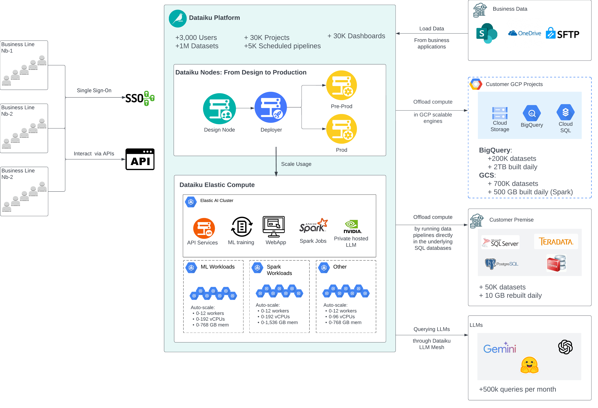
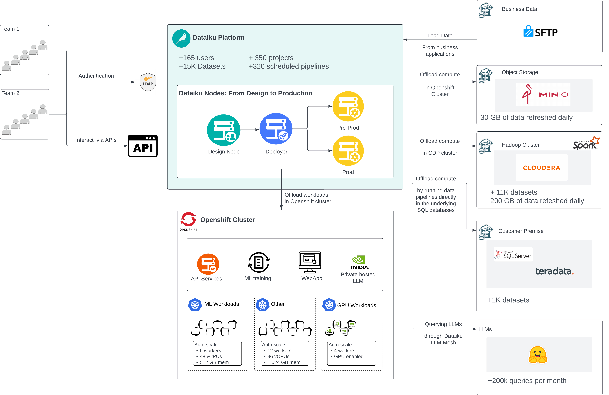
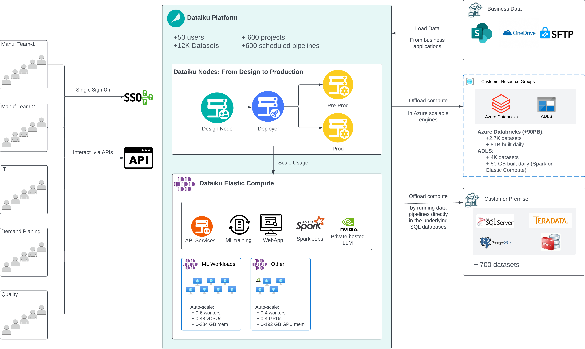
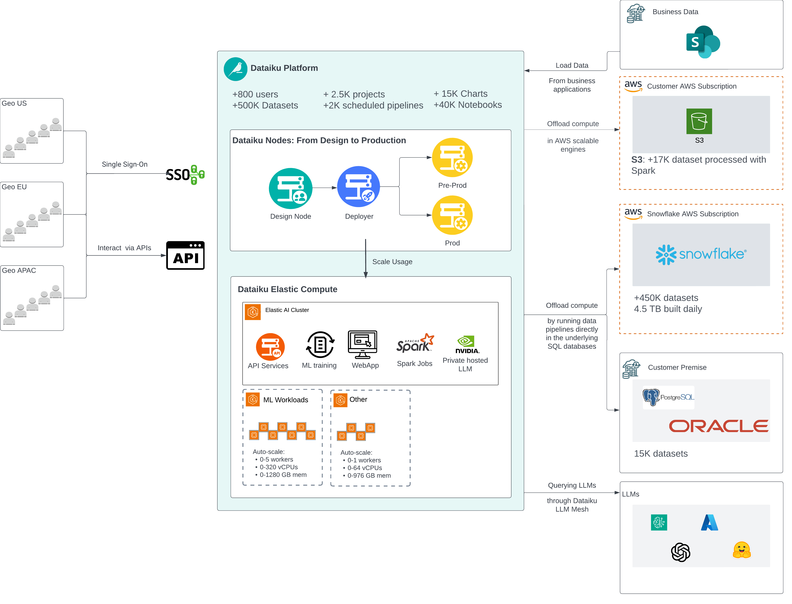

# Examples of scalable deployments

Below are several examples of self-hosted Dataiku platform deployments, each illustrated with clear, high-level diagrams. These examples demonstrate how Dataiku seamlessly integrates with companion technologies [to scale](https://doc.dataiku.com/app-notes/13/autoscaling-data-workloads/) and enhance usage across various environments.

**Notes:**

* **Real-World Deployments:** The scenarios presented are based on actual Dataiku client deployments.  
* **High-Level Overview:** For clarity, the diagrams provide a simplified, high-level view that abstracts away lower-level technical details.  
* **Topology Simplification:** The depicted topologies have been streamlined (e.g., the number of nodes) to emphasize the overall architecture rather than every specific element.  
* **Hybrid Footprints:** In many large-scale deployments, the complete infrastructure often comprises a mix of platforms—such as self-hosted cloud and on-premise solutions—to address local constraints and the complexity of the technical environment.

## Dataiku Self-Hosted in the Client’s GCP Tenant

This large-scale Dataiku platform is deployed on Google Cloud Platform (GCP) and shared across several business units, supporting thousands of collaborating users. While on-prem data sources are still accessible, the majority of data operations are performed within GCP to leverage services such as BigQuery. Dataiku ensures that any workflows involving BigQuery remain in BigQuery, minimizing data movement and optimizing performance.

Key highlights include:

* **Elastic Compute:** Dataiku Elastic AI Compute, powered by Google Kubernetes Engine (GKE), automatically scales resources for Spark workloads, machine learning (ML) training, and interactive notebook analysis.  
* **Efficient Workflows:** When data resides in Google Cloud Storage (GCS), Spark jobs run in Dataiku’s elastic compute infrastructure to efficiently process and transform datasets.  
* **End-to-End ML Lifecycle:** The platform facilitates ML model training and deployment within the same elastic environment, streamlining the entire data science workflow.  
* **Extensive Use of Dashboards:** Business stakeholders leverage dashboards widely to gain insights and make data-driven decisions.

## On-Premises Dataiku Deployment

This on-premises Dataiku deployment has fewer users overall, but it highlights the platform’s full flexibility. Even in a fully on-prem environment, Dataiku’s push-down architecture ensures compute is performed where the data resides, minimizing data movement for efficient and scalable operations.

Key details include:

* **Hadoop CDP Cluster:** Most data and computing tasks are handled within an existing Hadoop CDP environment.  
* **OpenShift Integration:** Dataiku integrates seamlessly with an on-prem OpenShift cluster for scalable machine learning workloads and interactive notebooks.  
* **Local LLM Serving:** Dataiku orchestrates local deployment of LLM models on GPU workers within the OpenShift cluster, enabling advanced AI capabilities directly on-premises.

## Dataiku Self-Hosted in the Azure Tenant

Although this Dataiku deployment does not rank among the largest in terms of total users, projects, or managed datasets, it stands out when considering the volume of data processed per user. This ratio underscores Dataiku’s push-down architecture and near-limitless scalability. Most of the activity revolves around the integration between Dataiku and Azure Databricks, enabling business teams to tap into a nearly 100 PB data lake and refresh terabytes of data on a daily basis.

## Dataiku Self-Hosted on AWS

This large-scale deployment exemplifies Dataiku’s strong technical partnerships with major cloud and data providers. Fully hosted in the AWS cloud, the platform seamlessly harnesses AWS’s built-in elasticity while also making extensive use of Snowflake. Thanks to Dataiku’s push-down architecture and Snowflake integration, most data operations are efficiently executed within Snowflake itself, allowing the platform to scale according to demand.

Key highlights include:

* **Elastic Compute:** Dataiku Elastic Compute leverages AWS to dynamically provision GPU resources for prompt-based workloads with locally hosted LLMs.  
* **Snowflake Integration:** By storing the majority of data in Snowflake, Dataiku significantly reduces data movement, improving performance and scalability.  
* **Dashboard-Driven Insights:** The extensive use of dashboards is facilitated by interactive chart rendering in Snowflake, making it simple for users to explore and visualize data directly.

