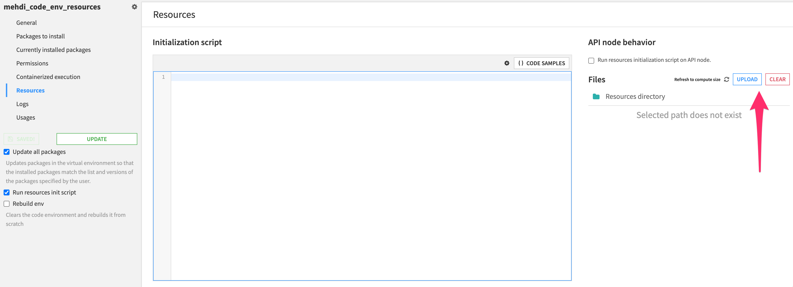
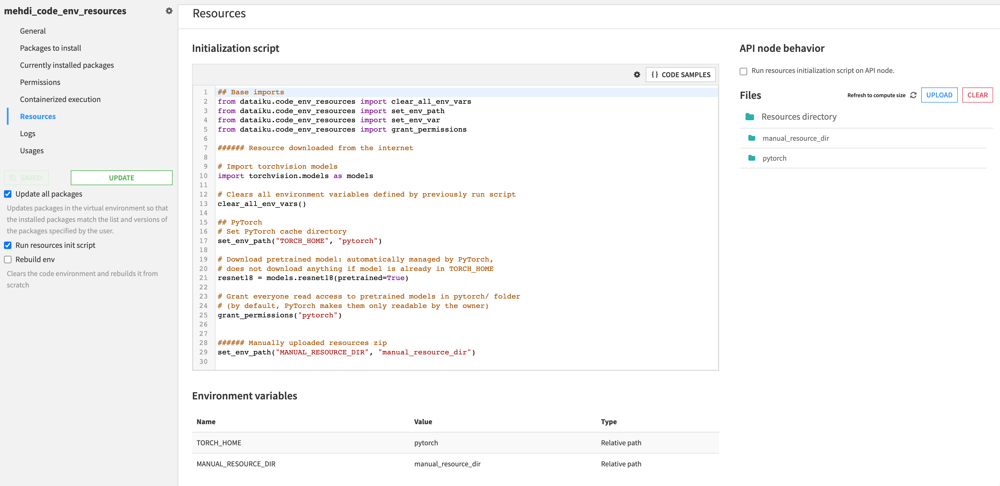
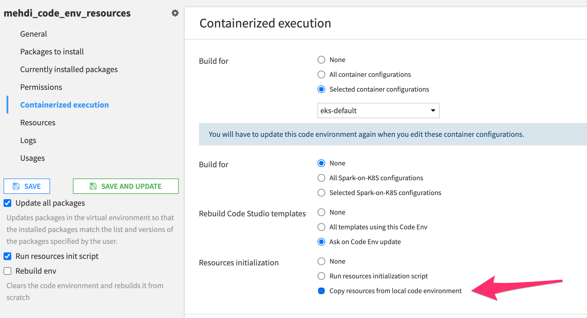
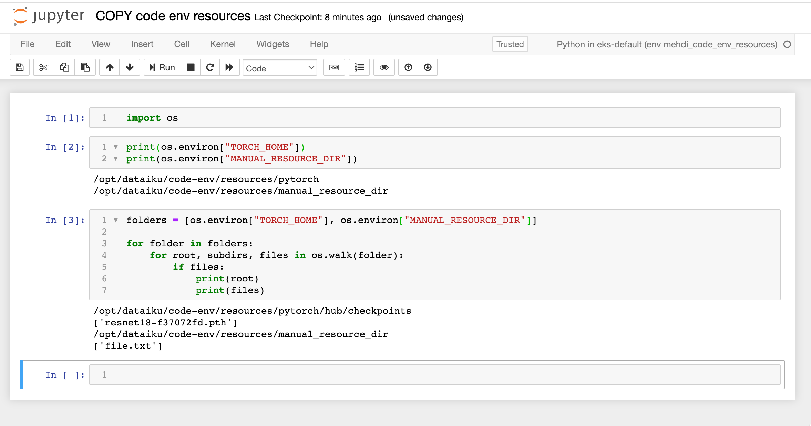

# Code environment resources: offline containers

## Context

This document focuses on using code environment resources in containerized execution, when containers do not have access to the internet. 

_We omit external access to pip mirrors for installation of python packages, which is out of scope of this document._

## Setting up code env resources

### Uploading/downloading resources 

On the DSS backend server, if external internet access is not available to download resources (e.g. pretrained model from pytorch hub), you can use the upload button to manually upload a resources zip folder.

>You should make sure to define an environment variable in the code env resources initialization script (`set_env_path` e.g. [here](https://developer.dataiku.com/latest/tutorials/machine-learning/code-env-resources/pytorch-resources/index.html)), that points towards the manually uploaded resource, so that you can access it later from your code.



Otherwise you can simply set the code env resources initialization script to fetch resources from the internet.



### Containerized execution

Then choose `Copy resources from local code environment` mode in the `Containerized execution` tab: see [documentation](https://doc.dataiku.com/dss/latest/containers/code-envs.html#code-environment-resources-directory) for more info.



### Verification

For instance, you can use a notebook running in this containerized code env, to check that environment variables pointing to resources are available, and that resources files are indeed present in the container image.



## How to check in the logs that COPY was used

Look in the `updateEnvAccordingToSpec.log` code env update logs for:

```
...
#11 DONE 0.3s
#12 [ 8/11] COPY code-env/resources /opt/dataiku/code-env/resources
#12 DONE 0.1s
#13 [ 9/11] COPY code-env/resources_env.json /opt/dataiku/code-env/resources_env.json
...

```
