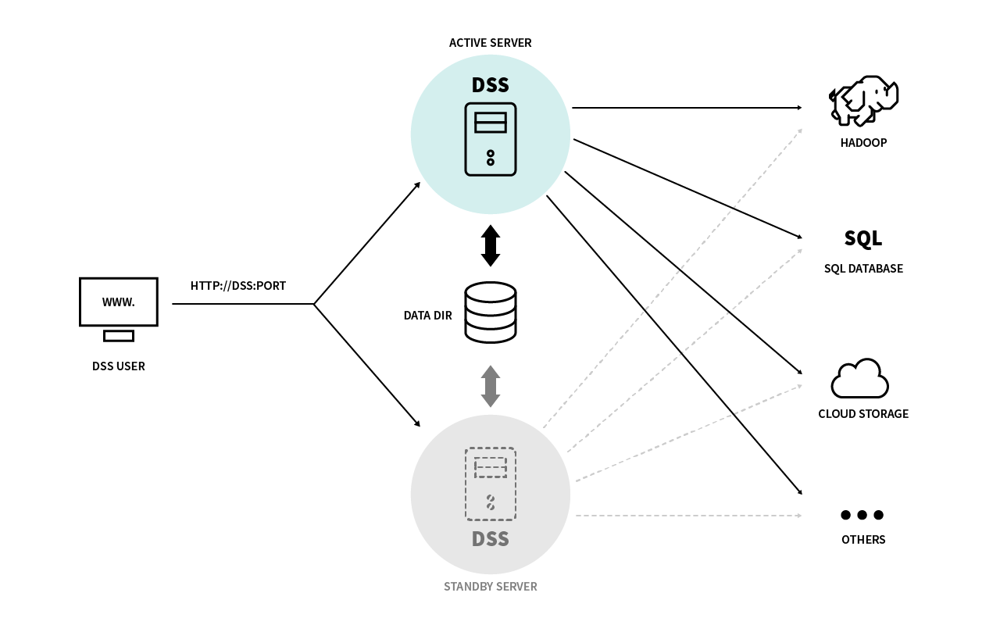

# Howto: High-availability on premise.

  * [1. Overview](#1-overview)
    + [1.1. Concepts](#11-concepts)
    + [1.2. Principles](#12-principles)
  * [2. Required components](#2-required-components)
    + [2.1. Redundant servers](#21-redundant-servers)
    + [2.2. Shared storage](#22-shared-storage)
    + [2.3. Cluster management](#23-cluster-management)
    + [2.4. User-visible URL](#24-user-visible-url)
    + [2.5. DSS installation](#25-dss-installation)
  * [3. Sample deployment using RHEL 7 cluster and NAS](#3-sample-deployment-using-rhel-7-cluster-and-nas)
    + [3.1 Storage setup](#31-storage-setup)
    + [3.2 DSS installation](#32-dss-installation)
    + [3.3 Cluster setup](#33-cluster-setup)
    + [3.4 Fencing](#34-fencing)
    + [3.5 Network service address setup](#35-network-service-address-setup)
    + [3.6 Operations](#36-operations)

## 1. Overview

### 1.1. Concepts

This document describe strategies for implementing failover / high-availability capabilities for the Dataiku DSS design and automation nodes, when running on on-premise.

This document distinguishes the following capabilities:

* High-availability relates to the capacity of an application to remain functional even though some specific adverse event occurs. Failover is a means to achieve high-availability through switch of the active service from one node to another. Failover is the primary means to achieve high-availability for the Dataiku DSS design and automation nodes.

* Disaster-recovery relates to the capacity to recover an application in the face of a major failure or catastrophe that may result in the inability of the application to perform (even if HA is implemented). Backups are the main ways to implement disaster recovery.

Please note that this document does not apply to the API node, which implements high-availability through replication rather than through failover. In the rest of the documentation, "DSS instance" or "DSS node" shall mean "Dataiku DSS design or automation node".

This document does not discuss scalability. Scalability for a DSS instance is achieved primarily through leveraging execution engines that allow spreading of the load of a cluster (Hadoop, Spark, Kubernetes, distributed SQL databases, ...)

HA and DR are separate concepts, and the answers to both requirements are independent and separate. Notably, some HA scenarios are incompatible with some DR scenarios.

This document does not cover DR, which is centered mainly on backups

### 1.2. Principles

As seen from a system point of view, Dataiku DSS is a Linux server-based application which:

- serves interactive user requests (and optionally, automated API requests) through a single HTTP (or HTTPS) endpoint
- stores all its internal data and state within a single directory on the local machine (base configuration, user-edited dataset
  definitions and recipes, versioning history, log files, various indexes and caches, etc...)
- connects to external data storage and drives external compute resources through outgoing connections to their respective APIs (Hadoop
  services, SQL databases, cloud storage, etc...)

If required, it is possible to setup a high-availability deployment for a Data Science Studio instance,
using industry-standard clustering techniques, similar to those used for example for database servers.

At a high level, these techniques involve the following components, each of which can be implemented using a variety of tools,
depending on the local hosting constraints:

- two (or more) identical servers, each able to run DSS. The cluster deployment will be of the "active-passive" (aka failover) kind,
  where at any point in time one and only one of these servers will host a running instance of DSS, the other one(s) being in a
  inactive standby mode, ready to takeover active service if needed
- a shared or replicated storage area, accessible from all these servers, which will contain the DSS data directory. This ensures
  that in case of failover, the standby server can take over from the exact state where the active server was at the time of failure,
  and no user input is lost. In essence, a failover is then strictly equivalent to a crash and restart of the DSS server, as seen from
  a end-user point of view.
- a shared IP address, which lets users access the currently active instance using a consistent URL. Depending on the local setup,
  this can either be a "floating" address, ie a secondary IP address which moves from server to server tracking the active DSS
  instance, or the IP address of a network load-balancer installed between the end-user and DSS.

This document discusses in more details possible implementation options for the above components, and the constraints
which should be respected for applicability to DSS. In a second part, implementation details are provided for a typical deployment
using common industry-standard solutions, namely the high-availability add-on to RedHat Enterprise Linux version 7, a Network-Attached
Storage (NAS) appliance, and a network load balancer.

> **Note:** This document only applies to DSS design and automation node instances. DSS API nodes do not require shared storage,
and are designed to scale horizontally by simply deploying more instances.
See [DSS documentation](http://doc.dataiku.com/dss/latest/apinode/ha_deployment.html) for details.

## 2. Required components

### 2.1. Redundant servers

The most important component for a highly-available deployment is of course the availabity of two (or more) different servers,
each of which should be able to host the DSS instance.

It is highly recommended, though not technically mandatory, to use identical servers for this purpose, in terms of hardware
configuration and OS installation.

All redundant servers should be able to connect to all external resources used by DSS (Hadoop clusters, databases, remote file systems,
etc) using the **same** target hostnames and credentials.

For maximum availability, redundant servers should be fully independent of each other and should not share common points of failure
(power supplies, network gateways, switches, etc) unless those are themselves highly available. For cloud-based implementations, this usually
means that redundant servers should be hosted in different availability zones.

**Note:** In virtualized environments (including cloud- and Docker-based setups) the standby server(s) may not physically exist at all, as
the virtual infrastructure manager can simply re-spawn a failed DSS server instance. It is then enough for the virtual infrastructure
manager itself to be highly available, which is typically the case in cloud-based environments.

### 2.2. Shared storage

It is mandatory that all data locally written by DSS be located in a storage area shared by all instances. This includes:

- the DSS data directory
- any additional directory configured as a dataset storage area ("local filesystem" connection type)

The DSS installation directory, being read-only after installation, can be either located on the same shared storage, or replicated on all
redundant servers. The former setup is usually simpler, though.

The following implementation methods are typically available, depending on the hosting environment:

- a file system hosted on a shared remote block device (typically, a SAN or iSCSI volume, or a cloud-based virtual disk).
  The underlying provider should itself be highly available for it not to be a single point of failure. This is ususally the case when using production-level appliances or cloud-based managed services.
- a replicated block device (eg [DRDB](http://www.drbd.org)), when running in a shared-nothing environment.
- not recommended: a single NFS file server, mounted on all redundant servers. This file server should itself be highly available in order not
  to be a single point of failure.

> **Notes on using NFS**
>
> If is strongly advised **not** to use a shared NFS file system.
>
> -  The file system used for the DSS data directory must support POSIX locks (Linux `flock(3)`).
>  This might not be the case for some NFS deployments, especially when running in legacy mode. NFS version 4
>  and recent NFS version 3 setups support file locking in their default configurations.
>
> - When deploying DSS in user isolation mode, the file system used must support POSIX ACLs (setfacl). 
> This is not the case of NFS version 4 and is not the case of NFS version 3 out of the box
>
> - NFS generally handles file-deletions-while-open using "phantom" files (the so-called "silly rename" mechanism). DSS relies
> on a regular behavior for file deletion and this mechanism can cause random corruptions and failures of DSS
>
> Therefore, we strongly recommend using shared block devices (SAN) or replicated block devices (DRDB).

**Note: Directory paths** All the above directories (data directory, installation directory, additional local dataset directories if any) must
have the **same absolute path** as seen from all servers. In practice, this means that the shared storage mount point must be the same
on all servers.

**IMPORTANT NOTE: Single writer** In cases where the shared disk is simultaneously accessible from the redundant servers (NFS volumes,
but also shared or replicated block devices when using a shared filesystem like GFS2) care must be taken that the
standby servers do not write to the shared volume, as this would lead to corruption of the DSS data structures. In particular, DSS itself
should not be running on a server which is in standby mode. It is typically the role of the cluster manager to enforce this.

### 2.3. Cluster management

The cluster manager is the component which ensures that one (and only one) instance of DSS is running at all time, restarting a failed
instance or migrating it to a standby server if necessary.

It also makes sure that additional dependent resources are available, and migrated along as needed, including:

- attachment of exclusive-access shared storage to the active server (SAN volume, cloud-based virtual disk)
- attachment of floating service IP address to the active server

It usually also includes a "fencing" component which insures that a non-responding server is locked out of any shared resource
while it is in an unknown state.

The second part of this document describes an implementation based on the industry-standard cluster manager included with the Red Hat 
Enterprise Linux 7 distribution
([High Availability Add-On](https://access.redhat.com/documentation/en-US/Red_Hat_Enterprise_Linux/7/html/High_Availability_Add-On_Overview/)).
Alternative implementations are available for most virtualization and cloud-based environments.

### 2.4. User-visible URL

In order for users (and API clients) to access DSS with a fixed URL, independent of which one of the redundant servers is currently 
active, it is typically necessary to configure a virtual IP address, in addition to the physical IP addresses of the underlying servers,
and communicate to users an URL which resolve to this virtual address.

Ensuring this virtual address points at all times to the currenly active server can be achieved in a number of ways:

- configure a secondary "floating" address so that it tracks the active DSS instance. This is typically a built-in function
  of the cluster manager.
- in cloud-based environment, attach a secondary virtual interface to the active server
- configure a standard load-balancer which pools together the service URLs of all DSS replicas (load-balancer appliance, software-based
  solution eg haproxy, or cloud-based solution eg AWS Elastic Load Balancer). As at any point in time only one DSS instance will be up,
  no particular configuration is necessary on the load balancer to have it track the active DSS instance.
  Note that the load balancer itself should be highly available in order for it not to be a single point of failure.

**Note: Certificate** If DSS is configured on a HTTPS URL, care should be taken to issue the corresponding certificate for the hostname of
the virtual URL.

**Note: Health monitoring** When using a load-balancer, health monitoring for individual instances can be configured to use URL
`http://DSS_HOST:DSS_PORT/dip/api/ping`, checking for HTTP status code 200.

**Note: DNS-based failover** If configuring a virtual IP is not possible, solutions involving DNS-based failover are possible. This is not 
recommended, though, at it typically entails long latencies on server switchover (minutes to tens of minutes), before users are rerouted
to the newly-active server.

### 2.5. DSS installation

Once the infrastructure described above is in place, installing DSS in a redundant environment is similar to a standard installation,
with the following additional caveats and constraints:

- the system-level dependencies (OS packages) should be installed on all servers, in matching configurations
- in particular, the Java and Python subsystems used by DSS should be installed on all servers using matching versions
and exactly identical installation paths
- if Hadoop or Spark connectivity is configured, the corresponding environments (libraries and configuration files) should
be installed on all servers using matching versions and exactly identical installation paths
- as already stated above, the physical path to the installation and data directories for DSS should be identical on all servers
- the Unix user account used for running DSS should have the same name and numerical id on all servers
- the HTTP service port for DSS will automatically be the same for all instances

If both the data and installation directories are located on shared storage, installing and upgrading DSS should be done only on the
active server, as this will automatically configure all resources required for running on the standby instances.

If the installation directory is kept local to each server, and only the data directory is on a shared filesystem, installation or upgrade 
should still be done only on the active server. After this operation is complete, the installation directory should be synchronized to
all standby servers.

**Note** Even when installed in a redundant environment, DSS does not support zero-downtime upgrades. Upgrading DSS requires stopping the active instance (be sure to neutralize the cluster manager before, to avoid this triggering a failover), upgrading the active instance,
and restarting it.

**Note** In configurations where the standby hosts are kept in a running state, you should normally not configure DSS to start at boot
on the servers, to avoid any spurious reboot starting DSS on a standby node. In such configurations, starting/stopping DSS instances is
typically under the sole responsability of the cluster manager.

## 3. Sample deployment using RHEL 7 cluster and NAS

This section describes in more details a standard setup using the following industry-standard components:

- a Network Attached Storage (NAS) appliance (highly available NFS server)
- two servers running Red Hat Enterprise Linux version 7 (and optionally, a third one acting as a quorum tie-breaker)
- an optional network load balancer

Reference documentation for the RHEL 7 clustering component, which is central to this deployment, can be found in
official RedHat documentation (High-availability add-on
[overview](https://access.redhat.com/documentation/en-US/Red_Hat_Enterprise_Linux/7/html/High_Availability_Add-On_Overview/),
[administration](https://access.redhat.com/documentation/en-US/Red_Hat_Enterprise_Linux/7/html/High_Availability_Add-On_Administration/) and
[reference](https://access.redhat.com/documentation/en-US/Red_Hat_Enterprise_Linux/7/html/High_Availability_Add-On_Reference/))
or documentation for the [underlying open-source project](http://clusterlabs.org/).

In the remaining of this document, we assume that:

- DSS will be installed on two redundant servers with FQDN `dss1.site` and `dss2.site`
- using user account `dataiku`
- both servers are already installed with RHEL 7, and this user account has been created, with the same user id on both

### 3.1 Storage setup

In the proposed deployment, both DSS installation and data directory will be hosted on shared storage, on a NFS volume
mounted at `/dataiku`.

- create and export an appropriately-sized partition on the NFS server
- mount it under path `/dataiku` on each of the two redundant DSS servers
- adjust permissions so that user `dataiku` can write to it

At this stage the only caveat is to ensure that file locking is correctly supported on the NFS filesystem, which can be tested
for example with:

	dataiku@dss1> flock /dataiku/locktest sleep 30                       # Takes a lock for 30 seconds

	dataiku@dss2> flock -n /dataiku/locktest echo ok || echo lock busy   # This should print 'lock busy'
	dataiku@dss2> flock /dataiku/locktest echo ok                        # This should block until the lock is released

### 3.2 DSS installation

Unpack the DSS installation kit on one of the servers:

	dataiku@dss1> cd /dataiku
	dataiku@dss1> tar xf /PATH/TO/dataiku-dss-VERSION.tar.gz
	# This creates installation dir /dataiku/dataiku-dss-VERSION

On both servers, install any missing system dependencies. The exact options to provide to the command below depend on the
underlying server setup (with respect to Java and Python, in particular) and whether R integration is to be installed.

	root@dss1# /dataiku/dataiku-dss-VERSION/scripts/install/install-deps.sh [-with-r]
	root@dss2# /dataiku/dataiku-dss-VERSION/scripts/install/install-deps.sh [-with-r]

Perform the initial DSS installation on one of the servers:

	dataiku@dss1> /dataiku/dataiku-dss-VERSION/installer.sh -d /dataiku/dss_data -p PORT [-l /PATH/TO/license.json]
	# This creates data directory /dataiku/dss_data

Optionnally, install required DSS integration(s) on one of the servers:

	dataiku@dss1> /dataiku/dss_data/bin/dssadmin install-R-integration
	dataiku@dss1> /dataiku/dss_data/bin/dssadmin install-spark-integration
	...

On both servers, create the boot-level service, but disable it (as DSS start will be under control of the cluster manager):

	root@dss1# /dataiku/dataiku-dss-VERSION/scripts/install/install-boot.sh /dataiku/dss_data dataiku
	root@dss1# chkconfig dataiku off

	root@dss2# /dataiku/dataiku-dss-VERSION/scripts/install/install-boot.sh /dataiku/dss_data dataiku
	root@dss2# chkconfig dataiku off

At this point it should be possible to start / test / stop DSS on each of the two servers, **making sure not to start them
simultaneously** (the second one would fail anyway, since DSS takes an exclusive lock upon startup).

	dataiku@dss1> /dataiku/dss_data/bin/dss start
	# Connect a browser to http://dss1.site:PORT/
	dataiku@dss1> /dataiku/dss_data/bin/dss stop
	# And similarly for dss2

### 3.3 Cluster setup

On each server, setup the system components for high-availability clustering:

	# Install the required packages
	root@dss1# yum install pcs pacemaker fence-agents-all
	# Set a common password for the cluster manager service account
	root@dss1# passwd hacluster
	# Enable and start the cluster manager agent
	root@dss1# systemctl enable pcsd.service
	root@dss1# systemctl start pcsd.service
	# If needed, add firewall exclusion rules for inter-node cluster communications
	firewall-cmd --permanent --add-service=high-availability
	firewall-cmd --add-service=high-availability

	# Repeat the steps above for the second server

**Note: Cluster quorum** For better cluster operation and reliability, it is preferrable to have a third server
configured as part of the cluster, in order to play the role of a witness (tie-breaker) avoiding any possibility of cluster split-brain. 
This third server needs to have network access to the two DSS servers, but would otherwise require negligible system resources, as it need not 
run DSS nor mount the shared disk.

	# Optionally repeat the steps above on a third server dss3

On one of the servers, configure and start the cluster, which will be named `dss_cluster`:

	# Authenticate to the cluster members, using username 'hacluster' and the password defined above for this user
	root@dss1# pcs cluster auth dss1.site dss2.site [dss3.site]

	# Configure and start the cluster
	root@dss1# pcs cluster setup --start --name dss_cluster dss1.site dss2.site [dss3.site]

	# Configure the cluster to start at boot on all servers (optional)
	root@dss1# pcs cluster enable --all

	# Check cluster status
	root@dss1# pcs cluster status

You can now add the dataiku service as a cluster-managed resource. We define it as part of a resource group `dssgroup` (optional, but
useful if you want to tie dependent resources to the DSS service, like a floating IP or a shared disk mount), and we push the start/stop
timeouts for DSS to 10 mn as the default value of 20 s may be too short (if a cluster service does not complete it startup sequence within
its allocated budget, it would be declared faulty by the cluster manager and restarted elsewhere):

	root@dss1# pcs resource create dataiku lsb:dataiku \
  		op start timeout=600 \
  		op stop timeout=600 \
  		--group dssgroup

**Note: Cluster quorum** If you configured a third node in the cluster, for safer quorum arbitration, but do not want this third node
to run DSS, you can disallow it with an exclude rule:

		root@dss1# pcs constraint location dataiku avoids dss3.site

Once cluster configuration is complete, you can start the Dataiku service with:

	root@dss1# pcs resource enable dataiku

### 3.4 Fencing

An essential component of a high-availability cluster is the definition of at least one "fencing" component, which allows the cluster 
to safely isolate any failed or unresponding server from the shared resources, before restarting the affected services on another server.
Failing to do this could indeed lead to shared data corruption if the failed server was still able to write to the shared disk.

The standard RHEL distribution comes with a host of predefined fencing scripts, suitable to most datacenter configurations, which can:

- power-off or reset a hardware server through its baseboard management controler (IPMI, HP iLO, Dell DRAC, etc...)
- power-off or reset a virtual server through its hypervisor (or cloud management service)
- isolate a server from the shared disk by acting on the SAN controler
- isolate a server from the shared iSCSI volume by acting on the network switch port
- etc...

It is also possible to adapt to non-standard configurations by defining custom fencing scripts (typically a few lines of shell or Python,
see [reference repository](https://github.com/ClusterLabs/fence-agents)).

You should define a fencing resource for each of the two DSS servers, using the plug-in most appropriate to your hardware setup:

	# The available scripts are in /usr/sbin/fence_*
	# You can get usage documentation for them in their manpages, eg: man fence_idrac
	# or using command: pcs stonith describe fence_idrac

	root@dss1# pcs stonith create SCRIPT [ARGS]

If none of the standard hardware-based methods apply to your case, a default method is always available, using the `sbd`
(Storage-Based Death) fencing method. This standard plugin gives slightly less safety than hardware-based ones, as it relies on
the failed server to be alive enough to self-reset, but is nevertheless considered reliable enough for most uses, especially
when used with a hardware watchdog.

See [documentation](https://github.com/l-mb/sbd/blob/master/man/sbd.8.pod) for details.
Additionally, [this page](http://blog.clusterlabs.org/blog/2015/sbd-fun-and-profit) describes a fallback deployment based on it
which does not require any hardware support (it is highly recommended to have three members in the cluster in this case).

### 3.5 Network service address setup

With the above setup in place, the redundant servers provide the DSS service at any time on one of the two following URLs:

		http://dss1.site:PORT
		http://dss2.site:PORT

In order to combine them into a single user-visible URL, configure a pool on your network load-balancer, as follows:

- define a virtual server at layer 4 (TCP) or layer 7 (HTTP)  
  **Important note:** if the load-balancer pool is defined at layer 7, it must support the WebSocket extension protocol to HTTP.
- add the two above URLs as pool members
- configure the load-balancer to check pool member health by querying URLs `http://DSS_HOST:PORT/dip/api/ping` and checking for
  HTTP code 200
- communicate the virtual server address to users

**Note: floating IP** In case you do not have a load-balancer on site (it could also be a software-defined one, eg `haproxy`,
or a reverse-proxy configured with the Nginx or Apache HTTP servers), an alternative would be to define a secondary IP address
as a cluster managed resource, making sure it is defined in the same resource group as DSS, so it tracks its active instance.

		root@dss1# pcs resource create dss_vip IPaddr2 ip=ADDRESS op monitor interval=30s --group dssgroup

### 3.6 Operations

Day-to-day operation and supervision of the cluster can be performed from any of the cluster nodes, using the `pcs` shell command or, if enabled,
using the `pcsd` HTTP front-end accessible at `https://CLUSTER_HOST:2224`.

A few common commands are listed below, refer to
[reference documentation](https://access.redhat.com/documentation/en-US/Red_Hat_Enterprise_Linux/7/html/High_Availability_Add-On_Reference/)
for details.

	# Start the DSS service on the cluster
	root@dssX# pcs resource enable dataiku

	# Stop the DSS service on the cluster
	root@dssX# pcs resource disable dataiku

	# Check status for the whole cluster
	root@dssX# pcs status
	# Check status for the DSS service
	root@dssX# pcs resource show

	# Force a failover for DSS
	# This bans the DSS service from the currently active node for the next 10 minutes
	root@dssX# pcs resource move dataiku lifetime=600S

	# Force all resources to migrate out of a node, so it can be stopped for maintenance
	root@dssX# pcs cluster standby dssY.site
	# Revert to normal
	root@dssX# pcs cluster unstandby dssY.site

