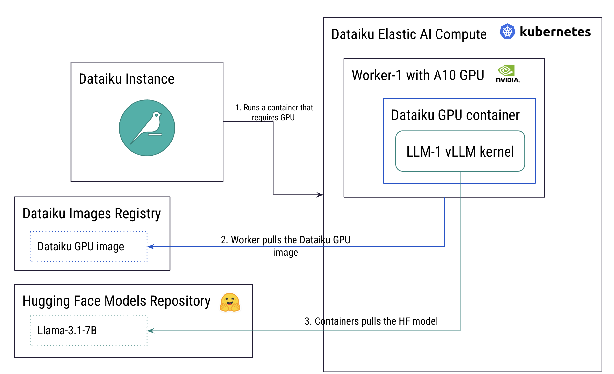
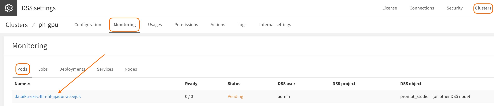
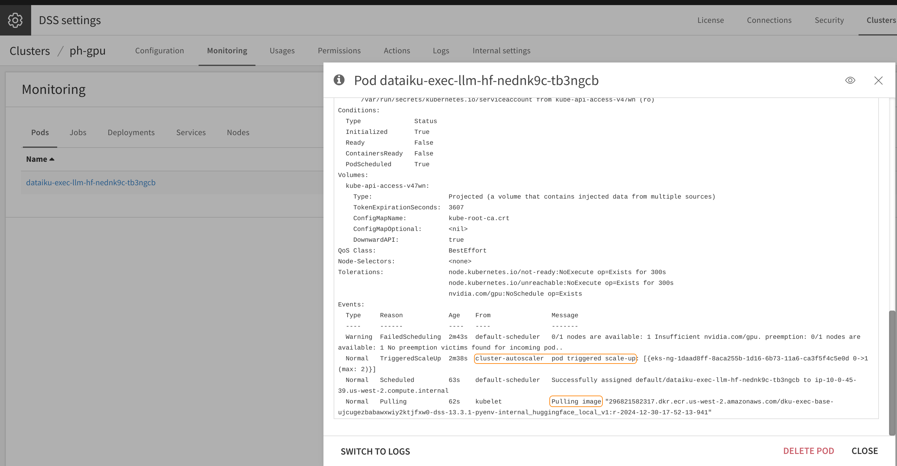
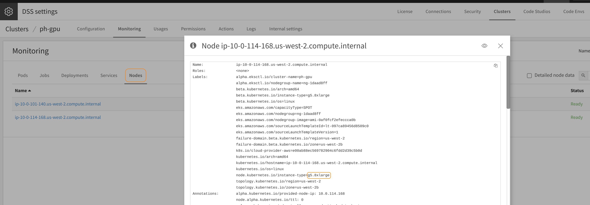
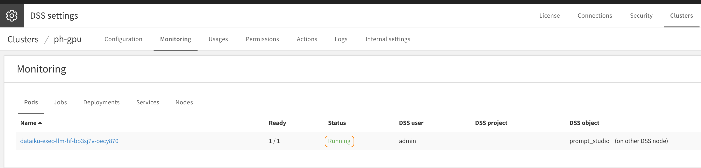
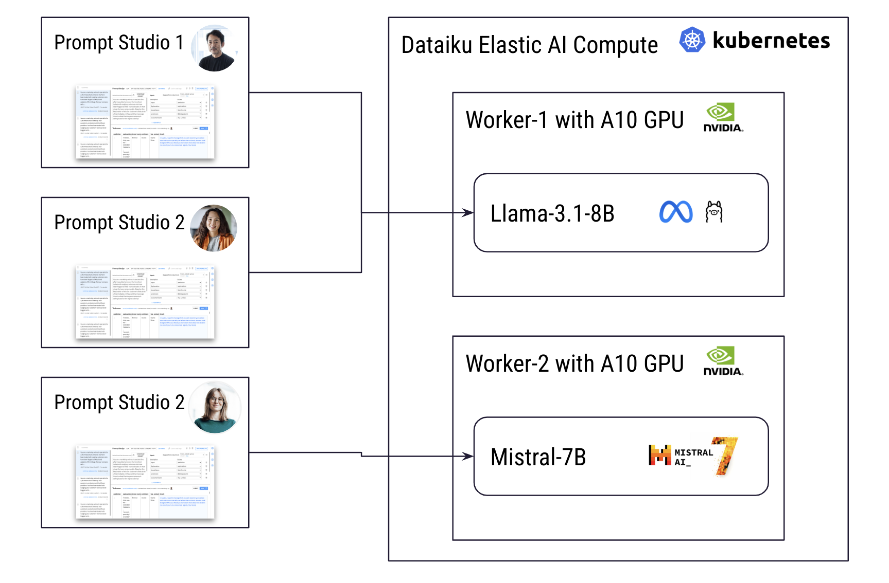
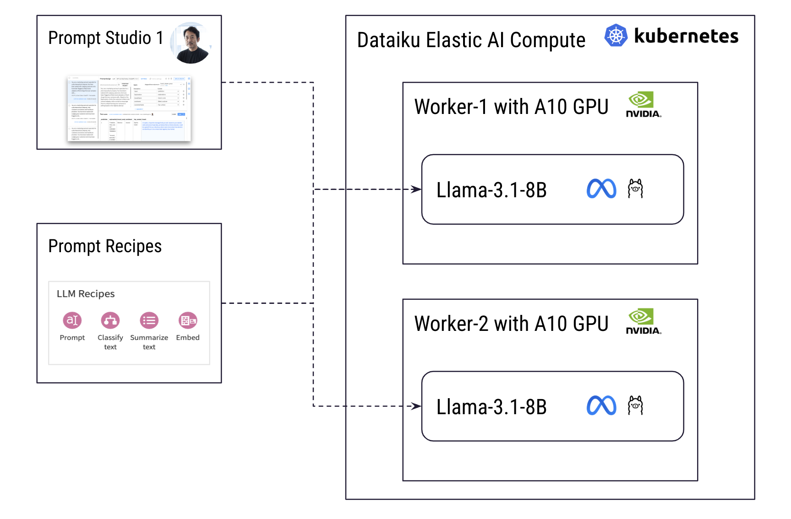
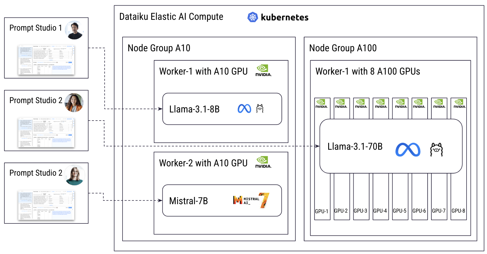

# Serve Scalable Local LLM Models with Dataiku

## 1\. Why Host LLMs Locally?

The primary reason for hosting your own LLM (Large Language Model) is data privacy. When using public APIs, your data is shared with third parties. While many providers offer options where no data is retained, this approach may still be unsuitable for certain sensitive data types. Hosting models locally ensures that sensitive data remains entirely within your infrastructure.

Self-hosting also provides full flexibility in model selection. Smaller, specialized models can often deliver a better cost-to-performance ratio compared to general-purpose models, especially when tailored to specific tasks.

**Key Considerations and Requirements:**

* **Compute Resources:** Access to specialized compute resources such as GPUs to run LLMs effectively.  
* **Cost Management:** Implement a system capable of dynamic scaling. This includes scaling down during the design and testing phases and scaling out to handle traffic spikes when deployed to production.  
* **Model Access:** Ensure availability of the latest state-of-the-art models and techniques.

## 2\. Getting Started with Dataiku: Serve your first model

The following requires Dataiku 13.4.

In the following steps, we will explore how to serve a self-hosted LLM deployment using [Dataiku Cloud Stacks](https://doc.dataiku.com/dss/latest/installation/index.html). While the deployment and configuration of a Dataiku platform, including its [Elastic AI Compute](https://doc.dataiku.com/dss/latest/containers/index.html) capabilities, are beyond the scope of this article, they will be assumed as already set up. The focus here will be on provisioning GPUs and hosting LLMs within the Dataiku environment.

To begin with a simple yet practical example, we will serve a 7B parameters model on NVIDIA A10 GPUs, provisioned through Dataiku’s Elastic AI Compute. This setup will demonstrate how LLM deployment can leverage Dataiku’s built-in elasticity and scalability for both cost efficiency and performance. Note that admin permission is  required for the next steps.

Notes:

* When operating on-premise, Dataiku can be attached to [existing Kubernetes (eg: Openshift)](https://doc.dataiku.com/dss/latest/containers/openshift/index.html) clusters equipped with GPU workers.  
* GPU resources can also be provisioned by [peering Dataiku with Nvidia DGX system](https://doc.dataiku.com/dss/latest/containers/dgxsystems/index.html).

### 2.1. Add GPU worker to Dataiku’s Elastic AI Compute

To serve your LLM effectively, you need to provision GPU resources. Start by adding two NVIDIA A10 GPU workers with auto-scaling capabilities to optimize cost by scaling down when idle.

#### Steps to Add GPU Workers:

1. Navigate to:  
   `Administration > Clusters > [Your Target Cluster] > Actions > Add a Node Group (Manually Defined)`  
2. Configure the following fields:  
   * **Machine Type:**  
     * AWS: `g5.8xlarge`  
     * Azure: `Standard_NV36ads_A10_v5`  
     * GCP: `g2-standard-16` (L4 GPU)  
   * **Default Number of Nodes:** `0`  
   * **Enable Nodes Autoscaling:** `Checked`  
   * **Min Number of Nodes:** `0` (Allows the system to remove GPUs when not in use)  
   * **Max Number of Nodes:** `2` (Scales up automatically as demand increases, capped at two nodes)  
   * **GPU:** `Checked`

   #### Optional Configuration for Cost Efficiency:

To prevent non-GPU workloads from being scheduled on the GPU nodes (which could block them from scaling down and result in unnecessary costs), you can configure node labels and taints:

* **Node Labels:** `workerType → gpu_1xa10`  
* **Node Taints:** `workerType → gpu_1xa10`

### 2.2. Create Container Execution Configuration

Next, you'll need to create a container execution configuration to leverage the GPUs provisioned earlier.

#### Steps to Create a Container Execution Configuration:

1. Navigate to:  
   `Administration > Settings > Containerized Execution > + ADD ANOTHER CONFIG`  
2. Fill in the following fields:  
   * **Configuration Name:** `gpu_a10`  
   * **Image Registry URL:** Use the existing registry URL from a previous configuration:  
     * AWS: `[aws-sub-id].dkr.ecr.<region>.amazonaws.com`  
     * Azure: `[acr-name].azurecr.io`  
   * **Usable by** (Optional): Restrict access to this GPU configuration to a specific group of users if needed.  
   * **Custom Limits:**  
     * `nvidia.com/gpu → 1` (Since the A10 worker provisioned earlier has 1 GPU per VM. Adjust this value if using workers with multiple GPUs.)  
   * **Node Selector** (Optional): *(Requires labels set on the workers)*  
     * `nodeSelector: gpuType: gpu_1xa10`  
   * **Tolerations** (Optional): *(Requires taints set on the workers)*  
     * `tolerations: gpuType: gpu_1xa10`  
   * **Increase Shared Memory Size:** `Checked`  
   * **CPU and Memory Limit/Request:** Leave both set to `-1` (default settings).

This configuration ensures the containerized workloads can effectively utilize the provisioned GPUs, while optional node selectors and tolerations help control resource allocation. 

### 2.3. Configure the Code Environment

With GPU-enabled workers now available in Dataiku’s Elastic AI Compute powered by Kubernetes, the next step is to prepare the container image used to run LLM models. Dataiku offers a managed set of Python packages and fully handles the image build and push to the container registry. Note that, since GPU-enabled images are significantly larger, they are not included by default and need to be explicitly configured.

#### Preparing the Image:

Follow the steps outlined in the [official Dataiku documentation](https://doc.dataiku.com/dss/latest/generative-ai/huggingface-models.html#create-a-code-env) to prepare the image properly.

This ensures the code environment is optimized for GPU workloads, enabling efficient deployment of your LLM models.

### 2.4. Configure the Hugging Face (HF) Connection

To enable access to Hugging Face models within Dataiku, you need to [configure the Hugging Face connection as described here](https://doc.dataiku.com/dss/latest/generative-ai/huggingface-models.html#create-a-hugging-face-connection). This defines which models will be available for use. Note that it is possible to run models without direct connectivity to the Hugging Face registry (eg: airgaped deployment) by using [Dataiku model cache](https://doc.dataiku.com/dss/latest/generative-ai/model-cache.html).

#### Steps to Configure the HF Connection:

1. Activate a Model:  
   * Ensure that **Llama 3.1 8B** is activated.  
   * You must have a Hugging Face account and accept the terms for accessing the Llama models.  
2. Generate a Token:  
   * [Generate a Hugging Face API token from your account](https://huggingface.co/docs/hub/security-tokens).  
   * Use this token when configuring the Hugging Face connection in Dataiku.

#### Security Settings (Optional):

You can restrict access to Hugging Face models within the connection by setting:  
`Security Settings > Freely Usable by > Selected groups`

### 2.5. Test the Setup

You now have a fully operational setup where users can query the **Llama-3.1-8B** model running on your own GPU-enabled environment, benefiting from the scalability and efficiency of **Dataiku LLM Mesh**.

#### Quick Test Using Prompt Studio:

The most straightforward way to test the setup is through Prompt Studio:

1. In a Dataiku Project:  
   * Create a New Prompt Studio session.  
2. Add a Prompt:  
   * Select Prompt without inputs.  
3. Choose the LLM:  
   * Set the model to **Llama-3.1-8B Instruct** (connection: hf).  
4. Run the Prompt.

#### What to Expect During the First Query:

The very first query may take a few minutes to complete. This delay occurs because your environment was configured to minimize costs by scaling GPU workers to zero when idle (as defined in **Section 2.1**). Here's what happens behind the scenes before you receive the first response:

1. Prompt Submission: Your query is submitted to the Dataiku LLM Mesh targeting the local Llama-3.1-8B model.  
2. GPU Provisioning: A GPU worker is provisioned.  
3. Container Pulling: The worker pulls the GPU-enabled container image and the LLM model.  
4. Model Initialization: The model is loaded and initialized.  
5. Prompt Execution: The query runs, and you receive a response within seconds once the LLM model instance is ready.

#### Monitoring the Activity:

Optionally, you can observe the entire process using Elastic AI Compute Monitoring:

* Go to: `Administration > Cluster > [Your Cluster] > Monitoring`.  
* You'll see the container in a waiting state as it prepares for the GPU worker to become available.

Clicking on the pod in the monitoring view provides detailed insights into the provisioning process. You'll observe the following steps:

1. GPU Worker Provisioning: The GPU worker is allocated and started.  
2. Container Pulling: The worker pulls the Dataiku GPU-enabled image required to run the LLM model.

This detailed view helps confirm that the infrastructure is functioning as expected and that the GPU worker is being correctly provisioned and utilized.

On the Nodes table, the GPU worker appears as ready in the list.  

Finally, you can see that the model is up and running.  

Now, an instance of **Llama-3.1-8B** is fully up and running. If you submit another prompt, the response will be generated within a few seconds—just the time needed for the model to process and return the result.

#### Idle Timeout Behavior:

* If the model remains unused, it will stay idle for 20 minutes by default before being deallocated.  
* This behavior can be adjusted in:  
  * `Administration > LLM Mesh > Hugging Face > Idle TTL`

This timeout setting ensures efficient resource management while keeping the model available for frequent queries.
Note that it is possible to avoid this startup time by keeping the model running. This can be configured in the Hugging Face connection on a per model basis:
* **Llama-3.1-8B configuration box:**  
  * **Min. model isntances:** `1`

## 3\. How Dataiku Scales Usage

As a centralized AI platform, Dataiku manages diverse types of AI workloads, efficiently directing them to the available GPU resources it controls. To maintain consistent performance, Dataiku dynamically orchestrates the scaling of GPUs based on demand.

In the previous configuration, a pool of **NVIDIA A10 GPUs** was set up with the ability to scale from **0** (no demand) to **2 active GPUs**. Currently, a single user is running **Llama-3.1-8B** experiments through **Prompt Studio.** 

### 3.1 What Happens When Other Users Join?

If a second user starts working with **Llama-3.1-8B** at the same time, Dataiku LLM Mesh will automatically route the new prompts to the existing **Llama-3.1-8B** instance already running on the active GPU worker.

However, if another user initiates prompts using a different model, such as **Mistral-7B**, Dataiku will seamlessly provision a new model instance by:

1. Starting the second GPU worker.  
2. Pulling the GPU-enabled container image and the required model.  
3. Running the new model on the newly provisioned worker.

This dynamic scaling ensures optimal resource usage while maintaining low-latency performance for all users.

This type of workload typically does not saturate GPU resources. The current setup, running **Llama-3.1-8B** on **NVIDIA A10 GPUs**, can handle several dozen queries per second (processing hundreds of tokens per second) while maintaining a streaming speed that remains comfortable for real-time reading.

This efficiency ensures that multiple users can interact with the model simultaneously without performance degradation, making it suitable for both experimentation and production workloads.

### 3.2 Scaling Under Heavy Workloads ("Hammering" the Model)

Now, let's explore scenarios where the **Llama-3.1-8B** model is pushed to its performance limits and how Dataiku LLM Mesh manages such demands.

A single model instance can reach its capacity when handling large-scale batch processing, such as:

* Prompt Recipes included in the Flow, applied to thousands of rows,  
* Each row generates a separate query sent to the LLM model.

#### How Dataiku Manages Heavy Workloads:

When the model's capacity is exceeded, Dataiku LLM Mesh automatically scales to maintain performance:

1. **Auto-Scaling:** Additional instances of **Llama-3.1-8B** are provisioned automatically.  
2. **Load Balancing:** Once the additional instances are ready, Dataiku LLM Mesh load balances incoming queries across all available instances, a technique known as **data parallelism**.  
3. **Resource Optimization:** As the workload decreases, Dataiku automatically deprovisions unused model instances and their associated GPU resources to reduce costs.

This elastic scaling ensures both optimal performance and cost efficiency, making the platform well-suited for demanding AI workloads.

By default, a given Hugging Face LLM model can scale out to up to the maximum defined at the global Dataiku level, once the maximum is reached no additional model instance can be started. This can be considered as a global cost guard: 

* `Administration > LLM Mesh > Hugging Face > Max Concurrent Runs` : **2**

To ensure balanced GPU resource allocation between several models, it is possible to define a maximum number of LLM model instance on a per model basis within the Hugging Face connection: 

* **Llama-3.1-70B configuration box:**  
  * **Max. model instances:** **1** 

### 3.3. Going Large: Scaling for Bigger Models

So far, we've focused on "small" models like **Llama-3.1-8B**, which can run on a single GPU. But what about larger models, such as **Llama-3.1-70B**, which require multiple GPUs due to their size?

#### Provisioning Additional GPU Resources:

To serve larger models, you can provision an additional node group following the same process outlined in **Section 2.1**, with a few adjustments:

* **Machine Type:**  
  * Select a worker type equipped with 8 GPUs, such as:  
    * **AWS:** `p4d.24xlarge`  
    * **Azure:** `Standard_ND96amsr_A100_v4`

#### Add a Dedicated Container Execution Configuration:

 Follow the same process outlined in **Section 2.2**, with a few adjustments:

* **Configuration Name:** `gpu_8x_a100`  
* **Custom Limits:**  
  * `nvidia.com/gpu → 8` (since each instance of **Llama-3.1-70B** spans multiple GPUs).

#### Adjust the Hugging Face Configuration:

Enable the access to this larger GPU pool for  **Llama-3.1-70B** with a few adjustments in the Hugging Face connection:

* **Llama-3.1-70B configuration box:**  
  * **Container execution:** `gpu_8x_a100` (created in the previous step to access the A100 GPUs, making sure that smaller 7B models will use the default GPU workers with A10)

#### Dataiku’s Multi-GPU Scaling:

Once configured, Dataiku LLM Mesh automatically deploys **Llama-3.1-70B** across multiple GPUs using **tensor parallelism**, ensuring efficient handling of large models without performance degradation.

#### Handling Large Context Length Models:

When loading models on a GPU, vLLM checks if sufficient GPU memory is available to accommodate both the model weights and the cache for the full context length. Since recent models support very large context lengths, this can sometimes cause out-of-memory errors.

**If needed, you can limit the amount of memory consumed by the context length by restricting its maximum length as follows:**

* In Hugging Face connection go to: `<the-model-you-want-to-adjust>`  
* Set Property:  
  * `Max tokens → 4096`

## 4\. Exploring Further: Understanding GPU Requirements for LLM Serving

As we explored earlier, each model has specific GPU requirements to be served effectively. The primary factor influencing these requirements is **GPU memory**, which can be divided into two key components:

#### Model Weights Storage:

* A portion of the GPU memory is used for storing the model's weights.  
  * **Llama-3.1-8B:** Requires approximately **16 GB** of GPU memory.  
  * **Llama-3.1-70B:** Requires approximately **160 GB** of GPU memory.

  #### KV Cache Storage (Key-Value Cache):

The remaining memory is allocated for the **KV Cache**, which stores the keys and values of all tokens within the model's context.

* Example KV Cache Requirements (1000 Tokens):  
  * **Llama-3.1-8B:** \~**0.125 GB**  
  * **Llama-3.1-70B:** \~**0.313 GB**  
* KV Cache Growth Factors:  
  * One KV cache is allocated per sequence the model computes in parallel.  
  * Memory usage grows with **sequence length** and **batch size**.

  #### Key Insight:

Once the model weights are loaded, **the more memory available for KV cache, the more parallel sequences the model can handle.** This improves real-time inference throughput by allowing the model to process multiple queries simultaneously.

#### Performance Metrics for Real-Time Use Cases

The table below summarizes common configurations for major models and their corresponding GPU requirements.

* **Max Real-Time Concurrency:** Refers to the number of concurrent queries (each with a few hundred tokens) that can be served while maintaining a good user experience:  
  * Responses start in **under 10 seconds**.  
  * Token generation speed exceeds the average reading pace.  
* **Example GPU Configurations:** VM instances from Azure and AWS are provided as examples, though other configurations can also be successful.

| Model | GPU | Max real-time concurrency (query/s) | AWS VM | AZ VM | GCP VM |
| :---- | :---- | :---- | :---- | :---- | :---- |
| Llama-3.1-8B | 1x A10 | 30 | g5.8xlarge | Standard\_NV36ads\_A10\_v5 |  |
| Llama-3.1-70B | 8x A100 | 50 | p5.48xlarge | Standard\_ND96amsr\_A100\_v4 | a2-ultragpu-8g |
| Mistral-7B | 1x A10 | 30 | g5.8xlarge | Standard\_NV36ads\_A10\_v5 |  |
| Mixtral-8x7B | 8x A100 | 50 | p5.48xlarge | Standard\_ND96amsr\_A100\_v4 | a2-ultragpu-8g |
| Gemma-2-9B | 1x A10 | 5 | g5.8xlarge | Standard\_NV36ads\_A10\_v5 |  |
| Llama-3.1-8B | 1x L40 | 50 | g6e.4xlarge |  |  |

Note that the prompts used are have a few hundreds of tokens and also generate a few hundreds of tokens.