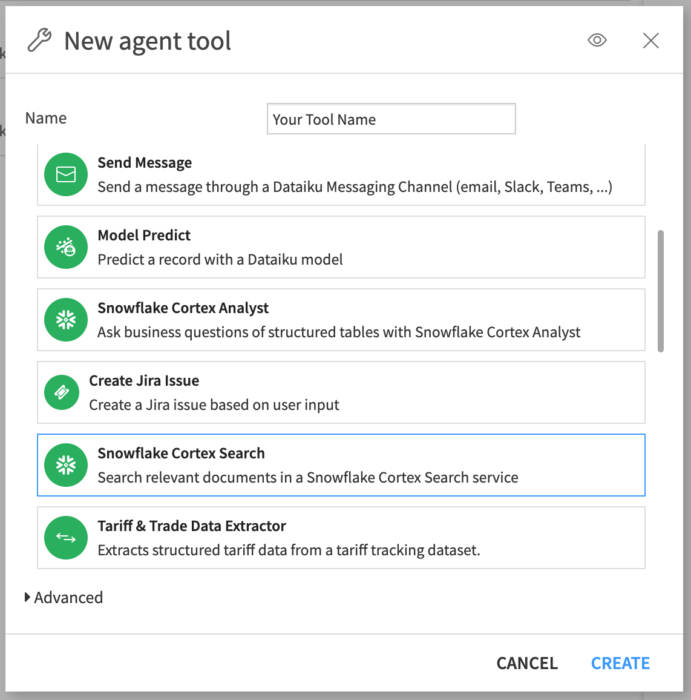
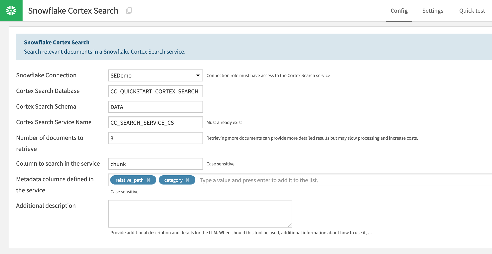
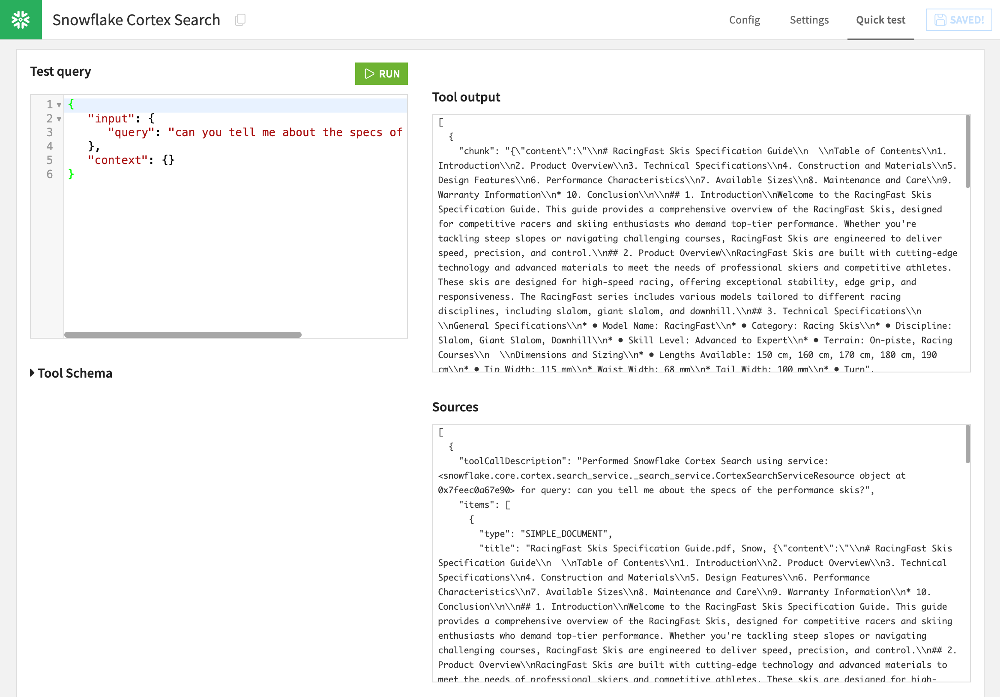
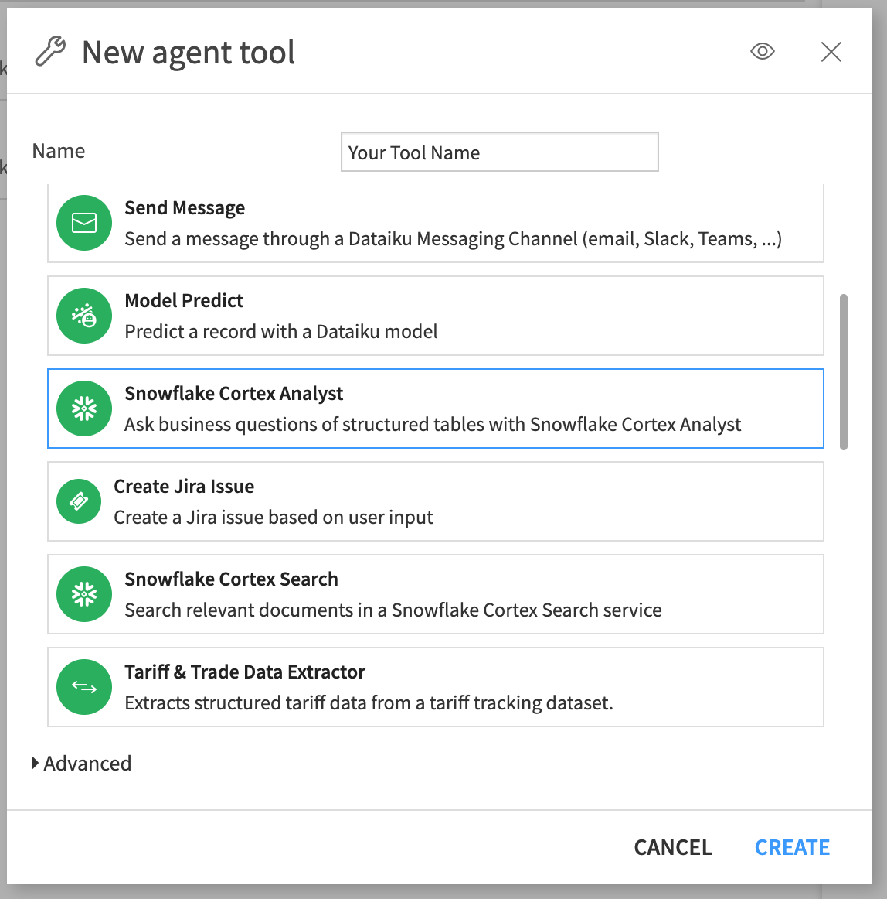
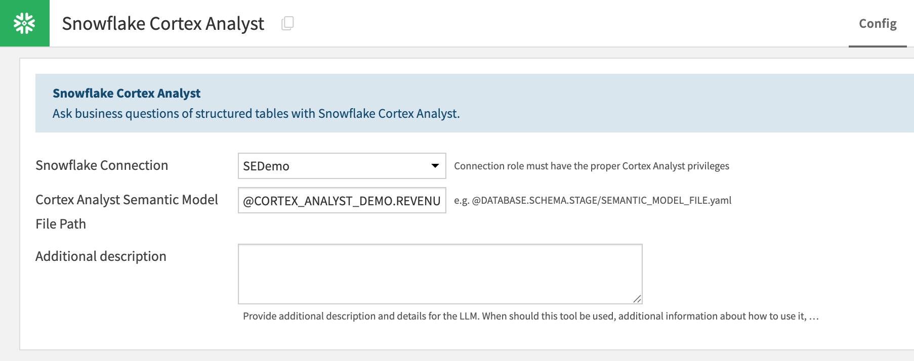
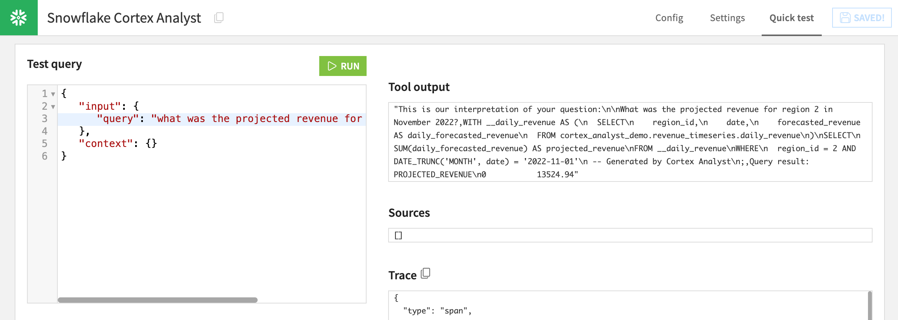
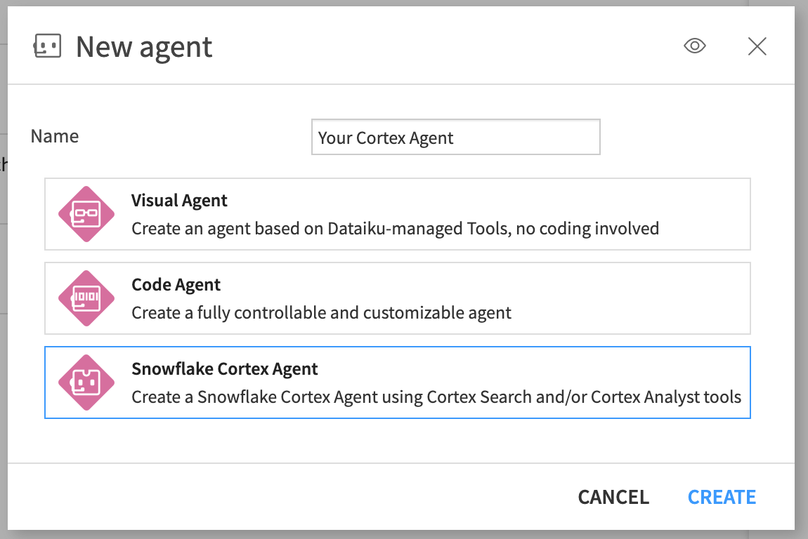
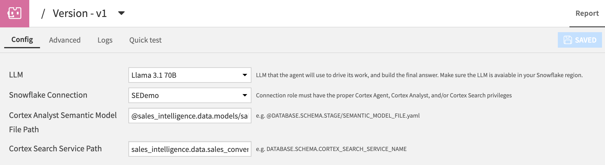
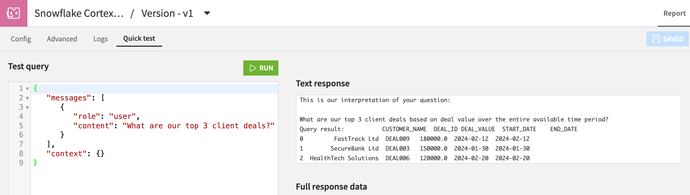

# Snowflake Cortex - Extended Integrations

## Introduction
The purpose of this app-note is to describe how to integrate Snowflake Cortex Agents, Cortex Search, and Cortex Analyst into you Dataiku projects.

All of these extended integrations are provided by the "Snowflake Tools" plugin, which needs to be installed. You can download the latest version of the plugin [here](https://tinyurl.com/bdef6pyh). 

There are two ways you can build agents with Snowflake Cortex Search and Cortex Analyst:
1. Use the "lower-level" Cortex Search tool and Cortex Analyst tool plugin components. Simply add these tools to any Dataiku visual or code agent. This way, you can customize your agent by adding routing logic, other non-Snowflake tools, and choosing any LLM supported by the LLM Mesh with Dataiku's standard Agent building capabilities.
2. Use the "higher-level" Cortex Agent plugin component. Create a Cortex Agent in Dataiku, point it to your existing Cortex Search and/or Cortex Analyst service(s), then let Snowflake's proprietary agentic workflow handle any routing to these tools.

## Cortex Search
[Cortex Search](https://docs.snowflake.com/en/user-guide/snowflake-cortex/cortex-search/cortex-search-overview) is a Snowflake-managed search/retrieval service over your text data in Snowflake.

You must first create a Cortex Search service in Snowflake, choosing the document corpus, embedding model, and other search parameters. Then, use this tool to submit a query to the Cortex Search service. The tool will return a list of matching documents. Generating an answer based on the matching documents is then the responsibility of the calling agent.

When creating a tool instance in your project, choose the Snowflake connection, database, schema, and Cortex Search service name. Choose the number of documents to retrieve, and the columns to search in the service.

Test your Cortex Search tool in the "Quick test" tab:

This tool uses the Snowflake python API to query the Cortex Search service. Ensure that your Snowflake role from the chosen Snowflake connection has the required usage [permissions](https://docs.snowflake.com/en/user-guide/snowflake-cortex/cortex-search/cortex-search-overview#grant-usage-permissions) on the service.

## Cortex Analyst
[Cortex Analyst](https://docs.snowflake.com/en/user-guide/snowflake-cortex/cortex-analyst) is a Snowflake-managed generative chat API intended for text-to-SQL applications over your Snowflake tables.

You must first create a Cortex Analyst-compatible semantic model YAML file and upload it to a Snowflake stage. Defining the semantic model is critical to the Cortex Analyst service being able to accurately translate questions into SQL queries on your data. For more information on defining a semantic model, see the Snowflake [documentation](https://docs.snowflake.com/en/user-guide/snowflake-cortex/cortex-analyst/semantic-model-spec).

This tool passes a natural language query into a REST API call to the Cortex Analyst service. The Cortex Analyst service will then return back a combination of 1) natural language chat response and 2) SQL query suggestion. If Cortex Analyst returns a SQL query suggestion, this tool will run the query using a Snowpark python session. The tool then returns to the agent any Cortex Analyst natural language response, SQL query suggestion, SQL query result, and/or error message returned from the Cortex Analyst API or the Snowpark SQL query run.

When creating a tool instance in your project, choose the Snowflake connection and path to the Cortex Analyst semantic model file in Snowflake, with the format @DATABASE.SCHEMA.STAGE/SEMANTIC_MODEL_FILE.yaml

Test your Cortex Analyst tool in the "Quick test" tab:

Ensure that your Snowflake role from the chosen Snowflake connection has the required [permissions](https://docs.snowflake.com/en/user-guide/snowflake-cortex/cortex-analyst#access-control-requirements) to access the service. Note that Cortex Analyst API requires an OAuth connection to Snowflake.

## Cortex Agents
[Cortex Agents](https://docs.snowflake.com/en/user-guide/snowflake-cortex/cortex-agents) is a Snowflake-managed agentic chat API that includes planning, tool use (with Cortex Search and Cortex Analyst) and reflection.

You must first create a Cortex Analyst or Cortex Search service (or both) as described above. 

When creating a Cortex Agent in your project, choose an LLM to drive the agent's work. These LLMs are not LLMs from an existing LLM Mesh connection, rather they are the LLMs hosted and [supported](https://docs.snowflake.com/en/user-guide/snowflake-cortex/cortex-agents#supported-models) by the Cortex Agents service.

Then, select your Snowflake connection, enter the path to the Cortex Analyst semantic model file in Snowflake, with the format @DATABASE.SCHEMA.STAGE/SEMANTIC_MODEL_FILE.yaml, and path to the Cortex Search service with the format DATABASE.SCHEMA.CORTEX_SEARCH_SERVICE_NAME.

Test your Cortex Agent in the "Quick test" tab:

This agent passes a natural language user input into a REST API call to the Cortex Agent service path "$YOUR_SNOWFLAKE_ACCOUNT_BASE_URL/api/v2/cortex/agent:run". The Cortex Agent will ultimately return a text response. The agent will decide which Cortex Search or Cortex Analyst tools to use (if at all), and will return source citations.

Ensure that your Snowflake role from the chosen Snowflake connection has the required [permissions](https://docs.snowflake.com/en/user-guide/snowflake-cortex/cortex-agents#access-control-requirements) to access Cortex Agents and the selected Cortex Search and/or Cortex Analyst services. Note that Cortex Agents API requires an OAuth connection to Snowflake.
