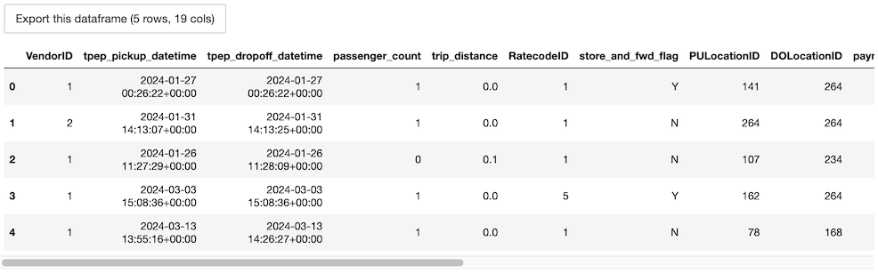
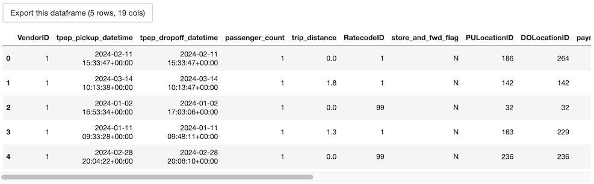
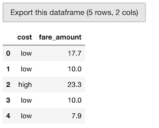
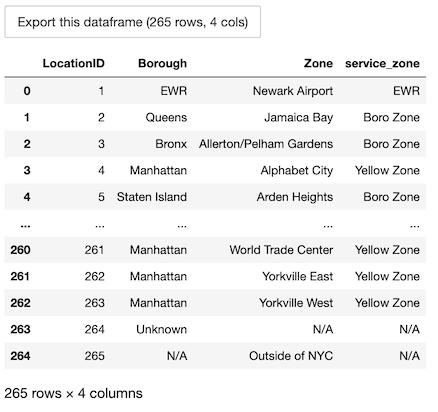
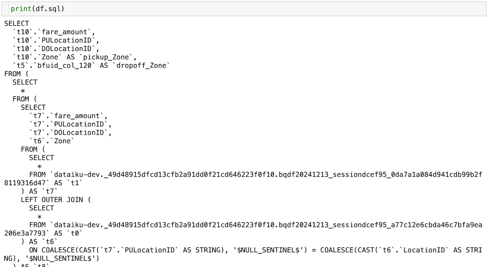

# Using Bigframes Python in Dataiku: basics 

This tutorial introduces users to Bigframes,
a Python library designed for efficient data manipulation in BigQuery, within the Dataiku environment.
It covers the prerequisites for using Bigframes, demonstrates how to establish a session,
provides guidance on loading data into BigQuery DataFrames, and performs common data operations.
By using the NYC taxi trip and zone datasets, users will learn to leverage the Bigframes API for effective data processing.

## Prerequisites

* Dataiku >= 13.4.0
* A [BigQuery connection](https://doc.dataiku.com/dss/latest/connecting/sql/bigquery.html) with Datasets containing :

    * the [NYC Taxi trip data](https://www1.nyc.gov/site/tlc/about/tlc-trip-record-data.page) over the year/month of your choice, referred to as `NYC_trips`
    * the [NYC Taxi zone lookup table](https://d37ci6vzurychx.cloudfront.net/misc/taxi+_zone_lookup.csv) referred to as `NYC_zones`.

* A Python 3.9 [code environment](https://doc.dataiku.com/dss/latest/code-envs/index.html) with the [`bigframes`](https://cloud.google.com/python/docs/reference/bigframes/latest) package installed.


## What is Bigframes?

Bigframes is a Python library design to programmatically access and process data in BigQuery using Python. It allows the user to manipulate *DataFrames* similarly to Pandas. The developer site of Bigframes mentions [Apache Ibis](https://ibis-project.org) as a precursor, which means that Bigframes' goal is to convert operations expressed on Pandas dataframes as BigQuery SQL under the hood.

In this tutorial, you will work with the `NYC_trips` and `NYC_zones` Datasets to discover a few features of the Bigframes Python API and how they can be used within Dataiku to:

- Facilitate reading and writing BigQuery Datasets.
- Perform useful/common data transformation.


## Creating a Session

Whether using Bigframes in a Python recipe or notebook, you'll first need to create a Bigframes Session. 

A [Session](https://cloud.google.com/python/docs/reference/bigframes/latest/bigframes.session.Session) object is used to establish a connection with BigQuery. Normally, this Session would need to be instantiated with the user manually providing credentials such as a private key or an access token. However, the `get_session()` method reads all the necessary parameters from the BigQuery connection in Dataiku and thus exempts the user from having to handle credentials manually. 

Start by creating a Jupyter notebook with the code environment mentioned in the prerequisites and instantiate your Session object: 
```py
from dataiku.bigframes import DkuBigframes

bf = DkuBigframes()
# Replace with the name of your BigQuery connection
session = bf.get_session(connection_name="YOUR-CONNECTION-NAME")
```

The default when instantiating the `DkuBigframes` object is to use the so-called "NULL ordering" or "partial ordering". This mode is needed to use BigQuery tables with `require_partition_filter` set to true, and to avoid full scans in some Bigframes operations, but comes at the cost of ease of use of the API, since the dataframes then lack an index. You can pass `session_ordering_mode = 'strict'` to the `DkuBigframes` constructor if you don't need the partial ordering.

## Loading data into a DataFrame

Before working with the data, you first need to read it, more precisely to *load it from a BigQuery table into a BigQuery DataFrame*. With your `session` variable, create a BigQuery DataFrame using one of the following ways:


### Option 1: with the Dataiku API
The easiest way to obtain a BigQuery DataFrame is by using the `get_dataframe()` method and passing a `dataiku.Dataset` object. The `get_dataframe()` can optionally be given a Bigframes Session argument. Dataiku will use the session created above or create a new one if no argument is passed.

```py
import dataiku 
NYC_trips = dataiku.Dataset("NYC_trips")
df_trips = bf.get_dataframe(dataset=NYC_trips)
```
### Option 2: with a SQL query
Using the `session` object, a DataFrame can be created from a SQL query.

```py
# Get the name of the dataiku.Dataset's underlying Bigquery table.
trips_table_info = NYC_trips.get_location_info().get('info', {})
df_trips = session.read_gbq_query(f"Select * from `{trips_table_info.get('schema')}.{trips_table_info.get('table')}`")
```

Unlike Pandas DataFrames, BigQuery DataFrames are lazily evaluated. This means that they, and any subsequent operation applied to them, are not immediately executed.

Instead, they are evaluated only upon the calling of certain methods (`peek()`, `to_pandas()` and converting to text, for example when printing in a notebook cell).

This lazy evaluation minimizes traffic between the BigQuery warehouse and the client as well as client-side memory usage.


## Retrieving rows

* The `peek(n)` method is the only method that allows users to pull and check **n** rows from the BigQuery DataFrame. Yet, it is arguably not the most pleasant way of checking a DataFrame's content.

```py
# Retrieve 5 rows
df_trips.peek(5)
```

{.image-popup}

* The `to_pandas()` method converts the BigQuery DataFrame into a more aesthetically-pleasing Pandas DataFrame. Avoid using this method if the data is too large to fit in memory. Instead, leverage the [`to_pandas_batches()`](https://cloud.google.com/python/docs/reference/bigframes/latest/bigframes.dataframe.DataFrame#bigframes_dataframe_DataFrame_to_pandas_batches) method. Alternatively, you can use a head statement before retrieving the results as a Pandas DataFrame. Note that the inner workings of Bigframes use orderings in order to replicate Pandas indexes, and this means that the `head()` method needs one such ordering to be present. Since the default when instantiating the `DkuBigframes` object is to use the so-called "NULL ordering" or "partial ordering", the ordering needs to be provided manually for methods who need it, with a `sort_values()` call for example.

```py
df_trips.sort_values('VendorID').head(5).to_pandas()
```
{.image-popup}

## Common operations

Bigframes attempts to follow Pandas' usage pattern when it comes to dataframes. This contrasts with Snowpark and Databricks Connect, whose dataframes behave a lot more like Spark dataframes.

The following paragraphs illustrate a few examples of basic data manipulation using DataFrames:

### Selecting column(s)

Accessing columns using classical Pandas indexing is possible, as well as accessing as properties.

```py
fare_amount = df_trips[['fare_amount', 'tip_amount']]
          
# Single columns can also be accessed as
fare_amount_only = df_trips['fare_amount']
fare_amount_only_again = df_trips.fare_amount
```

### Computing the average of a column

Collect the mean `fare_amount`. This is evaluated directly and the `mean()` method returns the value as a `float`:

```py
avg_fare = df_trips['fare_amount'].mean()
avg_fare # 12.556332926005984
```

### Creating a new column from a case expression

Columns can be added or replaced with the usual Pandas indexing, or with the `assign()` meethod.

Leverage the `assign()` method to create a new column indicating whether a trip's fare was above average:

```py
df_trips = df_trips.assign(cost='high')
df_trips["cost"] = df_trips["cost"].case_when([(df_trips["fare_amount"] < avg_fare, 'low')])

# Check the first five rows
df_trips[['cost', 'fare_amount']].peek(5)
```
{.image-popup}

### Joining two tables 

The `NYC_trips` contains a pick up and drop off location id (*PULocationID* and *DOLocationID*). We can map those location ids to their corresponding zone names using the `NYC_zones` Dataset.

To do so, perform two consecutive joins on the *LocationID* column in the NYC zone Dataset.

```py
# Get the NYC_zones Dataset object
NYC_zones = dataiku.Dataset("NYC_zones")
df_zones = bf.get_dataframe(NYC_zones)

df_zones.to_pandas()
```
{.image-popup}

Finally, perform the two consecutive left joins. We'll use `merge()` and not `join()`, because `join()` is a join on the dataframe's index, and not on a specific column; and by default the dataframes have a null index. Note how you are able to chain different operations including  `rename()` to rename the *Zone* column and `drop()` to remove other columns from the `NYC_zones` dataset:

```py
df = df_trips.merge(df_zones, how='left', left_on='PULocationID', right_on='LocationID') \
             .drop(['LocationID', 'Borough', 'service_zone'], axis=1) \
             .rename(columns={"Zone":"pickup_Zone"}) \
             .merge(df_zones, how='left', left_on='DOLocationID', right_on='LocationID') \
             .drop(['LocationID', 'Borough', 'service_zone'], axis=1) \
             .rename(columns={"Zone":"dropoff_Zone"})
```

Since Bigframes essentially builds up SQL queries from operations on DataFrames, it is always possible to inspect the generated SQL query by looking at the `sql` property of the dataframe

```py
print(df.sql)
```

{.image-popup}


### Group By

Count the number of trips by pickup zone among expensive trips. Use dataframe indexing to remove cheaper trips, or the equivalent `query()`. Then use the `groupby()` method to group by *pickup_Zone*, `agg()` to compute aggregates on each group, and `sort_values()` to get them in descending order. Finally, call the `to_pandas()` method to store the results of the group by as a Pandas DataFrame, which has a slightly different display from the BigQuery DataFrames, notably the ability to elide rows.

```py
# you can also use df.query("cost == 'low'")
results_count_df = df[df["cost"] == 'low'] \
                           .groupby('pickup_Zone') \
                           .agg({"pickup_Zone":"count", "fare_amount":"mean"}) \
                           .rename(columns={'pickup_Zone':'count', 'fare_amount':'mean_fare'}) \
                           .sort_values('count', ascending=False)
results_count_df.to_pandas()
```
{.image-popup}


## Writing a DataFrame into a BigQuery Dataset

In a Python recipe, you will likely want to write BigQuery DataFrame into a BigQuery output Dataset. We recommend using the `write_with_schema()` method of the `DkuBigframes` class. This method runs the [`to_gbq()`](https://cloud.google.com/python/docs/reference/bigframes/latest/bigframes.dataframe.DataFrame#bigframes_dataframe_DataFrame_to_gbq) Bigframes method to save the contents of a DataFrame into a BigQuery table.

```py
ouput_dataset = dataiku.Dataset("my_output_dataset")
bf.write_with_schema(ouput_dataset, df)
```

```{warning}
You should avoid converting a Bigframes Python DataFrame to a Pandas DataFrame before writing the output Dataset. In the following example, using the `to_pandas()` method will create the Pandas DataFrame locally, further increasing memory usage and potentially leading to resource shortage issues.

```py
ouput_dataset = dataiku.Dataset("my_output_dataset")
# Load the ENTIRE DataFrame in memory (NOT optimal !!)
ouput_dataset.write_with_schema(df.to_pandas())
```


## Wrapping up 

Congratulations, you now know how to work with Bigframes Python within Dataiku! To go further, here are some useful links:

* [Dataiku reference documentation on the Bigframes Python integration](https://doc.dataiku.com/dss/latest/connecting/sql/bigquery.html#bigframes-integration)
* [Bigframes Python reference](https://cloud.google.com/python/docs/reference/bigframes/latest)


