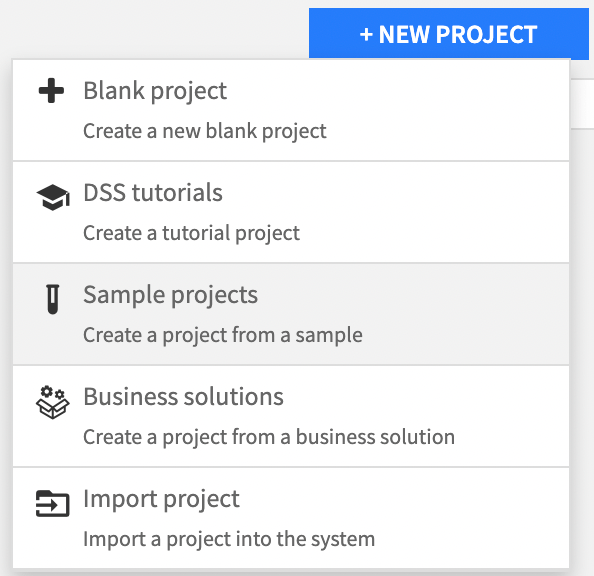
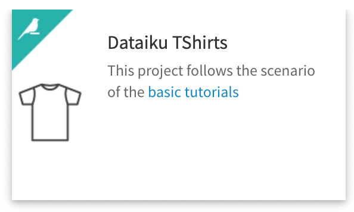
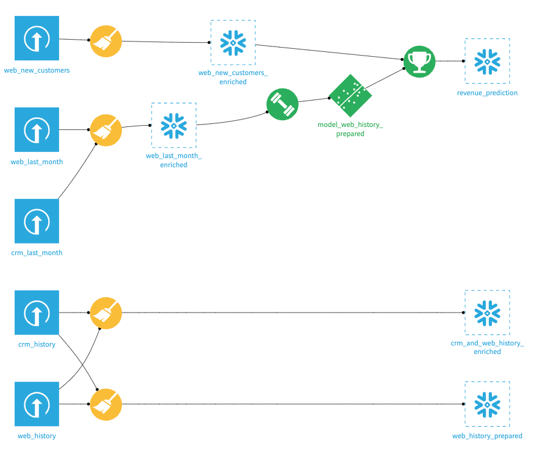
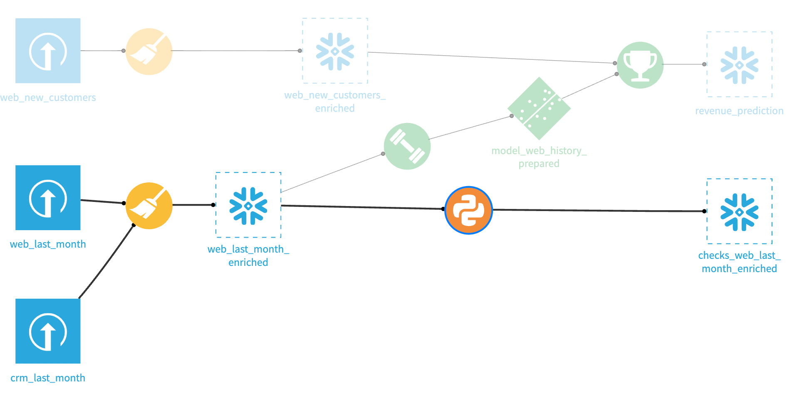
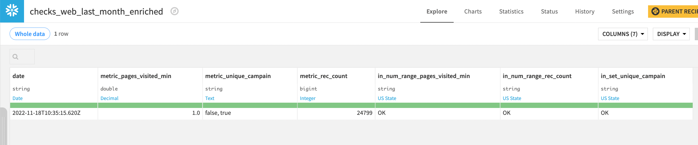
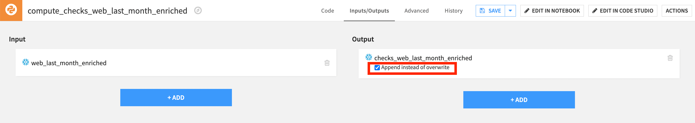

# Data quality assessments (SQL Datasets)

Data quality is fundamental to the success of businesses, it leads to better decision-making which translates to better service and potential for higher revenues. In practice, making sure that key datasets abide by your project's quality rules will ensure its robustness. For example, you will probably want to refrain from retraining a model if your training data has too much missing data in specific columns.

In Dataiku, ensuring data quality can be done visually with a combination of [Metrics](https://doc.dataiku.com/dss/latest/metrics-check-data-quality/metrics.html#metrics) and [Checks](https://doc.dataiku.com/dss/latest/metrics-check-data-quality/checks.html). You first use Metrics to take measurements on your data then use Checks to make sure those measurements meet some expectation about the data. 

While it is possible to implement [custom metrics or checks](https://doc.dataiku.com/dss/latest/metrics-check-data-quality/custom_metrics_and_checks.html#custom-probes-and-checks), those still rely on the visual features of Dataiku. For a fully programmatic usage, it is more convenient to implement the same logic using plain Python Recipes.  The resulting Flow can then be orchestrated and automated using [Scenarios](https://doc.dataiku.com/dss/latest/scenarios/index.html).  

In this tutorial, you will implement an example of fully programmatic data quality assessment in a Dataiku Project. You can think of it as a light and custom version of the Metrics and Checks visual features. 

## Prerequisites

*  A working Connection to a SQL database


## Setting up your project

This tutorial is based on the "Dataiku TShirts" sample Project available directly on your Dataiku platform. This project features a simple data processing pipeline on sales data to eventually build a ML model that predicts sales revenue from new visitors on the website.

* Create the "Dataiku TShirts" sample project.

 


* Go to the flow and [change all non-input datasets to your SQL connection](https://knowledge.dataiku.com/latest/courses/flow-views-and-actions/connection-changes-concept-summary.html). Your data flow should look like this now:



:::{note}
This tutorial assumes that you are using Snowflake, however any compatible SQL database can also work. You may have to slightly modify the SQL/Python code and use correct data types in the relevant Datasets to comply with your SQL’s flavor syntax. 
:::

## Creating metrics and checks

The `web_last_month_enriched` dataset serves as the train dataset for our model. As such, having quality data to feed to the model is of paramount importance. You will now create a python recipe to compute metrics and checks on that dataset.

### Create a Python recipe on the training dataset.

Create a python recipe from the `web_last_month_enriched` dataset. Name the output dataset `checks_web_last_month_enriched`. That output dataset will contain all the results of your checks which in turn will govern whether or not the model should be trained. 




### Importing libraries, and defining handles and check functions.
Replace the recipe's template code with the following snippet to import the necessary libraries, check functions, input and output datasets. The functions are implementations of [numeric range check](https://doc.dataiku.com/dss/latest/metrics-check-data-quality/checks.html#numeric-range-check) and [value in set check](https://doc.dataiku.com/dss/latest/metrics-check-data-quality/checks.html#value-in-set-check).

```python
import dataiku
from dataiku import SQLExecutor2
import numbers

input_dataset_name = 'web_last_month_enriched'
input_dataset = dataiku.Dataset(input_dataset_name)

output_dataset_name = 'checks_web_last_month_enriched'
output_dataset = dataiku.Dataset(output_dataset_name)

def metric_in_numeric_range(metric_val=None, maximum=None,
                         soft_maximum=None, minimum=None, soft_minimum=None):
    """
    Returns OK if a metric value falls within the minimum - maximum range otherwise ERROR
    Returns WARNING if a metric value falls outside a soft_minimum - soft_maximum range
    """
    if metric_val is None:
        return 'EMPTY'

    if maximum is None and soft_maximum is None and minimum is None and soft_minimum is None:
        return 'EMPTY'

    elif isinstance(metric_val, numbers.Number):      
        if minimum is not None:
            if metric_val < minimum:
                return 'ERROR'
        if maximum is not None:
            if metric_val > maximum:
                return 'ERROR'
        if soft_minimum is not None:
            if metric_val < soft_minimum:
                return 'WARNING'

        if soft_maximum is not None:
            if metric_val > soft_maximum:
                return 'WARNING'
        return 'OK'  

    else:
        return 'WARNING'

    
def metric_in_set_of_values(metric_vals=None, admissible_values=None):
    """
    Returns OK if the set of metric values is in 
    the set of allowed values
    """
    if not isinstance(metric_vals, set) or not isinstance(admissible_values, set):
        return 'EMPTY'
    
    if not len(metric_vals) or not len(admissible_values):
        return 'EMPTY'
    
    if len(metric_vals - admissible_values):
        return 'ERROR'
    else:
        return 'OK' 
```

### Querying the metrics and checking them.
In the recipe, you will leverage the [SQLExecutor2](https://doc.dataiku.com/dss/latest/python-api/sql.html#performing-sql-hive-and-impala-queries) module to inject a SQL query into the `web_last_month_enriched` dataset and collect statistics (your metrics) in the form of a Pandas dataframe. Besides computing column statistics, you are also "timestamping" for bookkeeping purposes. 


Add the following code to the bottom of your recipe:

```python
query_stats = f"""
SELECT
    current_timestamp(2) as "date",
    MIN("pages_visited") AS "metric_pages_visited_min",
    LISTAGG(DISTINCT("campain"), ', ') AS "metric_unique_campain",
    COUNT(*) AS "metric_rec_count"
    FROM "{input_dataset.get_location_info().get('info', {}).get('table')}"
"""

executor = SQLExecutor2(dataset=input_dataset)
df = executor.query_to_df(query_stats)


# Checking that metric_pages_visited_min is at least 1 
df['in_num_range_pages_visited_min'] = metric_in_numeric_range(
    df['metric_pages_visited_min'][0], minimum=1)

# CHecking that metric_rec_count is greater than 1000
df['in_num_range_rec_count'] = metric_in_numeric_range(
    df['metric_rec_count'][0], minimum=1000)

# Check that "metric_unique_campain" is either true or false
metric_values = set(df['metric_unique_campain'][0].split(', '))
admissible_values = set(['true', 'false'])

df['in_set_unique_campain'] = metric_in_set_of_values(
        metric_values, admissible_values)

# write the results of the query to your output dataset
output_dataset.write_with_schema(df)
```

In the above code, note that `LISTAGG` works for Snowflake, Oracle and Db2. For PostgreSQL or SQL Server, use `STRING_AGG`. For MySQL, use `GROUP_CONCAT()`. 

You should be all set! Run the recipe to make sure everything works -  the output should look like this:




## Persisting check results

When building datasets, the default behavior in Dataiku is to overwrite their content. If you want to persist the results from each build, go to the Python recipe, then click **Inputs/Ouputs** and check the **Append instead of overwrite** box. Save. 




## Using test results 

Suppose that every week, you wish to re-train your revenue-prediction model on newer data. Before doing so, it's important to check that after every update, your train dataset (`web_last_month_enriched`) meet your data quality requirements and only re-train the model if none of the checks fails. 

You can build a [scenario](https://doc.dataiku.com/dss/latest/scenarios/definitions.html#definitions) to automate this process. After setting a weekly trigger, you would use a Python script (or Python step) to:

* Re-build the `checks_web_last_month_enriched` dataset recursively
* Retrieve the results of the checks
* Re-train the model only if all the checks passed. 


