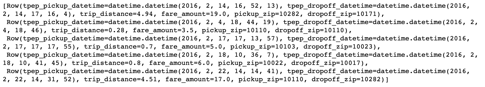
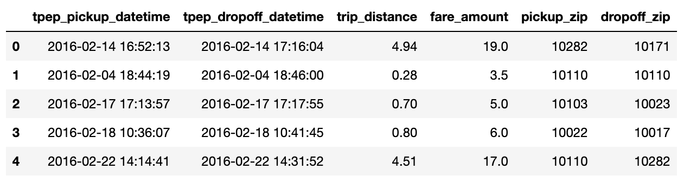
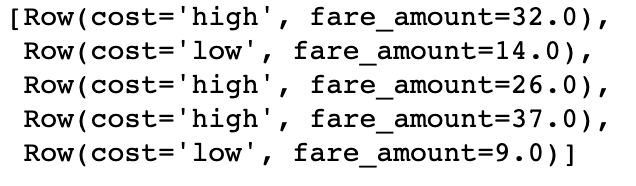
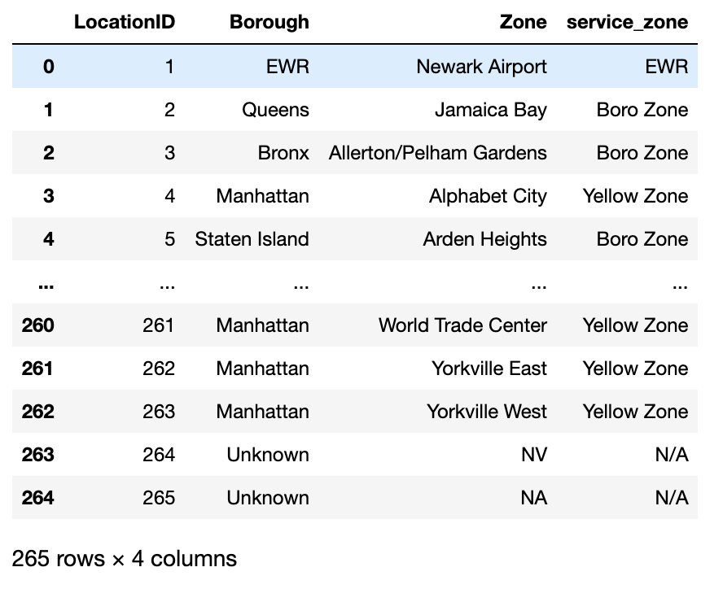
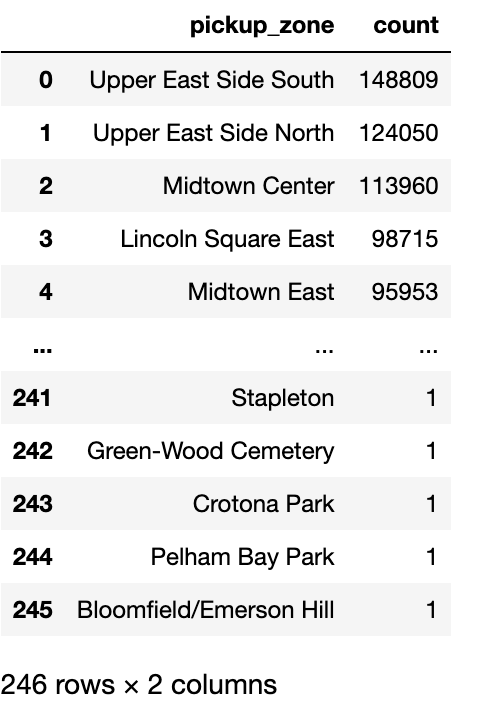
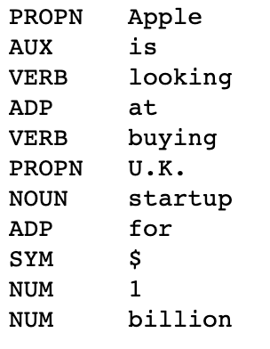

# Using Databricks Connect Python in Dataiku: basics 

This tutorial provides a comprehensive guide to using Databricks Connect with Python in Dataiku,
from the initial setup to data manipulation with Pyspark DataFrames.
By following this tutorial, users will be equipped to leverage Databricks' computational resources effectively,
directly from Dataiku.

## Prerequisites

* Dataiku >= 12.1.0
* A [Databricks cluster](https://docs.databricks.com/clusters/configure.html) with a runtime in version at least 13.0
* A [Databricks connection](https://doc.dataiku.com/dss/latest/connecting/sql/databricks.html) with Datasets containing: 
    * the [NYC Taxi trip data](https://www1.nyc.gov/site/tlc/about/tlc-trip-record-data.page) over the year/month of your choice, referred to as `NYC_trips`
    * the [NYC Taxi zone lookup table](https://d37ci6vzurychx.cloudfront.net/misc/taxi+_zone_lookup.csv) referred to as `NYC_zones`.
    * an [extract from the IMDB movie review dataset](https://cdn.downloads.dataiku.com/public/website-additional-assets/data/IMDB_train.csv.gz) referred to as `IMDB_train`.
* A Python 3.10 [code environment](https://doc.dataiku.com/dss/latest/code-envs/index.html) with the following packages installed: 
    - `databricks-connect==13.0.*`
    - `spacy==3.6.0`
    The code environment should also have the following initialization script:
    ```python
    from dataiku.code_env_resources import clear_all_env_vars
    clear_all_env_vars()
    import spacy
    spacy.cli.download("en_core_web_sm")
    ```  

## What is Databricks Connect?

Databricks Connect is a package to run [Pyspark](https://spark.apache.org/docs/latest/api/python/) code on a Databricks cluster from any machine, by connecting remotely to the Databricks cluster and accessing its computational resources.


## Creating a Session

As usual with Pyspark, all commands will ultimately be issued to a Spark session, either via methods directly on the session object, or via Spark *DataFrames*, which will translate and propagate commands to the session object they're referencing. 

Normally, this Session would need to be instantiated with the user manually providing credentials such as the personal access token, and connection details such as the workspace and cluster id. However, the `get_session()` method reads all the necessary parameters from the Databricks connection in Dataiku and thus exempts the user from having to handle credentials manually.

Start by creating a Jupyter notebook with the code environment mentioned in the prerequisites and instantiate your Session object: 
```py
from dataiku.dbconnect import DkuDBConnect

dbc = DkuDBConnect()
# Replace with the name of your Databricks connection
session = dbc.get_session(connection_name="YOUR-CONNECTION-NAME")
```

## Loading data into a DataFrame

Before working with the data, you first need to read it, more precisely to *get a Pyspark DataFrame pointing at the Databricks table*. With your `session` variable, create a Pyspark [DataFrame](https://spark.apache.org/docs/latest/api/python/reference/pyspark.sql/api/pyspark.sql.DataFrame.html#pyspark.sql.DataFrame) using one of the following ways:


### Option 1: with the Dataiku API
The easiest way to retrieve a DataFrame is by using the `get_dataframe()` method and passing a `dataiku.Dataset` object. The `get_dataframe()` can optionally be given a Databricks Connect Session argument. Dataiku will use the session created above or create a new one if no argument is passed.

```py
import dataiku 
NYC_trips = dataiku.Dataset("NYC_trips")
df_trips = dbc.get_dataframe(dataset=NYC_trips)
```
### Option 2: with a SQL query
Using the `session` object, a DataFrame can be created from a SQL query.

```py
# Retrieve useful metadata from the Dataset object:
NYC_trips_info = NYC_trips.get_location_info().get('info', {})
# Get the name of the dataiku.Dataset's underlying Databricks table:
trips_table_name = NYC_trips_info.get('table')
# Get the table's schema and catalog names:
trips_table_schema = NYC_trips_info.get('schema')
trips_table_catalog = NYC_trips_info.get('catalog')
# Combine all this information to create the DataFrame via SQL:
df_trips = session.sql(f"select * from {trips_table_catalog}.{trips_table_schema}.{trips_table_name}")
```

Unlike Pandas DataFrames, Pyspark DataFrames are lazily evaluated. This means that they, and any subsequent operation applied to them, are not immediately executed.

Instead, they are recorded in a Directed Acyclic Graph (DAG) that is evaluated only upon the calling of certain methods (`collect()`, `take()`, `show()`, `toPandas()`) or when writing out the dataframe produced by the chain of operations (`write.saveAsTable()`).

This lazy evaluation minimizes traffic between the Databricks cluster and the client as well as client-side memory usage.


## Retrieving rows

* The `take(n)` method is a method that allows users to pull and check **n** rows from the Pyspark DataFrame. Yet, it is arguably not the most pleasant way of checking a DataFrame's content.

```py
# Retrieve 5 rows
df_trips.take(5)
```

{.image-popup}

* The `toPandas()` method converts the Pyspark DataFrame into a more aesthetically-pleasing Pandas DataFrame. Avoid using this method if the data is too large to fit in memory. Alternatively, you can use a limit statement before retrieving the results as a Pandas DataFrame.

```py
df_trips.limit(5).toPandas()
```
{.image-popup}

## Common operations

The following paragraphs illustrate a few examples of basic data manipulation using DataFrames:

### Selecting column(s)

Databricks is case-insensitive w.r.t. identifiers (column names, table names, ...). Using the `select` method returns a DataFrame:

```py
from pyspark.sql.functions import col

fare_amount = df_trips.select([col('fare_amount'),col('tip_amount')])
          
# Shorter equivalent version:
fare_amount = df_trips.select(['fare_amount','tip_amount'])
```

### Computing the average of a column

Collect the mean `fare_amount`. This returns a 1-element list of type `snowflake.snowpark.row.Row`:

```py
from pyspark.sql.functions import mean

avg_row = df_trips.select(mean(col('fare_amount'))).collect()
avg_row
```

You can access the value as follows:

```py
avg = avg_row[0].asDict().get('avg(fare_amount)')
```

### Creating a new column from a case expression

Leverage the `withColumn()` method to create a new column indicating whether a trip's fare was above average. That new column is the result of a case expression (`when()` and `otherwise()`):

```py
from pyspark.sql.functions import when

df_trips = df_trips.withColumn('cost', when(col('fare_amount') > avg, "high")\
       .otherwise("low"))

# Check the first five rows
df_trips.select(['cost', 'fare_amount']).take(5)
```
{.image-popup}

### Joining two tables 

The `NYC_trips` contains a pick up and drop off location id (*PULocationID* and *DOLocationID*). We can map those location ids to their corresponding zone names using the `NYC_zones` Dataset.

To do so, perform two consecutive joins on the *OBJECTID* column in the NYC zone Dataset.

```py
# Get the NYC_zones Dataset object
NYC_zones = dataiku.Dataset("NYC_zones")
df_zones = dbc.get_dataframe(NYC_zones)

df_zones.toPandas()
```
{.image-popup}

Finally, perform the two consecutive left joins. Note how you are able to chain different operations including  `withColumnRenamed()` to rename the *zone* column and `drop()` to remove other columns from the `NYC_zones` Dataset:

```py
df = df_trips.join(df_zones, col('PULocationID')==col('LocationID'))\
        .withColumnRenamed('zone', 'pickup_zone')\
        .drop('LocationID', 'PULocationID', 'borough', 'service_zone')\
        .join(df_zones, col('DOLocationID')==col('LocationID'))\
        .withColumnRenamed('zone', 'dropoff_zone')\
        .drop('LocationID', 'DOLocationID', 'borough', 'service_zone')
```

### Group By
Count the number of trips by pickup zone among expensive trips. Use the `filter()` method to remove cheaper trips. Then use the `groupBy()` method to group by *pickup_zone*, `count()` the number of trips and `sort()` them by descending order. Finally, call the `toPandas()` method to store the results of the group by as a Pandas DataFrame. 

```py
results_count_df = df.filter((col('cost')=="low"))\
  .groupBy(col('pickup_zone'))\
  .count()\
  .sort(col('count'), ascending=False)\
  .toPandas()

results_count_df
```
{.image-popup}

## User Defined Functions (UDF)

Databricks Connect can use UDFs like regular Pyspark.

A [User Defined Functions (UDF)](https://archive.apache.org/dist/spark/docs/3.1.2/api/python/reference/api/pyspark.sql.functions.udf.html) is a function that, for a single row, takes the values of one or several cells from that row, and returns a new value.

UDFs effectively allow users to transform data using custom complex logic beyond what's possible in pure SQL. This includes the use of any Python packages.


To be used, UDFs first need to be *registered* so that at execution time they can be properly sent to the Snowflake servers. 
In this section, you will see a simple UDF example and how to register it. 

### Registering a UDF


* The first option to register a UDF is to use either the [`register()`](https://docs.snowflake.com/en/developer-guide/snowpark/reference/python/api/snowflake.snowpark.udf.UDFRegistration.register.html#snowflake.snowpark.udf.UDFRegistration.register) or the [`udf()`](https://docs.snowflake.com/en/developer-guide/snowpark/reference/python/api/snowflake.snowpark.functions.udf.html#snowflake.snowpark.functions.udf) function. In the following code block is a simple UDF example that computes the tip percentage over the taxi ride total fare amount:

```py
from pyspark.sql.functions import udf
from pyspark.sql.types import FloatType

def get_tip_pct(tip_amount, fare_amount):
    return tip_amount/fare_amount

# Register with register()
get_tip_pct_udf = session.udf.register('get_tip_pct_udf', get_tip_pct, FloatType())

# Register with udf() 
get_tip_pct_udf = udf(get_tip_pct, FloatType())

```

* An alternative way of registering the `get_tip_pct()` function as a UDF is to decorate your function with `@udf` . If you choose this way, you will need to specify the input and output types directly in the Python function.

```py
@udf(returnType=FloatType())
def get_tip_pct(tip_amount:float, fare_amount:float) -> float:
    return tip_amount/fare_amount

```

### Applying a UDF

Now that the UDF is registered, you can use it to generate new columns in your DataFrame using `withColumn()`: 

```py
df = df.withColumn('tip_pct', get_tip_pct_udf(col('tip_amount'), col('fare_amount') ))
```

After running this code, you should be able to see that the *tip_pct* column was created in the `df` DataFrame.


## Advanced UDFs

UDfs can be simple Python code, not relying on any external package, or on base Python packages, but the real value comes from using complex packages. In the end, this is akin to using Spark as a resilient parallelization engine.

We'll make an example by running [Spacy](https://spacy.io/usage/linguistic-features) part-of-speech abilities on the IMBD reviews dataset.

### Package setup

Using special packages comes with a price, though, in that packages must be installed in the Databricks cluster nodes. To that effect, use the [Libraries](https://docs.databricks.com/libraries/cluster-libraries.html) of your cluster to install libraries, each one a Pypi package:

* `spacy==3.6.0`
* `https://github.com/explosion/spacy-models/releases/download/en_core_web_sm-3.6.0/en_core_web_sm-3.6.0.tar.gz`

{.image-popup}

On the Dataiku side, if you have properly fulfilled the tutorial prerequisites then you should be all set.


### Define UDF with imports

Since`spacy` is installed in the code environment, you can run in the notebook the example from Spacy's tutorial:

```py
import spacy

nlp = spacy.load("en_core_web_sm")
for token in nlp("Apple is looking at buying U.K. startup for $1 billion"):
    print("%s\t%s" % (token.pos_, token.text))
```
{.image-popup}

We can use some UDF magic to apply this to each row of a Pyspark Dataframe, but there's a catch: the `spacy.load()` function shouldn't be called for each row processed, as it's too slow, nor can the `nlp` object (the Spacy model handle) be created outside the UDF's body and copied to the Databricks cluster. This implies using a global variable to store the model on the cluster-side.

```py
import spacy, json
from pyspark.sql.types import StringType
NLP = None
@udf(returnType=StringType())
def part_of_speech(input_text):
    global NLP
    if NLP is None:
        NLP = spacy.load("en_core_web_sm")
    poses = [token.pos_ for token in NLP(input_text)]
    return json.dumps(poses)
```

This can then be applied to our IMDB reviews dataset.

```py
df_imdb = dbc.get_dataframe(dataiku.Dataset("IMDB_train"))
df_imdb = df_imdb.withColumn("partOfSpeech", part_of_speech(col('text')))
df_imdb.limit(5).toPandas()
```
{.image-popup}


## Writing a DataFrame into a Databricks Dataset

In a Python recipe, you will likely want to write a Pyspark DataFrame into a Databricks output dataset. We recommend using the `write_with_schema()` method of the `DkuDBConnect` class. This method runs the [`saveAsTable()`](https://archive.apache.org/dist/spark/docs/3.1.2/api/python/reference/api/pyspark.sql.DataFrameWriter.saveAsTable.html) Pyspark method to save the contents of a DataFrame into a Databricks table.

```py
ouput_dataset = dataiku.Dataset("my_output_dataset")
dbc.write_with_schema(ouput_dataset, df)
```

```{warning}
You should avoid converting a Pyspark DataFrame to a Pandas DataFrame before writing the output Dataset. In the following example, using the `toPandas()` method will create the Pandas DataFrame locally, further increasing memory usage and potentially leading to resource shortage issues.

```py
ouput_dataset = dataiku.Dataset("my_output_dataset")
# Load the ENTIRE DataFrame in memory (NOT optimal !!)
ouput_dataset.write_with_schema(df.toPandas())
```


## Wrapping up 

Congratulations, you now know how to work with Databricks Connect within Dataiku! To go further, here are some useful links:

* [Dataiku reference documentation on the Databricks Connect integration](https://doc.dataiku.com/dss/latest/connecting/sql/databricks.html#databricks-connect-integration)
* [Pyspark reference](https://spark.apache.org/docs/latest/api/python/reference/index.html)


