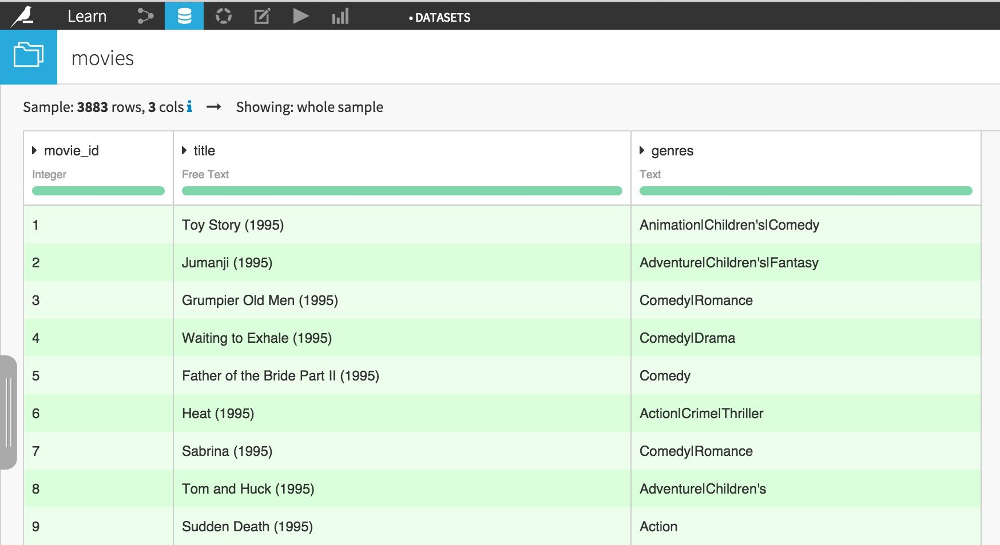
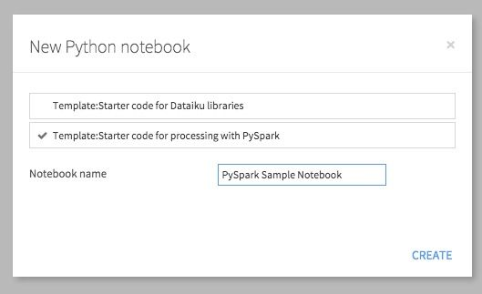
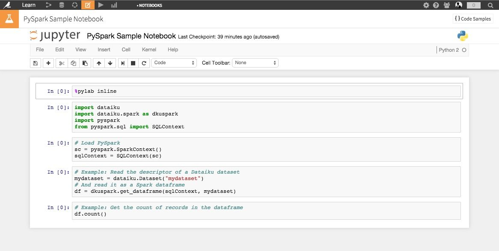
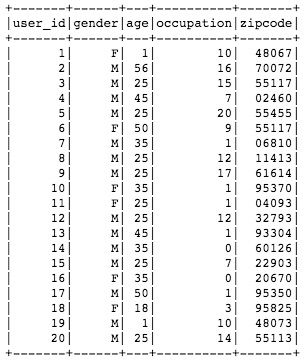
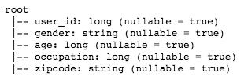
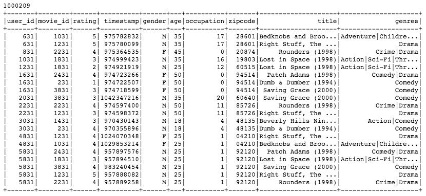
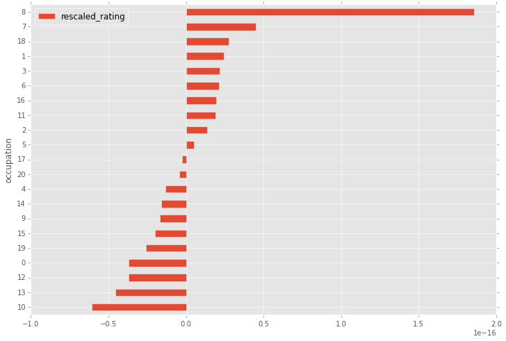
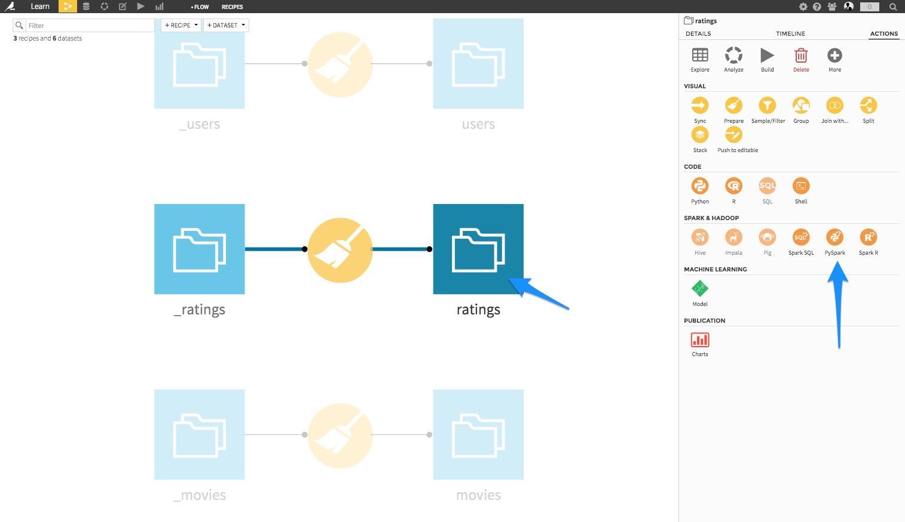
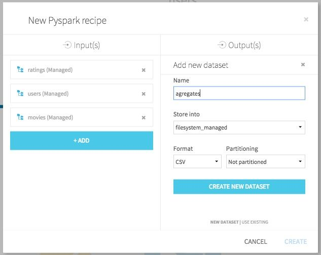
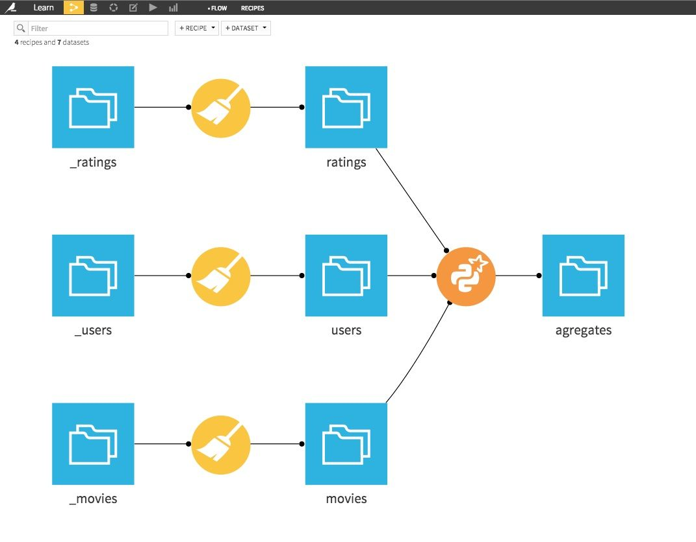

Introduction 
==============
Out of the numerous ways to interact with `Spark <https://spark.apache.org/docs/latest/index.html>`_, the DataFrames API, introduced back in Spark 1.3, offers a very convenient way to do data science on Spark using Python
(thanks to the PySpark module), as it emulates several functions from the widely used `Pandas <https://pandas.pydata.org/>`_ package. Let's see how to do that in Dataiku in the short article below.

Prerequisites
===============

You have access to an instance of Dataiku with Spark enabled, and a working **installation of Spark, version 1.4+**.

We'll use the `MovieLens 1M dataset <https://grouplens.org/datasets/movielens/>`_, made of 3 parts: ratings, movies and users. You can start with downloading and creating these datasets in Dataiku, and parse them
using a Visual Data Preparation script to make them suitable for analysis:

You should end up with 3 datasets:

* movies
* users
* ratings

Creating DataFrames using PySpark and Dataiku APIs
===================================================

As with regular Python, one can use `Jupyter <https://jupyter.org/>`_, directly embedded in Dataiku, to analyze interactively its datasets.

Go to the Notebook section from Dataiku top navbar, click **New Notebook**, and choose Python. In the new modal window showing up, select
**Template: Starter code for processing with PySpark**:

You are taken to a new Jupyter notebook, conveniently filled with starter code:

Let's start with loading our Dataiku datasets into an interactive PySpark session, and store them in DataFrames.

Dataiku does the heavy lifting in terms of "plumbing", so loading the Datasets into DataFrames is as easy as typing the following lines of code
in your Jupyter notebook:

.. code-block:: python

  # Dataiku and Spark Python APIs
  import dataiku
  import dataiku.spark as dkuspark
  import pyspark
  from pyspark.sql import SQLContext

  # Load PySpark
  sc = pyspark.SparkContext()
  sqlContext = SQLContext(sc)

  # Point to the Dataiku datasets
  users_ds = dataiku.Dataset("users")
  movies_ds = dataiku.Dataset("movies")
  ratings_ds = dataiku.Dataset("ratings")

  # And read them as a Spark dataframes
  users = dkuspark.get_dataframe(sqlContext, users_ds)
  movies = dkuspark.get_dataframe(sqlContext, movies_ds)
  ratings = dkuspark.get_dataframe(sqlContext, ratings_ds)

The hardest part is done. You can now start using your DataFrames using the regular Spark API.

Exploring your DataFrames
==========================

A Spark DataFrame has several interesting methods to uncover their content.
For instance, let's have a look at the number of records in each dataset:

.. code-block:: python

  print "DataFrame users has %i records" % users.count()
  print "DataFrame movies has %i records" % movies.count()
  print "DataFrame ratings has %i records" % ratings.count()

DataFrame users has 6040 records,
DataFrame movies has 3883 records, and
DataFrame ratings has 1000209 records.

You can also want to look at the actual content of your dataset using the ``.show()`` method:

.. code-block:: python

  users.show()

You may want to only check the column names in your DataFrame using the columns attribute:

.. code-block:: python

  dfs = [users, movies, ratings]

  for df in dfs:
      print df.columns

.. image:: ./assets/columns.jpg
  :alt: "Column names of Spark DataFrames"
  :class: image-popup

The printSchema() method gives more details about the DataFrame's schema and structure:

.. code-block:: python

  print users.printSchema()

Note that the DataFrame schema directly inherits from the Dataiku Dataset schema, which comes very handy when you need to manage centrally your datasets and the associated metadata!

Analyzing your DataFrames
==========================

Let's have a look now at more advanced functions. Let's start with merging the datasets together to offer a consolidated view.

.. code-block:: python

  a = ratings\
       .join(users, ratings['user_id']==users['user_id'], 'inner')\
       .drop(users['user_id'])

  complete = a\
              .join(movies, a['movie_id']==movies['movie_id'], 'inner')\
              .drop(movies['movie_id'])

  print complete.count()
  print '\n' + complete.show()

Let's assume you need to rescale the users ratings by removing their average rating value:

.. code-block:: python

  from pyspark.sql import functions as spfun

  # Computing the average rating by user
  avgs = complete.groupBy('user_id').agg(
      spfun.avg('rating').alias('avg_rating')
  )

  # Join again with initial data
  final = complete\
            .join(avgs, complete['user_id']==avgs['user_id'])\
            .drop(avgs['user_id'])

  # Create a new column storing the rescaled rating
  df = final.withColumn('rescaled_rating', final['rating'] - final['avg_rating'])

How do the rescaled ratings differ by occupation code? Don't forget that you are in regular Jupyter / Python session,
meaning that you can use non-Spark functionalities to analyze your data.

.. code-block:: python

  matplotlib.style.use('ggplot')

  # Spark DataFrame
  stats = df.groupBy('occupation').avg('rescaled_rating').toPandas()

  # Pandas dataframe
  stats.columns = ['occupation', 'rescaled_rating']
  stats = stats.sort('rescaled_rating', ascending=True)

  stats.plot(
    kind='barh',
    x='occupation',
    y='rescaled_rating',
    figsize=(12, 8)
  )

Creating PySpark recipes to automate your workflow
===================================================

Finally, once your interactive session is over and you are happy with the results, you may want to automate your workflow.

First, download your Jupyter notebook as a regular Python file on your local computer, from the File => Download as... function in the Notebook menu.

Go back to the Flow screen, left click on the **ratings** dataset, and in the right pane, choose **PySpark**:

Select the 3 MovieLens datasets as inputs, and create a new dataset called *agregates* on the machine filesystem:

In the recipe code editor, copy/paste the content of the downloaded Python file, and add the output dataset:

.. code-block:: python

  # -*- coding: utf-8 -*-
  import dataiku
  import dataiku.spark as dkuspark
  import pyspark
  from pyspark.sql import SQLContext
  from pyspark.sql import functions as spfun

  # Load PySpark
  sc = pyspark.SparkContext()
  sqlContext = SQLContext(sc)

  # Point to the Dataiku datasets
  users_ds = dataiku.Dataset("users")
  movies_ds = dataiku.Dataset("movies")
  ratings_ds = dataiku.Dataset("ratings")

  # And read them as a Spark dataframes
  users = dkuspark.get_dataframe(sqlContext, users_ds)
  movies = dkuspark.get_dataframe(sqlContext, movies_ds)
  ratings = dkuspark.get_dataframe(sqlContext, ratings_ds)

  # Analysis
  a = ratings\
        .join(users, ratings['user_id']==users['user_id'], 'inner')\
        .drop(users['user_id'])

  complete = a\
              .join(movies, a['movie_id']==movies['movie_id'], 'inner')\
              .drop(movies['movie_id'])

  avgs = complete.groupBy('user_id').agg(
      spfun.avg('rating').alias('avg_rating')
  )

  final = complete\
            .join(avgs, complete['user_id']==avgs['user_id'])\
            .drop(avgs['user_id'])

  df = final.withColumn('rescaled_rating', final['rating'] - final['avg_rating'])

  stats = df.groupBy('occupation').avg('rescaled_rating')

  # Output datasets
  agregates = dataiku.Dataset("agregates")
  dkuspark.write_with_schema(agregates, stats)

Hit the **Run** green button. The Spark jobs launches, and successfully completes (check your job's logs to make sure everything went fine).

Your flow is now complete:

Using PySpark and the Spark's DataFrame API in Dataiku is really easy. This opens up great opportunities for data science in Spark, and create large-scale complex analytical workflows.