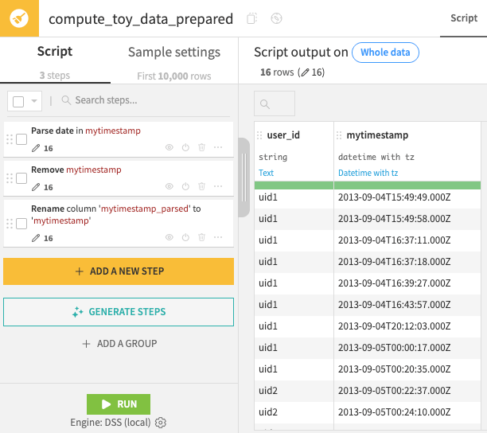
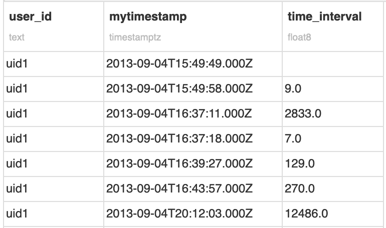
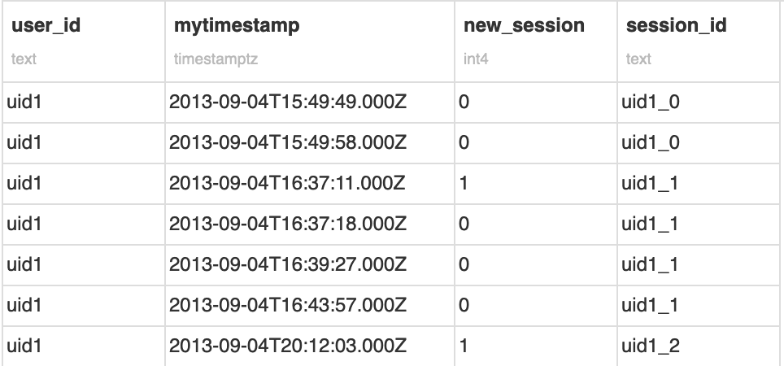

Sessionization in SQL, Hive, and Python
********************************************

.. meta::
  :description: This tutorial demonstrates how to use sessionization when dealing with time series data. Learn how to perform sessionization in SQL, Hive, and Python using Dataiku.

Sessionization is the act of turning event-based data into `sessions <https://en.wikipedia.org/wiki/Session_(web_analytics)>`_, the ordered list of a user's actions in completing a task. It's widely used in several domains, such as:

- | Web analytics:
  | A session tracks all of a user's actions during a single visit to a website, such as a buying process on an e-commerce site.
  | Analyzing these sessions provides crucial insights into user behavior, including common purchase paths, site navigation, exit points, and the effectiveness of various acquisition funnels.

- | Trip analytics:
  | Given the GPS coordinates history of a vehicle, you can compute sessions to extract the different trips.
  | Each trip can then be labeled distinctly (e.g., user going to work, on holidays, etc.).

- | Predictive maintenance:
  | A session can encompass all the information related to a machine's behavior (working, idle, etc.) until a change in its assignment occurs.

Given a user ID or machine ID, the question is: how can we recreate sessions? Or more precisely, how do we choose the boundaries of a session?

The third example defines a new session when the assignment changes. If we examine the first two examples, however, we see that we can define a new session if the user has been inactive for a certain amount of time, *T*.

In this case, a session is defined by two things: a user ID and a threshold time. If the subsequent action occurs within a time range greater than *T*, it marks the start of a new session. This threshold can depend on the website constraints themselves.

Prerequisites
=============

- An SQL database that supports window functions, such as PostgreSQL.
- An HDFS connection for Hive.
- An SQL Dataset named ``toy_data``.
  You can create this Dataset by uploading this :download:`CSV file</tutorials/data-engineering/sessionization/assets/toy_data.csv>` and using a **Sync recipe** to store the data in an SQL connection.

Preparing the data
===================

Coming from a CSV, the ``mytimestamp`` column of the ``toy_data`` dataset is currently stored as a string. To tackle sessionization, we want it stored as a date.

1. Create a **Prepare** recipe with ``toy_data`` as the input.
2. Store the output into your SQL database and create the recipe.
3. Parse the ``mytimestamp`` column as a date into a new column.
4. Delete the original and rename the parsed date column as ``mytimestamp``.
5. Run the recipe and update the schema.

On opening the synced output dataset, recognize that:

- It's sorted by time.
- There are two different users.
- ``mytimestamp`` is stored as a date.

.. note::
  For more information on syncing datasets to SQL databases, please see this course on `Dataiku & SQL <https://academy.dataiku.com/dataiku-dss-sql-1>`_.

Sessionization in SQL
=======================

The objective is to identify the row in the ordered dataset where a new session begins.
To do that, we need to calculate the interval between two rows of the same user. The SQL window function ``LAG()`` does it for us:

1. Create a **new SQL notebook** on the ``toy_data_prepared`` dataset.
2. Create a new query.
3. Use the tables tab on the left to confirm the name of your table.
4. If using the starter project, directly copy the snippet below to calculate a ``time_interval`` column.
5. Click **Run** to confirm the result.

.. code-block:: sql

  SELECT *
      ,  EXTRACT(EPOCH FROM mytimestamp)
         - LAG(EXTRACT(EPOCH FROM mytimestamp))
         OVER (PARTITION BY user_id ORDER BY mytimestamp) AS time_interval
  FROM "DKU_SESSIONIZATION_toy_data_prepared";

This SQL query outputs a new column that is the difference between the timestamp of the current row and the previous one, by ``user_id``.
Note that the first appearance of a user contains a row with an empty time interval, as the calculation cannot produce a value.

Based on this interval, we will now flag each session of a given user.
Assuming 30 minutes of inactivity defines a new session, we can slightly transform the previous expression into this one:

.. code-block:: sql

  SELECT *
    , CASE
        WHEN EXTRACT(EPOCH FROM mytimestamp)
             - LAG(EXTRACT(EPOCH FROM mytimestamp))
             OVER (PARTITION BY user_id ORDER BY mytimestamp) >= 30 * 60
        THEN 1
        ELSE 0
      END as new_session
  FROM
    "DKU_SESSIONIZATION_toy_data_prepared";

This query creates a Boolean column, where a value of 1 indicates a new session and zero otherwise.

Finally, we can create a cumulative sum over this Boolean column to create a ``session_id``.
To make it easier to visualize, we can concatenate it with the ``user_id``, and then build our final ``session_id`` column:

.. code-block:: sql

  SELECT *
    , user_id || '_' || SUM(new_session)
    OVER (PARTITION BY user_id ORDER BY mytimestamp) AS session_id
  FROM (
    SELECT *
      , CASE
         WHEN EXTRACT(EPOCH FROM mytimestamp)
            - LAG(EXTRACT(EPOCH FROM mytimestamp))
              OVER (PARTITION BY user_id ORDER BY mytimestamp) >= 30 * 60
         THEN 1
         ELSE 0
        END as new_session
      FROM
        "DKU_SESSIONIZATION_toy_data_prepared"
  ) s1

We finally have our sessionized data! We can now move towards more advanced analytics and derive new KPIs.

Note that this code is enough for this simple example. However, if we had a large partitioned Hive table, a simple increment may not be enough (because we would have collisions for each partition).
In this case, it's possible to concatenate the user ID with the epoch of the first row of the session.
You can perform the concatenation by calculating the first timestamp of each session and joining it on the previously calculated ``session_id``.

Sessionization in Hive
========================

If your data is stored in Hadoop (HDFS), and you can use `Hive <https://hive.apache.org/>`_ (and a version >= 0.11, where window partitioning functions were introduced), creating sessions will be similar to how you did in the previous PostgreSQL example.
To make it work, ensure that your timestamp column has been serialized as "Hive" in your Dataiku dataset (in Dataset > Settings > Preview).

1. Copy the existing Prepare recipe.
2. Name the output ``toy_data_hdfs``.
3. Store it in an HDFS connection.
4. Make sure the format is "CSV (Hive compatible)".
5. Create and run the recipe.
6. In a Hive notebook on the output dataset, run the following query, adjusting the connection name as needed.

.. code-block:: sql

  SELECT *
      , CONCAT(user_id,
         CONCAT('_',
          SUM(new_session) OVER (PARTITION BY user_id ORDER BY mytimestamp)
         )
        ) AS session_id
  FROM (
      SELECT *
          , CASE
              WHEN UNIX_TIMESTAMP(mytimestamp)
                   - LAG (UNIX_TIMESTAMP(mytimestamp))
                   OVER (PARTITION BY user_id ORDER BY mytimestamp) >= 30 * 60
              THEN 1
              ELSE 0
            END AS new_session
      FROM `connection_name`.`toy_data_hdfs`
  ) s1

Sessionization in Python
==========================

You can also build sessions using Python. There are several ways to do it, ranging from a pure Python implementation to reproducing the logic above using the `pandas <https://pandas.pydata.org/>`_ library, which is what we will demonstrate here.

In a Python notebook, use the following snippet.

.. code-block:: python

  import dataiku
  import pandas as pd
  from datetime import timedelta

  # define threshold value
  T = timedelta(seconds=30*60)

  # load dataset
  toy_data = dataiku.Dataset("toy_data_prepared").get_dataframe()

  # add a column containing previous timestamp
  toy_data =  pd.concat([toy_data,
                         toy_data.groupby('user_id').transform(lambda x:x.shift(1))]
                        ,axis=1)
  toy_data.columns = ['user_id','mytimestamp','prev_mytimestamp']

  # create the new session column
  toy_data['new_session'] = ((toy_data['mytimestamp'] - toy_data['prev_mytimestamp'])>=T).astype(int)

  # create the session_id
  toy_data['increment'] = toy_data.groupby("user_id")['new_session'].cumsum()
  toy_data['session_id'] = toy_data['user_id'].astype(str) + '_' + toy_data['increment'].astype(str)

  # to get the same result as with hive/postgresql
  toy_data = toy_data.sort_values(['user_id','mytimestamp'])

The output of this code should give you the sessionized dataset similar to the previous example. We can see that the ``shift()`` function is equivalent to ``LAG()`` in PostgreSQL, and ``transform()`` to a window function.

Wrapping Up
===========

Congratulations, you are now able to detect and mark sessions within your data, using SQL, Hive, or Python.

Reference documentation
=======================

Classes
-------
.. autosummary::
    dataiku.Dataset

Functions
---------
.. autosummary::
    ~dataiku.Dataset.get_dataframe

