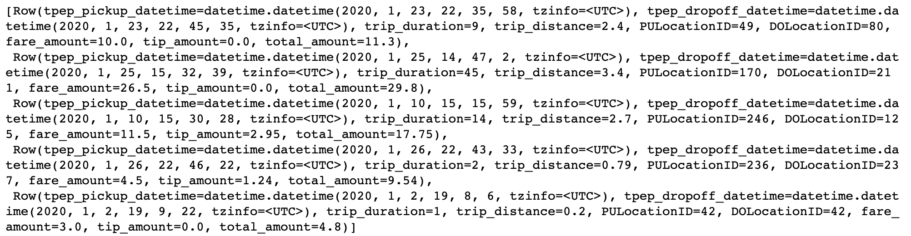
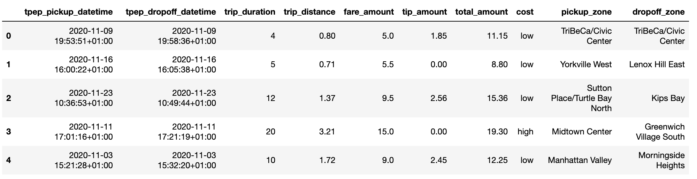
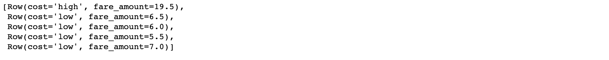
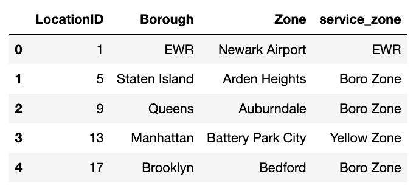
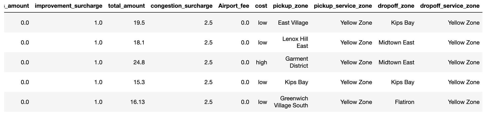
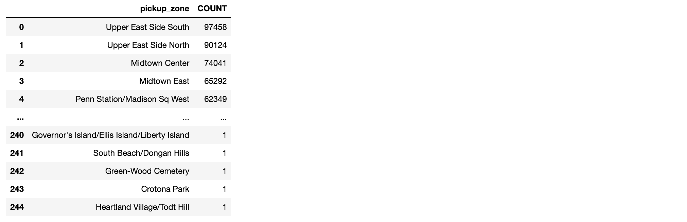
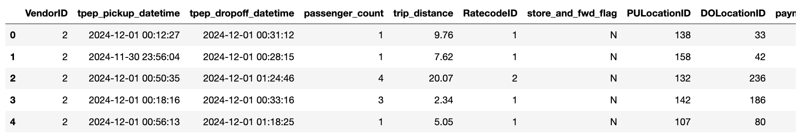
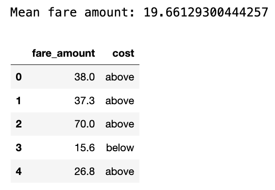
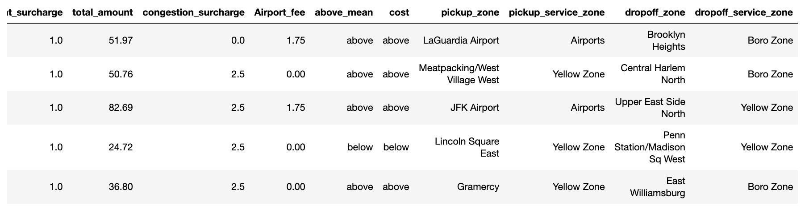
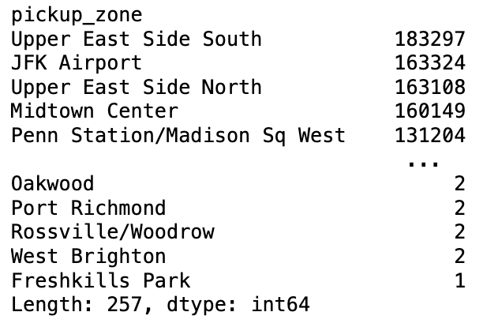

# Using Snowpark Python in Dataiku: basics

This tutorial provides a comprehensive guide on using Snowpark Python within Dataiku,
specifically focusing on integrating with Snowflake for data manipulation.
It describes the process of importing and syncing datasets and illustrates the functionality of Snowpark DataFrames
and Pandas on Snowflake through practical examples.
Users will learn how to create a Snowpark session, load data, and perform data transformations efficiently.

## Prerequisites

* Dataiku >= 10.0.7
* A [Snowflake connection](https://doc.dataiku.com/dss/latest/connecting/sql/snowflake.html#snowflake) with write access.
* A python 3.9, 3.10, or 3.11 [code environment](https://doc.dataiku.com/dss/latest/code-envs/index.html) with the [`snowflake-snowpark-python`](https://docs.snowflake.com/en/developer-guide/snowpark/python/setup.html#installation-instructions) package installed
* If using Pandas on Snowflake, install the `snowflake-snowpark-python` package with `modin`, like this: `snowflake-snowpark-python[modin]` 

## Import Taxi Data

Download two datasets from the New York City government, [Taxi Zone Lookup Table](https://d37ci6vzurychx.cloudfront.net/misc/taxi_zone_lookup.csv) (`taxi_zone_lookup.csv`) and [2024 December Yellow Taxi Trip Records](https://d37ci6vzurychx.cloudfront.net/trip-data/yellow_tripdata_2024-12.parquet) (`yellow_tripdata_2024-12.parquet`). 
For more information on this data, please refer to the NYC government [website](https://www1.nyc.gov/site/tlc/about/tlc-trip-record-data.page).

Upload these datasets to a Dataiku project. You'll need spark enabled on your Dataiku instance to read the parquet file.
If you do not have spark enabled, you can use a parquet to csv converter tool like this one from [TabLab](https://www.tablab.app/parquet/to/csv).

Use a Sync recipe to sync these uploaded files to Snowflake datasets.
In this tutorial, we named these Snowflake datasets `NYC_zones` and `NYC_trips`, respectively.

## What is Snowpark?

Snowpark is a set of libraries for programmatically accessing and processing data in Snowflake using languages like Python, Java, or Scala. 
It allows the user to manipulate `Snowpark DataFrames` similar to PySpark, and `Snowpark Pandas DataFrames (with Modin)` similar to Pandas. 
The [Snowflake documentation](https://docs.snowflake.com/en/developer-guide/snowpark/index.html) provides more details on how Snowpark works under the hood.

In this tutorial, we will work with the `NYC_trips` and `NYC_zones` Datasets to discover a few features of the Snowpark Python API, including Pandas on Snowflake, and how they can be used within Dataiku to:

- Facilitate reading and writing Snowflake Datasets.
- Perform useful/common data transformation.
- Leverage User Defined Functions (UDFs).

We will start by creating a Snowpark session and then split the tutorial into dataset operations using 1) Snowpark DataFrame APIs and 2) Pandas on Snowflake APIs.

Snowpark DataFrames and Snowpark Pandas DataFrames with Modin work differently. For more information, please refer to the Snowflake [documentation](https://docs.snowflake.com/en/developer-guide/snowpark/python/pandas-on-snowflake).

## Import Python packages

Import the necessary dataiku and Snowpark packages:
```py
import dataiku
from dataiku.snowpark import DkuSnowpark
```

If using Pandas on Snowflake, import the modin packages too:
```py
import modin.pandas as pd
import snowflake.snowpark.modin.plugin
```

## Create a Session

Whether using Snowpark Python in a Python recipe or notebook, we'll first need to create a Snowpark Session. 

A [Session](https://docs.snowflake.com/developer-guide/snowpark/reference/python/latest/api/snowflake.snowpark.Session) object is used to establish a connection with a Snowflake database. Normally, this Session would need to be instantiated with the user manually providing credentials such as the user id and password. However, the `get_session()` method reads all the necessary parameters from the Snowflake connection in Dataiku and thus exempts the user from having to handle credentials manually.

Start by creating a Jupyter notebook with the code environment mentioned in the prerequisites and instantiate a Session object: 
```py
sp = DkuSnowpark()
# Replace with the name of your Snowflake connection
session = sp.get_session(connection_name="YOUR-CONNECTION-NAME")
```

::::{tabs}

:::{group-tab} Snowpark DataFrames

## Load data into a Snowpark DataFrame

There are multiple ways to load data from a Snowflake table into a Snowpark DataFrame object. 

### Option 1: with the Dataiku API
The easiest way to query a Snowpark DataFrame is 
by using the {meth}`~dataiku.snowpark.DkuSnowpark.get_dataframe()` method and passing a {class}`~dataiku.Dataset` object. 
The {meth}`~dataiku.snowpark.DkuSnowpark.get_dataframe()` can optionally be given a Snowpark Session argument. 
Dataiku will use the `session` created above or create a new one if no argument is passed.

```py
NYC_trips = dataiku.Dataset("NYC_trips")
snowpark_df_trips = sp.get_dataframe(dataset=NYC_trips)
```

Here is the same example using a specific Snowpark `session`:

```py
NYC_trips = dataiku.Dataset("NYC_trips")
snowpark_df_trips = sp.get_dataframe(dataset=NYC_trips, session=session)
print("Trips table # rows: " + str(snowpark_df_trips.count()))
```

### Option 2: with a SQL query
Using the `session` object, a DataFrame can be created from a SQL query.

```py
# Get the name of the dataiku.Dataset's underlying Snowflake table.
trips_table_name = NYC_trips.get_location_info().get('info', {}).get('quotedResolvedTableName')
snowpark_df_trips = session.sql(f"Select * from {trips_table_name}")
print("Trips table # rows: " + str(snowpark_df_trips.count()))
```

## Pandas DataFrames vs Snowpark DataFrames

Unlike DataFrames, Snowpark DataFrames are lazily evaluated. This means that they, and any subsequent operation applied to them, are not immediately executed.

Instead, they are recorded in a Directed Acyclic Graph (DAG) that is evaluated only upon the calling of certain methods. 

Some methods that trigger eager evaluation: `collect()`, `take()`, `show()`, `toPandas()`

This lazy evaluation minimizes traffic between the Snowflake warehouse and the client as well as client-side memory usage.

## Retrieving rows

* The `take(n)` method is the only method that allows users to pull and check **n** rows from the Snowpark DataFrame. Yet, it is arguably not the most pleasant way of checking a DataFrame's content.

```py
# Retrieve 5 rows
snowpark_df_trips.take(5)
```

{.image-popup}

* The `toPandas()` method converts the Snowpark DataFrame into a more aesthetically-pleasing Pandas DataFrame. Avoid using this method if the data is too large to fit in memory. Instead, leverage the [`to_pandas_batches()`](https://docs.snowflake.com/en/developer-guide/snowpark/reference/python/latest/api/snowflake.snowpark.DataFrame.to_pandas_batches) method. Alternatively, we can use a limit statement before retrieving the results as a Pandas DataFrame.

```py
snowpark_df_trips.limit(5).toPandas()
```
{.image-popup}

## Common operations

The following paragraphs illustrate a few examples of basic data manipulation using DataFrames:

### Selecting column(s)

Snowflake stores unquoted column names in uppercase. Be sure to use double quotes for case-sensitive column names. Using the `select` method returns a DataFrame:

```py
from snowflake.snowpark.functions import col

fare_amount = snowpark_df_trips.select([col('"fare_amount"'),col('"tip_amount"')])
          
# Shorter equivalent version:
fare_amount = snowpark_df_trips.select(['"fare_amount"','"tip_amount"'])
print(fare_amount)
```

### Computing the average of a column

Collect the mean `fare_amount`. This returns a 1-element list of type `snowflake.snowpark.row.Row`:

```py
from snowflake.snowpark.functions import mean

avg_row = snowpark_df_trips.select(mean(col('"fare_amount"'))).collect()
print(avg_row)
```

We can access the value as follows:

```py
avg = avg_row[0].asDict().get('AVG("FARE_AMOUNT")')
print(avg)
```

### Creating a new column from a case expression

Leverage the `withColumn()` method to create a new column indicating whether a trip's fare was above average. That new column is the result of a case expression (`when()` and `otherwise()`):

```py
from snowflake.snowpark.functions import when

snowpark_df_trips = snowpark_df_trips.withColumn('"cost"', when(col('"fare_amount"') > avg, "high")\
                                                .otherwise("low"))

# Check the first five rows
snowpark_df_trips.select(['"cost"', '"fare_amount"']).take(5)
```
{.image-popup}

### Joining two tables 

First, read in the `NYC_zones` Dataset as a Snowpark DataFrame.

```py
import pandas as pd

# Get the NYC_zones Dataset object
NYC_zones = dataiku.Dataset("NYC_zones")
snowpark_df_zones = sp.get_dataframe(NYC_zones)

# Print out a few rows from the zones table
snowpark_df_zones.toPandas().head()
```
{.image-popup}

The `NYC_trips` Dataset contains a pick up and drop off location id (`PULocationID` and `DOLocationID`).
We can map those location ids to their corresponding zone names in the `NYC_zones` Dataset
to get more helpful pick up and drop off zone names.

Next, let's perform the two consecutive left joins. Note how we're able to chain different operations including `withColumnRenamed()` to rename the `Zone` and `service_zone` columns and `drop()` to remove other columns from the `NYC_zones` Dataset:

```py
snowpark_df_merged = snowpark_df_trips.join(snowpark_df_zones, col('"PULocationID"')==col('"LocationID"'))\
    .withColumnRenamed(col('"Zone"'), '"pickup_zone"')\
    .withColumnRenamed(col('"service_zone"'), '"pickup_service_zone"')\
    .drop([col('"LocationID"'), col('"PULocationID"'), col('"Borough"')])\
    .join(snowpark_df_zones, col('"DOLocationID"')==col('"LocationID"'))\
    .withColumnRenamed(col('"Zone"'), '"dropoff_zone"')\
    .withColumnRenamed(col('"service_zone"'), '"dropoff_service_zone"')\
    .drop([col('"LocationID"'), col('"DOLocationID"'),col('"Borough"')])

# Print out a few rows from the merged DataFrame
snowpark_df_merged.toPandas().head()
```
{.image-popup}

### Group By
Count the number of trips by pick up zone among expensive trips. Use the `filter()` method to remove cheaper trips. Then use the `groupBy()` method to group by `pickup_zone`, `count()` the number of trips and `sort()` them by descending order. Finally, call the `toPandas()` method to store the results of the group by as a Pandas DataFrame. 

```py
results_count_df = snowpark_df_merged.filter((col('"cost"')=="low"))\
  .groupBy(col('"pickup_zone"'))\
  .count()\
  .sort(col('"COUNT"'), ascending=False)

# Print out a few rows from the merged DataFrame
results_count_df.toPandas().head()
```
{.image-popup}

## User Defined Functions (UDF)

A [User Defined Functions (UDF)](https://docs.snowflake.com/en/developer-guide/snowpark/reference/python/latest/api/snowflake.snowpark.functions.udf) is a function that, for a single row, takes the values of one or several cells from that row, and returns a new value.

UDFs effectively allow users to transform data using custom complex logic beyond what's possible in pure SQL. This includes the use of any Python packages.

To be used, UDFs first need to be `registered` so that at execution time they can be properly sent to the Snowflake servers. 
In this section, we will see a simple UDF example and how to register it. 

### Registering a UDF

* The first option to register a UDF is to use either the [`register()`](https://docs.snowflake.com/en/developer-guide/snowpark/reference/python/latest/api/snowflake.snowpark.udf.UDFRegistration.register#snowflake.snowpark.udf.UDFRegistration.register) or the [`udf()`](https://docs.snowflake.com/en/developer-guide/snowpark/reference/python/latest/api/snowflake.snowpark.functions.udf) function. In the following code block is a simple UDF example that computes the tip percentage over the taxi ride total fare amount:

```py
from snowflake.snowpark.functions import udf
from snowflake.snowpark.types import FloatType

# Some fares are zero and below. Let's return zero if this is the case.
def get_tip_pct(tip_amount, fare_amount):
    if fare_amount > 0:
        return tip_amount/fare_amount
    else:
        return 0.0

# Register with register()
get_tip_pct_udf = session.udf.register(get_tip_pct, input_types=[FloatType(), FloatType()], 
                     return_type=FloatType())

# Register with udf() 
get_tip_pct_udf = udf(get_tip_pct, input_types=[FloatType(), FloatType()], 
                     return_type=FloatType())
```

* An alternative way of registering the `get_tip_pct()` function as a UDF is to decorate our function with `@udf` . If we choose this way, we'll need to specify the input and output types directly in the Python function.

```py
@udf
def get_tip_pct(tip_amount:float, fare_amount:float) -> float:
    if fare_amount > 0:
        return tip_amount/fare_amount
    else:
        return 0.0
```

### Applying a UDF

Now that the UDF is registered, we can use it to generate new columns in our DataFrame using `withColumn()`: 

```py
snowpark_df_merged = snowpark_df_merged.withColumn('"tip_pct"', get_tip_pct_udf('"tip_amount"', '"fare_amount"' ))
```

After running this code, we should be able to see that the `tip_pct` column was created in the `snowpark_df_merged` DataFrame.

## Write a Snowpark DataFrame into a Snowflake Dataset

```{note} 
You'll first need to create a Snowflake dataset in your project flow to hold the output.
Here, we've named this dataset `my_outut_dataset`.
Dataiku automatically does this if you are using a Python recipe.
```

In a Python recipe, you will likely want to write Snowpark DataFrame into a Snowflake output Dataset. 
We recommend using the {meth}`~dataiku.snowpark.DkuSnowpark.write_with_schema()` method 
of the {class}`~dataiku.snowpark.DkuSnowpark` class. 
This method runs the [`saveAsTable()`](https://docs.snowflake.com/developer-guide/snowpark/reference/python/latest/api/snowflake.snowpark.DataFrameWriter.saveAsTable#snowflake.snowpark.DataFrameWriter.saveAsTable) 
Snowpark Python method to save the contents of a DataFrame into a Snowflake table.

```py
# Point to the output Dataset (a Snowflake table)
ouput_dataset = dataiku.Dataset("my_output_dataset")
# Write the Snowpark Dataframe to the output Snowflake table
sp.write_with_schema(ouput_dataset, snowpark_df_merged)
```

````{warning}
Avoid converting a Snowpark Python DataFrame to a Pandas DataFrame before writing the output Dataset. In the following example, using the `toPandas()` method will create the Pandas DataFrame locally, further increasing memory usage and potentially leading to resource shortage issues.

```py
# Point to the output Dataset (a Snowflake table)
ouput_dataset = dataiku.Dataset("my_output_dataset")
# Load the ENTIRE DataFrame in memory (NOT optimal !!)
ouput_dataset.write_with_schema(snowpark_df_merged.toPandas())
```
````

:::
:::{group-tab} Pandas on Snowflake (with Modin)

## Load data into a Snowpark Pandas DataFrame with Modin

There are multiple options to load data from a Snowflake table or Snowpark DataFrame into a Snowpark Pandas DataFrame with Modin.

### Option 1: with the Dataiku API
First, load a Snowflake table into a Snowpark DataFrame, then load into a Snowpark Pandas DataFrame with one additional line of code:

```py
NYC_trips = dataiku.Dataset("NYC_trips")
snowpark_df_trips = sp.get_dataframe(dataset=NYC_trips)
snowpark_pandas_df_trips = snowpark_df_trips.to_snowpark_pandas()
```

Here is the same example using a specific Snowpark `session`:

```py
NYC_trips = dataiku.Dataset("NYC_trips")
snowpark_df_trips = sp.get_dataframe(dataset=NYC_trips, session=session)
snowpark_pandas_df_trips = snowpark_df_trips.to_snowpark_pandas()
```

### Option 2: with the Snowpark Pandas API
Using the `session` object, create a Snowpark Pandas DataFrame with Modin using the standard Snowpark Pandas API.

```py
import modin.pandas as pd
# pd.session is the session that Snowpark Pandas is using for new Modin DataFrames.
# In this case we'll set it to be the Snowpark session we created earlier
pd.session = session

# Get the name of the dataiku.Dataset's underlying Snowflake table.
trips_table_name = NYC_trips.get_location_info().get('info', {}).get('quotedResolvedTableName')
snowpark_pandas_df_trips = pd.read_snowflake(trips_table_name)
```

## Pandas DataFrames vs Snowpark Pandas DataFrames (with Modin)

Unlike DataFrames, Snowpark Pandas DataFrames (with Modin) are lazily evaluated. 
This means that they, and any subsequent operation applied to them, are not immediately executed.

Instead, they are recorded in a Directed Acyclic Graph (DAG) that is evaluated only upon the calling of certain methods. 

Some methods that trigger eager evaluation: `read_snowflake()`, `to_snowflake()`, `to_pandas()`, `to_dict()`, `to_list()`, `__repr__`

This lazy evaluation minimizes traffic between the Snowflake warehouse and the client and client-side memory usage.

## Retrieve rows

Just like with Pandas, we can use `head(n)` to retrieve the first n rows from the Snowpark Pandas DataFrame:

```py
# Retrieve 5 rows
snowpark_pandas_df_trips.head(5)
```

{.image-popup}

## Common operations

The following paragraphs illustrate a few examples of basic data manipulation using Snowpark Pandas DataFrames:

### Select column(s)

We can pass a list of column names into square brackets to select column(s):

```py
fare_amount = snowpark_pandas_df_trips[['fare_amount','tip_amount']]
print(fare_amount.head())
```

We can also use `.loc[]` on column names:

```py
fare_amount = snowpark_pandas_df_trips.loc[:, ['fare_amount', 'tip_amount']]
```

Or `.iloc[]` on column index positions:

```py
fare_amount = snowpark_pandas_df_trips.iloc[:, [2,4,8]]
```

### Compute the average of a column

Calculate the mean of the `fare_amount` column with `.mean()`:

```py
mean_fare_amount = snowpark_pandas_df_trips['fare_amount'].mean()
print(mean_fare_amount)
```

### Create a new column from a where expression

We can use numpy's `where()` method to create a new column indicating whether a trip's fare was above average:

```py
import numpy as np

snowpark_pandas_df_trips['cost'] = np.where(snowpark_pandas_df_trips['fare_amount'] >= mean_fare_amount, 'above', 'below')

# Check the mean fare amount and the new column we just created
print("Mean fare amount: " + str(mean_fare_amount))
snowpark_pandas_df_trips[['fare_amount','cost']].head()
```
{.image-popup}

### Join two tables 

First, read in the `NYC_zones` Dataset as a Snowpark Pandas DataFrame.

```py
# Get the NYC_zones Dataset object
NYC_zones = dataiku.Dataset("NYC_zones")
snowpark_df_zones = sp.get_dataframe(NYC_zones)
snowpark_pandas_df_zones = snowpark_df_zones.to_snowpark_pandas()
snowpark_pandas_df_zones.head()
```
{.image-popup}

The `NYC_trips` Dataset contains a pick up and drop off location id (`PULocationID` and `DOLocationID`). 
We can map those location ids to their corresponding zone names in the `NYC_zones` Dataset
to get more helpful pick up and drop off zone names.

Next, let's join the zones DataFrame to the trips DataFrame by the pick up location ID. We can chain different operations to the join to rename and drop columns:

```py
snowpark_pandas_df_merged = pd.merge(snowpark_pandas_df_trips, 
                     snowpark_pandas_df_zones, 
                     left_on='PULocationID', 
                     right_on='LocationID')\
                     .rename(columns={'Zone':'pickup_zone', 'service_zone':'pickup_service_zone'})\
                     .drop(['LocationID', 'PULocationID', 'Borough'], axis=1)
```

Then, let's join the zones DataFrame again to the new merged DataFrame by the drop off location ID:

```py
snowpark_pandas_df_merged = pd.merge(snowpark_pandas_df_merged, 
                     snowpark_pandas_df_zones, 
                     left_on='DOLocationID', 
                     right_on='LocationID')\
                     .rename(columns={'Zone':'dropoff_zone', 'service_zone':'dropoff_service_zone'})\
                     .drop(['LocationID', 'DOLocationID', 'Borough'], axis=1)
```

We should see new `pickup_zone`, `pickup_service_zone`, `dropoff_zone`, and `dropoff_service_zone` columns.

```py
snowpark_pandas_df_merged.head()
```
{.image-popup}

### Group by aggregations
Count the number of trips by pick up zone with `groupby()`, `count()` the number of trips, and `sort_values()` to sort pick up zone counts in descending order.

```py
results_count_df = snowpark_pandas_df_merged.groupby("pickup_zone").size().sort_values(ascending=False)

results_count_df
```
{.image-popup}

## Write a Snowpark Pandas DataFrame into a Snowflake Dataset

```{note} 
You'll first need to create a Snowflake dataset in your project flow to hold the output.
Here, we've named this dataset `my_outut_dataset`.
Dataiku automatically does this if you are using a Python recipe.
```

In a Python recipe, you will likely want to write a Snowpark Pandas DataFrame into a Snowflake output Dataset. 
We recommend first converting the Snowpark Pandas DataFrame back into a Snowpark DataFrame, 
then using the  {meth}`~dataiku.snowpark.DkuSnowpark.write_with_schema()` method 
of the {class}`~dataiku.snowpark.DkuSnowpark` class. 
This method runs the [`saveAsTable()`](https://docs.snowflake.com/developer-guide/snowpark/reference/python/latest/api/snowflake.snowpark.DataFrameWriter.saveAsTable#snowflake.snowpark.DataFrameWriter.saveAsTable) 
Snowpark Python method to save the contents of a Snowpark DataFrame into a Snowflake table.

```py
# Convert the Snowpark Pandas DataFrame back to a Snowpark DataFrame
output_snowpark_df = snowpark_pandas_df_merged.to_snowpark(index=False)
# Point to the output Dataset (a Snowflake table)
ouput_dataset = dataiku.Dataset("my_output_dataset")
# Write the Snowpark Dataframe to the output Snowflake table
sp.write_with_schema(ouput_dataset, output_snowpark_df)
```

:::
::::

## Wrapping up 

Congratulations, you now know how to work with Snowpark Python DataFrames and Snowpark Pandas DataFrames within Dataiku! To go further, here are some useful links:

* [Dataiku reference documentation on the Snowpark Python integration](https://doc.dataiku.com/dss/latest/connecting/sql/snowflake.html#snowpark-integration)
* [Snowpark Python reference](https://docs.snowflake.com/developer-guide/snowpark/reference/python/latest/index)
* [Pandas on Snowflake reference](https://docs.snowflake.com/en/developer-guide/snowpark/python/pandas-on-snowflake)