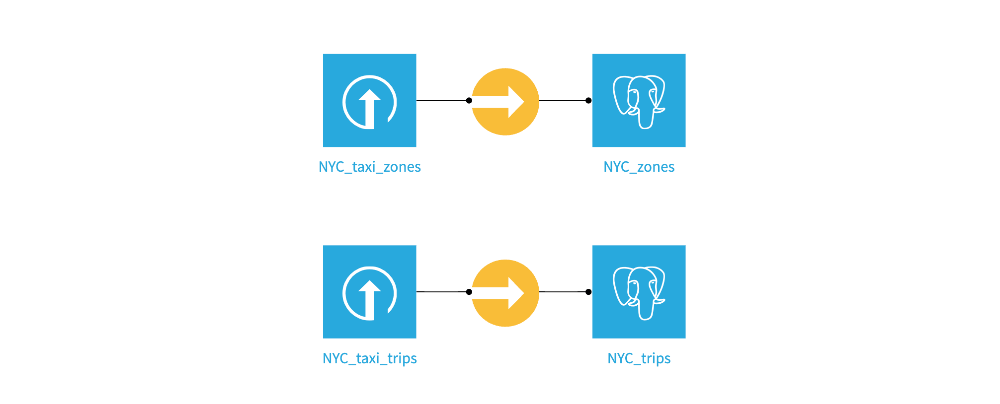
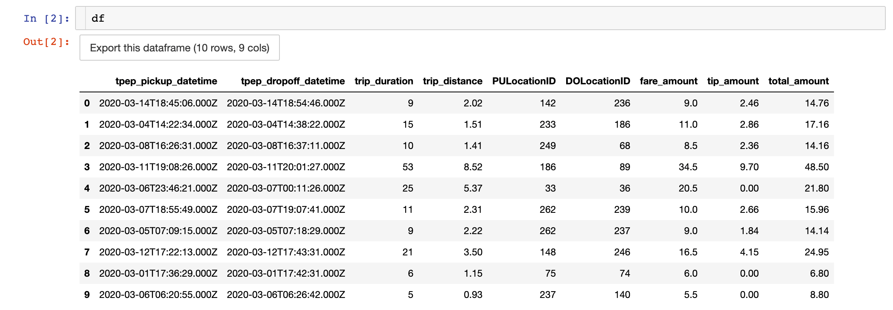
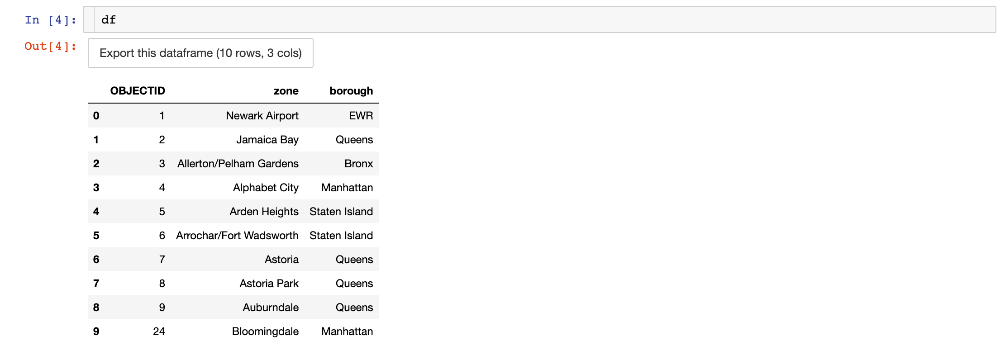
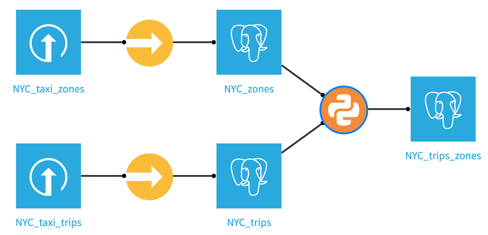
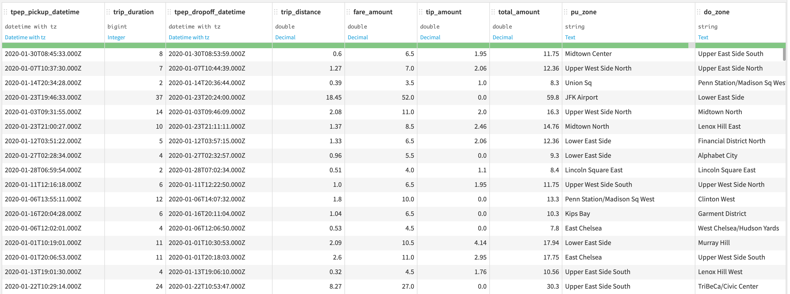
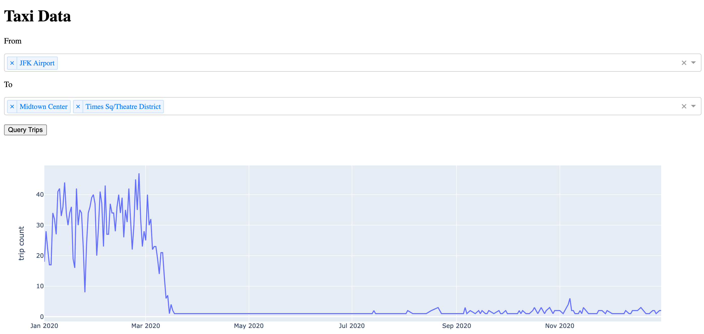

# Leveraging SQL in Python & R

Running SQL queries inside Python and R will help you build dynamic queries and run
queries based on certain conditions. This gives you, as a coder, the control to know exactly
what queries run in what specific situations. You can especially leverage this in the few examples
laid out in this tutorial. 

This can be initiated through Notebooks, Code Recipes, or Dash web-applications, and this tutorial
focuses on all of these solutions, so you will be best suited to make a decision on when to leverage
each of the solutions.

## Prerequisites

*  A Dataiku connection to a SQL database (or the possibility of creating one)
*  Have a Dataiku user profile with the following global permissions:
    *  "Create projects"
    *  "Write unisolated code"
    *  [optional] "Create active Web content"
*  [optional] [R on Dataiku](https://doc.dataiku.com/dss/latest/installation/custom/r.html)
*  [optional] A code environment with python version >= 3.9 to install the `dash` package
*  [optional] Basic knowledge of dash


## Introduction
Structured Query Language (SQL) is a family of languages used to manage data held in relational databases. With SQL, Data practitioners or applications can efficiently insert, transform, and retrieve data. 

Dataiku can translate visual recipes into the SQL syntax of the database that holds the data. This feature lets Dataiku users easily contribute to the development of efficient ETL pipelines without having to write a single line of SQL. Users can also chose to write SQL query or script recipes for more specific data processing. 

Lesser known is the possibility for coders to inject SQL statements through the [`SQLExecutor2`](https://doc.dataiku.com/dss/latest/python-api/sql.html) module in Python, and the [`dkuSQLQueryToData`](https://doc.dataiku.com/dss/api/10.0/R/dataiku/reference/dkuSQLQueryToData.html) and [`dkuSQLExecRecipeFragment`](https://doc.dataiku.com/dss/api/10.0/R/dataiku/reference/dkuSQLExecRecipeFragment.html) functions in R. These functions are part of the Python and R dataiku internal package.

Using SQL in Python or R has three main advantages:

1. The use of a programming language's flexibility to generate SQL statements (e.g. dynamic queries).

2. The possibility of further processing the result of a query direcly in Python or R.

3. The use of the database's engine.


In this tutorial, you'll see how you can use Python or R to:

1. Generate a dataframe from a SQL query in a Python or R notebook.

2. Execute a SQL statement in a Python or R recipe. 

3. [Python Only] Use SQL in a Dash web app.


In this tutorial, you will get familiar with using SQL in Python or R by working with a modified sample of the notorious [New York City Yellow Cab data](https://www1.nyc.gov/site/tlc/about/tlc-trip-record-data.page) and the [New York City zones data](https://data.cityofnewyork.us/Transportation/NYC-Taxi-Zones/8meu-9t5y). These datasets contain records from thousands of NYC yellow cab trips in 2020 and a lookup table for New York City neighborhood, respectively. See the Set Up section below for downloading instructions.


## Initial Set Up

In this section, you will take the necessary steps to have the two above-mentionned datasets ready in a SQL database.

### SQL connection on Dataiku

```{important}
For this tutorial, you will need a Dataiku connection to a SQL database.  
The examples in this tutorial were run on a PostgreSQL 11.14 connection named `pg`.  
However, any [supported databases](https://doc.dataiku.com/dss/latest/connecting/sql/introduction.html#supported-databases) should do (after potential modification of the SQL syntax shown in the code snippets).
```

 If you have to create a new connection,
 please refer to our {doc}`documentation <refdoc:connecting/sql/index>` or this [tutorial](https://knowledge.dataiku.com/latest/data-sourcing/connections/sql/tutorial-index.html).
 Note that you will either need to have admin access,
 or the right
 to create {doc}`personal connections<refdoc:security/connections>`.  


### Create your project and upload the datasets

* Create a new project and name it `NYC Yellow Cabs`.

* Download the [NYC_taxi_trips](https://cdn.downloads.dataiku.com/public/website-additional-assets/code/NYC_taxi_trips.tar.gz) and the [NYC_taxi_zones](https://downloads.dataiku.com/public/website-additional-assets/code/NYC_taxi_zones.tar.gz) datasets. 

* Upload those two datasets to your project. There is no need to decompress the datasets prior to uploading them.


### Build the two SQL datasets

Now use sync recipes to write both datasets to your sql connection. Name the output datasets `NYC_trips` and `NYC_zones`.

{.image-popup}

## Notebook examples
It's time to explore both datasets in either a Python or R notebook. 

* In the top navigation bar, go to *&lt;/&gt; -> Notebooks* 
* Either create a Python or an R notebook (if R is available on your instance).

Copy and paste the following code. This code injects a string query to the database and collect the result as a dataframe:

::::{tab-set}
:::{tab-item} Python

```python
import dataiku
from dataiku.core.sql import SQLExecutor2

dataset_trips = dataiku.Dataset("NYC_trips")

# Instantiates the SQLExecutor2 class which takes the NYC dataset object as a parameter to retrieve the connection details of the dataset. An alternative is to use the `connection=pg` parameter.
e = SQLExecutor2(dataset=dataset_trips) 

# Get the name of the SQL table underlying the NYC_trips dataset. 
table_name = dataset_trips.get_location_info().get('info', {}).get('quotedResolvedTableName')

# Inject the query to the database and returns the result as a pandas dataframe.
query = f"""SELECT * FROM {table_name} LIMIT 10""" 
df = e.query_to_df(query)
```

:::

:::{tab-item} R
```R
library(dataiku)

# Get the name of the SQL table underlying the NYC_trips dataset.
table_name_trips <- dkuGetDatasetLocationInfo("NYC_trips")$info$table

query = sprintf('
SELECT * FROM "%s" LIMIT 10
', table_name_trips)

# Returns the result of the query as a dataframe. Also needs the connection name.
df <- dkuSQLQueryToData(connection='pg', query=query) 
```

:::
::::

The above query may be simple,
but it shows how Python or R give you the flexibility to generate any query string you want,
potentially leveraging the results from other operations.
Additionally,
you can now analyze or further process the results of the query using one of the two programming languages.


{.image-popup}

Eeach row represents a trip. Trip duration is expressed in minutes and any amount in USD. The columns `PULocationID` and `DOLocationID` refers to the pickup and dropoff identifier of the NYC zones in the `NYC_zones` dataset
Running a similar query on the zones dataset returns the following dataframe:

{.image-popup}

## Experiment with SQL Notebook

To calculate trips per borough, we’ll use the CASE expression.

For example, let’s use an SQL notebook to calculate the number of trips that start in Manhattan. 
Create a new SQL notebook on the `NYC_trips` and `NYC_zones` datasets.

In the Tables tab of the left panel, click the **+** next to the dataset to copy a query selecting all columns.

Be sure to adjust the tablename to match your instance, then run the query below:

```SQL
SELECT 
  SUM(CASE 
      WHEN z.borough = 'Manhattan' THEN 1 
      ELSE 0 
  END) AS manhattan_trips
FROM "NYC_trips" t
JOIN "NYC_zones" z ON t."PULocationID" = z."OBJECTID";
```

## Code recipe examples

You can also use SQL inside a Python or R recipe.
If you don't need to further transform the results of the query,
there is no reason for you to load the results as a dataframe first.
Why not be more efficient and run everything in database?
You can rely on the [`exec_recipe_frament()`](https://developer.dataiku.com/latest/api-reference/python/sql.html#dataiku.SQLExecutor2.exec_recipe_fragment) method from the `SQLExecutor2` in Python or the [`dkuSQLExecRecipeFragment`](https://doc.dataiku.com/dss/api/12/R/dataiku/reference/dkuSQLExecRecipeFragment.html) function in R
to store the result of the query directly into a SQL dataset on the *pg* connection.
For this to work, the output dataset must be a table within the same SQL connection. 


{.image-popup}

Create a Python or R recipe that takes the `NYC_trips` and `NYC_zones` datasets as inputs, name the output dataset `NYC_trips_zones` and create it within the `pg` connection. Copy and paste the below code and run the recipe.

::::{tab-set}
:::{tab-item} Python

```python
import dataiku
from dataiku.core.sql import SQLExecutor2

e = SQLExecutor2(connection='pg')

zones_dataset = dataiku.Dataset("NYC_zones")
table_name_zones = zones_dataset.get_location_info().get('info', {}).get('quotedResolvedTableName')
taxi_dataset = dataiku.Dataset("NYC_trips")
table_name_trips = taxi_dataset.get_location_info().get('info', {}).get('quotedResolvedTableName')

query = f"""
SELECT 
    "trips"."tpep_pickup_datetime" AS "tpep_pickup_datetime",
    "trips"."trip_duration" AS "trip_duration",
    "trips"."tpep_dropoff_datetime" AS "tpep_dropoff_datetime",
    "trips"."trip_distance" AS "trip_distance",
    "trips"."fare_amount" AS "fare_amount",
    "trips"."tip_amount" AS "tip_amount",
    "trips"."total_amount" AS "total_amount",
    "PUzones"."zone" AS "pu_zone",
    "DOzones"."zone" AS "do_zone"
  FROM {table_name_trips} "trips"
  LEFT JOIN {table_name_zones} "PUzones"
    ON "trips"."PULocationID" = "PUzones"."OBJECTID"
  LEFT JOIN {table_name_zones} "DOzones"
    ON "trips"."DOLocationID" = "DOzones"."OBJECTID"
"""

nyc_trips_zones = dataiku.Dataset("NYC_trips_zones")

# Pass the output dataset object in which to store the result of the query.
e.exec_recipe_fragment(nyc_trips_zones, query)
```

::: 

:::{tab-item} R

```R
library(dataiku)

table_name_zones <- dkuGetDatasetLocationInfo("NYC_zones")$info$table
table_name_trips <- dkuGetDatasetLocationInfo("NYC_trips")$info$table

query = sprintf('
SELECT 
    "trips"."tpep_pickup_datetime" AS "tpep_pickup_datetime",
    "trips"."trip_duration" AS "trip_duration",
    "trips"."tpep_dropoff_datetime" AS "tpep_dropoff_datetime",
    "trips"."trip_distance" AS "trip_distance",
    "trips"."fare_amount" AS "fare_amount",
    "trips"."tip_amount" AS "tip_amount",
    "trips"."total_amount" AS "total_amount",
    "PUzones"."zone" AS "pu_zone",
    "DOzones"."zone" AS "do_zone"
  FROM "%s" "trips"
  LEFT JOIN "%s" "PUzones"
    ON "trips"."PULocationID" = "PUzones"."OBJECTID"
  LEFT JOIN "%s" "DOzones"
    ON "trips"."DOLocationID" = "DOzones"."OBJECTID"
', table_name_trips, table_name_zones, table_name_zones)

# Pass the output dataset name in which to store the result of the query.
dkuSQLExecRecipeFragment("NYC_trips_zones", query)
```

:::
::::

The query above demonstrates how to run the query directly on the database; however, it is also possible to run the query and load the result into memory. Of course, you will need to be careful when doing this, as you don't want to load big datasets into memory. Below is the Python example of doing this.

```python
result = executor.query_to_df(query)

output_dataset = dataiku.Dataset("NYC_trips_zones")
output_dataset.write_with_schema(result)
```

:::{note}
You could have performed this simple query using a visual join or a SQL recipe. The point here is to show you that you can use code to generate more complex SQL queries. In some instances, code is the most convenient way to write logic beyond what SQL constructs or visual recipes are capable of. 
:::

### Visualize the output

Now that your new dataset has been created using your Python or R code recipe you should validate it looks as you expect it. Return to the Flow, click your newly created `NYC_trips_zones` dataset, and click **Explore** to show your data. It should look like this.

{.image-popup}

## Dash webapp example

Most websites (or web applications) have to store and serve content. Whether it is to store customer login information, inventory lists or any data to be sent to the users, databases have become an essential part of a web application architecture.

You will now see how to use [`SQLExecutor2`](https://doc.dataiku.com/dss/latest/python-api/sql.html) in Dash webapp within Dataiku to visualize the count of trips over time in 2020 from and to user-specified locations.


### Create a Code Environment for your Dash app

* In the top navigation bar, click the *Applications* grid icon.
* Click *Administration->Code Envs->NEW PYTHON ENV*
* Select `python>=3.9` (from PATH) and leave all other fields as is. Click create.
* In *Packages to install*, type `dash` under *Requested packages (Pip)*. Click *SAVE AND UPDATE*.

:::{note}
If you need a refresher on code environment creation and packages install, please refer to [our documentation](https://doc.dataiku.com/dss/latest/code-envs/index.html).
:::

### Create a Dash Webapp 

* Head back to your `NYC Yellow Cabs` project.
* In the top navigation bar, go to *&lt;/&gt; -> Webapps*.
* Click on *+ NEW WEBAPP* on the top right, then select *Code Webapp > Dash*.
* Select the *An empty Dash app* template and give a name to your newly-created Webapp.
* Once create, go to *Settings* and in the *code env* dropdown, click *Select an environment*.
* In the *Environment* dropdown below, select your newly-created code environment. 

### Build your Webapp

Copy and paste the code below:

```python
import dataiku
import pandas as pd
from dataiku.core.sql import SQLExecutor2
import plotly.express as px
from dash import dcc, html, Input, Output, State


# Collect the zones to populate the dropdowns
dataset_zones = dataiku.Dataset('NYC_zones')
zones = dataset_zones.get_dataframe(columns=['zone']).values.ravel()
zones.sort()

dataset_trips = dataiku.Dataset("NYC_trips_zones")
table_name_trips = dataset_trips.get_location_info().get('info', {}).get('table')

e = SQLExecutor2(connection='pg')

# This is the query template. There are two placeholders for the pick-up and drop-off locations in the WHERE clause. These will be populated from the dropdowns' values. 
query = """
    SELECT
        "pickup_time",
        COUNT(*) AS "trip_count"
      FROM (
        SELECT
          date_trunc('day'::text, "tpep_pickup_datetime"::date) AS "pickup_time"
          FROM "{}"  WHERE "pu_zone" IN {} AND "do_zone" IN {}
        ) "dku__beforegrouping"
      GROUP BY "pickup_time" """ 


app.layout = html.Div([
    html.H1("Taxi Data"),
    html.P("From"),
    # Dropdown for the input location(s).
    dcc.Dropdown(
                  id="pu_zone",
                  options=zones,
                  value=None,
                  multi=True,
                  placeholder="Select pick-up location(s)..."),

    html.P("To"),

    # Dropdown for the output location(s).
    dcc.Dropdown(
                  id="do_zone",
                  options=zones,
                  value=None,
                  placeholder="Select drop-off location(s)...",
                  multi=True),

    html.Br(),
    # "Query Trips" button.
    html.Button('Query Trips', id='submit', n_clicks=0),

    html.Br(),
    dcc.Graph(id="output")
])

@app.callback(
    output=Output('output', 'figure'),
    inputs=dict(n_clicks=Input('submit', 'n_clicks')),
    state=dict(pu=State('pu_zone', 'value'),
               do=State('do_zone', 'value'))
)

def get_query(n_clicks, pu, do):
    """ This function is run the user clicks the "Query Trips" button.
    """
    
    if n_clicks == 0 or pu is None or do is None: 
        return {} 
    pu = str(pu)[1:-1]
    do = str(do)[1:-1]
    q = query.format(table_name_trips, f'({pu})', f'({do})')
    # The pick-up and drop-off location(s) are fed into the query placeholders.
    df = e.query_to_df(q)
    fig = px.line(
        df, x='pickup_time', y="trip_count",
        labels={"pickup_time": "date", "trip_count": "trip count"}) 
    return fig 
```

### What does this webapp do?

* This webapp lets users input one or more pick-up locations and one or more dropoff locations from two dropdown menus. 

* Once the query trips button is clicked, a SQL query is generated with a dynamic `WHERE` statement to filter on those pick-up and drop-off locations.

* The query is then injected into the underlying table of the `nyc_taxi_with_zones` dataset and returns the count of trips from those pick-up locations to those drop-off locations aggregated at the day level as a pandas dataframe.

* The dataframe is then fed to a *plotly.express* line plot, allowing the users to visualize the results. Keep in mind that this a 10% random sample of the original dataset, so the true daily trip count is roughly 10 times greater than the one reported in the plot. Also, don't be puzzled by the drastic fall in trip count starting March 2020--that's what a pandemic does. 

{.image-popup}
