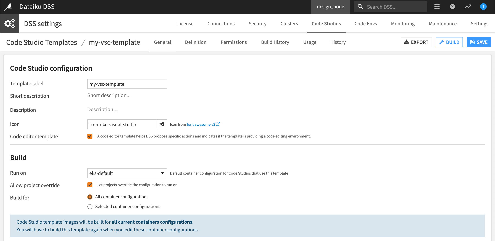
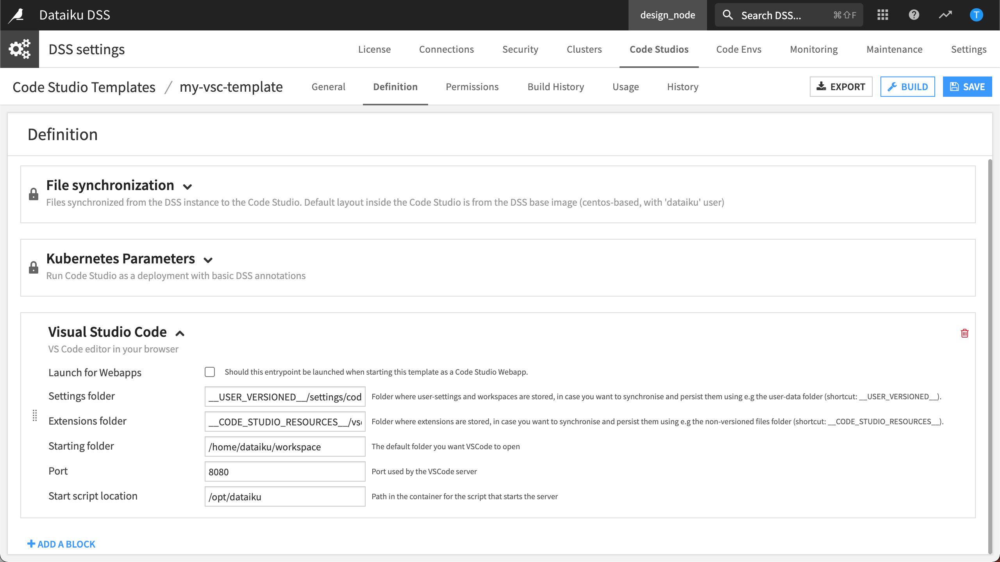
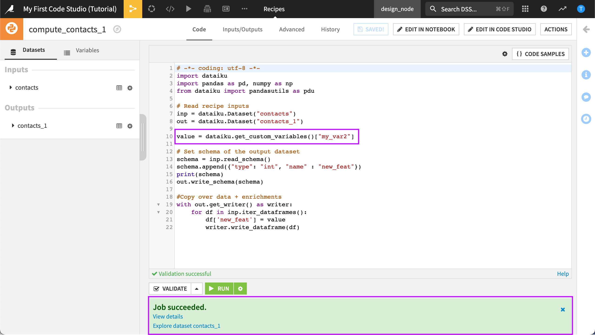
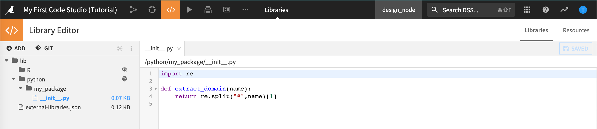
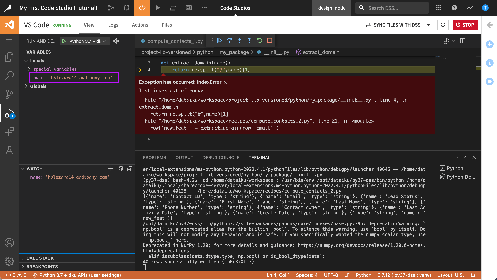

Tutorial | My first Code Studio
*********************************

..
    This tutorial comes from the KB.
    It is hidden, and should be refactored BEFORE publishing.
    You should also uncomment the related link in the conf.py

.. meta::
 :description: Follow the steps in this tutorial to get started with Code Studios. Code Studios allow you to work in your own IDE (e.g., VS Code) to edit or debug code.

When coding and building solutions in Dataiku, it can be helpful to access your own integrated development environment (IDE), such as JupyterLab or Visual Studio Code (VS Code). Dataiku :doc:`Code Studios <refdoc:code-studios/concepts>` allow you to do just that.

Get started
============

Objectives
---------------

In this tutorial, you will:

- Create a Code Studio template with a VS Code editor.
- Edit a Python recipe in a VS Code Studio.
- Edit a Project Library in a VS Code Studio.

Prerequisites
---------------

.. tabs::

    .. group-tab:: Dataiku Cloud

       * Administrator privileges for your user profile.
       * Being familiar with Code Recipes.

    .. group-tab:: Self-managed

      * A Dataiku 11+ instance.
      * Administrator privileges for your user profile.
      * Being familiar with Code Recipes.
      * A Kubernetes cluster is configured. For details, visit :doc:`Elastic AI Computation <refdoc:containers/index>`.
      * A base image is built. Typically, this is built using a command such as ``./bin/dssadmin build-base-image --type container-exec``. For details, visit `Build the Base Image <https://doc.dataiku.com/dss/latest/containers/setup-k8s.html#build-the-base-image>`_.

Create the project
-------------------
1. From the Dataiku homepage, click **+New Project** > **Learning projects** > **Developer** > **My First Code Studio**.
2. From the project homepage, click **Go to Flow**.

.. include:: /_shared/project-creation-help.txt

.. |downloadlink| replace:: website
.. _downloadlink: https://cdn.downloads.dataiku.com/public/dss-samples/DKU_TUT_CODE_STUDIOS/

Use case summary
--------------------

We'll work with a project that contains a simple pipeline: one input dataset, two Python recipes, and two output datasets. Both recipes generate errors when run. 
Our goal is to debug these recipes in our own IDE. We'll accomplish this within Dataiku using Code Studios.

.. note::

   There are other ways to debug code recipes with Dataiku. You may also consider using various `IDE integrations <https://knowledge.dataiku.com/latest/code/work-environment/index.html#how-tos>`_. 

The first thing we'll need is a Code Studio template. Once we have the template created, we can start our own VS Code Studio.

Create a Code Studio template
====================================

To use Code Studios, you'll need to set up a `Code Studio template <https://doc.dataiku.com/dss/latest/code-studios/concepts.html#code-studio-templates>`_.

.. note::
  You'll need Administrator privileges on your instance to create a Code Studio template.

To do this:

.. tabs::

    .. group-tab:: Dataiku Cloud

       1. In the Dataiku `Launchpad <https://launchpad-dku.app.dataiku.io/>`_, navigate to the **Extensions** panel.
       2. Click on the **+ Add an Extension** button.

          .. image:: ./assets/cloud-code-studio-extension.png
             :alt: Create code studios extension on Dataiku cloud launchpad.
             :class: image-popup

       3. Choose **Code Studios** and click on **Confirm**. It may take a few minutes.
       4. Once it's created, navigate to the Code Studios by clicking on **Create your first code studio template 🚀**.
       5. Select **+Create Code Studio Template**.
       6. Type a name for your template, like ``my-vsc-template`` and then select **Create**.

       .. image:: ./assets/create-code-studio-template-cloud.png
             :alt: Code Studios tab in the Admin menu.
             :class: image-popup

    .. group-tab:: Self-managed

       1. In your Dataiku instance, choose **Administration** from the **Applications** menu.
       2. Navigate to the **Code Studios** tab.
       3. Select **+ Create Code Studio Template**.

          .. image:: ./assets/create-code-studio-template.png
             :alt: Code Studios tab in the Admin menu.
             :class: image-popup

       4. Type a name for your template, like ``my-vsc-template`` and then select **Create**.

Let's configure our template.

Configure general settings
----------------------------

Use the General tab to give a meaningful name and description to your template. You can even add an icon. In the **Build** section, the container is set to the default container configuration for your instance. This is configurable.

1. In the **General** tab, make any changes you want to your template including adding a description. Or, leave the default settings.
2. Select **Save** if making any changes.

Configure definition settings
-------------------------------

The Definition settings define the services provided by your template. To enrich the template definition, you add blocks. Let's add a VS Code block so that we can use a VS Code editor in our browser.

1. Navigate to the **Definition** tab.
2. Select **Add a Block**.
3. In **Select a block type**, click **Visual Studio Code**.
4. Leave the other settings as default and select **Save**.

.. note::
  The VS Code block contains a basic Python code-environment and Dataiku APIs by default. To add a specific code environment, select **Add Block**. In **Select a block type**, select **Add Code Environment**.

Build the template
-------------------------------------------------

Let's build and publish the docker image so that our template becomes available. To do this:

1. Select **Build**.
2. Wait while Dataiku begins building the docker image.
3. When the build is complete, you can select **Build History** to view the details of the build.

We are now ready to use VS Code in our project!

Launch your first Code Studio
===============================================

Back in our project, we'll launch Code Studios and select our new VS Code template.

1. From the **Code** menu, select **Code Studios**.
2. Select **Create Your First Code Studio**.
3. In **New Code Studio**, select the VS Code template you just created.
4. Name the Code Studio ``VS Code`` and select **Create**.
   
   .. image:: ./assets/new-vs-code-studio.png
    :alt: Launching a new Code Studio in a project.
    :class: image-popup
 

   Dataiku lets you know the Code Studio status is *stopped*.
   Now that your Code Studio is created, let's start it and get a first look!

5. Select **Start Code Studio**.

Wait while Dataiku starts the Code Studio and launches it in a browser window.

.. note:: 

  If it's the first time, VS Code may ask you to trust the authors. 
  
  Click on **Yes, I trust the authors.** to move forward. 
   
In the next few sections, we'll use our Code Studio to debug a code recipe and the project library.

.. note::
  If you exit the tutorial and come back later, you may have to restart your Code Studio.

Debug a recipe in a VS Code Studio
================================================

In this section, we'll use our Code Studio to edit and debug a code recipe.

If you have not already started your Code Studio, you can start it now to ensure it is ready.

1. From the **Code** menu, select **Code Studios**.
2. Click **Start** to start the Code Studio.
   
   Wait while Dataiku starts the Code Studio and launches the VS Code Workspace Explorer.

3. Return to the Flow.
4. Open and run the Python recipe that generates *contacts_1*.

Dataiku displays "Job succeeded with warnings".

While we could inspect the errors and edit our code within the recipe itself, we want to demonstrate using the tools in our IDE so we'll debug this recipe in our Code Studio.

Debug with VS Code
-----------------------------------------

Let's inspect and debug this recipe in our Code Studio.

1. From the recipe, select **Edit in Code Studio**.
2. In Code Studios, select **VS Code**.

Dataiku displays the VS Code Workspace Explorer ready to debug the recipe.

.. tip::
  To go back and forth between the Flow and your Code Studio, you can keep the VS Code Workspace Explorer open in its own browser tab.

We are interested in working with the Python recipe, *compute_contacts_1*. To find it:

1. Open the **Recipes** folder.
2. Select **compute_contacts_1.py**.
3. Run the code to generate the errors we saw in the recipe.

Running the recipe in VS Code displays the same error we saw in the Flow. This lets us know our Code Studio is configured correctly.

We see that we can work with our code recipe within our own IDE, all from Dataiku. However, we are now working in VS Code and not in the Dataiku Python recipe editor. If we make any changes to our code from our IDE, we'll need to sync the changes back to Dataiku.
Since we suspect the error is occuring when the output dataframe is written, let's set a breakpoint and use the VS Code debugger.

1. Click in the far left margin next to the last line of code to set a breakpoint.
2. Select **Debug Python File** from the dropdown at the top right.
   
   .. image:: ./assets/vs-code-debug-python-file.png
      :alt: [type alt]
      :class: image-popup
 

   VS Code executes the code and pauses at the breakpoint. To debug our code, we can take advantage of navigation commands and shortcuts in our IDE. More specifically, we can inspect the variables.

3. Expand **Variables > Locals** in the debugger explorer, in the left panel.

   Upon inspection, we can see that the project variable, *my_var* is fetched and added to the column, *new_feat*. To see the definition of this project variable, select **… > Variables** from the top navigation bar.
   
   .. image:: ./assets/vs-code-debugger-variables-section.png
      :alt: VS Code Studio debugger variables section.
      :class: image-popup

   However, this column contains a string - *foo*. This is causing a type mismatch because the new column should be an integer.
   
   To resolve this issue, we'll replace *my_var* with the variable, *my_var2*.

4. Edit the code, replacing *my_var* with *my_var2*.
   
   .. code-block:: python

     value = dataiku.get_custom_variables()["my_var2"]

5. Run the code again.

Now that our code executes without error, we can sync our changes back to our recipe in the Flow.

Sync the changes back to Dataiku
-------------------------------------------------------------

When we are developing in Code Studios, we are working with a local copy of the code. If we return to the Flow now, we'll still be using the broken code. In order to push the new version to the recipe, we'll need to sync our changes back to Dataiku.

1. In VS Code, select **Sync Files With DSS** in the upper right.
   
   Once the sync is complete, VS Code displays a green checkbox.
   
   .. image:: ./assets/vs-code-debugged-python-file-synced-with-dss.png
    :alt: Python recipe debugged and synchronized back to Dataiku.
    :class: image-popup

2. Return to the Flow.
3. Open the *compute_contacts_1* Python recipe.
   
   We can see that our recipe is updated and that "my_var" is now "my_var2".

4. Run the recipe.

The recipe runs without warnings.

Edit a project library
===============================

Project libraries are a great way to organize your code in a centralized location that can be reused in any project on the instance. From Dataiku, you can also connect to a remote Git repository to manage your code. For more details, visit :doc:`Reusing Python Code <refdoc:python/reusing-code>`.

In this section, we'll practice editing a project library in our Code Studio. We'll be working with the second Python recipe in our project.

Start the Code Studio
------------------------------------------------

If you have not already started your Code Studio, you can start it now to ensure it is ready.

1. From the **Code** menu, select **Code Studios**.
2. Click **Start** to start the Code Studio.

Wait while Dataiku starts the Code Studio and launches the VS Code Workspace Explorer.

Run the Python recipe
--------------------------------------------------------

1. Return to the Flow.
2. Run the Python recipe that generates **contacts_2**.

This recipe is performing a simple transformation using a custom Python package, *my_package*.

 

The error, "list index out of range", is raised at line 21 of our code.

.. code-block:: python

    row['new_feat'] = extract_domain(row['Email'])

We want to inspect this error to find out more. One way to do this is to use the logs, but we can also inspect and debug this error in our Code Studio.

Debug with VS Code
-------------------------------------------

Let's see if we can find out more by using the VS Code debugger.

1. From the recipe that generates *contacts_2*, select **Edit in Code Studio**.
2. In Code Studios, select **VS Code**.

Dataiku displays the VS Code Workspace Explorer ready to debug the recipe. The *project-lib-versioned* folder contains our Python package, *my_package*. In addition, the *recipes* folder contains our recipes.

Let's run our recipe in the debugger.

1. Open the **Recipes** folder.
2. Select **compute_contacts_2.py**.
3. Select **Debug Python File**.

We can work with our recipe within our own IDE even when it is using a project library. However, we are now working in VS Code and not in the Dataiku Python recipe editor. If we make any changes to our code from our IDE, we'll need to sync the changes back to Dataiku.
Running the recipe in VS Code displays the same error we saw in the Flow.

 
We can see that the record "hblezard14.addtoany.com" does not fit our regex split pattern because it is missing the "@" symbol.

Add a basic control
---------------------------------------------------

Let's add a very basic control to solve this issue.

1. Open *_init_.py* from the *proj-lib-versioned* folder.
2. Edit the code as follows:
   
   .. code-block:: python

      import re
      
      def extract_domain(name):
         split_name = re.split("\.|,",name)
         if len(split_name) > 1 :
             return split_name[1]
         return '(unknown)'

3. **Run** the code again.

Our code executes without error.

Sync the changes back to Dataiku
--------------------------------------------------------------

Let's sync our changes back to our recipe in the Flow.

1. In VS Code, select **Sync Files With DSS** in the upper right.
   
   Dataiku synchronizes both the recipe and the project library file back to the project. Once the sync is complete, VS Code displays a green checkbox. Let's check that the project library file is now updated.

2. From the **Code** menu, select **Libraries**.
   
   We can validate the synchronization back to our project library file was successful.
   
   .. image:: ./assets/vs-code-synchronized-python-package.png
      :alt: Python package synchronized from VS Code Studio.
      :class: image-popup
 
3. Run the recipe that generates *contacts_2* to see that the output dataset is built without exceptions.
  

What's next?
================
In this tutorial, you took your first steps with Code Studios and learned the basics including how to create a Code Studio template, start a Code Studio, edit a recipe, and edit a project library. You saw how you can take advantage of the tools such as the debugger in your IDE and synchronize any changes back to your project.

Now you are ready to explore Code Studios on your own! You can use Code Studios to create more advanced templates, code more efficiently, and even write entirely custom web applications!

..
    putting this in comment
    To see more about Code Studios, you can also navigate to our :doc:`Developer Guide <devguide:tutorials/devtools/using-vscode-for-code-studios/index>`!

 
 

