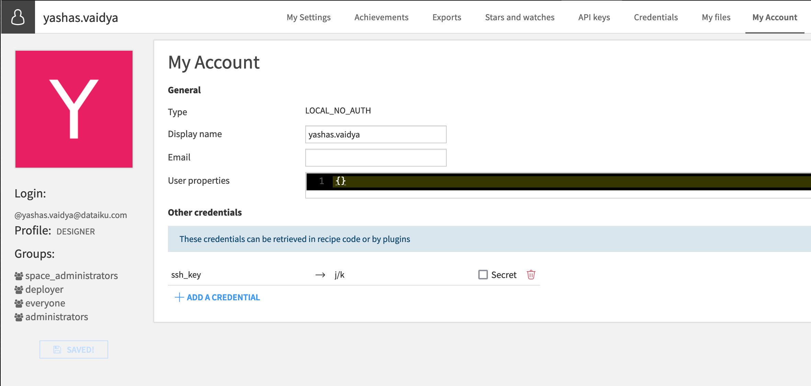
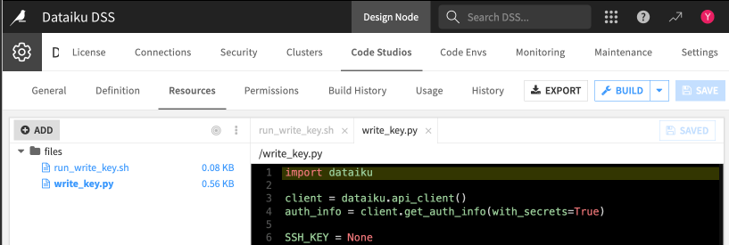
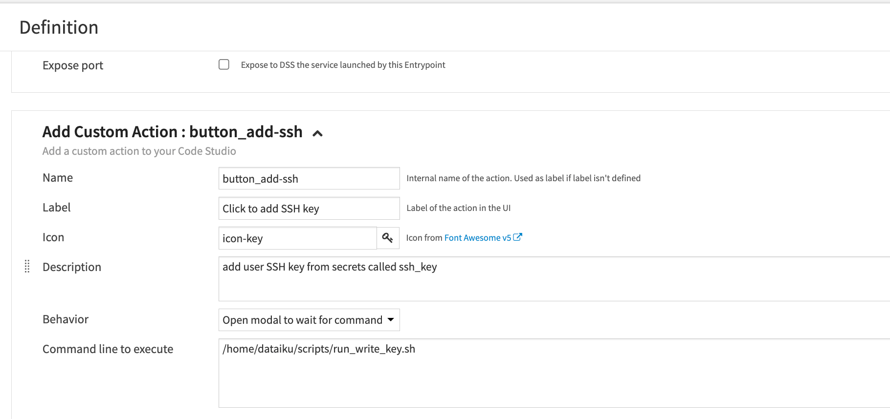
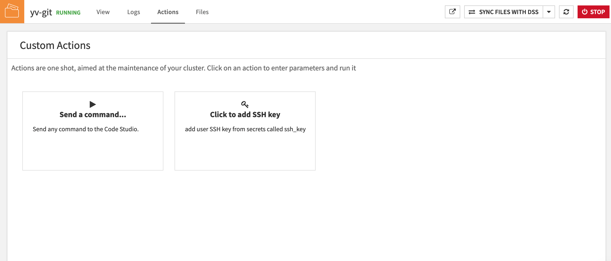
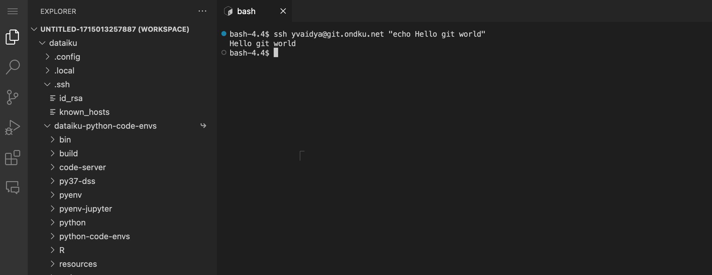

# Using Code Studio templates to connect to git remotes

There are many Git integrations in Dataiku. The vast majority of them also give the platform the ability to interact with remote repositories, say, on Github. This tutorial shows yet another way of connecting to a remote, using {doc}`user secrets <refdoc:security/user-secrets>` and {doc}`Code Studios <refdoc:code-studios/index>`.

It also highlights the capabilities of the Dataiku APIs, since they can programmatically copy these user secrets using the startup script of the Code Studio.

## Prerequisites

- Knowledge of Code Studios
- Permission to configure Code Studio templates
- Private key authenticated on the remote server

:::{topic} Caution
Please consult your platform admin or engage a friendly Dataiku TAM or FE to validate that this approach is advisable in your setup.
:::

## Add SSH key to user secrets

To connect securely to an external git repository, you **must** copy the private SSH key to an account's user secrets. You can add them in **My Account > Other credentials > + ADD A CREDENTIAL**. The tutorial will place it in a secret named `ssh_key`.

{.image-popup}

## Setting up the template

A detailed tutorial on setting up a Code Studio template, using manual setup or importing a saved one, can be found [here](tutorials_webapps_code_studio_template_manual_setup). Let's go over the main steps of the manual process:

- First, you'll create a template via **Application > Administration > Code Studio > + Create Code Studio Template** and by picking a label
- Then, copy the scripts via the **Resources** panel to the `files` directory to ensure each Code Studio instance contains them when built--they use Dataiku API calls that place the SSH key into the correct directory with the right permissions

{.image-popup}

```{dropdown} [Python script](./assets/write_key.py)

```{literalinclude} assets/write_key.py
:language: python
```

```{dropdown} [bash script](./assets/run_write_key.sh)

```{literalinclude} assets/run_write_key.sh
:language: bash
```

- Finally, add the following blocks to the **Definition** panel ({doc}`File synchronization <refdoc:code-studios/code-studio-templates#file-synchronization>` and [Kubernetes Parameters](https://doc.dataiku.com/dss/latest/code-studios/code-studio-templates.html#kubernetes-parameters) are available by default and can be configured if needed):

  + **[Visual Studio Code](https://doc.dataiku.com/dss/latest/code-studios/code-studio-templates.html#visual-studio-code)**: Provides VS Code IDE as an interface to run CLI commands like `git clone`
  + **[Add an Entrypoint](https://doc.dataiku.com/dss/latest/code-studios/code-studio-templates.html#add-an-entry-point)**: Copies the scripts added via **Resources** to a specific path and runs the bash script when the Code Studio is launched

{.image-popup}

- *[OPTIONAL]* **[Add Custom Action](https://doc.dataiku.com/dss/latest/code-studios/code-studio-templates.html#add-custom-action)**: Adds a way to trigger the scripts from the Code Studio UI

{.image-popup}

- **Build** the template to prepare the Code Studio image

## Using a Code Studio based on the template

Once the template is set up, accessing it and adding the SSH key requires the following steps:

- Open or create a Dataiku project where the Code Studio will live
- Navigate to **</> > Code Studios** in the top navigation bar
- Click on **+ New Code Studio** in the upper right and choose your configured template
- Start the Code Studio!
- If needed, run the Custom Action to copy over and modify the permissions of the necessary files again

{.image-popup}

- Open a **New Terminal** and run a git command against the remote

{.image-popup}

## Wrapping up

Welcome to the git world!