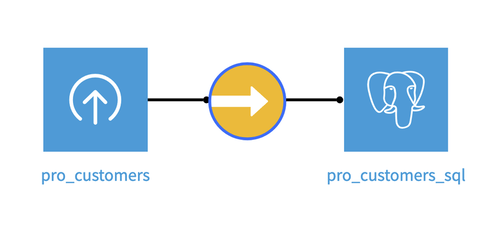
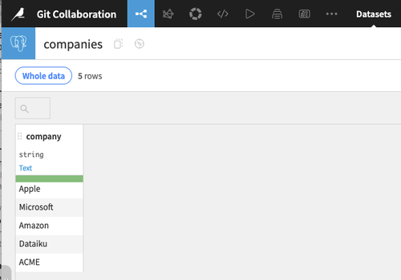
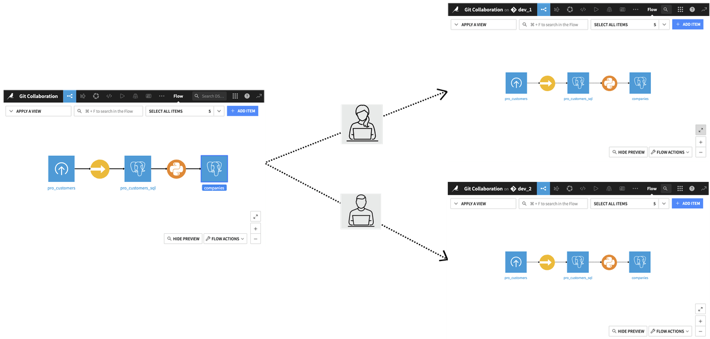
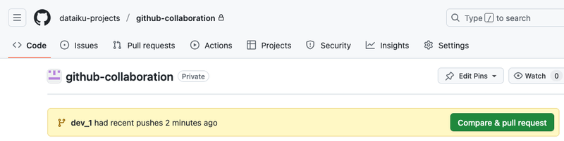
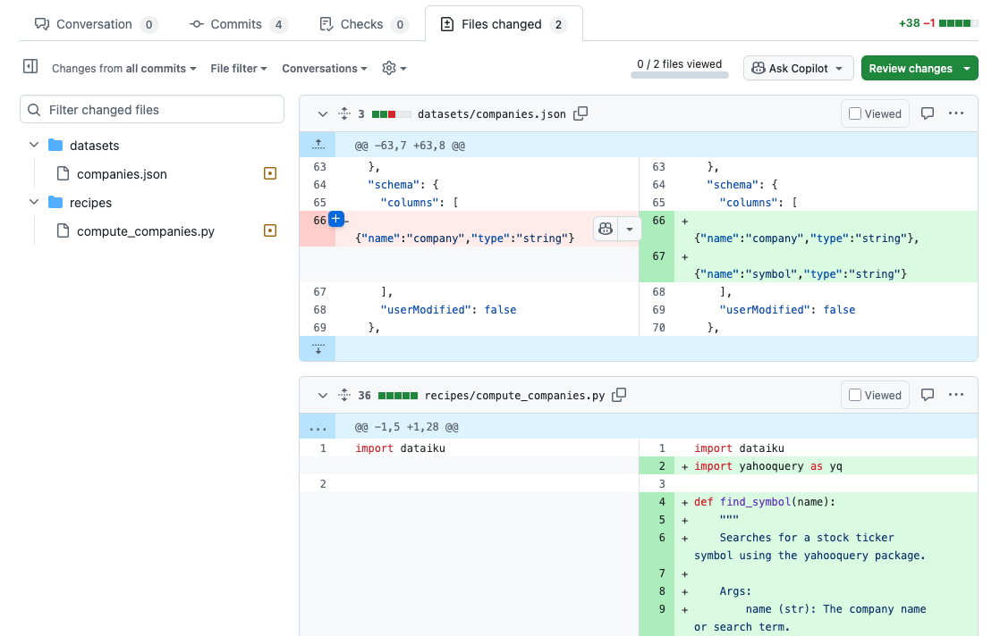
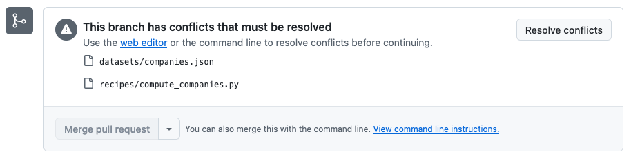
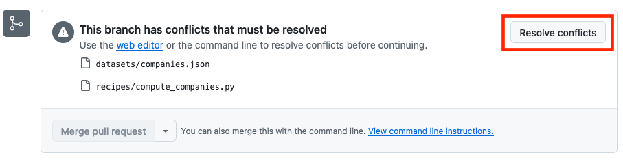
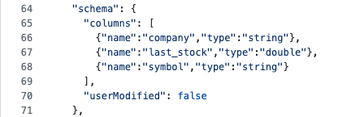

Git collaboration
*****************

.. meta::
  :description:  This tutorial shows how to leverage Git integration within Dataiku when working in team collaboration.

This tutorial teaches you how to use Git integration within Dataiku in a multi-developer team use case.
We are going to follow the story of a team of two developers in charge of a new project.
Starting with a Dataset with customers information, a Dataset with companies information will be created.
The first developer will add a column with the stock ticker symbol.
The second developer will add a column with the last stock value.
In both cases, they will use two libraries to help them: yfinance and yahooquery.
It will show the different steps during a collaboration on a project, including operations like branching, creating a Pull Request, and handling a case of merge conflict.

Prerequisites
=============

- Dataiku >= 13.5
- Python >= 3.10
- A code environment with the following packages:

  .. code-block:: python

    yfinance    #tested with 0.2.65
    yahooquery  #tested with 2.4.1

- An SQL Dataset named ``pro_customers_sql``.
  You can create this Dataset by uploading this :download:`CSV file</tutorials/genai/agents-and-tools/agent/assets/pro_customers.csv>` and using a **Sync recipe** to store the data in an SQL connection.

Preparing the project
=====================

Before explaining the collaboration with branches, let's prepare the project that will be used.
Set up the required **Code Environment**
In **Administration** > **Code envs**, select an existing **Code Environment** or click **Create code environment**, then add the libraries listed in the prerequisites section.
Once you have fulfilled the requirements, you will have a project with a flow with the uploaded file, a Sync recipe, and an SQL Dataset with the data from the CSV file.
For this tutorial, let's call the SQL Dataset ``pro_customers_sql``.

    Fig. 1: Prepared project flow.

Adding a Python recipe
----------------------
We are going to add a **Python Code recipe** from the SQL dataset (``pro_customers_sql``).
Go to the **Advanced** tab of the recipe to check you are using the **Code Environment** with the requirements installed.
We will create a new Dataset (named ``companies``) containing only the ``company`` column.
For code implementation, you can use :ref:`Code 1<tutorials-devtools-git-collaboration-initial>`.

.. literalinclude:: ./assets/initial.py
    :language: python
    :caption: Code 1: Extract the ``company`` column
    :name: tutorials-devtools-git-collaboration-initial

You now have a ``companies`` Dataset with the following content.

    Fig. 2: Starting ``companies`` table.

You can now add a remote repository, as described in the :ref:`Git basics section<git_setup_adding_remote-repository>`.
In summary, go to the **Version Control** menu and choose the **Add remote** action.

Creating the developer's environments
=====================================

To collaborate on the project, let's assume there are two developers.
From the current state of the project, let's create a branch for each of them.
As described in the :ref:`git_setup_adding_branches`, you will follow those steps:

- From the **Version Control** menu, choose the branch menu currently showing the ``main`` branch, and select **Create new branch...**.
- Enter the branch name, ``dev_1``, and click the **Next** button.
- Click on the **Duplicate and create branch** button.

This will create the branch ``dev_1`` for the first developer, who will use the duplicated project.
Return to the main project and repeat the sequence for the second developer (``dev_2``, for example).
We have the following collaboration architecture:

    Fig. 3: Collaboration architecture.

Each developer is going to work on a dedicated project and branch.

Adding and pushing code
=======================

Adding and filling the symbol column.
-------------------------------------

The first developer has to work on the following task: for each company in the ``companies`` Dataset, add the corresponding stock ticker symbol in a new column called ``symbol``.
Code 2 shows how to modify the Python recipe.

.. literalinclude:: ./assets/dev1.py
    :language: python
    :caption: Code 2: Adding and filling the symbol column.
    :name: tutorials-devtools-git-collaboration-dev1
    :emphasize-lines: 3-25, 34-46

Pushing the code
----------------

Once satisfied with this new version of the project, the first developer decides to push the code.
To do so, go to the **Version Control** menu. From there, use the **Push** action.
The ``dev_1`` branch now has this version of the project.

Creating a Pull Request
-----------------------
As the branch has just been pushed, you can now navigate to Github and create a PR from the suggested **Compare & pull request**.
You can also use the **New pull request** button from the **Pull requests** tab.

    Fig. 4: Compare & pull request.

Add all the needed elements, such as a description.
You can see that two files were modified.

    Fig. 5: Dev1 changed files.

The file ``datasets/companies.json`` shows the modification done with the addition of the column ``symbol``.
The file ``recipes/compute_companies.py`` shows the code modification done.

Merging changes in the main project
-----------------------------------

The Pull Request view on GitHub shows that there is no conflict: you can merge your pull request.
Once it is done, you can go back to your Dataiku instance and navigate to the main project.
From the **Version Control** menu, choose the **Pull** action.
The main project now has all the modifications by the first developer.

Working in the second environment
=================================

You can switch to the environment created for the second developer.

Adding a stock value
--------------------

The second developer will now modify the **Python recipe**.
The developer must add a new column, ``last_stock``, to the ``companies`` Dataset to store the last stock value retrieved using the ``yfinance`` package.
This can be done by using the following code in the ``compute_companies`` recipe:

.. literalinclude:: ./assets/dev2.py
    :language: python
    :caption: Code 3: Adding and filling the last stock column.
    :name: tutorials-devtools-git-collaboration-dev2
    :emphasize-lines: 2-27, 36-54

Creating the Pull Request
-------------------------

The second developer will follow the same steps as the first one:

- Push the code to the ``dev_2`` branch from the **Version Control** menu of Dataiku
- Create a Pull Request from GitHub.

Note that conflicts have been detected this time.

    Fig. 6: Dev2 conflict detected.

Solving and merging changes in the main project
-----------------------------------------------

You now have to solve the conflicts detected. You can do it with the tools you are the most comfortable with.
For the purpose of this tutorial, we will use the tool proposed on GitHub from the PR view.

    Fig. 7: Resolve conflicts button

The conflict for the ``datasets/companies.json`` is solved by incorporating all modifications as shown below (don't forget to add a `,` at the end of the first addition):

    Fig. 8: Companies conflict solution.

The conflict in the recipe code is a little trickier. You have to add the elements corresponding to the ``last_stock`` into the existing loop.
The final result is as the code below:

.. literalinclude:: ./assets/recipe.py
    :language: python
    :caption: Code 4: Complete recipe code.
    :name: tutorials-devtools-git-collaboration-recipe
    :emphasize-lines: 39, 43, 52, 56-57

You can commit the resulting merge. Your pull request for the second developer is now ready to be merged.
You can merge into the main branch.

Wrapping up
===========

Congratulations! You are able to collaborate on a Dataiku project with a remote repository!

Reference documentation
=======================

Classes
-------

.. autosummary::
    dataiku.Dataset

Functions
---------

.. autosummary::
  ~dataiku.Dataset.get_dataframe
  ~dataiku.Dataset.write_with_schema