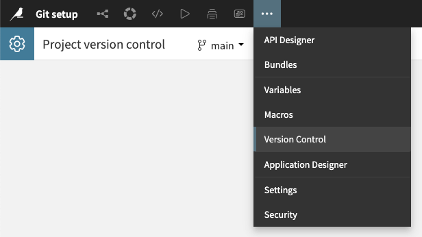
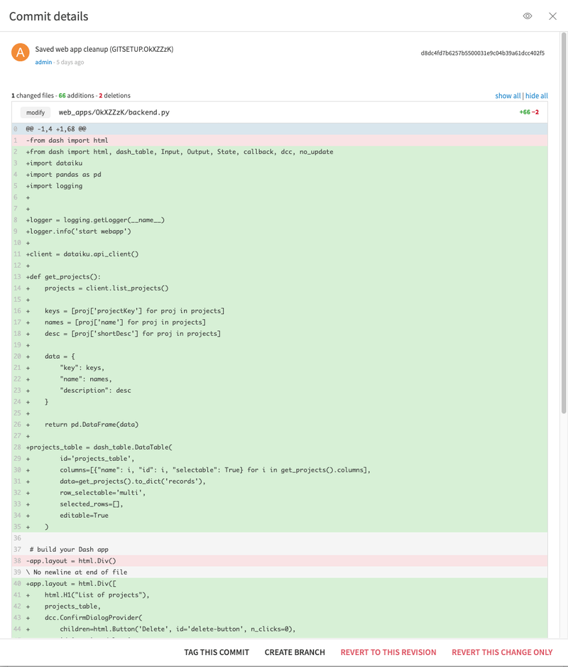
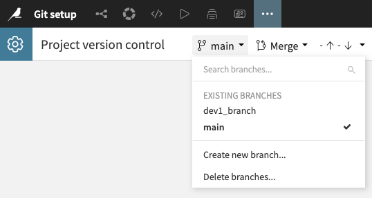
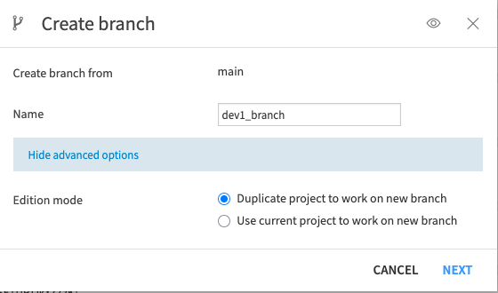
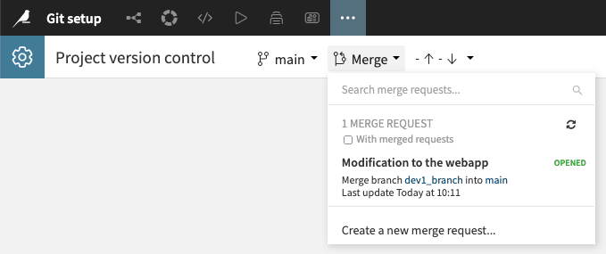
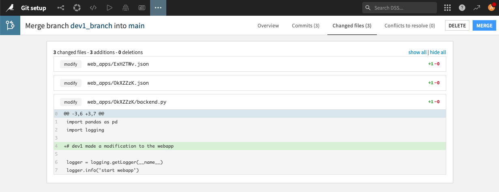
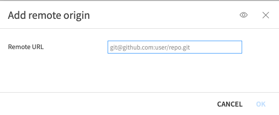
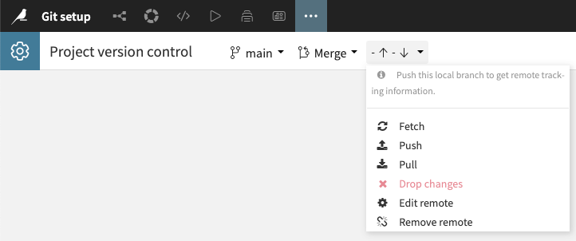

Git basics in Dataiku
*********************

.. meta::
  :description:  This tutorial shows how to use the Git integration in your development projects.

This tutorial teaches you how to use Git integration within Dataiku to enhance project collaboration and manage changes effectively.
It includes instructions for accessing project version control, guidance on executing key Git operations such as managing branches and creating merge requests,
and instructions for setting up and using a remote repository.

Prerequisites
=============

- Dataiku >= 13.5

Introduction
============

Dataiku comes built-in with Git-based version control. A regular Git repository backs each project.
Each change you make in the Dataiku (e.g., modifying the settings of a dataset, editing a recipe, or modifying a dashboard) is automatically recorded in the Git repository.
The :doc:`Version Control <refdoc:collaboration/version-control>` documentation provides more details.

Operating the integrated version control
========================================

Accessing project version control
---------------------------------

From your project, you can access the version control page by clicking the dot menu and clicking `Version Control`, as in the screenshot below.

    Fig. 1: Accessing project version control.

You will have access to your project's history and all the commits you have made so far.
By clicking on a specific commit, you will see what modifications were made.
An example is shown in the screenshot below.

    Fig. 2: Shows a commit detail.

Integrated git operations
-------------------------

The Version Control page allows you to perform several git operations.

.. _git_setup_adding_branches:

Branches operations
^^^^^^^^^^^^^^^^^^^

From the branches menu, you will be able to:

* Search branches to find the proper one among the existing branches.
* Select a branch to switch to and work from there.
* Create a new branch when needed
* Delete branches to clean up the project

    Fig. 3: Branches operations menu.

The creation and deletion of branches are git operations.

The creation has an additional option for the project itself.
You can choose to duplicate the Dataiku project.

    Fig. 4: Create branch dialog.

We encourage you to use this duplication option if you want to modify several project elements, like changing the workflow.
In that case, you can work on this duplicated project without interfering with the source project.
Once you are ready to contribute, you will use the Merge Request feature described in the next section.

Merge Request
^^^^^^^^^^^^^

When you have modifications done in other branches and need to integrate them into your branch, you must perform a Merge Request.

    Fig. 5: Merge request menu.

A merge Request allows you to review the changes made to files and the corresponding history of commits.
You can review and resolve potential conflicts and decide whether to validate the changes or delete the Merge Request.

    Fig. 6: Merge request actions.

Using a remote repository
=========================

It is possible to use remote repositories with.
We recommend working with a remote whenever possible, as it offers more options for managing merge commits and better collaboration capabilities.

.. _git_setup_adding_remote-repository:

Adding a remote repository
--------------------------

You will undoubtedly need an SSH key to add a remote repository and be authorized to operate it.
Known Git service providers, such as GitHub, GitLab, or others like AWS Code Commit or Azure Repos, have a well-defined process for authorizing a connection using an SSH key.

To allow your Dataiku project to use such a key, you will have two cases:

* You work on a Dataiku Cloud instance.
* You work on an on-premises instance.

The process is described in more detail in the :ref:`Setup chapter in Working with Git <refdoc:git.setup>` of the documentation.
For quick reference here, let's summarize as:

* From Dataiku Cloud: add an extension with the git integration, then enter the service provider's domain.
* From a on-premises instance: generate an SSH key for the Dataiku user

In both cases, don't forget to copy the public key to your git service provider.

From that point, you can now add a remote repository to your project.

.. figure:: ./assets/add-remote-menu.png
    :align: center
    :class: with-shadow image-popup
    :alt: Fig. 7: Add remote menu.

    Fig. 7: Add remote menu.

You will be asked for the git URL of your repository.

    Fig. 8: Add remote dialog.

Update operations
-----------------

Once you have added a remote repository, a new set of actions is available.

    Fig. 9: Remote actions.

The first actions are familiar operations to any git user.

* Fetch: retrieve all the remote repository data without modifying your local work.
* Push: uploads your local updates to the remote repository.
* Pull: performs the fetch action and immediately integrates changes in your local branches.

The last actions allow you to:

* Drop changes: Delete all of your non-pushed work on the current local branch. The project's history of changes will be reset to the state of the remote repository.
* Edit remote: allows you to modify the remote repository URL.
* Remove remote: unlink the remote repository.

Wrapping up
===========

Congratulations! You can start collaborating on your project and managing its change workflow with all that information.