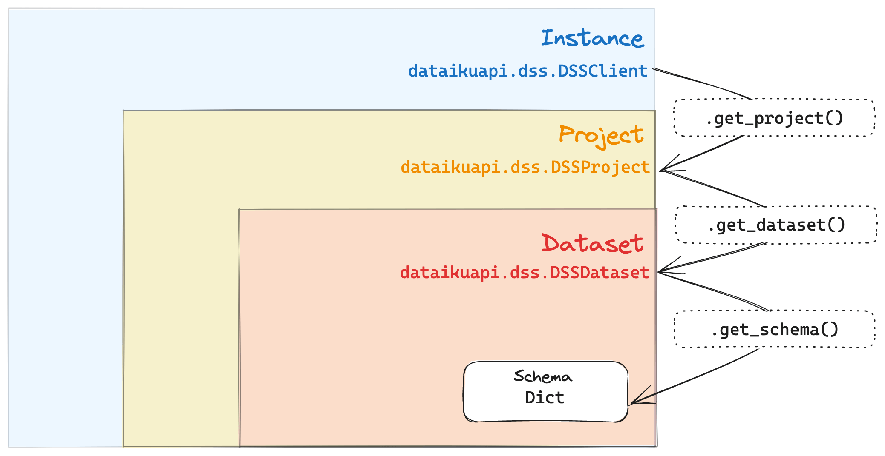

# Dataiku’s Public API: A Comprehensive Guide

The public API of Dataiku is a powerful tool for automating tasks
and programmatically interacting with your instance's components.
This tutorial will guide you through its basics and provide a few good practices for using it efficiently.

## Prerequisites

* Dataiku >= 11.4
* Dataiku's Python API client is properly set up on your client machine following
[this tutorial](../python-client/index).

## A bit of architecture

When working on Dataiku, under the hood, every user interacts with the platform's *backend*.
In short, Dataiku's backend is an essential process
that is responsible for managing many configuration items and orchestrating all running tasks.

The main interface to interact with the backend is through your browser by accessing Dataiku's
web interface. However, to provide more flexibility to advanced users, there is a programmatic
alternative: Dataiku's public API.

At its core, Dataiku’s public API is a collection of RESTful API endpoints that can be queried via HTTP.
Working at this fine-grained level can be cumbersome and requires lots of code to manage the HTTP query properly. 
We strongly advise our coder users to rely on the Python client instead.
Please refer to {doc}`this documentation<../rest-api/index>` for more information on the REST API and its usage.

### The benefits of the Python API client

Dataiku's Python API client is explicitly built to speed up the work of programmatic users. It wraps low-level
endpoint operations into helper functions that make for more transparent and concise code. Additionally,
working at a higher level removes the need for the user to manually parse the (often complex) responses provided
by the REST API endpoints.

Retrieving a dataset's schema with the Python API client would look like this:

```python
import dataiku

client = dataiku.api_client()
project = client.get_project("YOURPROJECTKEY")
dataset = project.get_dataset("yourDataset")
schema = dataset.get_schema()

print(schema)
```

which should output:

```
{
    columns: [
        {"name": "Column1", type: "string", maxLength: -1},
        {"name": "Column2", type: "bigint"},
        ...
    ]
}
```

From the previous code snippet, you can see that you have to manipulate a few handles before getting to the
final result. You'll learn more about them in the next section.

## Using the Python API handles

Code written with the Python API client follows a pattern where the user:

1. First, "log in" by providing credentials when instantiating a {class}`dataikuapi.DSSClient` object, 
   which acts as the main entry point to interact with the API.
2. Then, navigate through a *hierarchy of scopes* to reach the item of interest they want to interact with.
3. Finally, get a handle object on that item and manipulate it using the relevant methods at their disposal.

To illustrate this, let's decompose the previous code snippet:

* ```python
  import dataiku

  client = dataiku.api_client()
  ```

  First, a `client` (a {class}`dataikuapi.DSSClient` object) is created and gives access to the *instance-level scope*,
  which, as the name indicates, allows you to perform operations on your Dataiku instance, such as:
  - Editing the administration settings
  - Creating projects and project folders

  Of course, these actions are only available if you have the proper permissions. We'll get to this
  in the last section of the tutorial.

* ```python
  project = client.get_project("YOURPROJECTKEY")
  ```

  Then, the scope shifts to the *project-level*: you acquire a handle on a specific project from the `client` object.
  More precisely, the `project` variable you create is an instance of {class}`~dataikuapi.dss.project.DSSProject`
  obtained through the {meth}`dataikuapi.DSSClient.get_project` method. It allows you to perform operations only within the
  `YOURPROJECTKEY` project and manipulate *project-level* items, for example:
     - Datasets
     - Recipes
     - Scenarios

* ```python
  dataset = project.get_dataset("yourDataset")
  ```

  Following the same logic, you switch from the *project-level* scope to the *dataset-level scope* by creating a
  {class}`~dataikuapi.dss.dataset.DSSDataset` object via {meth}`~dataikuapi.dss.project.DSSProject.get_dataset`.
  From there, the `dataset` variable
  allows you to handle all items relative to the `yourDataset` dataset within the `YOURPROJECTKEY` project, such as:
    - Schema
    - Metrics
    - Checks

* ```python
  schema = dataset.get_schema()
  ```

  Finally, within the *dataset-level* scope, you can obtain a handle on the dataset's schema to display using the
  {meth}`~dataikuapi.dss.dataset.DSSDataset.get_schema` method.
  Other examples of *dataset-level* operations are:
    - Listing the existing partitions
    - Getting the last computed metric values
    - Running checks

In summary, interacting programmatically with a given item is all about traversing the proper scopes, as illustrated in
this diagram:

{.image-popup}

## Authentication, scopes, and permissions

When instantiating the {class}`~dataikuapi.DSSClient` object, the standard practice is to pass a
{doc}`personal API key <refdoc:publicapi/keys>` to authenticate (for more information, please refer to {ref}`connecting-dataiku-instance`).
All the subsequent actions will then be executed as the Dataiku user who owns the key.
They will also be bounded by the permissions granted to that user.

For example, if your user doesn't have permission to create projects when you try running this:

```python
import dataiku

dataiku.set_remote_dss("https://dss.example", "YOURAPIKEY")
client = dataiku.api_client()
client.create_project("MYKEY", "My project", "myuserlogin")
```

Your code will fail after throwing an exception:

```text
DataikuException: java.lang.SecurityException: You may not create new projects
```

The {doc}`security section <refdoc:security/index>` in Dataiku's reference documentation provides more details on its permission system.

## Wrapping up

You now have the basics to manipulate Dataiku's public API through its Python client! If you are looking
for specific API documentation, the client is extensively documented in the
[API reference section](/api-reference/python/index).

