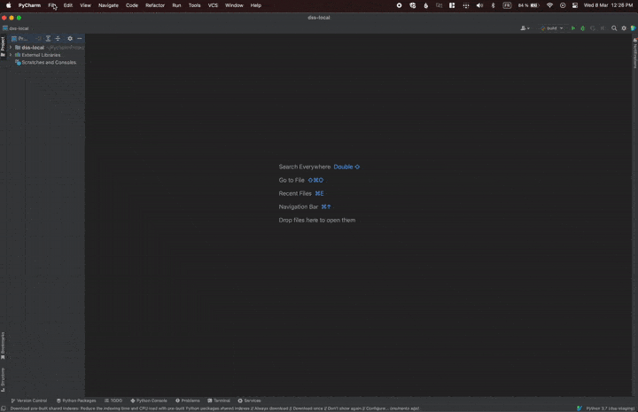
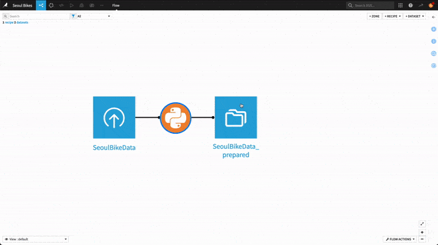

# PyCharm plugin for Dataiku

The PyCharm plugin for Dataiku enables you to connect to a Dataiku instance from your PyCharm environment and edit the following items:

| Item | Editable ? |
| :---- | -----------: |
| Code recipes | ✅ |
| Project libraries | ✅ |
| Plugins | ✅  |
| Notebooks | ❌ |
| Webapps (standard) | ❌ |
| Webapps (Bokeh) | ❌ |
| Webapps (Shiny) | ❌ |
| Webapps (Dash) | ❌ |
| Webapps (Streamlit) | ❌ |
| Wiki | ❌ |

This tutorial will provide an overview of some of these capabilities through a simple example.

```{caution}

The Dataiku PyCharm plugin provides a richer edition environment, but doesn't act as a full replacement for the web interface. Several important operations will still be done visually in your browser.
```

## Prerequisites

* [PyCharm](https://www.jetbrains.com/pycharm/) installed on your local computer

* A Dataiku API local environment set up. For detailed steps, see {doc}`this tutorial </tutorials/devtools/python-client/index>`

* "Write project content" permission on an existing Dataiku project

If you can't install the required components on your computer, we advise that you use {doc}`Code Studios <refdoc:code-studios/concepts>` instead.


## Setting up the plugin

* Start by installing the plugin from the [JetBrains plugin repository](https://plugins.jetbrains.com/plugin/12511-dataiku-dss)

* In PyCharm, create a new project. When setting up your project, do not create a new Python environment, instead: 
  * Select the "Previously configured interpreter" option and click on "Add Interpreter > Add Local Interpreter..."
  * For "Environment", select "Existing"
  * For "Interpreter", select the path to your Dataiku API local environment's Python executable
  * Finish the configuration by clicking on "Create"

You should now have your PyCharm project up and ready. The last setup step is to enable the Dataiku plugin. 

Go to "File > Open Dataiku DSS..." and:
* Don't change the "module" field
* In "DSS instance" select the name and URL of your target instance
* in "type", select the kind of Dataiku item you want to edit, in your case we'll start with "Library"

Click on "Next", then select which Dataiku project you want to work on, and click on "Create".

In your PyCharm project layout, you should now see your Dataiku project and its libraries in the side panel. From there , you should be able to access their source code.

{.image-popup}

## Editing project libraries and code recipes

The first item we will edit in PyCharm is the project library.

In the Dataiku web interface, start by creating a dataset from the [Seoul bike sharing demand dataset](https://archive.ics.uci.edu/ml/datasets/Seoul+Bike+Sharing+Demand) available online and name it `SeoulBikeData`. In your newly-created dataset, to prevent character encoding issues, go to "Settings > Schema" and rename the following columns:

* `Temperature(°C)` -> `Temperature_C`
* `Dew point temperature(°C)` -> `Dew point temperature_C`

Then, switch to PyCharm and in your project, create a new directory called `bikes` under `lib/python/`. Inside that directory, create the following files: 

* `__init__.py` and leave it empty
* `prepare.py` with the following code: 

  ```python
  import pandas as pd

  COLUMNS = ["Date", "Hour", "Temperature_C", "Wind speed (m/s)"]

  def celsius_to_fahrenheit(df: pd.DataFrame,
                               temp_celsius_col: str,
                               temp_fahrenheit_col: str) -> pd.DataFrame:
      df[temp_fahrenheit_col] = (df[temp_celsius_col] * 1.8) + 32.0
      return df

  def ms_to_kmh(df: pd.DataFrame,
                wind_ms_col: str,
                wind_kmh_col: str) -> pd.DataFrame:
      df[wind_kmh_col] = df[wind_ms_col] * 3.6
      return df
  ```

Note that every time you save your file(s) in PyCharm, they are automatically synchronized to the Dataiku instance.

Next, come back to the Dataiku web interface and:

* create a Python recipe using `SeoulBikeData` as input and a new dataset called `SeoulBikeData_prepared` as output
* save the recipe
* go back to the Flow screen

Switch to PyCharm and open your newly-created recipe. To do so, go to "File > Open Dataiku DSS..." and this time select the "Recipe" type. After clicking on "Next", you should see a list of the available recipes in your target Dataiku project. The one you just created should appear as `compute_SeoulBikeData_prepared`: select it and click on "Create" to start editing the recipe in PyCharm and replace the boilerplate code by this one:

```python
import dataiku
import pandas as pd

from bikes.prepare import celsius_to_fahrenheit
from bikes.prepare import ms_to_kmh
from bikes.prepare import COLUMNS

SeoulBikeData = dataiku.Dataset("SeoulBikeData")
df_in = SeoulBikeData.get_dataframe(columns=COLUMNS)

df_out = df_in \
    .pipe(celsius_to_fahrenheit,
          temp_celsius_col="Temperature_C",
          temp_fahrenheit_col="Temperature_F") \
    .pipe(ms_to_kmh,
          wind_ms_col="Wind speed (m/s)",
          wind_kmh_col="Wind_speed_kmh") \
    .round(2)

SeoulBikeData_prepared = dataiku.Dataset("SeoulBikeData_prepared")
SeoulBikeData_prepared.write_with_schema(df_out)

```

Don't forget to save your recipe's code! Same as for project libraries, it will synchronize it with the Dataiku instance. Your recipe is now ready to be run !


## Building datasets

In order to build the `SeoulBikeData_prepared` dataset you have two options: either trigger it from the Dataiku web interface or from PyCharm. Each case is further explained below.

### From the Dataiku web interface

This option is the simplest one: from the Flow screen, right-click on the `SeoulBikeData_prepared` dataset and choose "Build...", keep the default settings ("Not recursive") then click on "Build dataset". Once the dataset is built you can inspect its content by clicking on it.

{.image-popup}

### From PyCharm 

As opposed to the VSCode extension, you cannot run recipes remotely from PyCharm in a one-click fashion. Instead, you can leverage the Dataiku API from PyCharm to launch the job that will build your output dataset. To do so, create a new Python file called `build.py` inside your PyCharm project and populate it with the following code:

```python
import dataiku

client = dataiku.api_client()

# Uncomment this if your instance has a self-signed certificate
# client._session.verify = False

project = client.get_project("YOUR_PROJECT_KEY")

output_dataset = project.get_dataset("SeoulBikeData_prepared")
output_dataset.build()
```

To run your script, make sure that the current run/debug configuration is set to `build` (the name of your script) and click on the "Run" button. This will open the run tool window: if after some time you see a message saying "Processed finished with code 0" it means that your dataset was successfully built.

## Wrapping up

Congratulations, you now have a fully functional setup to leverage your PyCharm editor alongside your Dataiku instance! To dive deeper into the Dataiku API, you can read the {doc}`dedicated page </api-reference/python/index>`.
