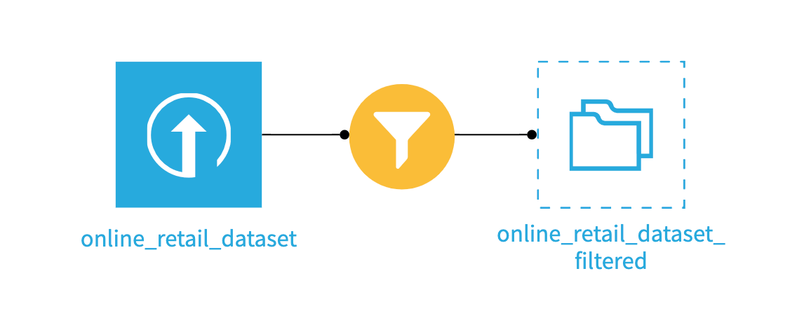
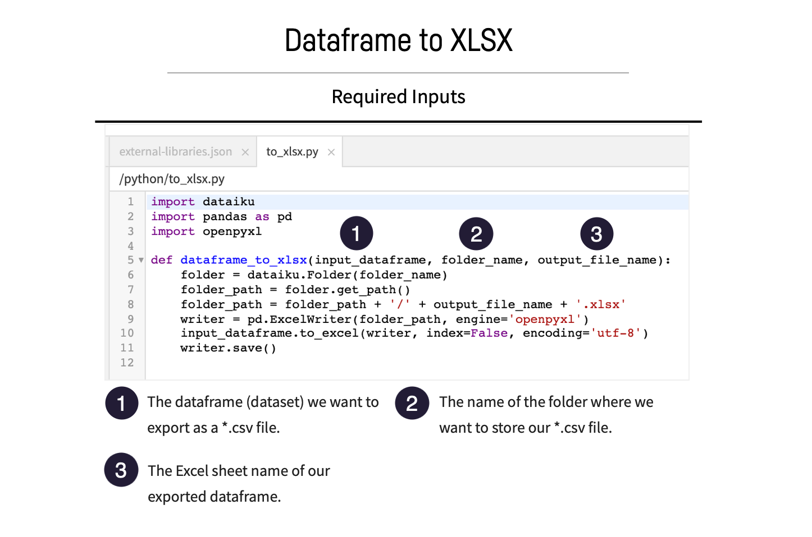
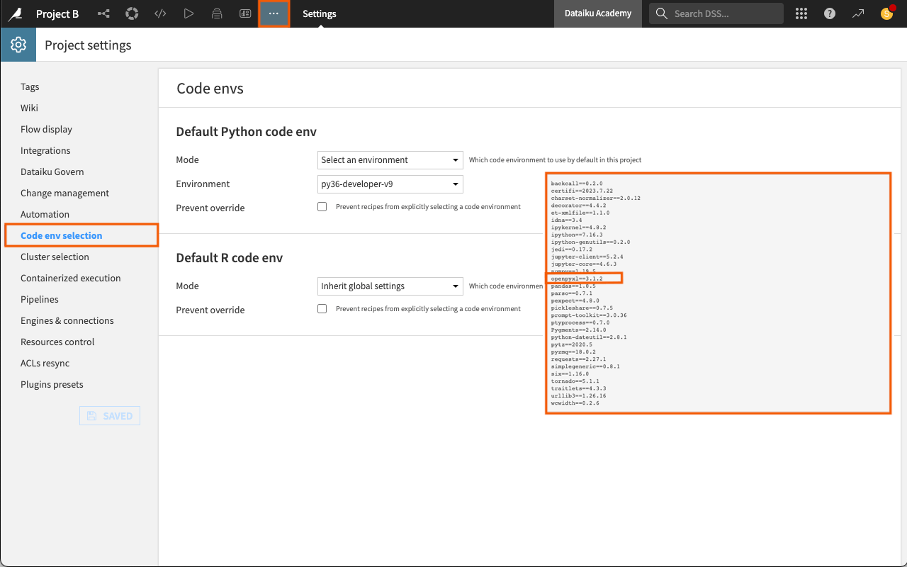

:orphan:

..
    This tutorial comes from the KB.
    It is hidden, and should be refactored BEFORE publishing.
    You should also uncomment the related link in the conf.py

Tutorial | Shared code
************************

.. meta:: 
	:description: Learn how to share a code library between projects on the same Dataiku instance.

Developers benefit from collective knowledge when they code with others developing projects on the same Dataiku instance. One of the most common ways to access and share frequently-used code in Dataiku is project libraries. When the code you need is available in a Git repository, you can import it into your project library and share that library with other projects for maximum reusability.

In this tutorial, we'll create a single project library that you can share among projects. 

Objectives
========================

In this tutorial, you will learn how to:

- Create a shareable project library.
- Add a file by importing it from a remote Git repository into a project's library.
- Import the project library into a second project.
- Make use of a shared code module.
  

Prerequisites
========================

To complete this tutorial, you'll need the following:

* A Dataiku instance (version 8 and above).
* A Python :doc:`environment <refdoc:code-envs/index>` that includes the package `openpyxl <https://openpyxl.readthedocs.io/en/stable/>`_.
  
  .. note::
	
	- The `14-Day Free Online Trial <https://www.dataiku.com/product/get-started/>`_ contains a code environment, *dash*, that includes everything you need to complete the courses in the `Developer learning path <https://academy.dataiku.com/path/developer>`_.
	- This tutorial was tested using a Python 3.9 code environment. Other Python versions may be compatible.

* A GitHub account with a public SSH key. This is needed so that you can download a Python file from the `Dataiku Academy Samples <https://github.com/dataiku/academy-samples>`_ repository using SSH.
  
  .. note::
	Visit `GitHub Docs <https://docs.github.com/en/get-started/signing-up-for-github/signing-up-for-a-new-github-account>`_ to find out how to sign up for a GitHub account. For more information about adding a public SSH key to your account, visit GitHub Docs: `Connecting to GitHub with SSH <https://docs.github.com/en/authentication/connecting-to-github-with-ssh>`_.

Create the starter projects
=============================

Let's first create the starter projects: Project A and Project B.

1. From the Dataiku homepage, click **+New Project > Learning projects > Developer > Project A**.
2. Click **+New Project > Learning projects > Developer > Project B**.

.. note::
	You can also download `Project A <https://cdn.downloads.dataiku.com/public/dss-samples/DKU_TUT_SHARECODE_A/>`_ and `Project B <https://downloads.dataiku.com/public/dss-samples/DKU_TUT_SHARECODE_B/>`_ from the downloads page and import them as zip files.

Here is the starting Flow for Project A.

.. image:: ./assets/project-a-starter.png
	:class: image-popup
	:alt: Screenshot of the Flow of Project A. 

.. note::
	The data quality issues in the *ecommerce_transactions* dataset will not impact the steps needed to complete this tutorial.

And the same for Project B.

Create a code library in Project A
======================================

In this section, we'll add a ``Pandas Dataframe to Excel`` function to our shared code library in Project A by cloning a library from a remote Git repository. To find out more, visit :doc:`Working with Git <refdoc:collaboration/git>`.

.. include:: /_shared/project-lib-note.txt

Access the remote Git repo
------------------------------

The first step is to access the remote Git repo and copy the SSH URL. We'll need this URL to import the Python file from the remote repo into our project library.

.. note::
	When importing from Git, use SSH for a secure connection. Visit `GitHub reference documentation <https://docs.github.com/en/authentication/connecting-to-github-with-ssh/generating-a-new-ssh-key-and-adding-it-to-the-ssh-agent>`_ to find out more about using SSH with GitHub. Visit :doc:`Working with Git <refdoc:collaboration/git>` for more information about working with Git in your Dataiku project. 

1. Sign in to your GitHub account, then go to the `Dataiku Academy samples repository <https://github.com/dataiku/academy-samples>`_.
2. Click **Code**, then copy the SSH URL to the clipboard. If you do not have SSH configured, you can copy the HTTPS URL instead.

We'll use this URL in the next section.

Import the file from Git
----------------------------

Let's import the remote Git repository into the library for Project A.

1. Open Project A.
2. In the top navigation bar, click **Libraries** in the **Code** dropdown menu or use the keyboard shortcut ``G+L``. 
3. In the left panel, click **Git** > **Import from Git**.
4. Paste the SSH URL of the Git repository you copied (``git@github.com:dataiku/academy-samples.git``). Alternatively, paste the HTTPS URL ( ``https://github.com/dataiku/academy-samples.git``).
5. In **Checkout**, click the **retrieve** icon to retrieve the branches, then choose the **main** branch. This branch contains the content we want to import.
   
   .. note:: 
	If you encounter an error when trying to retrieve the branches, try using the HTTPS URL. 
  
6. Enter ``shared-code`` as the **Path in repository**. We only want to import a part of the repository--the *shared-code* directory.
7. Enter the ``/python/`` **Target path**. This tells Dataiku to import the repository into the Python folder in our project library. If left blank, Dataiku will replace the entire Python library in the project, removing any existing files and code. Note that the syntax starts and ends with ``/``.
   
   .. image:: ./assets/import-from-git-dialogue.png
		:class: image-popup
		:alt: Screenshot of the Git import dialogue.

8. Click **Save and Retrieve** to fetch the repository.

Dataiku displays a success message letting you know the Git reference update was successful. Our Python library now contains the file, *to_xlsx.py*.

This Python file contains a ``Pandas Dataframe to Excel`` function that is now available to use in code capacities within Dataiku, including recipes and notebooks. 

About the pandas dataframe to xlsx function
-----------------------------------------------

The ``Pandas Dataframe to Excel`` function writes a specified DataFrame to an XLSX file and stores it in an output folder in the Flow.

It requires three inputs: 

Later, we'll provide these inputs via a Python recipe.

.. note::
	The DataFrame to Excel function demonstrates the use of shared code. However, you do not have to import a function to export a dataset as an Excel file in Dataiku. You can use the built-in export function when working with a dataset. 

Turn the project library into a shared code library
=======================================================

How could other teams on the same Dataiku instance use the code from Project A in their projects? They can import the code library from another project on the same Dataiku instance into their projects.

In this section, we'll:

- Turn the code library from Project A into a shared library by importing it into Project B.
- Use the dataframe to XLSX function in a Python recipe to export a dataset as a XLSX file.

To import the code library from one project to another, you'll need to add the parent project's key (each project in Dataiku has a unique project key) to the *external-libraries.json* file of the child project.

Let's add the project key of Project A to the *external-libraries.json* file in Project B. 

To do this:

1. Open Project A.
2. Copy the project key from the URL. You can find the project key in the URL of the project.
   
   .. image:: ./assets/project-key.png
	:alt: Find a project key in the URL.
	:class: image-popup

3. Open Project B and go to the library editor.
4. Open the **external-libraries.json** file.
5. Add the project key you just copied to the ``import Libraries From Projects`` list, putting the project key in quotes and wrapping it in square brackets.
   
   .. image:: ./assets/project-b-key-pasted.png
	:alt: Screenshot of the project key pasted into the JSON file.
	:class: image-popup
   
6. Click **Save All**.
 

The project library from Project A is now imported into Project B.

Set the code environment
=============================

To ensure our code runs successfully, we'll need to designate a code environment for Project B--one that has the package *openpyxl*. The function we are importing from Project A requires this package.

1. From the **More options** menu in the top navigation bar, select **Settings > Code env selection**.
2. Change the default Python code env by setting the **Mode** to *Select an environment* and selecting a designated **Environment**.
3. Click **Save**.

Build the Flow
==================
 
The dataset, *online_retail_dataset_filtered* is not yet built. This is the DataFrame we want to export as a XLSX file using the ``Dataframe to XLSX`` function. We'll need to make sure this dataset is built in our Flow.

1. Go to the **Flow**.
2. Click **Flow Actions** from the bottom-right corner of your window.
3. Select **Build all** and keep the default selection for handling dependencies.
4. Click **Build**.
5. Wait for the build to finish, and then refresh the page to see the built Flow.

Create a Python recipe and a managed folder
===============================================

Let's create our Python recipe where we'll use the function DataFrame to XLSX. Recall that our function uses a folder named *output_test*. 

We'll make this managed folder when we create the recipe.

Create the recipe
------------------

1. From the Flow of Project B, open the **Filter** recipe and **Run** it to build the dataset, *online_retail_dataset_filtered*.
2. Still from the **Flow** of Project B, select the **online_retail_dataset_filtered** dataset.
3. From the **Actions** tab, in the right panel, select **Python recipe** under the **Code recipes** section.
   
   .. image:: ./assets/python-recipe-create.png
	:class: image-popup
	:alt: Add a Python recipe to the Flow.

4. In the **New python recipe** window, set the **Input** to *online_retail_dataset_filtered*.
5. Set the **Output** as follows:
   
   - Click **+ Add**.
   - Click **New Folder** to add a folder instead of a dataset and name it ``output_test``.
   - Create the folder, and store it into the filesystem folders.

     .. image:: ./assets/project-b-create-python-recipe.png
		:class: image-popup
		:alt: Screenshot of the Python recipe configuration.

6. Click **Create Recipe**.

Configure the recipe
---------------------
Now that we have created the recipe, let's configure and run it.

1. Delete the sample code and replace it with the following code that provides the Dataframe to XLSX function with the required inputs.
   
.. code-block:: python
 
 # -------------------------------------------------------------------------------- NOTEBOOK-CELL: CODE
 import dataiku
 from dataiku import pandasutils as pdu
 import pandas as pd
 from to_xlsx import dataframe_to_xlsx
 
 # -------------------------------------------------------------------------------- NOTEBOOK-CELL: CODE
 # Example: load a Dataiku dataset as a Pandas dataframe
 transactions_filtered = dataiku.Dataset("online_retail_dataset_filtered")
 transactions_filtered_df = transactions_filtered.get_dataframe()
 
 # -------------------------------------------------------------------------------- NOTEBOOK-CELL: CODE
 #dataframe_to_xlsx(input dataframe, folder where output file will be written, name of the output file)
 dataframe_to_xlsx(transactions_filtered_df,'output_test', 'Transactions')

.. note:: 
	In this notebook:
	
	- The first cell tells Dataiku to import the function, *dataframe_to_xlsx* from the Python file, *to_xlsx* (which exists in the code library in Project A).
	- The second cell tells Dataiku which DataFrame we want to convert to output as a XLSX file--*online_retail_dataset_filtered*.
	- The third cell references the managed folder where we want to store our XLSX file and the Excel sheet name.

2. **Save** and **Run** the recipe.
3. When the job is over, return to the **Flow**. The *output_test* managed folder now contains *Transactions.xlsx*.

.. important::
 When we share libraries between projects and deploy our project to the Automation node, we must also deploy the parent project so that the project library is available.

What's next?
=================

Now that you have two projects sharing the same project library, you can try adding a shared notebook by importing it from Git. To do this, you could:

1. Create a notebook from the Python recipe in Project B.
2. Export the notebook to your own GitHub repo.
 
Experiment with the different ways you can import the notebook into your project's library - using both SSH and HTTPS URLs. If you want to save local modifications back into the remote repository, you can experiment with manually pushing your changes to the referenced Git repo.

Visit the Dataiku reference documentation, :doc:`Importing Jupyter Notebooks from Git <refdoc:collaboration/import-notebooks-from-git>`  to learn more.

