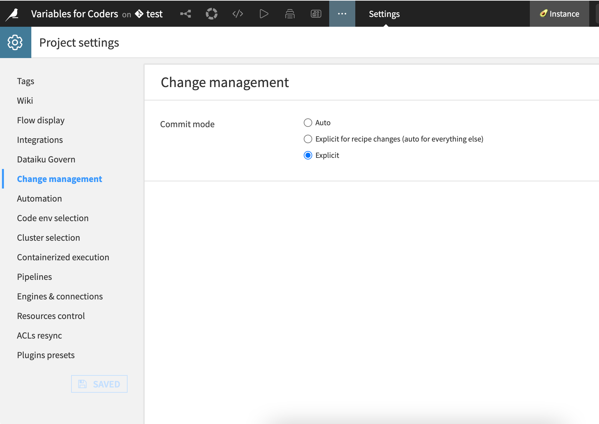

Using the API to interact with git for project versioning
***********************************************************

Prerequisites
##############
* Dataiku >= 12.4.2
* Access to a Dataiku instance with a personal API Key
* Access to an existing project with the following permissions:
    * "Read project content"
    * "Write project content"
* Access to an external git repository with necessary authentication

Introduction
#############

The git integration allows you to perform versioning in Dataiku directly in your IDE using the API client. This tutorial presents a day-to-day use case using git and project variables. 

You will use the `Variable for Coders starter project <https://cdn.downloads.dataiku.com/public/dss-samples/DKU_TUT_VARCOD/>`_ as a starting template. Its associated `tutorial <https://knowledge.dataiku.com/latest/mlops-o16n/variables/tutorial-code-recipes-dataiku-applications.html>`_ provides a set of steps implemented via the UI. This complementary tutorial shows the feasibility of using only code from outside Dataiku to interact with the platform.

.. note::

    All steps in this tutorial that require code and API usage can be performed within Dataiku using one of the hosted notebooks. For clarity and clarification, most of the steps and code will assume you are interacting with the platform from an external IDE.

Connecting to the instance
###########################

A tutorial on connecting to the instance is already available :ref:`here<connecting-dataiku-instance>` but to quickly start, here is the code:

.. dropdown:: Refresher - connecting to the instance
    :open:

    .. literalinclude:: ./assets/git_commit_push.py
        :language: py
        :lines: 1-12
    

Managing the repository
########################

The first step is to interact with the project via a handle.

.. literalinclude:: ./assets/git_commit_push.py
    :language: py
    :lines: 14-16

Next, manage the project git to target the remote repository. Please note that you will use the SSH address instead of the URL to connect.

.. literalinclude:: ./assets/git_commit_push.py
    :language: py
    :lines: 18-25

If the project is already associated with a remote repository, you can show its address using the :meth:`~dataikuapi.dss.project.DSSProjectGit.get_remote` method.

.. literalinclude:: ./assets/git_commit_push.py
    :language: py
    :lines: 27-29

You have now created your working branch, on which changes will be tracked. 
If they exist, :meth:`~dataikuapi.dss.project.DSSProjectGit.list_branches` allows you to check the other branches of the repository.

Making unit changes to and using code
#####################################

Add project variables
=====================

Next, you'll replicate the `steps of this section <https://knowledge.dataiku.com/latest/mlops-o16n/variables/tutorial-code-recipes-dataiku-applications.html#define-project-variables>`_ of the original tutorial.

.. literalinclude:: ./assets/git_commit_push.py
    :language: py
    :lines: 31-34

Update the project variables using the :meth:`~dataikuapi.dss.project.DSSProject.update_variables` method.
It takes a dictionary of variable names and their new values.
The code adds two variables: ``country_name`` and ``merchant_url``.
You can retrieve these stored variables using the :meth:`~dataikuapi.dss.project.DSSProject.get_variables` method.

Edit code recipe
================

Now, you'll implement `the next part of the other tutorial <https://knowledge.dataiku.com/latest/mlops-o16n/variables/tutorial-code-recipes-dataiku-applications.html#use-variables-in-a-code-recipe>`_, editing the recipe to incorporate these variables.
These new lines will switch the hardcoded ``United States`` with the ``country_name`` variable.

.. literalinclude:: ./assets/recipe_mod.py
    :language: py
    :lines: 15-16

The recipe that needs editing is called ``compute_dy9hOjP1``. To access the project's recipes from an IDE, you could use the 
:ref:`Dataiku VSCode extension<setting-up-the-vscode-extension>` or a :ref:`Code Studio instance<editing-recipe-with-code-studio>` to get a VSCode-like experience. You can also update the recipe from the Dataiku UI, for example, using a Jupyter notebook.

.. tabs::
    .. group-tab:: Dataiku VSCode extension

        .. image:: assets/editrecipe_IDE.png
         :alt: Fig. 1: Dataiku VSCode extension

    .. group-tab:: Code Studio

        .. image:: assets/editrecipe_CSio.png
         :alt: Fig. 2: Code Studio instance

Publishing changes
###################

Once the changes are made, you can get the branch's status, make commits and push these changes.

.. literalinclude:: ./assets/git_commit_push.py
    :language: py
    :lines: 37-39
    
.. note:: 

    Dataiku enables auto-commit as the **default** commit-tracking behavior.
    Hence, if you've made changes via the UI, you only have to :meth:`~dataikuapi.dss.project.DSSProjectGit.push` at the end.
    If you wish to make your commits manually, you can switch to **Explicit** mode under **Settings > Change Management > Commit mode**.

The :meth:`~dataikuapi.dss.project.DSSProjectGit.commit` function already includes ``git add``,
so files marked as *untracked* in :meth:`~dataikuapi.dss.project.DSSProjectGit.get_status` are always included in the commit.

Adapting to organizational processes
####################################

Git in workflows
================

Various organizations have unique ways of working with projects in Dataiku and with git. Some might require version control systems to track changes, while others might need approval processes before changes are implemented. These git-related APIs can help accommodate your ways of working within the platform to meet these needs.

When changes are made to a project and pushed to a remote repository, you can retrieve the new branches and the content of your working branch using:

.. literalinclude:: ./assets/git_commit_push.py
    :language: py
    :lines: 42-43

Implement a review process
==========================
Once branch development finishes, you might need to use standard review processes to validate the changes. Often, this involves having changes reviewed and approved by others. Using these APIs, you can use your IDE to connect to your instance and make unit changes in projects to code and code-like assets. Minor changes can often be easier to review and approve.

Wrapping up
############

This is an example of a version control workflow using the project git APIs. It demonstrates the first step towards programmatically interacting with and modifying Dataiku projects, enabling further automation and scaling.

Complete code
=============
.. _tutorial_devtools_projectgit_complete_gitapi_code:
.. dropdown:: Code 1: Complete API client code

    .. literalinclude:: ./assets/git_commit_push.py
        :language: py

.. _tutorial_devtools_projectgit_complete_recipe_code:
.. dropdown:: Code 2: Complete recipe code

    .. literalinclude:: ./assets/recipe_mod.py
        :language: python

Reference documentation
========================

.. autosummary:: 
    dataikuapi.dss.project.DSSProjectGit
    dataikuapi.dss.project.DSSProject

