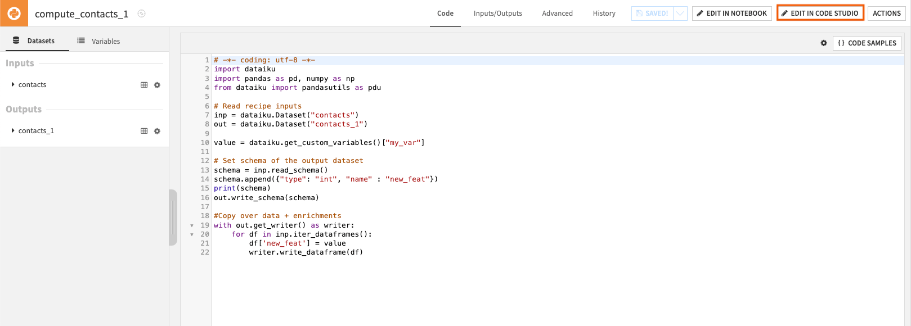
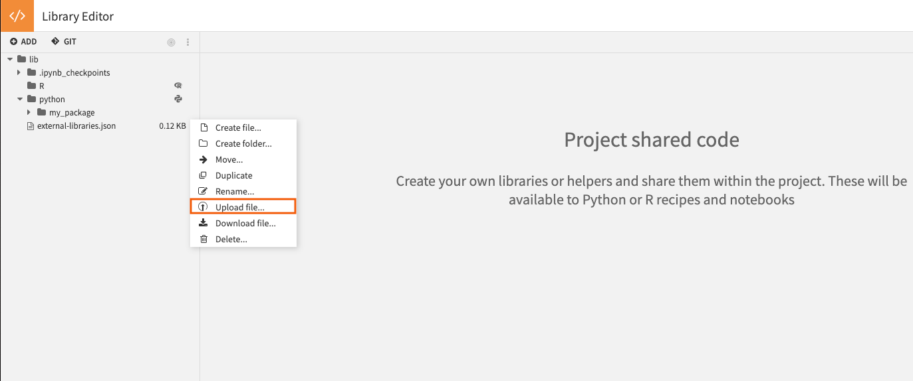
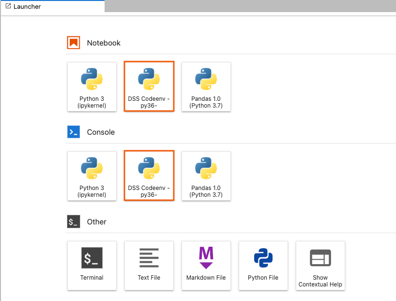

# Using JupyterLab in Code Studios 

This article covers the main features of JupyterLab in Code Studios.
You can follow [this tutorial](https://knowledge.dataiku.com/latest/code/work-environment/tutorial-first-code-studio.html) if you have never set up Code Studio.


## What can you edit with Code Studio and the Jupyterlab block?

VSCode for Dataiku Code Studio enables you to edit the following items:

| Item | Editable ? |
| :---- | :-----------: |
| Code recipes | ✅ |
| Project libraries | ✅ |
| Plugins | ❌  |
| Notebooks | ✅  |
| Webapps (standard) | ❌ |
| Webapps (Bokeh) | ❌ |
| Webapps (Shiny) | ❌ |
| Webapps (Dash) | ❌ |
| Webapps (Streamlit) | ✅ |
| Webapps (Gradio) |❌  |
| Webapps (Voila) | ✅ |
| Wiki | ❌ |

## Prerequisites

To use JupyterLab in Code Studios, you need a Dataiku 11+ instance with:

* A working Code Studio instance with a JupyterLab block, a configured Kubernetes cluster,
  and an instance set up for Elastic AI computation created by an admin user. 
  For details, visit [JupyterLab in Code Studios](https://doc.dataiku.com/dss/latest/code-studios/code-studio-ides/jupyterlab.html).

## Edit a Dataiku recipe

JupyterLab in Code Studios allows you to edit your code recipe created in the **Flow** quickly and dynamically.

1. From the **Flow**, open the code recipe you wish to edit. 
2. On the top-right corner, click on **Edit in Code Studio** and select your Code Studio instance.

{.image-popup}

You can also access your recipe directly from JupyterLab in Code Studios:
1. From the left panel, navigate to the **recipes** folder.
2. Click the recipe you want to edit to open it as a Python file in the center panel.

```{note}
You can execute your code in a Code Studio. However, to create a new recipe or build the output, you still have to do it from the **Flow**.
```

## Debug a Dataiku recipe

You can use JupyterLab debugging tools on a code recipe in a Code Studio, just as you would on local JupyterLab.

### Debugger tool 

Several magic commands trigger a debugger to allow traceback when raising an exception.

To name a few, you can use: 
* ``%debug``
* ``%pdb``

### Debugging extension

JupyterLab also supports some debugging extensions. One of them is the *``jupyterlab/debugger``* extension. To install it:

1. Enter the command line ``jupyter labextension install @jupyterlab/debugger`` in a terminal.
2. Access the debugger in the left panel.

## Manage a Jupyter Notebook

### Edit a notebook

Editing a notebook in a Code Studio is the same process as editing a recipe. To do so: 

1. Go to the Notebook page (``G+N``) and select a notebook to edit.
2. In the top right corner, click **Edit in Code Studio**.

Alternatively, you can edit your notebook from your Code Studio instance. To do so:
1. From the left panel, navigate to the **notebook** folder.
2. Select the notebook you want to open. 

### Create and retrieve a notebook

Unlike the recipe, you can create a new notebook directly from a Code Studio:
1. Click **File > New > Notebook** and select the type of notebook you want to create. 
2. Click **Sync files with DSS** to save it to Dataiku.
3. Go to the Notebook page (``G+N``) to access your new notebook.


## Code environment from scratch

### Import and install your code environment 

Code Studios can be seen as a place of experimentation where you can try out a different environment to test which package best suits your code.

In JupyterLab, there are different ways to install various packages. 

You can do it in a Jupyter Notebook (or a Python console):

1. In the top tools bar, click on **File > New > Notebook**.
2. In the first cell, install the wanted package with a package manager such as ``pip`` with the command: 

    ``` 
    !pip install <package>    
    ```
```{caution}
Note that the installed packages are not persistent when the Code Studio instance is restarted.
``` 

You can also do it in a terminal: 

1. In the top tools bar, click on **File > New > Terminal**.
2. In the command line, enter ``pip install <package>``


If you already have your code environment with plenty of packages ready to be used, it is possible to install them quickly.
To do so:

1. In the **Libraries** menu (``G+L``), in the left panel, navigate to the *python/my_package* folder and click on the **More options** icon.
2. Click on **Upload file...**.

    {.image-popup}

3. Drag your *requirements.txt* file in the dedicated area and click **Upload** to confirm.
4. Click on the Code page **</>** in the top navigation bar and return to your Code Studio instance.
5. In the terminal, enter the command line ``pip install -r workspace/project-lib-versioned/python/my_package/requirements.txt``

```{note}
Note that the **project-lib-versioned** folder stores the different libraries in a Code Studio. It refers to the **lib** folder in the **Libraries** menu.
```

Alternatively, you can also install these libraries through a notebook or a console. 

```{caution}
Mind where you create the notebook or the console in the directory, as the Path to the *requirements.txt* file may change according to it. 
Note that you don't have this issue with a terminal. 
``` 

### Export your code environment 

Once your tests are appealing, exporting the new code environment from your Code Studio is possible. To do so:

1. In the top tools bar, click on **File > New > Terminal**.
2. Enter the command line ``pip freeze > workspace/project-lib-versioned/python/my_package/new_requirements.txt`` 
3. On the top-right corner, click on **Sync files with DSS** to save the change and retrieve your code environment file in the **Libraries** menu. 

## Provided code environment from a template

### Exploration of the code environment

If the Code Studio instance has been installed with a template providing a code environment block, you should be able to explore it. To do so:

1. From the **Launcher** page of JupyterLab, under **Notebook**, click on the code environment provided to open a notebook. You can also open a Python console just below.

    {.image-popup}

2. In the first cell of the notebook, enter the magic command ``%pip list`` to list all the installed packages. 

### Edit the provided code environment

From the notebook or the console of the code environment provided, you can update the code env. To do so:

1. Enter ``%pip install <package>`` in the code cell and run it.
2. You can check that the result of ``%pip list`` has been changed, including the newly installed package.

```{caution}
For this to persist in the instance, several other steps are required on the admin side.
``` 

## Using Code Studio to edit code in a Git reference

If you have imported code from Git in Libraries, you will be able to edit this code within a Code Studio. You can commit the changes made in a Code Studio to the Git reference:

1. Edit the files in **project-lib-versioned** your Code Studio instance and click **Sync files with DSS**.
2. Go back to Dataiku Project Libraries, click **Commit and push all…**.

## Wrapping up

Congratulations, you should now have a functional setup to leverage JupyterLab in Code Studios to edit your code in Dataiku as if you were working with your local JupyterLab!
