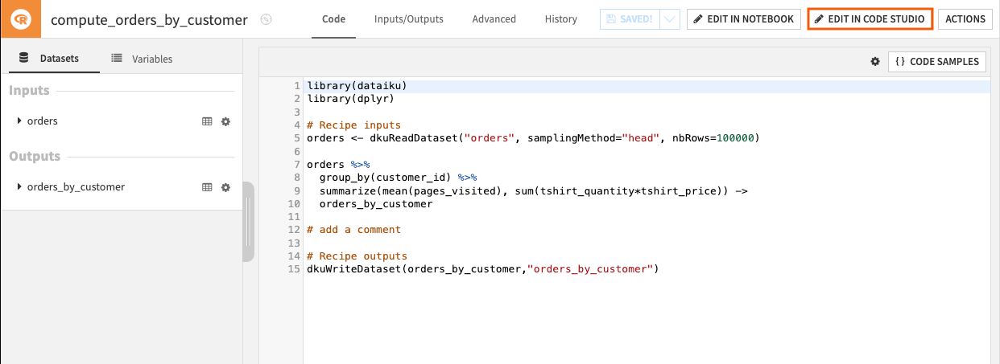
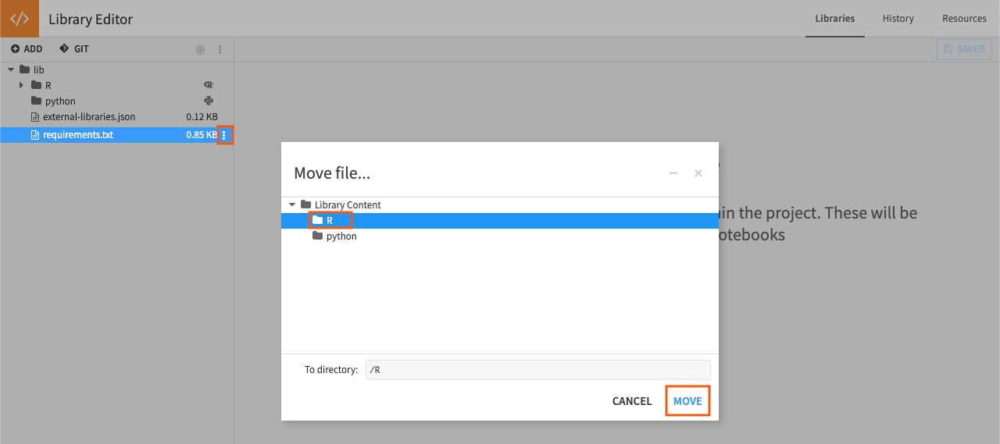

# Using RStudio in Code Studios

This article covers the main features of RStudio in Code Studios.
You can follow [this tutorial](https://knowledge.dataiku.com/latest/code/work-environment/tutorial-first-code-studio.html) if you have never set up Code Studio.


## Prerequisites

To use RStudio in Code Studios, you need a Dataiku 11+ instance with:

* A working Code Studio instance with an RStudio block, a configured Kubernetes cluster, and an Elastic AI computation instance set up by an admin user.
  For details, visit [RStudio Server in Code Studios](https://doc.dataiku.com/dss/latest/code-studios/code-studio-ides/rstudio.html).

## Edit a Dataiku recipe

RStudio in Code Studios lets you edit your code recipe quickly and dynamically.

You can do it from the **Flow** by:
1. Clicking on the code recipe you wish to edit. 
2. Clicking on **Edit in Code Studio** on the top-right corner of the recipe page. 

{.image-popup} 

You can also access your recipe directly from RStudio in Code Studios:
1. From the Files panel, in the bottom-right, navigate **Home > workspace > recipes**
2. Click on the recipe you want to edit to open it in the Source Editor panel.

```{note}
You can execute your code in Code Studio. However, to create a new recipe or build the output, you still have to do it from the **Flow**.
```
The recipe can be debugged with the proper tools of RStudio. For example: 

* Setting a diagnosis by launching ``rlang::last_trace()`` in the Console panel. 
* Using a linting package such as *``lintr``* and call ``library(lintr)`` to detect typos.

## Explore and export your code environment 

Code Studios can be seen as a place of experimentation where you can try out a different environment to test which package best suits your code.
To get the details of your environment:

1. In the Source Editor panel, enter :
    ``` 
    # Get information about installed packages
    installed_packages <- installed.packages()

    # Extract the package names
    package_names <- rownames(installed_packages)

    # Save the package names to a text file
    writeLines(package_names, "project-lib-versioned/requirements.txt")
    ```
2. Run the code with **Ctrl + Enter** (or **Cmd + Enter** on Mac).
3. Click **Sync files with DSS** to save the change in your instance.
4. In the top navigation bar, navigate to the **Libraries** menu (``G+L``) to open your new file.
     ```{note}
    You can notice that the ``project-lib-versioned`` is the folder for managing your libraries, and it refers to the **lib** folder on this page.
    ```
5. Hover the `requirements.txt` file, click the **More options** icon, and **Move** it to the **R** folder.

{.image-popup} 

```{caution}
For security purposes, the **R** folder is invisible in the Code Studio instance when empty.
```
When the Code Studio is created according to the template, if a code environment block is provided, the new packages are in this text file alongside with default R packages. 

## Using Code Studio to edit code in a Git reference

If you have imported code from Git in Libraries, you will be able to edit this code within Code Studio. You can commit the changes made in Code Studio to the Git reference:

1. Edit the files in `project-lib-versioned` in Code Studio and click **Sync files with DSS**.
2. Go back to Dataiku Project Libraries, click **Commit and push all…**.

## Wrapping up

Congratulations, you should now have a functional setup to leverage RStudio in Code Studios to edit your code in Dataiku as if you were working with your local RStudio!