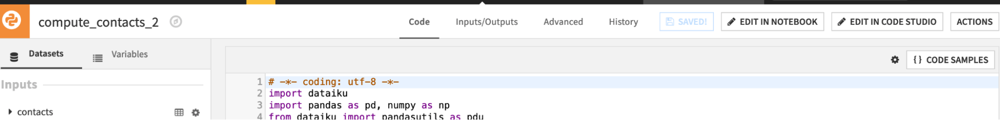
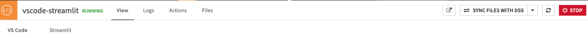
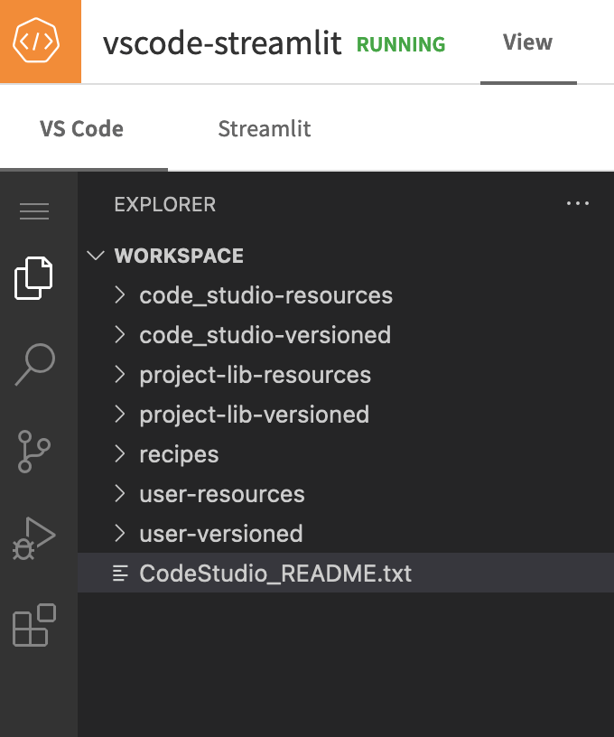
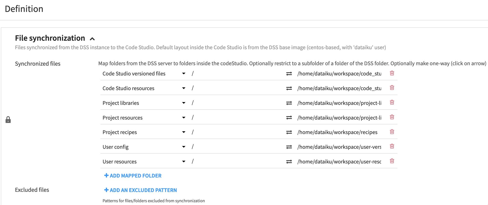
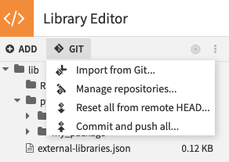
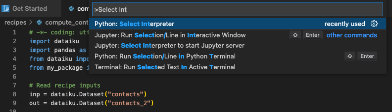

# Using VSCode for Code Studios

In this article, we will cover the main features and use cases of VSCode for Code Studio. If you have never set up Code Studio before, you can follow [this tutorial](https://knowledge.dataiku.com/latest/code/work-environment/tutorial-first-code-studio.html).

## What can you edit with Code Studio and the VSCode block?

VSCode for Dataiku Code Studio enables you to edit the following items

| Item | Editable ? |
| :---- | :-----------: |
| Code recipes | ✅ |
| Project libraries | ✅ |
| Plugins | ❌  |
| Notebooks | ✅  |
| Webapps (standard) | ❌ |
| Webapps (Bokeh) | ❌ |
| Webapps (Shiny) | ❌ |
| Webapps (Dash) | ✅ |
| Webapps (Streamlit) | ✅ |
| Webapps (Gradio) | ✅ |
| Webapps (Voila) | ✅ |
| Wiki | ❌ |

```{caution}
VSCode for Code Studio provides a richer edition environment but doesn’t act as a full replacement for the Dataiku web interface. Several important operations will still be done visually in your browser. For example, when you execute a code recipe from Code Studio, it doesn’t trigger a Dataiku job in your project.
```

```{note}
Developing a Dash application in VSCode for Code Studio requires more code than creating a Dataiku Web application. 
Specifically, you need to:
  - Declare the Dash application instance: ```app = Dash()``` (you can include additional parameters as needed).
  - Explicitly run the application using: ```app.run(debug=True, port=8282, threaded=True, processes=0)```.
  
Additionally, if you need to access ```dataiku.api_client()```, you must set up your Dataiku instance with the following declaration: ```dataiku.set_remote_dss("<YOUR DATAIKU URL>", "<YOUR_API_KEY>", no_check_certificate=True)```.
```

(using-vscode-for-code-studios-prerequisite)=
## Prerequisites

To use VScode for Code Studio, you need a Dataiku 11+ instance with:

* Administrator privileges for your user profile.
* A configured Kubernetes cluster, and an instance set up for Elastic AI computation.
* A Code Studio instance working with a VSCode block in a Dataiku project. For details, visit [Visual Studio Code in Code Studios](https://doc.dataiku.com/dss/latest/code-studios/code-studio-ides/vs-code.html).

This tutorial was written with Python 3.9, and the following package versions in a Dataiku Code Environment:

* ``black==22.8.0``
* ``pylint==2.13.9``

## Editing project libraries and recipes

(editing-recipe-with-code-studio)=
### Editing a code recipe with Code Studio

In a Dataiku project, you can start a Code Studio instance from a code recipe with the “Edit in Code Studio” button on the top right of each code recipe.

{.image-popup}

A pop-up will then ask you to select the Code Studio instance to use.


You can then edit the recipe as you would in VSCode and click “Sync files with DSS” to synchronize the file content on the Dataiku server.


As a reminder, a Code Studio runs in a Kubernetes pod, and changes are not persisted unless you click on “Sync files with DSS”.
For more information about how Code Studio works, you can check the [Technical Details](https://doc.dataiku.com/dss/latest/code-studios/concepts.html#technical-details) section of Dataiku’s reference documentation.

{.image-popup}

From a Code Studio instance, several directories are available, as you can see in the VSCode file explorer on the left.

{.image-popup}

A `CodeStudio_README.txt` file explains what those different directories are.
In addition,
you can find more information in the [Code Studio reference documentation](https://doc.dataiku.com/dss/latest/code-studios/code-studio-operations.html#editing-files-with-code-studio).
Let’s summarize the use cases for every directory available in a Code Studio.

| Directories | Versioned | Example | Default mounting location |
| --- | :---: | --- | --- |
| Code Studio versioned files<br/>**Scope**: Code Studio |      ✅    | Streamlit source code files | `code_studio-versioned` |
| Code Studio resources<br/>**Scope**: Code Studio       |      ❌    | Code Studio-specific images | `code_studio-resources` |
| Project libraries<br/>**Scope**: Project           |      ✅        | Project Libraries           | `project-lib-versioned` |
| Project resources<br/>**Scope**: Project           |      ❌        | Project-specific images     | `project-lib-resources` |
| Project recipes<br/>**Scope**: Project             |      ✅        | Project recipes             | `recipes` |
| User config<br/>**Scope**: User                 |      ✅           | IDE config files            | `user-versioned` |
| User resources<br/>**Scope**: User              |      ❌           | Plugins                     | `user-resources` |

Note that those directories are available by default, but a Code Studio administrator can configure them from a Code Studio template with the [File synchronization block](https://doc.dataiku.com/dss/latest/code-studios/code-studio-templates.html#file-synchronization).

{.image-popup}

### Editing a file in project libraries with Code Studio

If you create a file in Dataiku Project Libraries, you will then be able to edit it within a Code Studio instance in the `project-lib-versioned` directory and synchronize the changes by clicking “Sync Files with DSS”.

## Using Code Studio to edit code in a Git reference

If you have imported code from Git in Dataiku Project Libraries, you will be able to edit this code within Code Studio. Committing the changes made in Code Studio to the Git reference is a 2-step process:

* Edit the files in project-lib-versioned in Code Studio and click “Sync files with DSS”
* Go back to Dataiku Project Libraries and click “Commit and push all…”

{.image-popup}

## Code Formatting

Code formatting allows you to automatically adjust your code layout and make it more readable.
In this section,
you will see
how to use Python’s [`black`](https://black.readthedocs.io/en/stable/) formatter on your project libraries.

* Start by adding a Code Environment block to your Code Studio template. For more information, see [Preparing Code Studio Templates](https://doc.dataiku.com/dss/latest/code-studios/code-studio-templates.html).
* Next, ensure the `black` package is available in the selected Code Environment.
  You can use the Code Environment created in the [prerequisites](using-vscode-for-code-studios-prerequisite)
* Rebuild the Code Studio template.

Go to a Dataiku project in the Code Studio section and start an instance with the template you built.

* Open the [VSCode settings](https://code.visualstudio.com/docs/getstarted/settings) and search for the “Python > Formatting: Provider” section. In the dropdown list, select “black”.
* Still in the settings, go to the “Text Editor > Formatting” section, and under “Editor: Format on Save” tick the “Format a file on save” box.
* When you edit a file in VSCode make sure to select a Python Interpreter
  using the Code Environment with the `black` package installed earlier.
  You can select the Python Interpreter
  by clicking on the Python version on the bottom right of VSCode or by using the Command Palette
  with F1 and “> Select Interpreter”

{.image-popup}

From now on when editing Python files from VSCode (including code recipes and project libraries), your code layout will automatically be adjusted at every save.

## Linting

Linting is a process of analyzing source code and visually highlighting any syntax and style issues detected. In this section, we will set up the `pylint` linter for Python code and use it to analyze code quality.

* Make sure that the `pylint` package is available in the Dataiku Code Environment included in your Code Studio instance, or add it to the Code Environment and rebuild the Code Studio template using the same steps you followed in the Code Formatting section.
* Enable linting by following the instructions in the [VSCode documentation](https://code.visualstudio.com/docs/python/linting).

Open any Python file in Code Studio and run linting by opening the command palette and selecting “Python: Run Linting”. If the linter has identified code improvements, you should see a few highlighted parts in your source code: going to the “Problems” tab in the lower panel will provide you with a detailed list of the linter’s output.

## Defining Custom User Settings

By default, VSCode for Code Studio user settings are stored under the `user-versioned` directory. For example, if you change the color theme, it will be saved in `/home/dataiku/workspace/user-versioned/settings/code-server/User/settings.json`. If you click “Sync File with DSS” the VSCode `settings.json` file will be stored in your user profile and be applied across all your user code studio sessions. You can find all the files under the user-versioned directory in your Dataiku User Profile > My Files tab.

## Wrapping up

Congratulations, you should now have a functional setup to leverage VSCode for Code Studio to edit your code in Dataiku as if you were working with your local VSCode!
