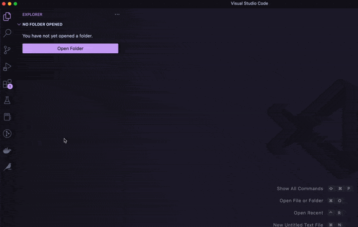
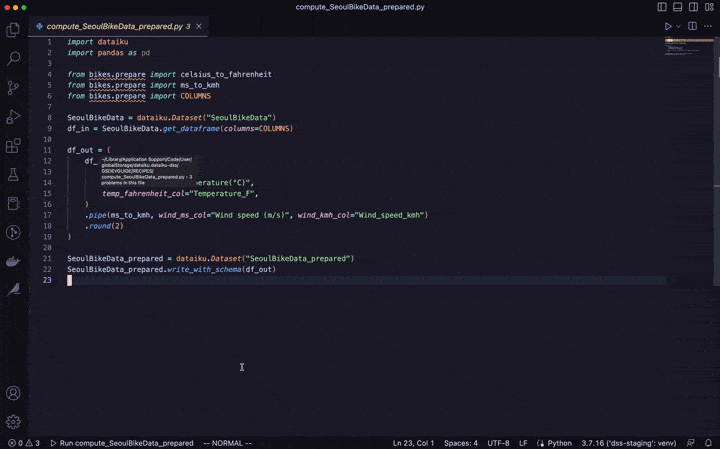
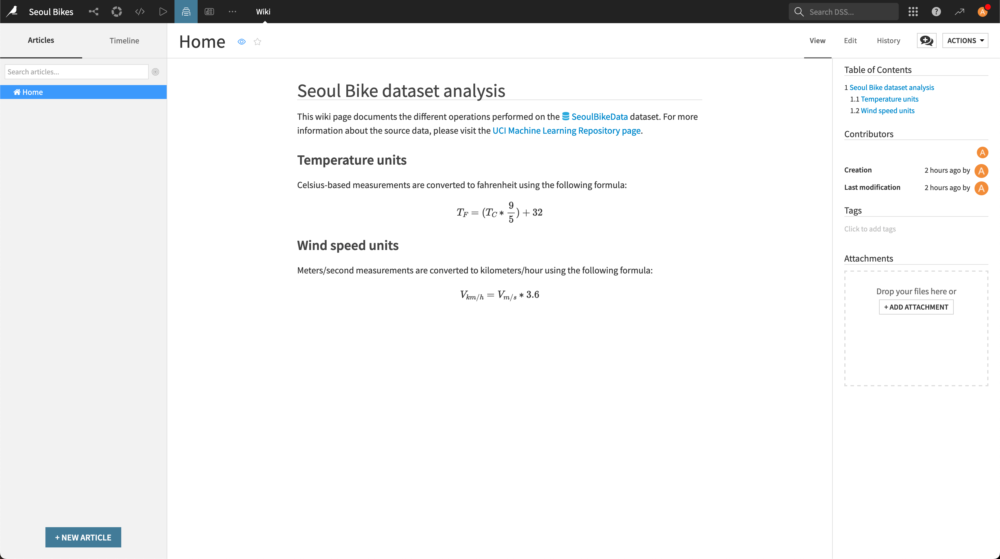

# VSCode extension for Dataiku

The VSCode extension for Dataiku enables you to connect to a Dataiku instance from your VSCode desktop environment and edit the following items:

| Item | Editable ? |
| :---- | -----------: |
| Code recipes | ✅ |
| Project libraries | ✅ |
| Plugins | ✅  |
| Notebooks | ❌  |
| Webapps (standard) | ✅ |
| Webapps (Bokeh) | ✅ |
| Webapps (Shiny) | ✅ |
| Webapps (Dash) | ❌ |
| Webapps (Streamlit) | ❌ |
| Webapps (Gradio) | ❌ |
| Webapps (Voila) | ❌ |
| Wiki | ✅ |


This tutorial will provide an overview of some of these capabilities through a simple example.

```{caution}

The Dataiku VSCode extension provides a richer edition environment, but doesn't act as a full replacement for the web interface. Several important operations will still be done visually in your browser.

```

## Prerequisites

* [VSCode](https://code.visualstudio.com/download) installed on your local computer

* A Dataiku API local environment set up. For detailed steps, see {doc}`this tutorial </tutorials/devtools/python-client/index>`

* "Write project content" permission on an existing Dataiku project

If you can't install the required components on your computer, we advise that you use {doc}`Code Studios <refdoc:code-studios/concepts>` instead.

(setting-up-the-vscode-extension)=
## Setting up the extension

Start by installing and configuring the VSCode extension by following the instructions listed on the [marketplace page](https://marketplace.visualstudio.com/items?itemName=dataiku.dataiku-dss). Once it's properly set up, you should see the Dataiku icon on VSCode's activity bar. After accessing the extension, you should also be able to see the list of projects which you have access to in VSCode's side bar. If you click on a given project you will be able to list its editable components.

{.image-popup}

## Pointing to your Dataiku API local environment

In order for VSCode to use the required dependencies, set up the Python interpreter to point to your Dataiku API local environment (see the [VSCode documentation](https://code.visualstudio.com/docs/python/environments#_manually-specify-an-interpreter)). Once this is done, your environment's name should appear at the right side of the status bar.

## Editing project libraries and recipes

The first item we will edit in VSCode is the project library.

In the Dataiku web interface, start by creating a dataset from the [Seoul bike sharing demand dataset](https://archive.ics.uci.edu/ml/datasets/Seoul+Bike+Sharing+Demand) available online and name it `SeoulBikeData`. In your newly-created dataset, to prevent character encoding issues, go to "Settings > Schema" and rename the following columns:

* `Temperature(°C)` -> `Temperature_C`
* `Dew point temperature(°C)` -> `Dew point temperature_C`

Then, switch to VSCode and in your project, create a new directory called `bikes` under `Libraries/python/`. Inside that directory, create the following files: 

* `__init__.py` and leave it empty
* `prepare.py` with the following code:

  ```python
  import pandas as pd

  COLUMNS = ["Date", "Hour", "Temperature_C", "Wind speed (m/s)"]

  def celsius_to_fahrenheit(df: pd.DataFrame,
                               temp_celsius_col: str,
                               temp_fahrenheit_col: str) -> pd.DataFrame:
      df[temp_fahrenheit_col] = (df[temp_celsius_col] * 1.8) + 32.0
      return df

  def ms_to_kmh(df: pd.DataFrame,
                wind_ms_col: str,
                wind_kmh_col: str) -> pd.DataFrame:
      df[wind_kmh_col] = df[wind_ms_col] * 3.6
      return df

  ```

Note that every time you save the file in VSCode, it is automatically synchronized to the Dataiku instance. 

Next, come back to the web interface and:

* create a Python recipe using `SeoulBikeData` as input and a new dataset called `SeoulBikeData_prepared` as output
* save the recipe
* go back to the Flow screen

If you switch to VSCode, you should see a new recipe called `compute_SeoulBikeData_prepared` in the side bar under your project's "Recipes" menu. Click on it to open its source code and edit it as follows:

```python
import dataiku
import pandas as pd

from bikes.prepare import celsius_to_fahrenheit
from bikes.prepare import ms_to_kmh
from bikes.prepare import COLUMNS

SeoulBikeData = dataiku.Dataset("SeoulBikeData")
df_in = SeoulBikeData.get_dataframe(columns=COLUMNS)

df_out = df_in \
    .pipe(celsius_to_fahrenheit,
          temp_celsius_col="Temperature_C",
          temp_fahrenheit_col="Temperature_F") \
    .pipe(ms_to_kmh,
          wind_ms_col="Wind speed (m/s)",
          wind_kmh_col="Wind_speed_kmh") \
    .round(2)

SeoulBikeData_prepared = dataiku.Dataset("SeoulBikeData_prepared")
SeoulBikeData_prepared.write_with_schema(df_out)

```

Don't forget to save your recipe's code! Same as for project libraries, it will synchronize it with the Dataiku instance. Your recipe is now ready to be run !

## Building datasets 

In order to build the `SeoulBikeData_prepared` dataset you have two options: either trigger it from the Dataiku web interface or from VSCode. Each case is further explained below.

### From the Dataiku web interface

This option is the simplest one: from the Flow screen, right-click on the `SeoulBikeData_prepared` dataset and choose "Build...", keep the default settings ("Not recursive") then click on "Build dataset". Once the dataset is built you can inspect its content by clicking on it.

{.image-popup}

### From VSCode

If you want to stay within the VSCode interface, an alternative is to click on the "Run this recipe in DSS" in the lower left part of the window. It should appear with the name of the recipe currently opened in your editor. 

Clicking this button will start a Dataiku Job to build the recipe's output dataset, and the activity logs will be streamed in the "Output" tab of VSCode.

{.image-popup}

## Editing wiki articles

The Dataiku VSCode extension also allows you to edit your project's wiki pages. To showcase a simple example, in VSCode's side bar under your project name, click on the "New wiki article" near the "Wikis" section and name your article "Home". This will generate a `Home.md` file that you will be able to edit from VSCode, the resulting page will be rendered in the Dataiku web interface. Populate your page with the following content:

:::markdown

# Seoul Bike dataset analysis

This wiki page documents the different operations performed on the dataset:SeoulBikeData dataset. For more information about the source data, please visit the [UCI Machine Learning Repository page](https://archive.ics.uci.edu/ml/datasets/Seoul+Bike+Sharing+Demand).

## Temperature units

Celsius-based measurements are converted to fahrenheit using the following formula:

$$
T_F = (T_C * \frac{9}{5}) + 32
$$

## Wind speed units

Meters/second measurements are converted to kilometers/hour using the following formula:

$$
V_{km/h} = V_{m/s} * 3.6
$$

:::

After saving your changes, right-click on "Wiki > Open in DSS" to switch to the Dataiku web interface: you should see the rendered version of your page in the "Wiki" section of the project. 
{.image-popup}

```{tip}

From VSCode you can also preview your Markdown file by clicking on the "Open Preview to the side" button located at the top right. While this works well for basic content, Dataiku's Markdown also introduces custom syntax elements (e.g.g links to Dataiku-specific objects, math formulas) that won't be rendered in VSCode's Preview screen. To get a full-rendered version of your wiki, you should always switch to the Dataiku web interface.

```

## Going further

Now that you have the basics of code edition, you can move on to more advanced tasks.

### Formatting

*Code formatting* allows you to automatically adjust your code layout and make it more readable. In this section you will see how to use Python's [`black`](https://black.readthedocs.io/en/stable/) formatter on your project libraries.

* Start by installing the [Python extension](https://marketplace.visualstudio.com/items?itemName=ms-python.python) provided by Microsoft. 

* Next, add the `black` package to your virtual environment. From the VSCode terminal, run:

  ```bash
  pip install black
  ```

* Open the [VSCode settings](https://code.visualstudio.com/docs/getstarted/settings) and search for the "Python > Formatting: Provider" section. In the dropdown list, select "black".

* Still in the settings, go to the "Text Editor > Formatting" section, and under "Editor: Format on Save" tick the "Format a file on save" box.

From now on, when editing Python files from VSCode (including code recipes and project libraries), your code layout will automatically be adjusted at every save. 

### Linting

Linting is a process to analyze source code and visually highlight any syntax and style issue detected. In this section you will set up the [`pylint`](https://pylint.readthedocs.io/en/latest/) linter for Python code and use it to improve the quality of your project libraries.

* Add the `pylint` package to your virtual environment. From the VSCode terminal, run:

  ```bash
  pip install pylint
  ```

* Enable linting by following the [instructions in the VSCode documentation](https://code.visualstudio.com/docs/python/linting).

* Go to the `prepare.py` file in your project library and run linting by opening the command palette and selecting "Python: Run Linting". You should see a few highlighted parts in your source code: going to the "Problems" tab in the lower panel will provide you with a detailed list of the linter's output.

* From there you can fix your code accordingly. Here is the modified code that is both formatted by `black` and compliant with the `pylint` linter: 

  ```python
  """prepare.py

  This file contains data preparation functions to process the Seoul Bike dataset.
  """

  import pandas as pd

  COLUMNS = ["Date", "Hour", "Temperature_C", "Wind speed (m/s)"]


  def celsius_to_fahrenheit(
      df_data: pd.DataFrame, temp_celsius_col: str, temp_fahrenheit_col: str
  ) -> pd.DataFrame:
      """Convert celsius to fahrenheit.

      Args:
          df_input (pd.DataFrame): the input DataFrame
          temp_celsius_col (str): the column name containing celsius temperatures
          temp_fahrenheit_col: the name for the generated column with fahrenheit tempetatures

      Returns:
          pd.DataFrame: the output DataFrame

      """
      df_data[temp_fahrenheit_col] = (df_data[temp_celsius_col] * 1.8) + 32.0
      return df_data


  def ms_to_kmh(
      df_data: pd.DataFrame, wind_ms_col: str, wind_kmh_col: str
  ) -> pd.DataFrame:
      """Convert meters per second into kilometers per hour.

      Args:
          df_input (pd.DataFrame): the input DataFrame
          wind_ms_col (str): the column name containing m/s wind speeds
          wind_kmh_col (str): the name for the generated column with km:h wind speeds

      Returns:
          pd.DataFrame: the output DataFrame

      """
      df_data[wind_kmh_col] = df_data[wind_ms_col] * 3.6
      return df_data
  ```

## Wrapping up

Congratulations, you now have a fully functional setup to leverage your VSCode editor alongside your Dataiku instance! To dive deeper into the Dataiku API, you can read the {doc}`dedicated page </api-reference/python/index>`.
