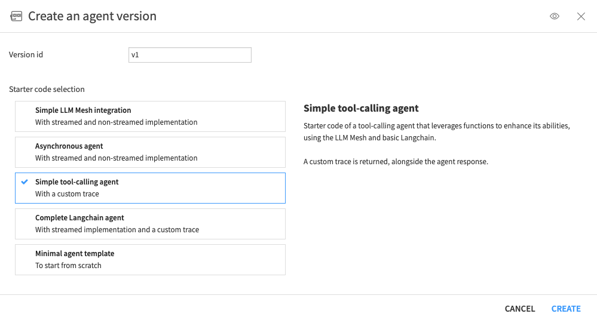
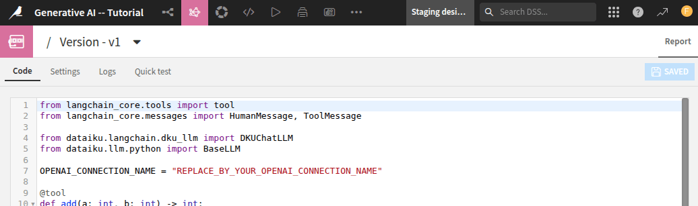

Creating and using a Code Agent
*******************************

.. meta::
  :description:
    This tutorial explains how to create and use a Code Agent.
    It covers the steps for coding the agent, creating tools, testing, and ultimately using it with code.

A :doc:`Code Agent <refdoc:agents/code-agents>` is software that interacts with its environment.
Agents can be built and deployed for different use cases.
Dataiku provides several default implementations.
This tutorial is focused on the *simple tool-calling* agent implementation.
The use case of this tutorial is the same as the one used in
:doc:`../llm-agentic/index`,  :doc:`../agent/index` and :doc:`/tutorials/plugins/custom-tools/generality/index`.
The use case involves retrieving customer information based on a provided ID
and fetching additional data about the customer's company utilizing an internet search.

Prerequisites
=============

- Dataiku >= 13.4
- An OpenAI connection
- Python >= 3.9
- A code environment with the following packages:

  .. code-block:: python

    langchain_core    # tested with 0.3.60
    langchain         # tested with 0.3.25
    duckduckgo_search # tested with 8.1.1

- An SQL Dataset named ``pro_customers_sql``.
  You can create this file by uploading this :download:`CSV file</tutorials/genai/agents-and-tools/agent/assets/pro_customers.csv>`.

Creating the Code Agent
=======================

To create a Code Agent, go to the project's **Flow**, click the **Add item** button at the top right,
select **Generative AI**, and click on **Code Agent**.
Alternatively, you can select the **Agents & GenAI Models** item in the **GenAI** menu,
click the **New Agent** button, and select the **Code Agent** option.
Choose a meaningful name for the agent, then click the **Ok** button.

.. _tutorials-genai-techniques-and-tools-code-agent-img-modal:

    Fig. 1: Modal window for Code Agent creation.

In the modal window shown in :ref:`Figure 1<tutorials-genai-techniques-and-tools-code-agent-img-modal>`,
choose the "Simple tool-calling agent" and click the **Create** button to enter a code environment, 
as shown in :ref:`Figure 2<tutorials-genai-techniques-and-tools-code-agent-img-code-agent>`.

.. _tutorials-genai-techniques-and-tools-code-agent-img-code-agent:

    Fig. 2: Code Agent -- Code environment.

This window contains four tabs:

* **Code**: where you will code your agent.
* **Settings**: where you will notably set up the code environment used by the agent.
* **Logs**: where you will find the agent's logs.
  These logs are enriched each time your agent is called using the LLM Mesh.
* **Quick test**: where you can test your code agent.

Coding the Agent
================
Before coding the agent, select the **Settings** tabs and set **Code env** to use your code environment,
which was created for the tutorial.
Then, return to the **Code** tabs and start coding your agent.
Dataiku provides a code sample to help you be more productive when creating a Code Agent.
Like :doc:`Visual Agent <refdoc:agents/visual-agents>`, Code Agent relies on tools to answer your queries.
There are three different ways to use a tool in a Code Agent:

* Embedded into the Code Agent.
* Using a function defined in the project library.
* Using Custom Tools.

Creating the tools
==================

.. attention::
    The SQL query might be written differently depending on your SQL Engine.

.. tabs::

  .. group-tab:: Embedded

    To create the tools (**Get Customer Info** and **Get Company Info**), replace the default code
    with the code provided in :ref:`Code 1<tutorials-genai-techniques-and-tools-code-agent-code-embedded>`.

    .. literalinclude:: ./assets/code-embedded.py
        :language: python
        :caption: Code 1: Embedded tools
        :name: tutorials-genai-techniques-and-tools-code-agent-code-embedded
    
    
        

  .. group-tab:: In project library

    Under the **</>** Menu, select the **Libraries** menu.
    Under the ``python`` folder, create a folder called ``tools``.
    In this folder, create a file ``tutorial.py`` and define the functions ``get_customer_info`` and ``get_company_info``
    as shown in :ref:`Code 1<tutorials-genai-techniques-and-tools-code-agents-code-tutorial-py>`.

    .. _tutorials-genai-techniques-and-tools-code-agent-image-library-editor:

    .. figure:: ./assets/library-editor.png
        :align: center
        :class: with-shadow image-popup
        :alt: Library editor

    If you want to use those functions in a Code Agent, you should replace the default code
    with :ref:`Code 2<tutorials-genai-techniques-and-tools-code-agents-code-code-library>`.
    Highlighted lines show where you have to pay attention compared to the Code Agent with embedded functions.

    .. literalinclude:: ./assets/tutorial.py
        :language: python
        :caption: Code 1: ``tutorial.py``
        :name: tutorials-genai-techniques-and-tools-code-agents-code-tutorial-py
    
    .. literalinclude:: ./assets/code-library.py
        :language: python
        :caption: Code 2: Using function in project library
        :name: tutorials-genai-techniques-and-tools-code-agents-code-code-library
        :emphasize-lines: 11-17,21-27,30,55-58
    
    

  .. group-tab:: Using Custom tools

    If you have defined :doc:`Custom Tools</tutorials/plugins/custom-tools/generality/index>`,
    you can use them in a Code Agent.
    Suppose you have two tools defined: **Get Customer Info** and **Get Company Info**,
    like those defined in the tutorial :doc:`/tutorials/plugins/custom-tools/generality/index`.
    You can directly use them in a Code Agent,
    as shown in :ref:`Code 1<tutorials-genai-techniques-and-tools-code-agents-code-code-custom>`.

    .. literalinclude:: ./assets/code-custom.py
        :language: python
        :caption: Code 1: Using Custom Tools
        :name: tutorials-genai-techniques-and-tools-code-agents-code-code-custom
        :emphasize-lines: 12-24
    

Testing the Code Agent
======================

No matter the way you define your Code Agent,
you can test it in the **Quick test** tabs by entering the following test query:

.. code-block:: json

  {
    "messages": [
        {
          "role": "user",
          "content": "Give all the professional information you can about the customer with ID: tcook. Also, include information about the company if you can."
        }
    ],
    "context": {}
  }

Using the tool with code
------------------------
After creating your agent, you can use it in any context where an LLM is applicable.
To list all agents that have been defined in a project,
you can use the :meth:`~dataikuapi.dss.project.DSSProject.list_llms()` and search for your agent.

.. code-block:: python

    import dataiku

    client = dataiku.api_client()
    project = client.get_default_project()

    llm_list = project.list_llms()
    for llm in llm_list:
        print(f"- {llm.description} (id: {llm.id})")

Running this code snippet will provide a list of all LLMs defined in the project.
You should see your agent in this list:

.. parsed-literal::

    - Agent - test guard (id: agent:2V8SR72P)
    - Agent - useCase4 (id: agent:44pVmkUi)
    - Agent - code (id: agent:4agXpWVO)
    - Agent - useCase5 (id: agent:GYrrlSns)
    - Agent - useCase1 (id: agent:IWX5i2Zh)
    - Agent - Visual (id: agent:Njgq8s9j)
    - Agent - Tutorial (id: agent:QRfIU99Z)

Once you know the agent's ID, you can use it to call the agent, as shown in the code below:

.. code-block:: python

    CODE_AGENT_ID = "agent:4agXpWVO"
    llm = project.get_llm(CODE_AGENT_ID)

    completion = llm.new_completion()
    completion.with_message('Give all the professional information you can about the customer with ID: fdouetteau. Also include information about the company if you can.')
    resp = completion.execute()
    resp.text

.. parsed-literal::

    "The customer's name is **Florian Douetteau**, holding the position of **CEO**
    at the company named **Dataiku**. \\n\\n### Company Information:\\n
    Dataiku is a global software company specializing in machine learning
    and artificial intelligence. Since its launch in 2013, Florian Douetteau,
    as the co-founder and CEO, has been dedicated to making data science accessible
    to everyone, helping businesses unlock the potential of artificial intelligence."

Wrapping up
===========

Congratulations! You now know how to create a Code Agent. 
To wrap things up, setting up and utilizing a Code Agent in Dataiku opens up opportunities to automate
and improve how we interact with Dataiku and data. 

You can test other functions, mix the different approaches, or create many other Code Agents that fit your needs.
