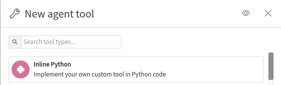

Creating an Inline Python Tool
*******************************

.. meta::
  :description: This tutorial guides you through creating an Inline Python Tool in Dataiku,
                which enables you to define and test Python code in an agent tool.
                Following this tutorial, you'll learn how to create, test,
                and call your Inline Python Tool in your Dataiku projects.

You can elaborate your code in an Inline Python Tool before creating your :doc:`Code Agent </tutorials/genai/agents-and-tools/code-agent/index>` or :doc:`Custom Tool </tutorials/plugins/custom-tools/generality/index>`.
An Inline Python Tool will allow you to keep a simple development workflow and inline your Python code.
The tool produced will be available in your project, and you will have straightforward steps to create a shared tool like a Custom Tool or a Code Agent.

Prerequisites
=============

- Dataiku >= 14.0
- An OpenAI connection (or an equivalent LLM Mesh connection)
- Python >= 3.10
- A code environment with the following packages:

  .. code-block:: python

    langchain_core    #tested with 0.3.60
    langchain         #tested with 0.3.25
    duckduckgo_search #tested with 8.0.2

- An SQL Dataset named ``pro_customers_sql``.
  You can create this dataset by uploading this :download:`CSV file</tutorials/genai/agents-and-tools/agent/assets/pro_customers.csv>` and using a Sync recipe to store the data in an SQL connection.

Creating the Inline Python Tool
===============================

To create an Inline Python Tool, go to the **GenAI** menu, select **Agent Tools**, and click the **New Agent Tool** button.
Then select **Inline Python**, give it a meaningful name, such as **Get Company Info**, and click the **Create** button.

The window you reach contains three tabs:

* **Design**: where you will code your tool and test your Inline Python Tool.
* **Settings**: where you will notably set up the code environment the tool uses.
* **History**: where you can see the history of the tool.

Coding the Tool
================

.. note::
    The code used in this tutorial is the same as the one used to define the first tool in the :ref:`Custom Tool tutorial<custom_tool_dataset_lookup_tool_link>`.
    When creating your Inline Python Tool, you are building the code that may be used in other tools and agents.

In the **Design** tab, you can write the code of your specific tool.
You can start from one of the templates available by clicking the **Use code template** button.
For this tutorial, we will code a tool to **Get Customer Info**.
Replace the default code with the code provided in :ref:`Code 1<tutorials-genai-inline-python-tool-get-customer-info>`.

.. literalinclude:: ./assets/code-embedded.py
    :language: python
    :caption: Code 1: Get Customer Info tool
    :name: tutorials-genai-inline-python-tool-get-customer-info

Testing the Code Agent
======================

Once you have your code, you can test it by entering the following test query:

.. code-block:: json

    {
       "input": {
          "id": "tcook"
       },
       "context": {}
    }

Call your Inline Python Tool from your application
==================================================

After creating your agent, you can utilize it in any context where an LLM is applicable.
It is a process in two steps:

First, you need to get the identifier of your Inline Python Tool.
To list all Inline Python Tools that have been defined in a project,
you can use the :meth:`~dataikuapi.dss.project.DSSProject.list_agent_tools()` and search for your tool.

.. literalinclude:: ./assets/identify.py
    :language: python
    :caption: Code 2: Get your Inline Python Tool identifier
    :name: tutorials-genai-inline-python-tool-get-tool-id

Running this code snippet will provide a list of all tools defined in the project.
You should see your tool in this list:

.. parsed-literal::
    [{'id': 'xg3bQfN',
        'type': 'InlinePython',
        'name': 'inline-tool'},
    {'id': 'REDaiQN',
        'type': 'Custom_agent_tool_toolbox_internet-search',
        'name': 'Get Company Info'},
    {'id': 'SOy7zKq',
        'type': 'Custom_agent_tool_toolbox_dataset-lookup',
        'name': 'Get Customer Info'}]

Once you know the tool's ID, you can use it to call the tool, as shown in the code below:

.. literalinclude:: ./assets/call-tool.py
    :language: python
    :caption: Code 3: Call your Inline Python Tool
    :name: tutorials-genai-inline-python-tool-call-tool

.. parsed-literal::

    The customer's name is "Florian Douetteau", holding the position "CEO" at the company named "Dataiku".

Using this type of code, you can call any of your Inline Python Tools at the right place in your application's code.

Call a Headless API from an Inline Python Tool
==============================================

After following the :doc:`Headless API tutorial</tutorials/webapps/common/api-llm/index>`,
you will have an application that can query an LLM from an API.
An Inline Python Tool can use a headless API webapp to implement a query.

As we did for the first tool, to create a new Inline Python Tool, go to the **GenAI** menu, select **Agent Tools**, and click the **New Agent Tool** button.
Then select **Inline Python**, give it a meaningful name, such as **API tool**, and click the **Create** button.

To call your API, you need to get the identifier of your headless API webapp.
You can use the :meth:`~dataikuapi.dss.project.DSSProject.list_webapps()` to search for your webapp.

.. literalinclude:: ./assets/identify-webapp.py
    :language: python
    :caption: Code 4: Get your headless API webapp identifier
    :name: tutorials-genai-inline-python-tool-get-webapp-api-id

Running this code snippet will provide a list of all webapp defined in the project.
You should see your headless API webapp in this list:

.. parsed-literal::
    WebApp id: aRdCgN0 name: std
    WebApp id: cpxmkji name: headless api
    WebApp id: fzUJ5Bw name: llm based
    WebApp id: iNFGFHN name: Uploading

Note the id; in the **Design** tab, you can write the code provided in :ref:`Code 5<tutorials-genai-inline-python-tool-query-api>`.

.. literalinclude:: ./assets/query-api-tool.py
    :language: python
    :caption: Code 5: Query API tool
    :name: tutorials-genai-inline-python-tool-query-api

Your Query API agent is now available. You can follow the same steps as for the first tool.
Identify the tool with :ref:`Code 3<tutorials-genai-inline-python-tool-call-tool>`.
The tool list will look like this:

.. parsed-literal::
    [{'id': 'xg3bQfN', 'type': 'InlinePython', 'name': 'inline-tool'},
    {'id': 'REDaiQN', 'type': 'Custom_agent_tool_toolbox_internet-search', 'name': 'Get Company Info'},
    {'id': 'SOy7zKq', 'type': 'Custom_agent_tool_toolbox_dataset-lookup', 'name': 'Get Customer Info'},
    {'id': 'rmESZYL', 'type': 'InlinePython', 'name': 'api_tool'}]

As previously, you can now call your Query API tool with :ref:`Code 6<tutorials-genai-inline-python-tool-call-api-tool>`.

.. literalinclude:: ./assets/call-api-tool.py
    :language: python
    :caption: Code 6: Call your Query API Tool
    :name: tutorials-genai-inline-python-tool-call-api-tool

.. parsed-literal::

    Yes, I am familiar with Dataiku. Dataiku is a data science and machine learning platform designed to help enterprises build and manage their data projects more efficiently.
    It provides tools for data preparation, analytics, machine learning, and deployment in a collaborative environment.
    Users can work with data using both a code-free, visual interface and through coding in languages like Python, R, and SQL. Dataiku is designed to empower data scientists, engineers, and analysts to work together on data-driven projects and make the process of developing and deploying models more streamlined and scalable.

Wrapping up
===========

Congratulations! You now know how to create an Inline Python Tool.
You can use this to define and test your tool efficiently.
Among the possible next steps, you can implement your current code in a :doc:`Code Agent </tutorials/genai/agents-and-tools/code-agent/index>` .
This will allow you to broaden the scope of your code's usage and make it available to other projects.

Reference documentation
=======================

Classes
-------
.. autosummary::
    dataiku.Dataset
    dataiku.SQLExecutor2
    dataiku.llm.agent_tools.BaseAgentTool
    dataikuapi.DSSClient
    dataikuapi.dss.project.DSSProject
    dataikuapi.dss.webapp.DSSWebApp
    dataikuapi.dss.webapp.DSSWebAppBackendClient

Functions
---------
.. autosummary::
    ~dataiku.api_client
    ~dataikuapi.dss.project.DSSProject.get_agent_tool
    ~dataikuapi.dss.webapp.DSSWebApp.get_backend_client
    ~dataikuapi.DSSClient.get_default_project
    ~dataiku.Dataset.get_location_info
    ~dataikuapi.dss.project.DSSProject.get_webapp
    ~dataikuapi.dss.project.DSSProject.list_agent_tools
    ~dataikuapi.dss.project.DSSProject.list_webapps
    ~dataiku.SQLExecutor2.query_to_iter
    ~dataikuapi.dss.webapp.DSSWebAppBackendClient.session
