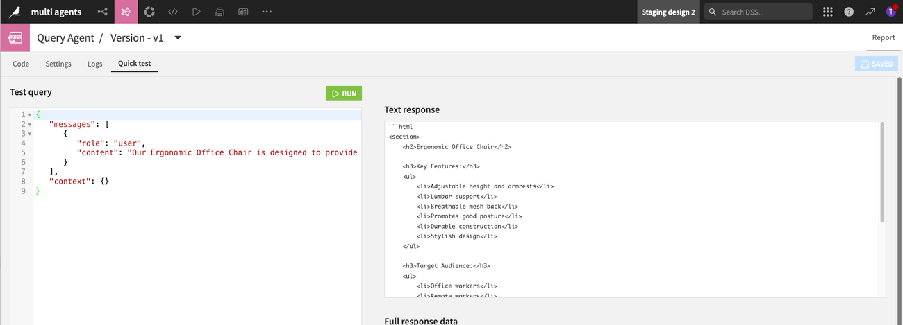

Multi agents: sequential workflow
*********************************

.. meta::
  :description: This tutorial aims to show the usage of a multi-agent system using a sequential workflow.

After creating agents, for example, through the :doc:`Creating and using a Code Agent</tutorials/genai/agents-and-tools/code-agent/index>`
or :doc:`Creating a custom agent</tutorials/plugins/agent/generality/index>` tutorials, you can use them and have various daily usages.
You will need several agents to work together to handle more complex use cases.

Prerequisites
=============

- Dataiku >= 13.4
- An OpenAI connection
- Python >= 3.9

Introduction
============

When solving a problem using multiple agents, keeping dedicated agents for well-delimited tasks is useful.
You will then articulate a multi-agent system to tackle the global topic.
You will implement a first agent to call the different agents with the appropriate prompt and parameters according to a sequential workflow.
This tutorial will elaborate on a multi-agent system that will produce the HTML code needed for your website from a product description.
It will use two agents. The first will extract the key features, target audience, and unique selling points.
The second one will format that information with the proper HTML code.

The Concept Extractor Agent
===========================

The Concept Extractor is in charge of the description analysis from a marketing perspective.
It extracts a list of key features from a product's textual description.
It will also estimate the target audience for such a product.
Lastly, the description analysis will provide a list of potential selling points that would be helpful.

To create this agent, follow the :doc:`Creating and using a Code Agent</tutorials/genai/agents-and-tools/code-agent/index>` tutorial and
use :ref:`Code 1<tutorials-genai-multi-agent-extractor>` below.

.. literalinclude:: ./assets/concept_extractor.py
    :language: python
    :caption: Code 1: Concept Extractor Agent code
    :name: tutorials-genai-multi-agent-extractor

You can test your Concept Extractor Agent in the **Quick test** tabs by entering the following test query:

You can use the following suggestion as a test query:

.. code-block:: json

  {
       "messages": [
          {
             "role": "user",
             "content": "Smart Water Bottle designed to help you stay hydrated throughout the day. ability to track water intake. sync with your smartphone. LED reminders. eco-friendly material. long-lasting battery life"
          }
       ],
       "context": {}
  }

Depending on the model you chose, the result will looks like the following:

.. code-block:: text

    **Product Name:** Smart Water Bottle

    **Key Features:**
    1. Tracks water intake
    2. Syncs with smartphone
    3. LED reminders for hydration
    4. Made from eco-friendly materials
    5. Long-lasting battery life

    **Target Audience:**
    - Health-conscious individuals
    - Tech-savvy users
    - Environmentally conscious consumers
    - Busy professionals and students
    - Fitness enthusiasts

    **Unique Selling Points:**
    - Integration with smartphone for easy tracking and reminders
    - Eco-friendly construction appealing to sustainable living advocates
    - LED reminders to ensure consistent hydration throughout the day
    - Durable battery life reducing the need for frequent charging

The Web Writer Agent
====================

The Web Writer Agent is in charge of formatting the elements analyzed by the concept extractor.
It will use a predefined HTML format enforced in the system prompt with a detailed example.
This system prompt is the part you need to adapt and refine to have a reliable answer from the LLM you chose to use.
Once again, you can follow the :doc:`Creating and using a Code Agent</tutorials/genai/agents-and-tools/code-agent/index>` tutorial and
use :ref:`Code 2<tutorials-genai-multi-web-writer>` below.

.. literalinclude:: ./assets/web_writer_agent.py
    :language: python
    :caption: Code 2: Web Writer Agent code
    :name: tutorials-genai-multi-web-writer

You can test your Web Writer Agent in the **Quick test** tabs.
You can use the following suggestion as a test query:

.. code-block:: json

    {
       "messages": [
          {
             "role": "user",
             "content": "**PRODUCT:** Smart Water Bottle\n\n**Key Features:**\n1. Ability to track water intake\n2. Syncs with your smartphone\n3. LED reminders\n4. Made from eco-friendly material\n5. Long-lasting battery life\n\n**Target Audience:**\n- Health-conscious individuals\n- Tech-savvy users\n- People with busy lifestyles\n- Environmentally conscious consumers\n- Fitness enthusiasts\n\n**Unique Selling Points:**\n- Integration with smartphone for easy tracking and monitoring\n- Eco-friendly materials appeal to environmentally conscious buyers\n- LED reminders provide a convenient way to ensure regular hydration\n- Long-lasting battery life reduces the need for frequent charging"
          }
       ],
       "context": {}
    }

Your result will looks like the following:

.. code-block:: html

    <section>
        <h2>Smart Water Bottle</h2>

        <h3>Key Features:</h3>
        <ul>
            <li>Ability to track water intake</li>
            <li>Syncs with your smartphone</li>
            <li>LED reminders</li>
            <li>Made from eco-friendly material</li>
            <li>Long-lasting battery life</li>
        </ul>

        <h3>Target Audience:</h3>
        <ul>
            <li>Health-conscious individuals</li>
            <li>Tech-savvy users</li>
            <li>People with busy lifestyles</li>
            <li>Environmentally conscious consumers</li>
            <li>Fitness enthusiasts</li>
        </ul>

        <h3>Unique Selling Points:</h3>
        <ul>
            <li>Integration with smartphone for easy tracking and monitoring</li>
            <li>Eco-friendly materials appeal to environmentally conscious buyers</li>
            <li>LED reminders provide a convenient way to ensure regular hydration</li>
            <li>Long-lasting battery life reduces the need for frequent charging</li>
        </ul>
    </section>

The Query Agent
===============

The Query Agent will describe a product as defined in the input prompt and handle the call between the two agents.
:ref:`Code 3<tutorials-genai-multi-agent-query>` shows how to get a handle on each agent.

.. literalinclude:: ./assets/query_agent.py
    :language: python
    :caption: Code 3: Query agent code
    :name: tutorials-genai-multi-agent-query

This agent will first call the concept extractor agent to obtain a list of the key features, identify the potential target audience, and develop a list of selling points for this product.
It will then call the web writer agent. This one will take the concept list as input and provide a piece of HTML code representing that data.

To test the whole sequence of multi agent calls, you can input the test query we used for the Concept Extractor Agent:

.. code-block:: json

  {
       "messages": [
          {
             "role": "user",
             "content": "Smart Water Bottle designed to help you stay hydrated throughout the day. ability to track water intake. sync with your smartphone. LED reminders. eco-friendly material. long-lasting battery life"
          }
       ],
       "context": {}
  }

Your result will looks like the result from the Web Writer Agent test:

.. code-block:: html

    <section>
        <h2>Smart Water Bottle</h2>

        <h3>Key Features:</h3>
        <ul>
            <li>Ability to track water intake</li>
            <li>Syncs with your smartphone</li>
            <li>LED reminders</li>
            <li>Made from eco-friendly material</li>
            <li>Long-lasting battery life</li>
        </ul>

        <h3>Target Audience:</h3>
        <ul>
            <li>Health-conscious individuals</li>
            <li>Tech-savvy users</li>
            <li>People with busy lifestyles</li>
            <li>Environmentally conscious consumers</li>
            <li>Fitness enthusiasts</li>
        </ul>

        <h3>Unique Selling Points:</h3>
        <ul>
            <li>Integration with smartphone for easy tracking and monitoring</li>
            <li>Eco-friendly materials appeal to environmentally conscious buyers</li>
            <li>LED reminders provide a convenient way to ensure regular hydration</li>
            <li>Long-lasting battery life reduces the need for frequent charging</li>
        </ul>
    </section>

Wrapping up
===========

Congratulations! You now have a sequential workflow to define a multi-agent system.
Once you have well-delimited Agents and Tools, you can build different workflows to suit your needs.
You may implement a system in which the queries to each agent are done in parallel and then collected and correctly assembled to answer the user's question.

Reference documentation
=======================

Classes
-------
.. autosummary::
    dataikuapi.DSSClient
    dataikuapi.dss.project.DSSProject
    dataikuapi.dss.llm.DSSLLM
    dataikuapi.dss.llm.DSSLLMCompletionQuery

Functions
---------
.. autosummary::
    ~dataikuapi.dss.llm.DSSLLMCompletionQuery.execute
    ~dataikuapi.DSSClient.get_default_project
    ~dataikuapi.dss.project.DSSProject.get_llm
    ~dataikuapi.dss.llm.DSSLLM.new_completion
    ~dataikuapi.dss.llm.DSSLLMCompletionQuery.with_message

