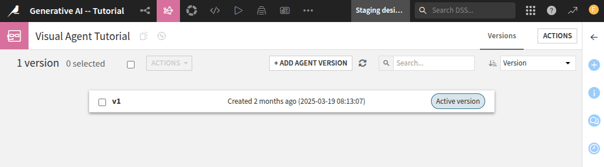
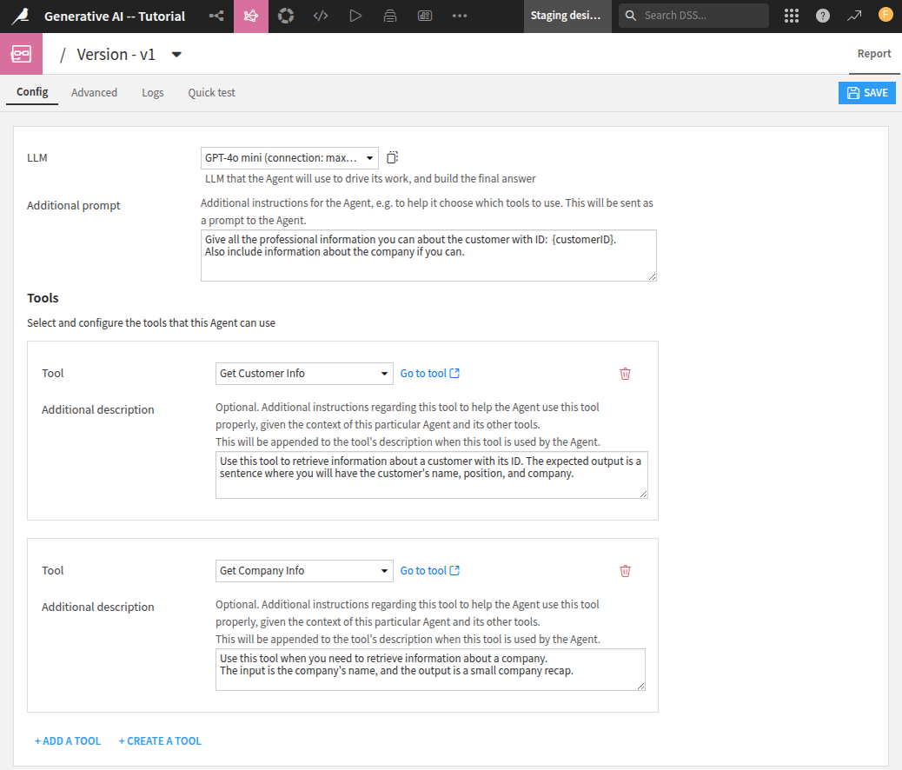
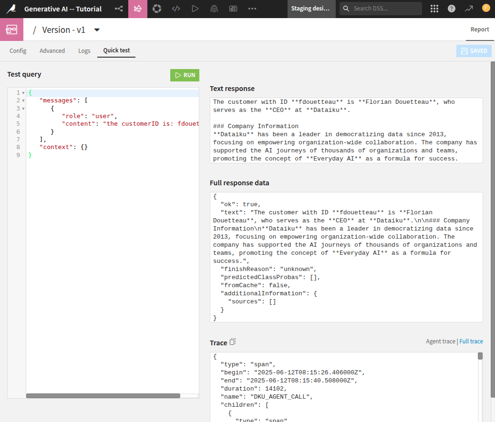

Leveraging a custom tool in a Visual Agent
******************************************

.. meta::
  :description: This tutorial shows 

In this tutorial, you will learn how to build a Visual Agent that uses tools.
Those tools can be default ones (provided by Dataiku) or custom ones (provided by plugins).
This tutorial will use the custom tools defined
in the :doc:`/tutorials/plugins/custom-tools/generality/index` tutorial.
However, if you haven't followed this tutorial but already have tools to use,
you can adapt this tutorial to meet your requirements. 
 
 
Prerequisites
=============

- Dataiku >= 13.4
- Tools already added in Dataiku. Those tools should be visible in the **Agent Tools** menu from the **GenAI** menu.

Creating a Visual Agent
=======================

To create a Visual Agent, go to the **Flow**, click the **Add item** button, select the **Generative AI** menu,
click **Visual Agent**, enter a name, and click the **OK** button.
Alternatively, you can select the **Agents & GenAI Models** item in the **GenAI** menu,
click the **New Agent** button, and select the **Visual Agent** option.
You should land on a page similar to the one shown
in :ref:`Figure 1<tutorials-genai-techniques-and-tools-visual-agent-creation>`.

.. _tutorials-genai-techniques-and-tools-visual-agent-creation:

    Fig. 1: Visual Agent created.

This page shows the different versions of the agent's life.
As this is a new agent, only one version is available (**v1**). 
Click on the **v1** label to see its definition.
Fill in the information on the **Config** tabs, as shown
in :ref:`Figure 2<tutorials-genai-techniques-and-tools-visual-agent-configuration>`.
For example, you could have entered for:

* **Additional prompt**:
  
  .. code-block:: text

    Give all the professional information you can about the customer with ID: {customerID}.
    Also, include information about the company if you can.

* the tool **Get Customer Info**:

  .. code-block:: text

    Use this tool to retrieve information about a customer with its ID.
    The expected output is a sentence where you will have the customer's name, position, and company.

* the tool **Get Company Info**:

  .. code-block:: text

    Use this tool when you need to retrieve information about a company.
    The input is the company's name, and the output is a small company recap.

.. _tutorials-genai-techniques-and-tools-visual-agent-configuration:

    Fig. 2: Visual Agent's configuration.

Testing the Agent
=================
To test the agent, click the **Quick test** tabs, fill in the information based on the prompt you have defined before,
and then click the **Run** button.
The result of this agent execution is shown 
in :ref:`Figure 3<tutorials-genai-techniques-and-tools-visual-agent-test>`.

.. _tutorials-genai-techniques-and-tools-visual-agent-test:

    Fig. 3: Testing the Visual Agent.
