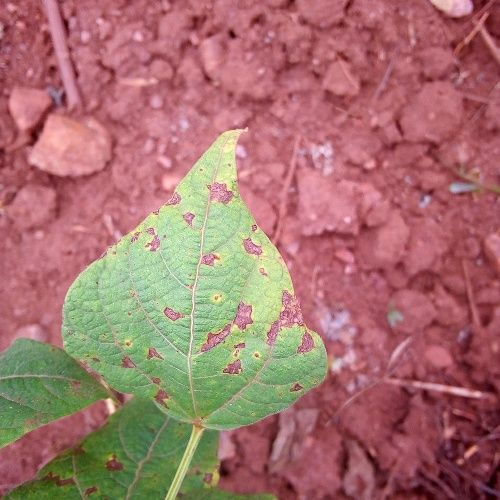
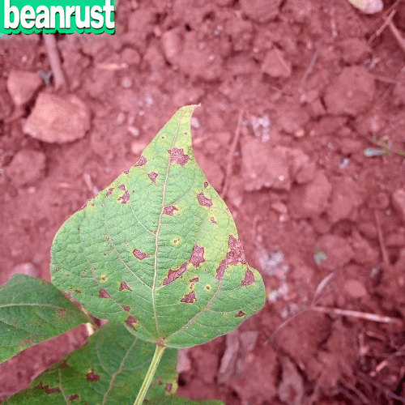

Mixing text and images: Images labeling with the LLM Mesh
*********************************************************

In this tutorial, you will learn how to use the LLM Mesh to add a label to classified images automatically.
Suppose you have a dataset composed of images that you want to classify.
You already have an ML model that classifies your pictures correctly,
but you want to add a text/label to the image automatically so that you do not need any other tool to view the classification result.
Usually, when you need to do such a thing,
you build a (web) application that extracts the label from the data and displays it.
Using an LLM with multimodal capability could help add a label to an image so that the classification result is written in the image,
avoiding the need to build an additional application.

Prerequisites
#############

* Dataiku > 13.3
* A valid LLM connection with a model that can do image-to-image.

This tutorial is based on the
`Image Classification <https://academy.dataiku.com/path/ml-practitioner/image-classification-with-visual-tools-open>`_
tutorial from the `Academy <https://academy.dataiku.com/>`_.
You will use the ``bean_images_test_files_scored`` dataset as an input.

If you don't want to follow the Academy's tutorial,
you will need a dataset with at least two columns (``path`` and ``prediction``).
You can build such a dataset by uploading the content of :download:`this zip file <./assets/test-image.zip>`
into a newly created managed folder.
Then, use the "List Contents" recipe with the following "Folder level mapping": ``1	prediction``.

Obviously, you will also need a set of images (corresponding to the `path` columns).
As you will use the ``"INPAINTING"`` mode for the LLM, you will also need a "masked" image,
like the one you can find :download:`here<./assets/mask.png>`.
You will use ``"INPAINTING"`` mode as it is the only one, at the time of writing, that allows you to modify an image;
``"VARY"`` mode will generate a new image based on the provided image, but without using a prompt;
``"MASK_FREE"`` will generate a new image (based on the provided image) with the prompt taken into account.

This tutorial can be run in a Jupyter Notebook.

Getting the LLM
###############

Getting an LLM ID for image generation is not so much different than retrieving a “classical” LLM ID.
:ref:`Code 1<tutorials_genai_multimodal_image_captioning_code_get_llm_id>` shows how to retrieve this ID.

.. code-block:: python
    :caption: Code1: List existing LLMs capable of image generation and their associated ID.
    :name: tutorials_genai_multimodal_image_captioning_code_get_llm_id

    import dataiku

    client = dataiku.api_client()
    project = client.get_default_project()
    llm_list = project.list_llms(purpose="IMAGE_GENERATION")
    for llm in llm_list:
        print(f"- {llm.description} (id: {llm.id})")

Checking if everything is okay
##############################

:ref:`Code 2<tutorials_genai_multimodal_image_captioning_code_checkup>`
is the code snippet to view if you can access all the required data.
If everything is okay you should see an image like the one shown in
:ref:`Figure 1<tutorials_genai_multimodal_image_captioning_figure_original_image>`.
You should also have access to a masked image.
For the simplicity of this tutorial,
let's consider that this image is stored in the same folder as the image you need to label.

.. code-block:: python
    :caption: Code 2: Snippet code to check if everything is ok.
    :name: tutorials_genai_multimodal_image_captioning_code_checkup

    from IPython.display import display, Image

    mydataset = dataiku.Dataset("bean_images_test_files_scored")
    mydataset_df = mydataset.get_dataframe()
    test_folder = dataiku.Folder("bean_images_test")
    data = mydataset_df.iloc[0]
    with test_folder.get_download_stream("mask.png") as img_file
        black_mask_image_data = img_file.read()
    with test_folder.get_download_stream(data.path) as img:
        img_data = img.read()

    Image(img_data)

.. _tutorials_genai_multimodal_image_captioning_figure_original_image:

    
    Figure 1: Original image.
    
Labeling your image
###################

Once all the requirements are met,
you can label your image using :ref:`Code 3<tutorials_genai_multimodal_image_captioning_code_captioning>`.
If so, you will obtain a similar result as in :ref:`Figure 3<tutorials_genai_multimodal_image_captioning_img_result>`.
If you want to label all the images in the ``test_folder``, you must iterate over the dataframe.

.. code-block:: python
    :name: tutorials_genai_multimodal_image_captioning_code_captioning
    :caption: Code 3: Labeling an image

    generation = imagellm.new_images_generation()
    generation.with_original_image(img_data, mode="INPAINTING", weight=1)
    generation.with_mask("MASK_IMAGE_BLACK", image=black_mask_image_data)
    generation.with_prompt(f"""Add the text "{data.prediction}" to the image""", weight=1)
    generation.fidelity = 1
    resp = generation.execute()

.. _tutorials_genai_multimodal_image_captioning_img_result:

    Figure 3: Result of the labeling task.

Wrapping up
###########

You have a working notebook for labeling images.
You can iterate over the folder to label all pictures or try another dataset.
Of course, you might not need an LLM to do this kind of processing,
but this tutorial gives you a good understanding of how to use an LLM to modify an image.

Here is the complete code of a possible notebook:

.. dropdown:: :download:`notebook.py<./assets/notebook.py>`
    :open:

    .. literalinclude:: ./assets/notebook.py
        :language: python