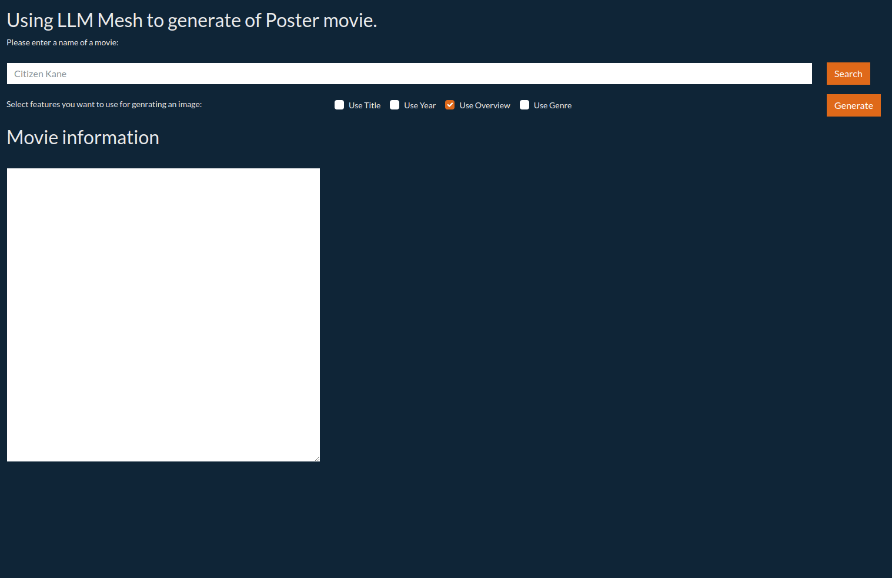
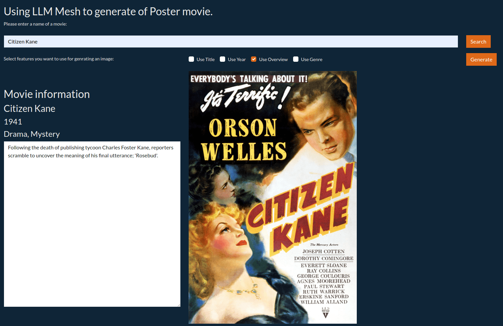

Image generation using the LLM Mesh
***********************************

Large Language Models (LLMs) are helpful for summarization, classification, chatbots, etc.
Their effectiveness can be extended with frameworks like agents and function calling,
and their accuracy can be improved with RAG and fine-tuning.
We usually use LLMs for textual interaction, even if we can input some images in the different models.

This tutorial explores another side of LLMs - their image generation capabilities.
Dataiku LLM Mesh allows users to use Image generation models.
The Python Dataiku LLM Mesh API lets users quickly set up and test various LLMs.
In this tutorial, you will use the image generation capabilities of the LLM Mesh and
and build a visual web application around it.
You will create a movie poster from an overview of a film.
This information comes from the IMDB database,
but you can easily gather film information using a search tool.

Prerequisites
#############

* Dataiku 13.1
* A valid LLM connection
* If you want to test the webapp part, a code-env with the following packages:

  .. code-block:: python

      dash
      dash-bootstrap-components

This tutorial has been tested with ``dash==2.17.1`` and ``dash-bootstrap-components==1.6.0``.

You will need the IMDB database, which can be downloaded
`here <https://www.kaggle.com/datasets/harshitshankhdhar/imdb-dataset-of-top-1000-movies-and-tv-shows>`__.

Getting the LLM
###############

Getting an LLM ID for image generation is not so much different than retrieving a "classical" LLM ID.
:ref:`Code 1<tutorials-genai-image-generation-poster-movies-code-get-the-llm-id>` shows how to retrieve this ID.

.. literalinclude:: ./assets/code-snippets.py
    :language: python
    :caption: Code1: List existing LLMs capable of image generation and their associated ID.
    :name: tutorials-genai-image-generation-poster-movies-code-get-the-llm-id
    :lines: 1-7

Once you have identified which LLM you want to use, note the associated ID (LLM_ID).

Retrieving movie information and image creation
###############################################

To query the dataset easily, create an **SQL** dataset named ``movies`` from the data you have previously downloaded.
Then, create the search function in a notebook,
as shown in :ref:`Code 2<tutorials-genai-image-generation-poster-movies-code-search-function>`.

.. attention::
    The SQL query might be written differently depending on your SQL Engine.

.. literalinclude:: ./assets/code-snippets.py
    :language: python
    :caption: Code 2: Searching for information about a movie
    :name: tutorials-genai-image-generation-poster-movies-code-search-function
    :lines: 9-29

Then, you can create a poster movie using a code similar to
:ref:`Code 3<tutorials-genai-image-generation-poster-movies-code-generate-image>` from that information.

.. literalinclude:: ./assets/code-snippets.py
    :language: python
    :caption: Code 3: Creating a poster movie.
    :name: tutorials-genai-image-generation-poster-movies-code-generate-image
    :lines: 32-48

Using the prompt defined in :ref:`Code 3<tutorials-genai-image-generation-poster-movies-code-generate-image>`
will obtain something like the poster shown in
:ref:`Figure 1<tutorials-genai-image-generation-poster-movies-image-result-1>` and
:ref:`Figure 2<tutorials-genai-image-generation-poster-movies-image-result-2>`.

.. _tutorials-genai-image-generation-poster-movies-image-result-1:

.. figure:: ./assets/tutorials-genai-image-generation-poster-movies-image-result-1.png
    :align: center
    :class: with-shadow image-popup w250
    :alt: Figure 1: Resulting image.
    
    Figure 1: Resulting image.

.. _tutorials-genai-image-generation-poster-movies-image-result-2:

    
    Figure 2: Resulting image -- second run.
    
Creating a web app
##################

Like the previous section, the web application retrieves and displays information from the ``movies`` dataset.
Based on the information and user needs, it generates a prompt for image generation.
Once the LLM generates the image, the web application displays the poster movie next to the original.

.. _tutorials-genai-image-generation-poster-movies-image-webapp-start:

    Figure 3: Start of the webapp.

:ref:`Figure 3<tutorials-genai-image-generation-poster-movies-image-webapp-start>` shows the web application when it starts.
In :ref:`Code 4<tutorials-genai-image-generation-poster-movies-code-webapp-global>`,
we import the necessary libraries and define the web application's default values.

.. literalinclude:: ./assets/webapp.py
    :language: python
    :caption: Code 4: Global definitions
    :name: tutorials-genai-image-generation-poster-movies-code-webapp-global
    :lines: 1-25

The highlighted lines in :ref:`Code 5<tutorials-genai-image-generation-poster-movies-code-webapps-layout>`
display the result of the query database when the user clicks on the search button.

.. literalinclude:: ./assets/webapp.py
    :language: python
    :caption: Code 5: Application layout
    :name: tutorials-genai-image-generation-poster-movies-code-webapps-layout
    :lines: 27-91
    :emphasize-lines: 5-8,26-42

:ref:`Code 6<tutorials-genai-image-generation-poster-movies-code-webapps-callbacks>` shows how to connect
the callbacks needed for the web application result.
:ref:`Figure 4<tutorials-genai-image-generation-poster-movies-image-webapp-search>` shows the result of searching "Citizen Kane,"
and :ref:`Figure 5<tutorials-genai-image-generation-poster-movies-image-webapp-result>` shows the result of image generation.

.. attention::
    The SQL query might be written differently depending on your SQL Engine.

.. literalinclude:: ./assets/webapp.py
    :language: python
    :caption: Code 6: Callbacks
    :name: tutorials-genai-image-generation-poster-movies-code-webapps-callbacks
    :lines: 94-

.. _tutorials-genai-image-generation-poster-movies-image-webapp-search:

    
    Figure 4: Searching for "Citizen Kane".
    
.. _tutorials-genai-image-generation-poster-movies-image-webapp-result:

.. figure:: ./assets/tutorials-genai-image-generation-poster-movies-image-webapp-result.png
    :align: center
    :class: with-shadow image-popup
    :alt: Figure 5: Generating an image from the user inputs.
    
    Figure 5: Generating an image from the user inputs.
    

Wrapping up
###########

You have a working web application that generates images using LLM Mesh.
You can enhance this application by using an LLM to write the image prompts
or by using a search engine to collect information directly from the Internet instead of a database.
This tutorial is easily adaptable to other use cases for image generation.
For example, if you work for a company with brands, you can adapt this tutorial to generate images of your products.

Here is the complete code of the web application:

.. attention::
    The SQL query might be written differently depending on your SQL Engine.

.. dropdown:: :download:`app.py<./assets/webapp.py>`
    :open:

    .. literalinclude:: ./assets/webapp.py
        :language: python