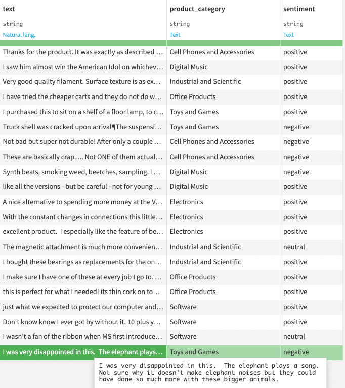

# Comparing zero-shot learning and few-shot learning using Dolly for efficient text classification
 
## Prerequisites
* Dataiku>=11.4
* "Use" permission on a code environment using Python >= 3.9 with the following
  packages:
  * `torch==1.13.1`
  * `transformers==4.30.2`
  * `scikit-learn==1.0.2`
  * `accelerate==0.19.0`
* Access to an existing project with the following permissions:
  * "Read project content" on an existing or new Dataiku project
  * "Write project content"
* basic natural language processing (NLP) domain knowledge (tokens, embeddings,
  etc.)
* **[HIGHLY RECOMMENDED]** GPU-enabled code environment

## Introduction

Large Language Models like [Dolly](https://github.com/databrickslabs/dolly) and
the GPT family allow for zero-shot learning, i.e., they can generate text
without any training data. At the same time, they can also be fine-tuned on a
specific task with relatively little training data using a technique called
few-shot learning. This tutorial will walk you through how to use an LLM for
few-shot learning on a text classification task and compare it to zero-shot
learning. 

## Getting the data

This tutorial uses the [Amazon Review
Dataset](https://nijianmo.github.io/amazon/index.html).
The [provided Python script](tutorials_machine_learning_generativeAI_BYOM_ETL)
downloads one of the subset
[datasets](http://jmcauley.ucsd.edu/data/amazon_v2/categoryFilesSmall/Luxury_Beauty_5.json.gz),
creates a small sample of reviews, and uploads it as a dataset named
`beauty_product_reviews`. To use this script, you must create a Python recipe
from the flow with an output dataset named `beauty_product_reviews` and copy the
code into the recipe's code.

```{literalinclude} assets/ELTreviews.py 
:language: python
:caption: labeling sentiment
:lines: 35-40
``` 

{.image-popup}

```{note}
The code specifies two recommended sample sizes for processing data - 256 with a 
GPU and 32 without one. 
Keep in mind that even with a GPU, the number of samples that can feasibly be processed 
may vary widely, depending on GPU configuration options: type and memory, among others.
Determining the appropriate sample size may require some experimentation.
```

## Model & tokens

In this tutorial, you will use a pre-trained model to predict a classification
label for these reviews. After loading the relevant libraries (see the [complete
code](tutorials_machine_learning_generativeAI_BYOM_fullcode)), the provided
script, which can be run as a recipe or in a notebook,
loads a model and the corresponding tokenizer. The `transformers` library
provides a simple interface to load and use pre-trained models and tokenizers
for various natural language processing tasks. Loading models from remote
repositories like Hugging Face is a common practice rather than training models
for specific NLP tasks.

Here, you'll be using the `databricks/dolly-v2-3b`
[model](https://huggingface.co/databricks/dolly-v2-3b). It is trained on a
diverse range of English-language text from the internet and similar sources and
fine-tuned using an instruction corpus. Here is the code for loading the model
and the tokenizer:

```{literalinclude} assets/fewVSzeroshot.py
:language: python
:caption: loading model
:lines: 13-21
```

```{caution}
Loading the model and tokenizer as common objects across multiple uses is a good
practice because it saves time and resources. Pre-trained models and tokenizers
can be quite large (this one is over five gigs!). Loading them multiple times
can be memory-intensive and slow, depending on the bandwidth available.
```

You load a small set of product reviews using the dataset
(`beauty_product_reviews`) already in the project. Specify the target labels and
their corresponding token ids using the `encode()` method. These are the main
steps for preparing data and objects for the text generation pipeline.

Once these assets are loaded, you can set `BATCH_SIZE` to a constant--in this
case, 8. This is the number of samples that pass through the model's neural
network during training. The batch size can affect the speed and stability of
the training process, with a larger batch giving faster training times, but it
could also lead to overfitting and instability.

This tutorial compares two text classification techniques. Zero-shot learning
leverages a pre-trained model's understanding of word and concept relationships
without further training. Few-shot learning, however, enhances the model with
training examples via the prompt, avoiding retraining. You'll walk through a
simple implementation of each to see that even a few examples are better than
none. In practice, you might choose one or the other depending on the use case.

## Zero-shot learning for text classification

First, perform zero-shot learning on the dataset using the model. Define a
prompt asking the model to decide whether a given product review is positive,
neutral, or negative without any examples. Using the pre-trained model and
tokenizer, the code iterates over the dataset in batches, tokenizing the prompts
and predicting the probability of the labels. The predicted sentiment (positive
vs. neutral vs. negative) is then concatenated to the original dataset, along
with the probabilities for each sentiment. You have used a pre-trained language
model for zero-shot learning on a dataset.

```{literalinclude} assets/fewVSzeroshot.py
:language: python
:lines: 41-50
```

## Few-shot learning for text classification

For few-shot learning, start by defining a prompt that asks the model to decide
whether a given product review is positive, neutral, or negative. This time,
though, you'll include a few examples with it. Here is how the `examples` look
based on the code snippet:  
> "I love my new chess board!" is *positive*.
>
> "Not what I expected but I guess it'll do" is *neutral*.
>
> "I'm so disappointed; the  product seemed much better on the website" is
> *negative*.
  
```{literalinclude} assets/fewVSzeroshot.py
:language: python
:lines: 69-84
```

Again, the predicted probabilities for each sentiment (`positive` vs. `neutral`
vs. `negative`) are concatenated to the original dataset, along with the
pre-trained language model for few-shot learning as well!

## Conclusion

The model metrics (accuracy, F1-score) demonstrate how few-shot learning can
improve a classification task's performance and efficiency. By defining a
few-shot prompt with examples and computing the next token probabilities with a
pre-trained language model, you can perform classification on a dataset with
limited labeled data. When evaluated using the ground truth, the metrics show
that few-shot learning is more efficient. It will likely have much higher
accuracy and F1 scores, demonstrating gains from using few-shot learning for
classification tasks.

```{literalinclude} assets/fewVSzeroshot.py
:language: python
:lines: 128-134
```

You can find two more end-to-end examples using both methods with the OpenAI API
instead ([](../llm-zero-shot-clf/index) and [](../llm-mesh-few-shot-clf/index)).

## Complete code 
(tutorials_machine_learning_generativeAI_BYOM_ETL)=
```{dropdown} [Python recipe for data prep](./assets/ELTreviews.py)

:::{literalinclude} assets/ELTreviews.py
:language: python
:::
```
(tutorials_machine_learning_generativeAI_BYOM_fullcode)=
```{dropdown} [Python recipe or notebook for performance comparison](./assets/fewVSzeroshot.py)

:::{literalinclude} assets/fewVSzeroshot.py
:language: python
:::
```