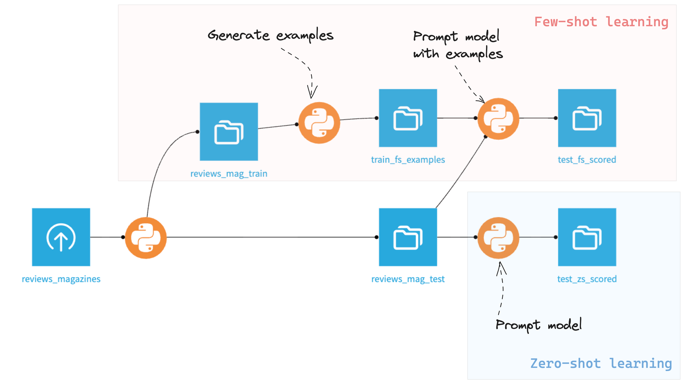

# Few-shot classification with the LLM Mesh

In the [zero-shot classification tutorial](../llm-zero-shot-clf/index),
you learned how to build a classifier that can perform reasonably well on a task that has not been explicitly trained. 
However, additional steps are required in other scenarios where the classification task can be more difficult.

In this tutorial, you will learn about few-shot learning,
a convenient way to improve the model's performance by showing relevant examples without retraining or fine-tuning it.
You will also dive deeper into understanding prompt tokens and see how LLMs can be evaluated.

## Prerequisites

* Dataiku >= 13.1 
* "Use" permission on a code environment using Python >= 3.9 with the following packages:
    * `langchain` (tested with version 0.2.0)
    * `transformers` (tested with version 4.43.3)
    * `scikit-learn` (tested with version 1.2.2)
* Access to an existing project with the following permissions:
    * "Read project content"
    * "Write project content"
* An LLM Mesh connection (to get a valid LLM ID, please refer to {ref}`this documentation<ce/llm-mesh/get-llm-id>`)
* Reading and implementing the [tutorial on zero-shot classification](../llm-zero-shot-clf/index)


## Preparing the data

For this tutorial, you will work on a different dataset to predict more than two classes.
This dataset is part of the [Amazon Review Dataset](https://nijianmo.github.io/amazon/index.html), 
and contains an extract of the "Magazine subscriptions" category.
Download the data file [here](https://jmcauley.ucsd.edu/data/amazon_v2/categoryFilesSmall/Magazine_Subscriptions_5.json.gz) 
and create a dataset called `reviews_magazines` with it in your project. 

### Counting tokens
Language models process text as *tokens*, which are recurring sequences of characters,
to understand the statistical links between them and infer the next probable ones.
Counting tokens in a text input is helpful because:

* It is the main pricing unit for managed LLM services (more details on 
[OpenAI's dedicated page](https://openai.com/chatgpt/pricing)),
* It can specify minimum/maximum thresholds for input and output lengths.

You will use the method {py:meth}`~dataikuapi.dss.langchain.llm.DKULLM.get_num_tokens` to enrich your dataset with the number of tokens per review.

### Binning ratings and splitting the data

Next, select the `reviews_magazines` dataset; 
create a Python recipe with two outputs called `reviews_mag_train` and `reviews_mag_test`;
copy {ref}`Code 1<tutorials-genai-nlp-llm-mesh-few-shot-clf-code1>` as the recipe's content.

```{literalinclude} assets/compute_reviews_mag_train.py
:language: python
:caption: "Code 1: compute_reviews_mag_train.py"
:name: tutorials-genai-nlp-llm-mesh-few-shot-clf-code1
```

This code bins the rating scores from the `overall` column into a 
new categorical column called `sentiment` where the values can be either:
- `pos` (positive) for ratings $\geq 4$,
- `ntr` (neutral) for ratings $=3$,
- `neg` (negative) otherwise.

It also removes useless columns to keep only `sentiment` and `reviewText` (the content of the user review) and randomly
dispatches output rows between: 
* `reviews_mag_test` on which you'll run and evaluate your classifier,
* `reviews_mag_train` which role will be explained later.


## Building a zero-shot-based baseline 

Establish a baseline using a zero-shot classification prompt on the test dataset.

### Defining the prompt

Create a directory named `utils` in your project library and create `chat.py` with the content shown in
{ref}`Code 2<tutorials-genai-nlp-llm-mesh-few-shot-clf-code2>`.

```{literalinclude} assets/chat.py
:language: python
:caption: "Code 2: chat.py"
:name: tutorials-genai-nlp-llm-mesh-few-shot-clf-code2
:lines: 1-23
```

`predict_sentiment()` defines the multi-class classification task by telling the model which classes to expect 
(`pos`, `ntr`, `neg`) and how to format the output. 

From there you can write the code for the zero-shot run. 

### Running and evaluating the model

Create and run a Python recipe using `reviews_mag_test` as input
and a new dataset called `test_zs_scored` as output, then add the following code:

```{literalinclude} assets/compute_test_zs_scored.py
:language: python
:caption: "Code 3: compute_test_zs_scored.py"
:name: tutorials-genai-nlp-llm-mesh-few-shot-clf-code3
```

That recipe iterates over the test dataset and infers the review text's sentiment in the `llm_sentiment` column.
Once the `test_zs_scored` dataset is built, you can evaluate your classifier's performance: 
in your project library, create a new file under `utils` called `evaluate.py` with 
{ref}`Code 4<tutorials-genai-nlp-llm-mesh-few-shot-clf-code4>`.

```{literalinclude} assets/evaluate.py
:language: python
:caption: "Code 4: evaluate.py"
:name: tutorials-genai-nlp-llm-mesh-few-shot-clf-code4
```

You can now use the `get_classif_metrics()` function to compute the precision and recall scores on the test dataset
by running {ref}`Code 5<tutorials-genai-nlp-llm-mesh-few-shot-clf-code5>` in a notebook.

```{literalinclude} assets/notebook.py
:language: python
:lines: 1-12
:name: tutorials-genai-nlp-llm-mesh-few-shot-clf-code5
:caption: "Code 5: evaluate test_zs_scored"
```

```text
{'precision': 0.61, 'recall': 0.71}
```

## Implementing few-shot learning

Next, you'll attempt to improve the baseline model's performance using *few-shot learning*, 
which supplements the model with training examples via the prompt without requiring retraining.

There are many ways to identify relevant training examples; in this tutorial, you will use a relatively intuitive approach:
- Start by running a zero-shot classification on the training dataset,
- Flag a subset of the resulting false positives/negatives to add to your prompt at evaluation time.

### Retrieving relevant examples

Create and run a Python recipe using `reviews_mag_train` as input and a new dataset called `train_fs_examples` as output 
with the {ref}`Code 6<tutorials-genai-nlp-llm-mesh-few-shot-clf-code3>` as content.


```{literalinclude} assets/compute_train_fs_examples.py
:language: python
:caption: "Code 6: compute_train_fs_examples.py"
:name: tutorials-genai-nlp-llm-mesh-few-shot-clf-code6
```

This code iterates over the training data,
filters out the reviews whose (token-based) size is not between `SIZE_EX_MIN` and `SIZE_EX_MAX`,
and then writes the prediction in the output dataset *only if it was mistaken*.
There is also a limit of 10 examples defined by `NB_EX_MAX` to make sure that at evaluation time,
the augmented prompts do not increase the model's cost and execution time too much.

### Running and evaluating the new model

The next step is incorporating those examples into your prompt before re-running the classification process.

Let's start by updating the prompt:
Examples are added as user/assistant exchanges following the system message when using the LLM.
To apply this, in your project library's `chat.py` file, add the following functions:

```{literalinclude} assets/chat.py
:language: python
:caption: "Code 7: chat.py"
:pyobject: build_example_msg
```

The `build_example_msg()` function helps transform a record's raw data into dicts that follow the Langchain message formalism.

```{literalinclude} assets/chat.py
:language: python
:caption: "Code 8: chat.py"
:pyobject: predict_sentiment_fs
```

The `predict_sentiment_fs()` function is a modified version of `predict_sentiment()` that adds a new `examples` argument
to enrich the prompt for few-shot learning.

With these new tools, you can execute a few-shot learning run on the test dataset! Create a Python recipe with
`train_fs_examples` and `reviews_mag_test` as input, and a new output dataset called `test_fs_scored` 
and {ref}`Code 9<tutorials-genai-nlp-llm-mesh-few-shot-clf-code9>` as content.

```{literalinclude} assets/compute_test_fs_scored.py
:language: python
:caption: "Code 9: compute_test_fs_scored.py"
:name: tutorials-genai-nlp-llm-mesh-few-shot-clf-code9
```

You can now finally assess the benefits of few-shot learning by comparing the classifier's performance with and without 
the examples! To do so, run this code in a notebook:

```{literalinclude} assets/notebook.py
:language: python
:lines: 15-23
```

```text
{'precision': 0.48, 'recall': 0.54}
```

Your Flow has reached its final form and should look like this:

{.image-popup}

## Wrapping up

Congratulations on finishing this (lengthy!) tutorial on few-shot learning!
You now have a better overview of how to enrich a prompt to improve the behavior of an LLM on a classification task.
Feel free to play with the prompt and the various parameters to see how they can influence the model's performance!
You can also explore other leads to improve the tutorial's code:

* From an ML perspective, the datasets suffer from class imbalance since there are many more positive reviews than negative
  or neutral ones. You can mitigate that by resampling the initial dataset or by setting up class weights. You can also adjust
  the number and classes of the few-shot examples to help classify data points belonging to the minority classes. 

* From a tooling perspective, you can make prompt building even more modular by relying on libraries such as Langchain or
  Guidance that offer rich prompt templating features.

Finally, you will find below the complete versions of the code presented in this tutorial.

Happy prompt engineering !

```{dropdown} [chat.py](./assets/chat.py)

:::{literalinclude} assets/chat.py
:language: python
:::
```

```{dropdown} [compute_reviews_mag_train.py](./assets/compute_reviews_mag_train.py)

:::{literalinclude} assets/compute_reviews_mag_train.py
:language: python
:::
```

```{dropdown} [compute_test_fs_scored.py](./assets/compute_test_fs_scored.py)

:::{literalinclude} assets/compute_test_fs_scored.py
:language: python
:::
```

```{dropdown} [compute_test_zs_scored.py](./assets/compute_test_zs_scored.py)

:::{literalinclude} assets/compute_test_zs_scored.py
:language: python
:::
```

```{dropdown} [compute_train_fs_examples.py](./assets/compute_train_fs_examples.py)

:::{literalinclude} assets/compute_train_fs_examples.py
:language: python
:::
```

```{dropdown} [evaluate.py](./assets/evaluate.py)

:::{literalinclude} assets/evaluate.py
:language: python
:::
```