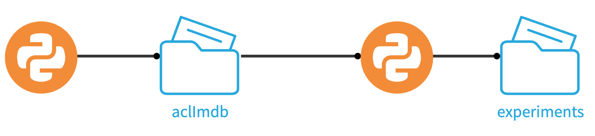

# Experiment Tracking for NLP with Keras/Tensorflow

## Prerequisites

* Dataiku >= 11.0
* A Python code environment containing the following libraries (see supported versions [here](https://doc.dataiku.com/dss/latest/mlops/mlflow-models/limitations.html)):
    * [mlflow](https://www.mlflow.org/docs/2.17.2/getting-started/intro-quickstart/index.html),
    * [tensorflow](https://www.tensorflow.org/install/pip)
* Possibility of dowloading the [Large Movie Review Dataset](https://ai.stanford.edu/~amaas/data/sentiment/).
* Basic knowledge of Tensorflow/Keras.

## Introduction

In this tutorial, you will:
1. Train multiple Keras text classifiers to predict whether a movie review is either positive or negative. 
2. Log those models in the MLflow format so that they can be compared using the Dataiku [Experiment Tracking interface](https://doc.dataiku.com/dss/latest/mlops/experiment-tracking/viewing.html).


The present tutorial is an adaptation of this [basic text classification tutorial](https://www.tensorflow.org/tutorials/keras/text_classification). We recommend that you take a look at that tutorial prior to starting ours, especially if you're not familiar with Tensorflow and Keras.


Although MLflow provides the [`mlflow.sklearn.log_model`](https://www.mlflow.org/docs/2.17.2/python_api/mlflow.sklearn.html#mlflow.sklearn.log_model) function to log models, you will rely on the more general
 [`mlflow.pyfunc.PythonModel`](https://www.mlflow.org/docs/2.17.2/python_api/mlflow.pyfunc.html#mlflow.pyfunc.PythonModel) module to enjoy greater flexibility and to circumvent a current limitation in the deployment of custom Keras pre-processing layers (more on this later). If needed, please consult our [`pyfunc` tutorial](../xgboost-pyfunc/index) to get familiar with that module.


## Downloading the data

The first step to training text classifiers is to obtain text data.

You will programmatically download the [Large Movie Review Dataset](https://ai.stanford.edu/~amaas/data/sentiment/) and decompress it into a **local** [managed folder](https://doc.dataiku.com/dss/latest/connecting/managed_folders.html#creating-a-managed-folder) in Dataiku. A [local managed folder](https://doc.dataiku.com/dss/latest/connecting/managed_folders.html#local-vs-non-local) is a folder that is hosted on the filesystem on the Dataiku machine, where your code runs. 


To do so, create a python recipe:
1. Leave the input field empty.
2. Set its output to a new **local** managed folder (name that folder `aclImdb`).
3. Edit the recipe with the following code (do not forget to change the folder id to that of your output folder).
    ```py
    import dataiku
    from io import BytesIO
    from urllib.request import urlopen
    import tarfile

    folder = dataiku.Folder("YOUR_FOLDER_ID") # change to output folder id
    folder_path = folder.get_path()


    r = urlopen("https://ai.stanford.edu/~amaas/data/sentiment/aclImdb_v1.tar.gz")
    with tarfile.open(name=None, fileobj=BytesIO(r.read())) as t:
        t.extractall(folder_path)
    ```     
4. Run the recipe.


## Preparing the experiment

After downloading and decompressing the movie review archive, prepare the ground for the experiment tracking:

1. Create a second Python recipe. 
2. Set its input to the managed `aclImdb` folder that contains the data.
3. Set its output to a new output folder which can either be local or non-local. Name the output folder `experiments`.
4. Create the recipe and change its code environment to one that satisfies the prerequisites laid out at the beginning of this tutorial.


The following code imports all libraries and defines constant variables, handles and function necessary to the training and tracking of Keras models. Copy and paste it while making sure to change the input folder id to your own input folder id.

For more information regarding experiment tracking in code, refer to our [documentation](https://doc.dataiku.com/dss/latest/mlops/experiment-tracking/tracking.html).


```py
import dataiku
import numpy as np
from datetime import datetime
import os
import shutil
import tensorflow as tf
import re
import string
from tensorflow.keras import layers, losses
from sklearn.model_selection import ParameterGrid

# Replace these constants with your own values
PREDICTION_TYPE = "BINARY_CLASSIFICATION"
EXPERIMENT_FOLDER_ID = ""         # Replace with your output Managed Folder id (experiments)
EXPERIMENT_NAME = ""              # Replace with your chosen experiment name
MLFLOW_CODE_ENV_NAME = ""         # Replace with your code environment name
SAVED_MODEL_NAME = ""             # Replace with your chosen model name    

# Some utils
def now_str() -> str:
    return datetime.now().strftime("%Y%m%d%H%M%S")


client = dataiku.api_client()
project = client.get_default_project()


input_folder = dataiku.Folder('YOUR_FOLDER_ID') # change to input folder id (aclImdb)
# Retrieve the path to the aclImbd folder. 
input_folder_path = input_folder.get_path()

# Create a mlflow_extension object to easily collect information for the promotion step
mlflow_extension = project.get_mlflow_extension()

# Get a handle on a Managed Folder to store the experiments.
mf = project.get_managed_folder(EXPERIMENT_FOLDER_ID)

# dictionary with path to save intermediary model
artifacts = {
    SAVED_MODEL_NAME: "./keras_model_cnn.pth"
}

```

In the rest of this tutorial, you will append more code snippets to that second recipe, starting with the creation of a train, an evaluation, and a test dataset. Only run the recipe at the end of the tutorial, after all snippets have been added.

At this stage, your Dataiku flow should look like this:
{.image-popup}


## Converting raw text data to Tensorflow Datasets

Before you can start training and evaluating your Keras models, you will have to convert your data to 3 different[Tensorflow Datasets](https://www.tensorflow.org/api_docs/python/tf/data/Dataset) (train, evaluation and test).

The [`tf.keras.utils.text_dataset_from_directory()`](https://www.tensorflow.org/api_docs/python/tf/keras/utils/text_dataset_from_directory) function will allow to create such datasets from the different subfolders in your newly created `aclImdb` input folder. 

Use the {doc}`Dataiku Folder API </api-reference/python/project-folders>` to retrieve the `aclImdb` folder path and pass it to the `tf.keras.utils.text_dataset_from_directory()` functions.


```py
dataset_dir = os.path.join(input_folder_path, 'aclImdb')
train_dir = os.path.join(dataset_dir, 'train')

remove_dir = os.path.join(train_dir, 'unsup')
if os.path.exists(remove_dir):
    shutil.rmtree(remove_dir)

batch_size = 32
seed = 42

raw_train_ds = tf.keras.utils.text_dataset_from_directory(
    os.path.join(input_folder_path,'aclImdb/train'),
    batch_size=batch_size, 
    validation_split=0.2, 
    subset='training', 
    seed=seed)


raw_val_ds = tf.keras.utils.text_dataset_from_directory(
    os.path.join(input_folder_path, 'aclImdb/train'), 
    batch_size=batch_size, 
    validation_split=0.2, 
    subset='validation', 
    seed=seed)

raw_test_ds = tf.keras.utils.text_dataset_from_directory(
    os.path.join(input_folder_path, 'aclImdb/test'), 
    batch_size=batch_size)
```


## Preprocessing
The reviews were pulled from a website and contain html carriage-return tags (`<br />`). The following `custom_standardization()` function strips those tags, lower-case the reviews and remove any punctuation from them.

That function is then used as a preprocessing step in a vectorization layer.

Append the following code. 
```py
@tf.keras.utils.register_keras_serializable()
def custom_standardization(input_data):
    lowercase = tf.strings.lower(input_data)
    stripped_html = tf.strings.regex_replace(lowercase, '<br />', ' ')
    return tf.strings.regex_replace(stripped_html,
                                  '[%s]' % re.escape(string.punctuation),
                                  '')

max_features = 10000
sequence_length = 250

vectorize_layer = layers.TextVectorization(
    standardize=custom_standardization,
    max_tokens=max_features,
    output_mode='int',
    output_sequence_length=sequence_length)

# Make a text-only dataset (without labels), then call adapt
train_text = raw_train_ds.map(lambda x, y: x)
vectorize_layer.adapt(train_text)


def vectorize_text(text, label):
    text = tf.expand_dims(text, -1)
    return vectorize_layer(text), label

# vectorize 
train_ds = raw_train_ds.map(vectorize_text)
val_ds = raw_val_ds.map(vectorize_text)
test_ds = raw_test_ds.map(vectorize_text)

AUTOTUNE = tf.data.AUTOTUNE

train_ds = train_ds.cache().prefetch(buffer_size=AUTOTUNE)
val_ds = val_ds.cache().prefetch(buffer_size=AUTOTUNE)
test_ds = test_ds.cache().prefetch(buffer_size=AUTOTUNE)
```

The `@tf.keras.utils.register_keras_serializable()` decorator makes that custom function [serializable](https://www.tensorflow.org/api_docs/python/tf/keras/utils/register_keras_serializable) which is a needed property to later be able to save that preprocessing layer as part of an MLflow model. 


### Model Training and hyperparameter grid

Now define a function--`create_model()`--that will be used to create a [Sequential model](https://keras.io/guides/sequential_model/) from two different hyperparameters.

The `embedding_dim` hyperparameter determines the output dimension of the [Embedding layer](https://keras.io/api/layers/core_layers/embedding/) while the `dropout` hyperparameter determines the frequency (rate) at which the [Dropout layers](https://keras.io/api/layers/regularization_layers/dropout/) randomly set the input units to 0 as a way of mitigating overfitting. 

The function makes it easier to test different model architecture and find the best hyperparameter combinations among a [scikit-learn hyperparameter grid](https://scikit-learn.org/stable/modules/generated/sklearn.model_selection.ParameterGrid.html). While simple, the function could be improved to allow for more flexibility in the architecture design.

Add the following code to the end of your python recipe.

```py
def create_model(embedding_dim, 
                 dropout):
    
    model = tf.keras.Sequential([
      layers.Embedding(max_features + 1, embedding_dim),
      layers.Dropout(dropout),
      layers.GlobalAveragePooling1D(),
      layers.Dropout(dropout),
      layers.Dense(1)
      ])

    model.compile(loss=losses.BinaryCrossentropy(from_logits=True),
              optimizer='adam',
              metrics=tf.metrics.BinaryAccuracy(threshold=0.0))
    
    return model

param_grid = {
    'embedding_dim':[16],
    'dropout':[0.1,0.2]
}

grid = ParameterGrid(param_grid)
```
This was the last step needed before you can run the experiment. 

### Experiment runs
At last, add the following piece of code to the recipe and run the recipe. After a successful run, you will be able to deploy the model either [visually](https://doc.dataiku.com/dss/latest/mlops/experiment-tracking/viewing.html) or [programmatically](https://doc.dataiku.com/dss/latest/mlops/mlflow-models/importing.html).

The following code can be split into the different steps:


1. Create an `mlflow` context using the `setup_mlflow()` method from the Dataiku API.
2. Create and experiment and add tags to it
3. Loop through the list of hyperparameter combinations so that for each combination, you start a run in which you: 
    -  Create and train a model.
    -  Collect trained model metrics on test set.
    -  Create a `full_model` by prepending the preprocessing layer to the model.
    -  Serialize + save that `full_model`. This is a necessary intermediary step.
    -  Wrap that `full_model` in a `KerasWrapper` so that the model can be logged as an MLflow python function model. 
    -  Log the wrapper along with the collected metrics and other model metadata (hyperparemeters, epochs, code environment...).

```py
# 1 create the mlflow context
with project.setup_mlflow(mf) as mlflow: 

    # 2 create experiment and add tags
    experiment_id = mlflow.create_experiment(
        f'{EXPERIMENT_NAME}_{now_str()}')

    mlflow.tracking.MlflowClient().set_experiment_tag(
        experiment_id, "library", "Keras")

    mlflow.tracking.MlflowClient().set_experiment_tag(
        experiment_id, "predictionType", "BINARY_CLASSIFICATION")
    
    # 3 Loop through combination of hyperparameter in grid
    for hparams in grid:
        with mlflow.start_run(experiment_id=experiment_id) as run:     
            # create model 
            print(f'Starting run {run.info.run_id} ...\n{hparams}')
            model = create_model(**hparams)
            print(model.summary())

            # train model 
            history = model.fit(
                train_ds,
                validation_data=val_ds,
                epochs=10)
        
            # collect metrics
            run_metrics = {}
            for k,v in history.history.items():
                run_metrics[f'mean_{k}'] = np.mean(v)

            # Bundle the model with the preprocessing layer
            full_model = tf.keras.Sequential([
                      vectorize_layer,
                      model,
                      layers.Activation('sigmoid')])
            
            full_model.compile(
                loss=losses.BinaryCrossentropy(
                    from_logits=False), optimizer="adam", metrics=['accuracy'])
        
            # Serialize and save full model   
            full_model.save(artifacts.get(SAVED_MODEL_NAME))

            # Wrap the full model using the pyfunc module
            class KerasWrapper(mlflow.pyfunc.PythonModel):
                def load_context(self, context):
                    import tensorflow as tf
                    @tf.keras.utils.register_keras_serializable()
                    def custom_standardization(input_data):
                        lowercase = tf.strings.lower(input_data)
                        stripped_html = tf.strings.regex_replace(lowercase, '<br />', ' ')
                        return tf.strings.regex_replace(
                            stripped_html,
                            '[%s]' % re.escape(string.punctuation),
                            '')
                    self.model = tf.keras.models.load_model(
                        context.artifacts.get(SAVED_MODEL_NAME))

                def predict(self, context, model_input):
                    model_input = model_input[['Review']]
                    return self.model.predict(model_input)


            mlflow_pyfunc_model_path = f"{type(full_model).__name__}-{run.info.run_id}"

             # log the wrapper
            mlflow.pyfunc.log_model(
                artifact_path=mlflow_pyfunc_model_path, python_model=KerasWrapper(),
                artifacts=artifacts
            )

            # log the metrics + model metadata
            mlflow.log_metrics(metrics=run_metrics)
            mlflow.log_params(hparams)
            mlflow.log_param("epochs", 10)

            mlflow_extension.set_run_inference_info(run_id=run._info.run_id, 
                                                    prediction_type=PREDICTION_TYPE, 
                                                    classes=['0', '1'],                                       
                                                    code_env_name=MLFLOW_CODE_ENV_NAME)
            print(f'Run {run.info.run_id} done\n{"-"*40}')            
 ```
You'll notice that we're reloading the decorated `custom_standardization()` function in the `load_context()` method of our `KerasWrapper`. The reason is that the `TextVectorization` layer contains a custom step which, despite having been serialized and saved, cannot automatically be restored at load time in a different pyhon program.  This limitation prevented us from using the [`mlflow.sklearn.log_model`](https://www.mlflow.org/docs/2.17.2/python_api/mlflow.sklearn.html#mlflow.sklearn.log_model)  function to log the model. 


### Deploying the model for batch scoring

You can now deploy your model either via the [Experiment Tracking interface](https://doc.dataiku.com/dss/latest/mlops/experiment-tracking/viewing.html) or through our [Python API](https://doc.dataiku.com/dss/latest/mlops/mlflow-models/importing.html). In either case, you will need an evaluation dataset that contains a `Review`column with the reviews (free text) and a `Label` column for the associated binary sentiment target (1 being positive, 0 being negative).


You can generate this dataset from one batch of the `test` subdirectory located in your **aclImdb** folder:
* Create a Python recipe that takes that folder as input and a new dataset as output. 
* Create the recipe and change its code environment to the one you used to log the experiment (so you have the `tensorflow` package available).
* Copy and paste the following code into your recipe. Run the recipe

```py
import dataiku
import pandas as pd
import os
import tensorflow as tf

# Read recipe inputs
aclImdb = dataiku.Folder("YOUR_FOLDER_ID") # change to aclImdb folder id 
folder_path = aclImdb.get_path()

batch_size = 300

raw_test_ds = tf.keras.utils.text_dataset_from_directory(
    os.path.join(folder_path, 'aclImdb/test'),
    batch_size=batch_size)

np_it = raw_test_ds.as_numpy_iterator()
records = np_it.next()
records = [[review, label] for review, label in zip(records[0], records[1])]
df = pd.DataFrame(records, columns=['Review', 'Label'])
aclImdb = dataiku.Dataset("YOUR_OUTPUT_DATASET") # change to output dataset
aclImdb.write_with_schema(df)
```
### Deploying the model as an API endpoint
Once your model is deployed in the flow, you can follow the steps laid out our reference documentation to deploy as an [API endpoint](https://doc.dataiku.com/dss/latest/apinode/first-service-apideployer.html#create-the-api-service)

### Conclusion
In this tutorial, you saw how to train multiple Keras models using a custom text vectorization layer and log them in the MLFlow format. You also saw that the [`mlflow.pyfunc.PythonModel`](https://www.mlflow.org/docs/2.17.2/python_api/mlflow.pyfunc.html#mlflow.pyfunc.PythonModel) allows for more deployment flexibility.
