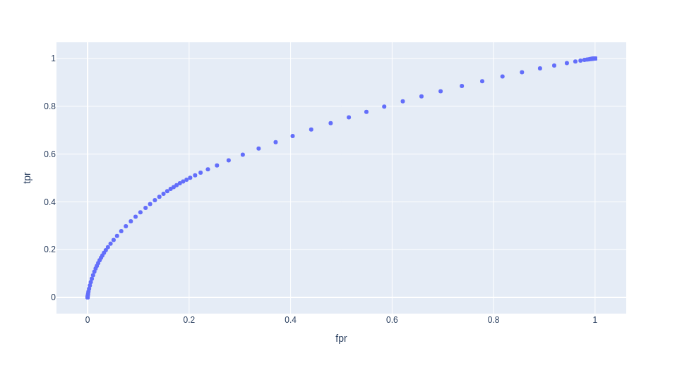
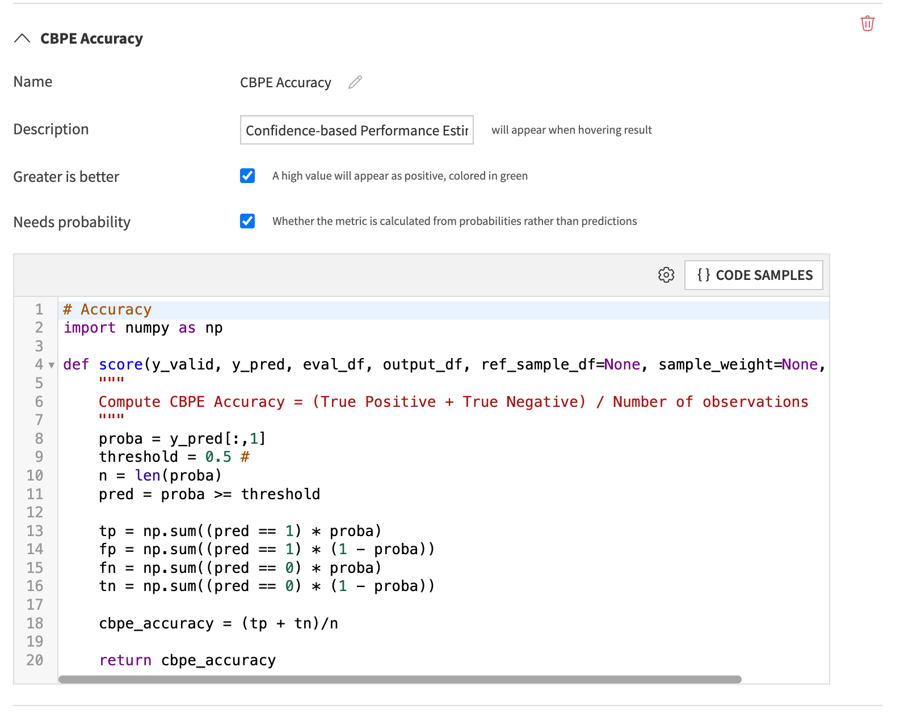

Predictive Model Maintenance for Binary Classification
######################################################

How can you predict performance before getting the ground truth?
****************************************************************

Once a model is trained on labeled data and evaluated on labeled holdout data it is time to deploy it into production.

The next step is to wait for the data on which the model has scored to be labeled
so we can assess its performance and decide whether to retrain it.

A risk arises when the time between scoring the data and labeling it with its ground truth is so long
that the model performance has already deteriorated.

This is where heuristic model performance metrics without ground truth
become crucial. Examples of those would be metrics like prediction or
data drift; both are built into the `Model Evaluation
Store <https://knowledge.dataiku.com/latest/mlops-o16n/model-monitoring/concept-model-evaluation-stores.html>`__.

In this tutorial, we will apply `Confidence-based Performance Estimation (CBPE) <https://nannyml.readthedocs.io/en/v0.4.1/how_it_works/performance_estimation.html>`__
to a Binary classification to estimate Model Accuracy and AUC from the predicted class probabilities.

CBPE is a concept introduced by Nanny ML.
To read more about how it works, please visit the links above.

Requirements
************

* Dataiku > 13.4
* Python Version >=3.9
* A code environment:
  
  * with the `visual machine learning` package set installed
  * with the following packages:
  
    .. code:: python
    
        plotly

Initial state & Assumptions
===========================
- Have a Deployed Binary Classification Model to the Flow
- The model predicted probabilities should be **well-calibrated**.
- There is a big enough set of unlabeled observations previously scored by our model.
- There should not be any concept drift - Data drift is accepted.

Through this tutorial, we will compute and estimate the Accuracy
and the AUC of the model on new, unseen, and unlabelled observations.

Importing the libraries
***********************

.. code:: python

    import dataiku
    import pandas as pd, numpy as np
    
    import plotly.express as px
    from dataikuapi.dss.modelevaluationstore import DSSModelEvaluationStore
    from datetime import datetime

We start by loading all of our score observations.

.. code:: python

    # Read recipe inputs
    new_records = dataiku.Dataset("TRANSACTIONS_unknown_scored")
    df = new_records.get_dataframe()

Compute the CBPE Model Accuracy
*******************************

We start by extracting the positive class probabilities and the number of observations from the input dataset, 

.. code:: python

    positive_outcome_proba_col = "proba_1"
    proba = df[positive_outcome_proba_col] # Probability of positive class
    n = len(df.index)

To convert the positive probabilities to predictions, we need to set a decision threshold.
In this tutorial, we set it to 0.5, but it can be changed based on the use case.

.. note::
    The Dataiku Lab automatically computes the Optimal Threshold best for optimizing the selected metric.

Given that the model probabilities are calibrated, we can extract each prediction's probability
to be  **True Positive**, **False Positive**, **False Negative** or **True Negative**.
We can then add all of these probabilities for each category which gives us the expected TP, FP, FN and TN amounts.

See `this <https://medium.com/towards-data-science/predict-your-models-performance-without-waiting-for-the-control-group-3f5c9363a7da>`__
blog post for more insight into how this works.

.. code:: python

    threshold = 0.5
    pred = proba >= threshold
    
    tp = np.sum((pred == 1) * proba)
    fp = np.sum((pred == 1) * (1 - proba))
    fn = np.sum((pred == 0) * proba)
    tn = np.sum((pred == 0) * (1 - proba))

With the TP, FP, FN, and TN computed, we can now compute classic performance metrics such as precision, recall, F1 score, average precision, etc.

Here is an example of how we can compute the CBPE Accuracy.

.. code:: python

    # Compute CBPE Accuracy = (True Positive + True Negative) / Number of observations
    cbpe_accuracy = (tp + tn)/n
    print (f"CBPE Accuracy : {cbpe_accuracy}")

Compute the CBPE Model ROC AUC
******************************

To compute a metric that is independent of the select threshold, we can compute the ROC AUC.

We need to compute :

- the **True Positive Rate** also known as **Recall** or **Sensitivity** 
- and the **False Positive Rate** also know as the **"false alarm rate"**.

for a set of thresholds ranging from 0 to 1.

.. code:: python

    # Compute CBPE AUC = Area under the True Positive Rate *
    #                    True Negative Rate Curve for every threshold.
    
    n_thresholds = 100 # Can be changed
    thresholds = [x /n_thresholds  for x in range(1, n_thresholds)]
    
    tprs = []
    fprs = []
    for threshold in thresholds:
        pred = proba >= threshold
        tp = np.sum((pred == 1) * proba)
        fp = np.sum((pred == 1) * (1 - proba))
        fn = np.sum((pred == 0) * proba)
        tn = np.sum((pred == 0) * (1 - proba))
    
        tprs.append(tp/(tp + fn)) # Correctly classified Positive Cases over ALL Positive Cases.
        fprs.append(fp/(fp + tn)) # Wrongly classified Negative Cases over ALL Negative Cases.

In order to visualize the generated ROC curve, we plot it using a plotly scatter plot.

.. code:: python

    px.scatter(pd.DataFrame({'fpr': fprs, 'tpr': tprs, "thresholds" : thresholds}),
               x="fpr",
               y="tpr",
               hover_data = "thresholds")

We can now compute the Area under the ROC curve.
We will use a built-in ``sklearn`` function to do this.

.. code:: python

    from sklearn.metrics import auc

    cbpe_roc_auc = auc(x=fprs, y=tprs)
    print(f"CBPE ROC-AUC : {cbpe_roc_auc}")

Saving the computed metrics to a Dataiku MES
********************************************

Now that our estimated model performances have been computed based on predictions made on real unlabelled data,
the next natural step is to save those metrics as MES Metrics.

In the following steps, we:

1. Fist need to format our metrics in a Dataiku MES format and add them to a list. 
2. Get a handle on the output MES (That you might have to create if it is not already done)
3. Add the metrics to the MES.

.. code:: python

    scores = []
    
    scores.append(
        DSSModelEvaluationStore.MetricDefinition(
            code="CBPE_ROC_AUC",
            value=cbpe_roc_auc,
            name="CBPE ROC-AUC",
            description="CBPE_ROC_AUC"
        ))
    scores.append(
        DSSModelEvaluationStore.MetricDefinition(
            code="CBPE Accuracy",
            value=cbpe_accuracy,
            name="CBPE Accuracy",
            description="CBPE Accuracy"
        )
    )
    
    mes = dataiku.api_client().get_default_project().get_model_evaluation_store("D7QrPRxd")
    eval_timestamp = datetime.now().isoformat()
    label = DSSModelEvaluationStore.LabelDefinition("evaluation:date", eval_timestamp)
    mes.add_custom_model_evaluation(scores, labels=[label])

Going further with the MES: Adding a Custom MES Metric
*******************************************************

Given that CBPE metrics only require a set of unlabelled evaluation datasets and the model's predictions,
we can go one step further and directly integrate these metrics in an MES
and have them computed at every new evaluate recipe run ;
the evaluate recipe is already computing metrics like prediction drift and concept drift. 

As of Dataiku 13.4, we can now add custom metrics to the MES, via the configuration of the evaluate recipe. 

Adding the following code, in the custom metrics of a MES, will allow the metrics to be computed every time it is needed.

.. code:: python

    # Accuracy
    import numpy as np

    def score(y_valid, y_pred, eval_df, output_df, ref_sample_df=None, sample_weight=None, **kwargs):
        """
        Compute CBPE Accuracy = (True Positive + True Negative) / Number of observations
        """
        proba = y_pred[:,1]
        threshold = 0.5 #
        n = len(proba)
        pred = proba >= threshold

        tp = np.sum((pred == 1) * proba)
        fp = np.sum((pred == 1) * (1 - proba))
        fn = np.sum((pred == 0) * proba)
        tn = np.sum((pred == 0) * (1 - proba))
        
        cbpe_accuracy = (tp + tn)/n
        
        return cbpe_accuracy
    
We also need to pay attention to the custom metric definition, as shown below.

    

Automate the retraining process
*******************************

Once the Metrics are added to an MES, you can `build
checks <https://knowledge.dataiku.com/latest/mlops-o16n/model-monitoring/basics/tutorial-index.html#create-a-check-on-a-mes-metric>`__
that can trigger the run of automatic maintenance tasks, such as notifying an ML Engineer
to automatically trigger a retraining on the model through a `Dataiku
Scenario <https://knowledge.dataiku.com/latest/automation/scenarios/concept-scenarios.html>`__.

Wrap Up
*******

In this notebook, we have computed CBPE performance metrics based on prediction probabilities made
on new unlabeled data. 
We then published these metrics to a Dataiku Model Evaluation Store plugged into an automatic notification
or a retraining pipeline.

This allows us to have and act upon performance insights much faster than if we had to wait for ground-truth data.

As a next step, we would recommend applying similar techniques to other
prediction types:

- Apply CBPE for `multi-label classification <https://nannyml.readthedocs.io/en/v0.4.1/how_it_works/performance_estimation.html#multiclass-classification>`__
- Apply DLE for `regression models <https://nannyml.readthedocs.io/en/v0.12.1/how_it_works/performance_estimation.html#direct-loss-estimation-dle>`__

