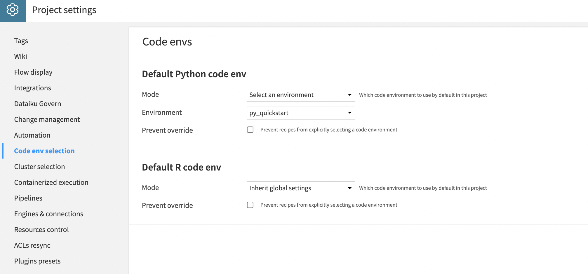
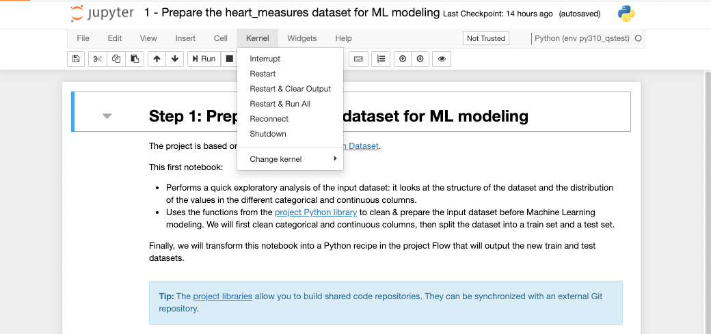

# Quickstart Tutorial

In this tutorial, you'll learn how to build a basic Machine Learning project in Dataiku, from data
exploration to model development, using mainly Jupyter Notebooks.

## Prerequisites

* Have access to a Dataiku 12+ instance.
* Create a Python>=3.9 code environment named `py_quickstart` with the following required packages:

```python
mlflow
scikit-learn>=1.0,<1.4
scipy<1.12.0
statsmodels
seaborn
```

  :::{admonition} Note
  :class: note
  In Dataiku, the equivalent of virtual environments is called a “code environment.”
  The [code environment documentation](https://doc.dataiku.com/dss/latest/code-envs/operations-python.html#create-a-code-environment) provides more information and instructions for creating a new Python code environment.
  :::

## Installation

### Import the project

On the Dataiku homepage, select **+ NEW PROJECT > Learning projects**. In the *Quick Start* section, select *Developers Quick Start*.

 Alternatively, you can download the project from [this page](https://cdn.downloads.dataiku.com/public/dss-samples/QS_DEVELOPERS/) and then upload it to your Dataiku instance: **+ NEW PROJECT > Import project**.

### Set the code environment

To ensure the code environment is automatically selected for running all the Python scripts in your project, we will change the project settings to use it by default.

- On the top bar, select **... > Settings > Code env selection**.
- In the **Default Python code env**:
  + Change **Mode** to `Select an environment`.
  + In the **Environment** parameter, select the code environment you've just created.
  + Click the `Save` button or do a `Ctrl+S`

{.image-popup}

## Set up the project

This tutorial comes with the following:

- a `README.md` file (stored in the project [Wiki](https://doc.dataiku.com/dss/latest/collaboration/wiki.html))
- an input dataset: the [Heart Failure Prediction Dataset](https://www.kaggle.com/datasets/fedesoriano/heart-failure-prediction)
- three Jupyter Notebooks that you will leverage to build the project
- a Python repository stored in the [project library](https://doc.dataiku.com/dss/latest/python-api/project-libraries.html), with some Python functions that
will be used in the different notebooks:

```{dropdown} [utils/data_processing.py](assets/utils/data_processing.py)

:::{literalinclude} assets/utils/data_processing.py
:language: python
:::
```

```{dropdown} [utils/model_training.py](assets/utils/model_training.py)

:::{literalinclude} assets/utils/model_training.py
:language: python
:::
```

The project aims to build a binary predictive Machine Learning model to predict the risk of heart failure based on health information. For that, you'll go through the standard steps of a Machine Learning project: data exploration, data preparation, machine learning modeling using different ML models, and model evaluation.

## Instructions

The project is composed of three notebooks (they can be found in the `Notebooks` section: **</> > Notebooks**) that you will run one by one. For each notebook:

1. Ensure you use the code environment specified in the **Prerequisites** (`py_quickstart`). You can change the Python kernel in the Notebook menu under **Kernel > Change Kernel**.
2. Run the notebook cell by cell.
3. For notebooks 1 and 3, follow the instructions in the last section of each notebook to build a new step in the project workflow.



You'll find the details of these notebooks and the associated outputs in the following sections:

```{toctree}
:maxdepth: 1

step1_data_preparation
step2_ml_experiment
step3_ml_deploy_and_eval
```
