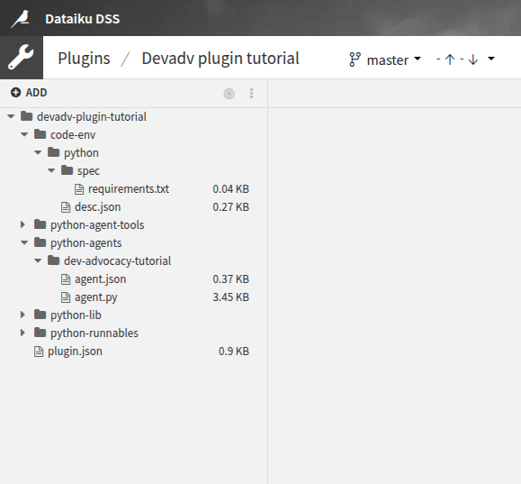
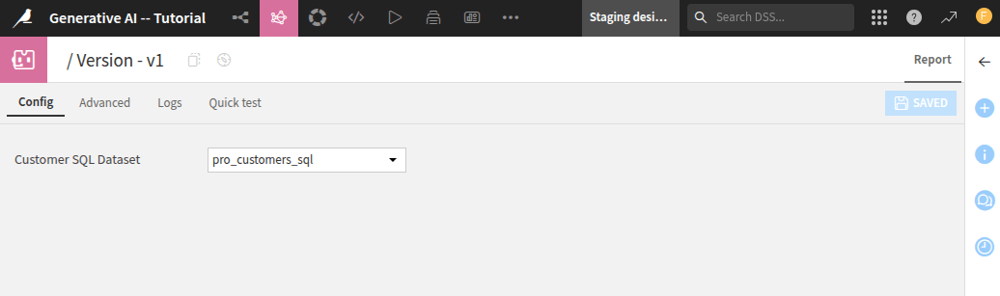

Creating a custom agent
***********************

This tutorial provides clear instructions for developing a custom agent in Dataiku.
It builds upon the essential knowledge gained from
the :doc:`/tutorials/genai/agents-and-tools/code-agent/index` tutorial,
enhancing your skills further.
By the conclusion of this guide, you will understand how to effectively package a Code Agent into a Custom Agent,
enabling its use across multiple projects.

Custom Agents differ significantly from project-specific Code Agents:
they function independently and are not linked to specific projects, datasets, or tools.
This autonomy allows for more versatile applications
but also requires thorough attention to the code environment and its associated dependencies.

Prerequisites
=============
* Dataiku >= 13.4
* Develop plugins permission
* A connection to an LLM, preferably an OpenAI connection
* Python >= 3.9

Introduction
============
This tutorial starts with the :doc:`/tutorials/genai/agents-and-tools/code-agent/index` tutorial.
You will learn how to package this Code Agent into a Custom agent,
allowing the user to use it across all projects where you may need this processing.
A custom agent is a broader version of a code agent in the sense that this agent is not tied to a project.
So, you should create an autonomous agent.
It is not tied to a project, so you can not rely on deployed tools; you should embed them if you need some tool.
Moreover, you can not rely on a particular **Dataset** (or other Dataiku objects) for the same reason.
As it may be executed in a context other than the one used at design time,
you should also pay attention to the code env of the plugin.

To develop a custom agent, you must first create a plugin.
Go to the main menu, click the **Plugins** menu, and select the **Write your own** from the **Add plugin** button.
Then, choose a meaningful name, such as "``toolbox``."
Once the plugin is created, click the **Create a code environment** button and select Python as the default language.
In the ``requirements.txt`` file (located in ``toolbox/code-env/python/spec``),
add the following requirements:

.. code-block:: python

    duckduckgo_search
    langchain_core
    langchain

Once you have saved the modification, go to the **Summary** tabs to build the plugin code environment.
The custom agent plugin will use this code environment when the agent is used.

Click the **+ New component** button, and choose the **Agent** component in the provided list,
as shown in :ref:`Figure 1<tutorials-plugins-agent-generality-new-agent-component-img>`.
Then, fill out the form by choosing a meaningful **Identifier**,
select the "Minimal agent template" as a **Starter code**, and click the **Add** button.

.. _tutorials-plugins-agent-generality-new-agent-component-img:

    Figure 1: New agent component.

Alternatively, you can select the **Edit** tab and, under the ``toolbox`` directory,
create a folder named ``python-agents``.
This directory is where you will find and create your custom agent.
Under this directory, create a directory with a meaningful name representing your agent's name.

Creating the agent
==================

Analyzing the tools
-------------------

The tutorial :doc:`/tutorials/genai/agents-and-tools/code-agent/index` uses two tools
(**Get Customer Info** and **Get Company Info**) to retrieve information about a user given their ID and a company given its name.
The **Get Company Info** uses the DuckDuckGo Python package to search the Internet for information about a company.
So, the only requirement for this tool is to have the Python packages in the plugin code env.

The **Get Customer Info** relies on a dataset to find information on a user given her ID.
As you cannot know the dataset's name in advance, you must ask the user its name.
This can be done in the **Config** section of an instantiated custom agent,
as shown in :ref:`Figure 2<tutorials-plugins-agent-generality-configuration-img>`.
To ask the user for a particular dataset, specify it in the ``agent.json`` file, 
as shown in :ref:`Code 1<tutorials-plugins-agent-generality-configuration-code>` (highlighted lines).

.. _tutorials-plugins-agent-generality-configuration-img:

    
    Figure 2: Configuration of an agent.
    
.. literalinclude:: ./assets/agent.json
    :language: json
    :caption: Code 1: configuration file -- ``agent.json``
    :name: tutorials-plugins-agent-generality-configuration-code
    :emphasize-lines: 9-14

Declaring the tools
-------------------

Once you have analyzed the plugin's requirements, you can start coding.
The easiest thing to do is create the tool **Get Company Info**;
there is nothing more to do than the usual work for creating a tool,
as shown in :ref:`Code 2<tutorials-plugins-agent-generality-get-company-info-code>`.
Highlighted lines show the classes and variables you should use to be able to run this tutorial.

.. literalinclude:: ./assets/agent.py
    :language: python
    :caption: Code 2: Get Company Info
    :name: tutorials-plugins-agent-generality-get-company-info-code
    :lines: 1-17,39-51
    :emphasize-lines: 1-16

Coding a custom agent with a parametrized tool requires minor plumbing.
When using a tool, the LLM provides information to the tool by feeding its inputs.
If the tool has several parameters, the LLM will provide input for all the parameters.
But you do not want the LLM to fill the dataset name.
So, this name should not be a parameter of the tool.
If you include the tool in the class handling the agent (see next section for more details on this class),
you must add the ``self`` parameter.
As previously explained, ``self`` should not be a parameter for the same reason.
Thus, you can not easily embed the tool in the agent's class.
An easy way to overcome these difficulties is to create a function to create the already parametrized tool,
as shown in :ref:`Code 3<tutorials-plugins-agent-generality-get-customer-info-code>`.

.. attention::
    The SQL query might be written differently depending on your SQL Engine.

.. literalinclude:: ./assets/agent.py
    :language: python
    :caption: Code 3: Get Customer Info
    :name: tutorials-plugins-agent-generality-get-customer-info-code
    :lines: 19-37

Coding the agent
----------------

Once the tools are created, you can focus on using these tools in your custom agent.
To create a custom agent, you must create a Python class that inherits from the ``BaseLLM`` class.
You also must define a ``set_config`` function to deal with the function's parameter (if you use parameters).
Moreover, you will also need a function to make the processing.
:ref:`Code 4<tutorials-plugins-agent-generality-agent-code>` shows the full implementation of the class.

.. literalinclude:: ./assets/agent.py
    :language: python
    :caption: Code 4: Code of the custom agent
    :name: tutorials-plugins-agent-generality-agent-code
    :lines: 53-82

Using the agent
===============

Once the custom agent has been coded, you can use it like any other agent.
For more information, please refer to the :ref:`refdoc:generative-ai-agent-introduction-using-agents` documentation.
If you want to use your custom agent, you should create a code agent by selecting the custom agent.

To list all agents that have been defined in a project,
you can use the :meth:`~dataikuapi.dss.project.DSSProject.list_llms()` and search for your agent.

.. code-block:: python

    import dataiku

    client = dataiku.api_client()
    project = client.get_default_project()

    llm_list = project.list_llms()
    for llm in llm_list:
        print(f"- {llm.description} (id: {llm.id})")

Running this code snippet will provide a list of all LLMs defined in the project.
You should see your agent in this list:

.. parsed-literal::

    - Agent - test guard (id: agent:2V8SR72P)
    - Agent - useCase4 (id: agent:44pVmkUi)
    - Agent - code (id: agent:4agXpWVO)
    - Agent - useCase5 (id: agent:GYrrlSns)
    - Agent - useCase1 (id: agent:IWX5i2Zh)
    - Agent - Visual (id: agent:Njgq8s9j)
    - Agent - Tutorial (id: agent:QRfIU99Z)
    - Agent - useCase2 (id: agent:aolFEv0W)
    - Agent - useCase3 (id: agent:hMRqhPVk)
    - Agent - Custom Agent tutorial (id: agent:iXqDRS08)

Once you know the agent's ID, you can use it to call the agent, as shown in the code below:

.. code-block:: python

    CODE_AGENT_ID = "agent:iXqDRS08"
    llm = project.get_llm(CODE_AGENT_ID)

    completion = llm.new_completion()
    completion.with_message('Give all the professional information you can about the customer with ID: fdouetteau. Also include information about the company if you can.')
    resp = completion.execute()
    resp.text

.. parsed-literal::

    "The customer's name is **Florian Douetteau**, and he holds the position of **CEO**
    at the company named **Dataiku**.\\n\\n### Company Information:\\n
    - **Company Name:** Dataiku\n- **Overview:** Dataiku is a global software company
    that specializes in machine learning and artificial intelligence. Founded in 2013,
    Dataiku aims to make data science accessible to everyone, helping businesses
    unlock the potential of artificial intelligence.
    Florian Douetteau, as a co-founder and CEO,
    has been instrumental in guiding the company's vision and operations."

Wrapping up
===========

Congratulations on finishing the tutorial for creating a custom agent in Dataiku.
You have effectively learned how to convert a Code Agent into a Custom Agent, a versatile tool for diverse projects.
By adhering to the steps in this tutorial, you have acquired the essential skills to develop a plugin,
set up the required code environment, and implement the agent's functionality.

Custom Agents need thoughtful planning to guarantee they operate efficiently in various contexts.
With this newfound knowledge, you can enhance your Dataiku projects using adaptable and reusable Custom Agents.

Here is the complete code of the custom agent:

.. dropdown:: :download:`agent.json<./assets/agent.json>`
    :open:

    .. literalinclude:: ./assets/agent.json
        :language: json

.. attention::
    The SQL query might be written differently depending on your SQL Engine.

.. dropdown:: :download:`agent.py<./assets/agent.py>`
    :open:

    .. literalinclude:: ./assets/agent.py
        :language: python

