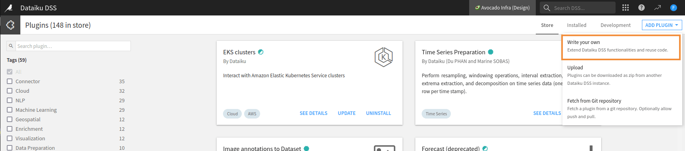
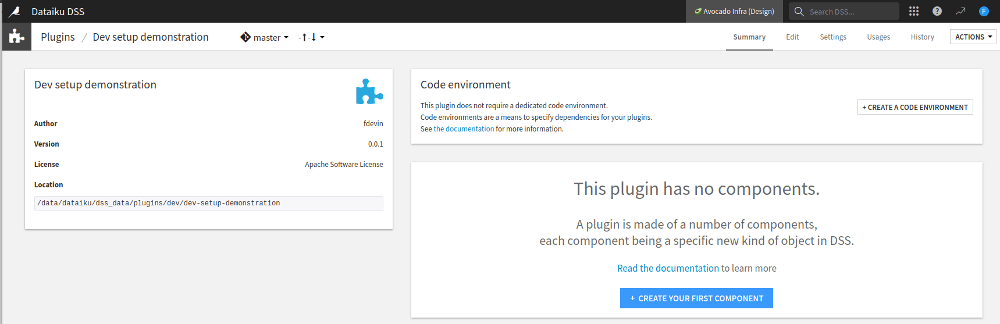
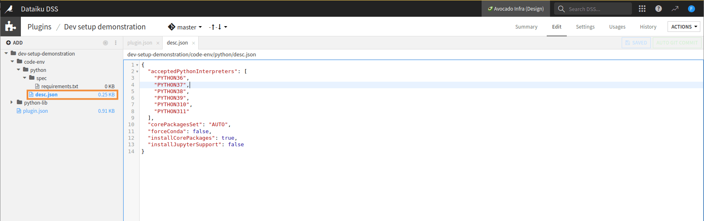
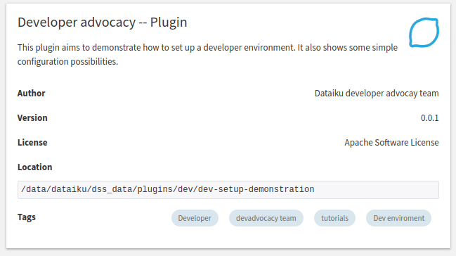

Creating and configuring a plugin
*********************************

This tutorial explains how to create and configure a plugin and why you should use a separate instance for plugin development.

Prerequisites
#############

The minimal prerequisites are:

* "Manage all code-envs" permission.
* "Develop plugins" permission.
* Dataiku.

It would be best to have:

* A dedicated Dataiku instance with admin rights (you can rely on the
  `community Dataiku instance <https://www.dataiku.com/product/get-started/>`_).

.. attention::

  We highly recommend a separate, dedicated instance for plugin development.
  That way, you can test and develop the plugin without affecting Dataiku projects or jeopardizing other users' experience.
  Attentive readers should **read this introduction first** (:doc:`Foreword<../foreword>`).

Plugin creation
###############

Although creating a plugin outside Dataiku is possible, we recommend not doing it this way.
It would be best if you let Dataiku complete the first initialization.
To do this, Go to the plugin page, click the **"ADD PLUGIN"** button,
and choose the **"Write your own"** option, as shown in :ref:`Fig. 1<tutorials_plugins_creation_configuration_write_your_own>`.

.. _tutorials_plugins_creation_configuration_write_your_own:

    Figure 1: Plugin creation -- first step.

This will create the correct directory structure and let you choose/create the code environment your plugin will use
once you have chosen a valid name for your plugin.
You can select any name you want, but we recommend following these rules:

* The plugin names must be in lowercase; the UI enforces this.
* The words must be separated by a -.
* The word order must be valid in English.
* The plugin name must not contain "plugin" or "custom". As you are developing a plugin,
  it is evident that this is a plugin for custom actions.

.. _tutorials_plugins_creation_configuration_plugin_creation_screen:

    Figure 2: Plugin creation screen.

Plugin configuration
####################

You will land on the screen shown in :ref:`Fig. 2<tutorials_plugins_creation_configuration_plugin_creation_screen>`.
If your plugin requires a specific code environment, click the **+ Create a code environment** button.
Adapt the ``desc.json`` file to your needs, and if you need particular packages,
fill in the ``requirements.txt`` file,
as shown in :ref:`Fig. 3<tutorials_plugins_creation_configuration_plugin_code_env_creation>`.
Then, in the **Summary** panel, click the **Build new environment** button.
n

.. _tutorials_plugins_creation_configuration_plugin_code_env_creation:

    Figure 3: Dedicated code environment creation for plugin development.

Plugin documentation
####################

.. literalinclude:: ./assets/plugin-generated.json
    :language: json
    :caption: Code 1: Default version of the ``plugin.json`` configuration file.
    :name: tutorials_plugins_creation_configuration_generated_json

The file ``plugin.json``, shown in :ref:`Code 1<tutorials_plugins_creation_configuration_generated_json>`,
is the configuration file for the plugin.
You should not change the ``"id"`` field and use semantic versioning for the ``"version"`` field.
The ``"meta"`` object is made of:

* ``"label"`` is used when Dataiku displays the plugin's name.
  As a plugin can contain many components, 
  the label should not be specific to a particular function but on a global naming representing the plugin.
* ``"description"`` is a longer text used by Dataiku when the UI has to display
  more information than only the plugin's name.
* ``"author"`` is the name of the plugin's author.
* ``"icon"`` is an icon representing your plugin.
* ``"recipesCategory"`` defines the category of plugin recipe components in the right panel. Allowed values are ``visual``, ``code``, ``genai`` or ``other``. If left empty recipes will simply appear in the "Plugin recipes" category.
* ``"tags"`` is a list of tags that help filter when searching for a plugin.
* ``"url"`` is a link to the plugin's documentation.
* ``"licenseInfo"`` is the license associated to your plugin.

For example, the :ref:`Fig. 4<tutorials_plugins_creation_configuration_configured_plugin>`
is obtained by using the :ref:`Code 2<tutorials_plugins_creation_configuration_json>`.

.. literalinclude:: ./assets/plugin.json
    :language: json
    :caption: Code 2: ``plugin.json`` configuration file.
    :name: tutorials_plugins_creation_configuration_json

.. _tutorials_plugins_creation_configuration_configured_plugin:

    
    Figure 4: Configuring the plugin.
    
