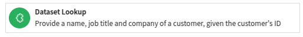
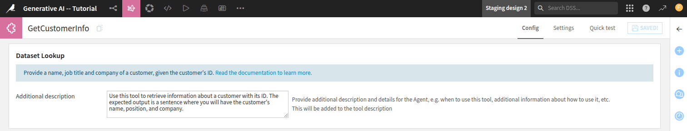
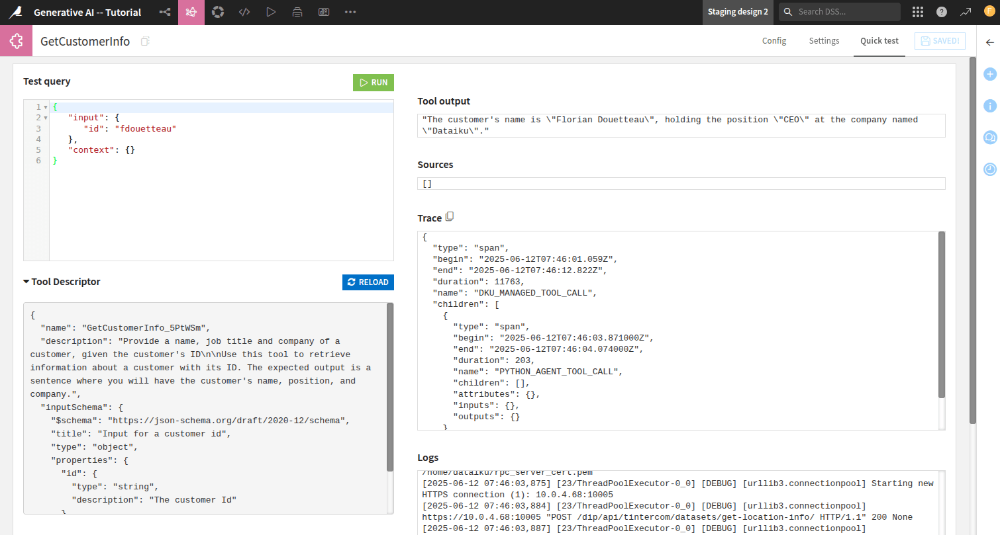

Creating a custom tool
**********************

.. meta::
  :description:
    This tutorial outlines the creation of a custom tool. 
    A custom tool is a plugin that provides the user with a tool that is usable in a visual agent.

This tutorial outlines the creation of a custom tool. 
By default, Dataiku provides some native generic tools
that are usable in :doc:`refdoc:agents/visual-agents`
and in :doc:`refdoc:agents/code-agents`
As tools depend very much on a company's business,
Dataiku could not provide every tool that each company would need.
Dataiku provides some general tools and a way to integrate specific tools.
This integration is done by using a custom tool.

Custom tools are the way to tailor tools to your company's business.
This tutorial relies on the same use case shown 
in :doc:`/tutorials/genai/agents-and-tools/agent/index`
and :doc:`/tutorials/genai/agents-and-tools/llm-agentic/index`.
The use case involves retrieving customer information based on a provided ID
and fetching additional data about the customer's company utilizing an internet search.
By the end of this tutorial, you will know how to create a custom tool and how to use it in a Visual agent.

Prerequisites
=============

You have followed the :doc:`/tutorials/plugins/creation-configuration/index` tutorial
or already know how to develop a plugin.

- Dataiku >= 13.4
- Develop plugins permission
- An SQL Dataset named ``pro_customers_sql``.
  You can create this file by uploading this :download:`CSV file</tutorials/genai/agents-and-tools/agent/assets/pro_customers.csv>`.

Creating the plugin environment
===============================

To develop a custom tool, you must first create a plugin.
Go to the main menu, click the **Plugins** menu, and select the **Write your own** from the **Add plugin** button.
Then, choose a meaningful name, such as "toolbox."
Once the plugin is created, click the **Create a code environment** button and select Python as the default language.
In the ``requirements.txt`` file (located in ``toolbox/code-env/python/spec``),
add the ``duckduckgo_search`` requirement.
Once you have saved the modification, go to the **Summary** tabs to build the plugin code environment.
The custom tool plugin will use this code environment when the tool is used.

Under the ``toolbox`` directory, create a folder named ``python-agent-tools``.
This directory is where you code custom tools.

Usually, creating a new component is done by clicking the **New component** button
and by choosing the **Agent tool** component.

.. _custom_tool_dataset_lookup_tool_link:

Creating the first tool -- Dataset Lookup
=========================================

The first tool you will create is the dataset lookup tool.
This tool is already provided by default in Dataiku, but for the sake of this tutorial,
you will need to re-implement a new one.
The default Dataiku tool is named **Look up a record in a dataset**.
It is more configurable than the one you will create.
However, understanding how to make a tool is the purpose of this tutorial.
Once you know, you can adapt the tool to meet your needs.

**Dataset lookup tool**: used to execute SQL queries on the ``pro_customers_sql`` dataset
to retrieve customer information (name, role, company), given a customer ID.
:ref:`Code 2<tutorials_plugins_custom_tools_generality_dataset_lookup_tool_py>` shows an implementation of this tool.

To create this tool, create a folder named ``dataset-lookup`` (for example) under the ``python-agent-tools`` directory.
In this folder, create two files: ``tool.json`` and ``tool.py``.
The ``tool.json`` file contains the description of the custom tool, like any other component,
and the ``tool.py`` contains the plugin's code.

:ref:`Code 1<tutorials_plugins_custom_tools_generality_dataset_lookup_tool_json>`
shows a possible configuration of this tool, 
and :ref:`Code 2<tutorials_plugins_custom_tools_generality_dataset_lookup_tool_py>` shows how to implement it.

.. literalinclude:: ./assets/dataset-lookup-tool.json
    :language: json
    :caption: Code 1: Dataset Lookup -- ``tool.json``
    :name: tutorials_plugins_custom_tools_generality_dataset_lookup_tool_json
    :emphasize-lines: 4-5

.. attention::
    The SQL query might be written differently depending on your SQL Engine.

.. literalinclude:: ./assets/dataset-lookup-tool.py
    :language: python
    :caption: Code 2: Dataset Lookup -- ``tool.py``
    :name: tutorials_plugins_custom_tools_generality_dataset_lookup_tool_py
    :emphasize-lines: 16-25

Once the plugin is saved, you can find the new tool in Dataiku.
To find your new tool, go to a project where you planned to use the tool,
go to the **GenAI** menu, select **Agent Tools**, and then click the **New agent tool** button.
Your tool is on the list, so you should be able to find a tool like the one shown in 
:ref:`Figure 1<tutorial-plugins-custom-tool-dataset-lookup-tool-image.png>`.
If your tool is not on the list, you may need to reload Dataiku to force Dataiku to reload the plugin. 
The title and the description come from the ``label`` and the ``description`` highlighted in
:ref:`Code 1<tutorials_plugins_custom_tools_generality_dataset_lookup_tool_json>`.

.. _tutorial-plugins-custom-tool-dataset-lookup-tool-image.png:

    Fig. 1: Custom tool visible in the list.

At the top of the modal, select a meaningful name for this tool: **Get Customer Info**, 
choose your custom tool, and click the **Create** button.
Your tool is ready for Dataiku to use.
However, you should enter an additional description,
as shown in :ref:`Figure 2<tutorial-plugins-custom-tools-dataset-lookup-tool-creation>`.
For example, you could enter the following description: 
"Use this tool when you need to retrieve information about a customer ID.
The expected output is the name, the job title, and the company." 
This helps the LLM to understand in which circumstance this tool should be used.

.. _tutorial-plugins-custom-tools-dataset-lookup-tool-creation:

    Fig. 2: Creation of a tool.

If you want to see your tool in action, click the **Quick test** tab,
provide the data you want to use, and click the **Run** button.
If everything goes well, you should go to something similar
to :ref:`Figure 3<tutorials-plugins-custom-tools-dataset-lookup-tool-test>`.
The ``inputSchema``, 
emphasized in :ref:`Code 2<tutorials_plugins_custom_tools_generality_dataset_lookup_tool_py>`, 
is mandatory. 
Dataiku uses it to provide the correct input to the tool.
You can find this ``inputSchema`` in the **Quick test** tab under the **Tool Schema** block,
as shown in :ref:`Figure 3<tutorials-plugins-custom-tools-dataset-lookup-tool-test>`. 

.. _tutorials-plugins-custom-tools-dataset-lookup-tool-test:

    Fig. 3: Testing a tool.

Using the tool with code
------------------------
After creating your custom tool, you can use it in any context where an LLM is applicable.
To list all tools that have been defined in a project,
you can use the :meth:`~dataikuapi.dss.project.DSSProject.list_agent_tools`.

.. code-block:: python

    import dataiku

    client = dataiku.api_client()
    project = client.get_default_project()

    project.list_agent_tools()

Running this code snippet will provide a list of all tools defined in the project.
You should see your tool in this list:

.. parsed-literal::

    [{'id': 'REDaiQN',
        'type': 'Custom_agent_tool_toolbox_internet-search',
        'name': 'Get Company Info'},
    {'id': 'SOy7zKq',
        'type': 'Custom_agent_tool_toolbox_dataset-lookup',
        'name': 'Get Customer Info'}]

Once you know the tool's ID, you can use it to call the tool, as shown in the code below:

.. code-block:: python

    tool = project.get_agent_tool('SOy7zKq')
    tool.run({"id":"fdouetteau"})

.. parsed-literal::

    {'output': 'The customer\'s name is "Florian Douetteau", holding the position "CEO" at the company named "Dataiku".',
     'trace': {'type': 'span',
      'begin': '2025-05-20T13:26:07.797Z',
      'end': '2025-05-20T13:26:07.841Z',
      'duration': 44,
      'name': 'DKU_MANAGED_TOOL_CALL',
      'children': [{'type': 'span',
        'begin': '2025-05-20T13:26:07.802000Z',
        'end': '2025-05-20T13:26:07.839000Z',
        'duration': 37,
        'name': 'PYTHON_AGENT_TOOL_CALL',
        'children': [],
        'attributes': {},
        'inputs': {},
        'outputs': {}}],
      'attributes': {'toolProjectKey': 'PROGRAMMATICRAGWITHDATAIKUSLLMMESHANDLANGCHAIN',
       'toolId': 'SOy7zKq',
       'toolType': 'Custom_agent_tool_devadv-plugin'}},
     'sources': []}

Wrapping up
===========
Congratulations! You now know how to create a custom tool and declare it usable by Dataiku.
You can now create a second tool (for searching over the internet)
and follow the :doc:`/tutorials/genai/agents-and-tools/visual-agent/index` tutorial.
Below, you will find a possible implementation of this tool.

Creating the second tool -- Internet search
-------------------------------------------

The second tool you will create is also provided by Dataiku,
which uses Google to search for information on the Internet.
In this tutorial, you will make a "Get Company Info" tool that uses the DuckDuckGo search engine.
The process to create the second tool is the same as the previous one.

Create a folder named ``internet-search`` (for example) under the ``python-agent-tools``,
and create also the two files: ``tool.json`` and ``tool.py``.
You will find a default implementation in codes 
:ref:`3<tutorials_plugins_custom_tools_generality_internet_search_tool_json>`
and :ref:`4<tutorials_plugins_custom_tools_generality_internet_search_tool_py>`, respectively.

.. dropdown:: Code 3: Internet Search -- ``tool.json``

    .. literalinclude:: ./assets/internet-search-tool.json
        :language: json
        :caption: Code 3: Internet Search -- ``tool.json``
        :name: tutorials_plugins_custom_tools_generality_internet_search_tool_json

.. dropdown:: Code 4: Internet Search -- ``tool.py``

    .. literalinclude:: ./assets/internet-search-tool.py
        :language: python
        :caption: Code 4: Internet Search -- ``tool.py``
        :name: tutorials_plugins_custom_tools_generality_internet_search_tool_py
