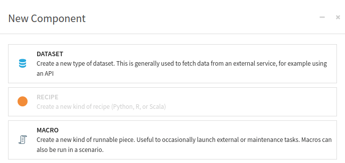

Creating a plugin Dataset component
*********************************************

Prerequisites
#############
* Dataiku >= 12.0
* Access to a dataiku instance with the "Develop plugins" permissions
* Access to an existing project with the following permissions:
    * "Read project content."
    * "Write project content."
* Access to an existing plugin

It would be best to have:

* A dedicated Dataiku instance with admin rights (you can rely on the
  `community Dataiku instance <https://www.dataiku.com/product/get-started/>`_).

.. attention::

  We highly recommend a separate, dedicated instance for plugin development.
  That way, you can test and develop the plugin without affecting Dataiku projects or jeopardizing other users' experience.
  Attentive readers should **read this introduction first** (:doc:`Foreword<../../foreword>`).

Introduction
############

Dataiku's Plugin Dataset component provides users with a flexible approach to creating
and integrating custom datasets into their data projects.
It allows users to import and work with data from their specific sources,
expanding the range of data and formats they can use in Dataiku.
This enables users to integrate their unique data sources and leverage the full power of Dataiku for data preparation,
analysis, and modeling.

The plugin Dataset component is particularly useful for working with specialized data sources, APIs,
or data generation processes not supported natively in Dataiku.
Users can write custom code to fetch data from APIs, databases,
or other sources and apply any necessary transformations or preprocessing steps to suit their needs.

Creating custom datasets in Dataiku using the plugin Dataset component has several benefits:

1. Users have complete control over the data fetching and transformation process,
   allowing them to customize it according to their requirements.
2. Custom datasets can seamlessly integrate with other features in Dataiku, such as recipes, visualizations,
   and models.
   This allows users to leverage the custom datasets in data pipelines, workflows, and machine learning projects.
3. Custom datasets can be reused across multiple projects within Dataiku,
   saving time and effort by eliminating the need to recreate the same data fetching and
   transformation logic for each project.

Finally, the plugin Dataset component provides:

- An extensible framework for adding new data sources or formats to Dataiku.
- Allowing users to contribute or share their plugins with the Dataiku community.
- Expanding the platform's capabilities.

Overall, the plugin Dataset component empowers users to work with diverse and unique data sources,
customize data processing workflows, and seamlessly integrate custom datasets into their data projects in Dataiku.

Dataset component creation
##########################

To create a plugin Dataset component, go to the plugin editor, click the **+ New component** button
(:ref:`Fig. 1<tutorial_plugin_dataset_generality_new_component>`),
and choose the Dataset component (:ref:`Fig. 2<tutorial_plugin_dataset_generality_new_dataset_component>`).
If you do not already have a plugin created,
you can follow this tutorial (:doc:`/tutorials/plugins/creation-configuration/index`).

.. _tutorial_plugin_dataset_generality_new_component:

.. figure:: ./assets/new-component.png
   :alt: Figure 1: New component
   :align: center
   :class: with-shadow image-popup

   Figure 1: New component

.. _tutorial_plugin_dataset_generality_new_dataset_component:

   Figure 2: New macro component

This will create a subfolder named ``python-connectors`` in your plugin directory.
Within this subfolder, a subfolder with the name of your dataset will be created.
You will find two files in this subfolder: ``connector.json`` and ``connector.py``.
The ``connector.json`` file configures your dataset, while the ``connector.py`` file is used for processing.

Dataset default configuration
#############################

:ref:`Code 1<tutorial_plugin_dataset_generality_generated_json>` shows the default configuration file generated by
Dataiku.
The file includes standard objects like ``"meta"``, ``"params"``, and ``"permissions"``,
which are expected for all components.
For more information about these generic objects, please refer to :doc:`refdoc:plugins/reference/plugins-components`.

.. literalinclude:: ./assets/connector-default.json
   :caption: Code 1: Generated dataset configuration
   :language: javascript
   :name: tutorial_plugin_dataset_generality_generated_json

Dataset default code
####################

:ref:`Code 2<tutorial_plugin_dataset_generality_generated_python>` shows the default code generated by Dataiku.
This code is spread into two classes: ``MyConnector`` and ``CustomDatasetWriter``.
You only have to define the last one if you plan to save data in your custom format
(then you should also set ``"writable"`` to ``true`` in the configuration file).

.. literalinclude:: ./assets/connector-default.py
   :caption: Code 2: Generated dataset code
   :language: python
   :name: tutorial_plugin_dataset_generality_generated_python
   :emphasize-lines: 15,112

The ``MyConnector`` class is designed to help you to get started quickly.
In the comments of this class, you will find the description of all functions.

Example of processing
#####################

As a straightforward  example, you will create a Dataiku's Plugin Dataset component to generate random data.
To generate random data, you need:

* The size of the dataset you want to create.
* The name of the columns you want to create.
* For each column, the data type of this column.

Considering this, you will have a configuration equivalent to :ref:`Code 3<tutorial_plugin_dataset_generality_configuration_random_data>`.

.. literalinclude:: ./assets/connector.json
   :caption: Code 3: Configuration for generating random data
   :language: javascript
   :name: tutorial_plugin_dataset_generality_configuration_random_data

Once you know which columns you need to create, the code for generating data is simple, with their associated types.
The highlighted lines in :ref:`Code 4<tutorial_plugin_dataset_generality_code_random_data>` show how to fill in the required types
if the user doesn't provide enough information.

The ``generate_random_data`` in :ref:`Code 4<tutorial_plugin_dataset_generality_code_random_data>`
should have been put into a library, but for the simplicity of this tutorial, it has been placed at the beginning of the file.

.. literalinclude:: ./assets/connector.py
   :caption: Code 4: Code
   :language: python
   :name: tutorial_plugin_dataset_generality_code_random_data
   :emphasize-lines: 36-40

Wrapping up
###########

Congratulations on finishing this tutorial! You now know how to create a Dataiku's Plugin Dataset component.
You can generate a dataset from an external API if you want to go further.

Here are the complete versions of the code presented in this tutorial:

.. dropdown:: connector.json

    .. literalinclude:: ./assets/connector.json
        :language: json

.. dropdown:: connector.py

    .. literalinclude:: ./assets/connector.py
        :language: python