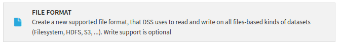
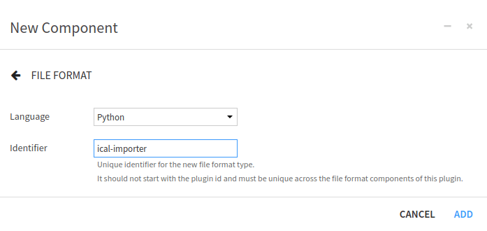
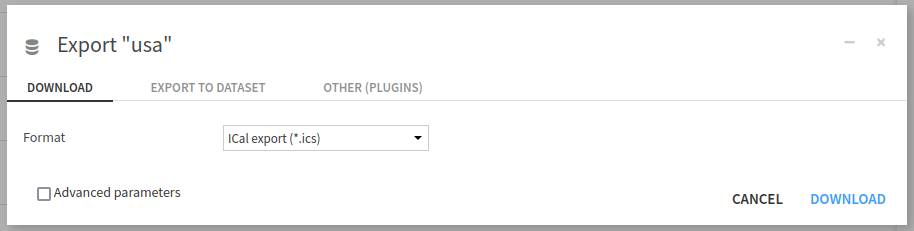

Writing a plugin File Format component to allow ICal import in Dataiku
**********************************************************************

Prerequisites
#############

* Dataiku >= 11.0;
* "Develop plugins" permission on the instance;
* A Python code environment with the ``ics`` package installed (either in the plugin requirement
  or in the associated code env);
* Some familiarity with the ICal format.

This tutorial was written with Python 3.9 and ``ics==0.7.2``.

Context
#######
The ICal file format is a format that allows users to store (and exchange) scheduling events (and some other things).
When we import an ICal file into Dataiku, it is detected as a CSV file. This results in creating a Dataset that does
not represent the events in the file. As calendar events are likely dynamics, we do not import files but rather
import Dataset via an API that provides the ICal events.  This can be done by using
the Dataset Plugin Component. However, we can upload a file containing events using this format.

To be able to import that kind of file, we need to create a File Format Plugin Component.

Create a File Format Component Plugin
#####################################

.. important::
    As we rely on the ``ics`` python library, please ensure this library is included in the Plugin Code
    Environment. Please refer to :doc:`this documentation<refdoc:plugins/reference/other>` for more information about
    Plugin Code Environment.

For more information about File Format Plugin Component, please refer to :doc:`refdoc:plugins/reference/file-format`.

To create a File Format Plugin Component, we have to create it from the Plugin Component interface (for more
information on Plugin development, please see :doc:`refdoc:plugins/reference/index`) and choose "new component"
(:ref:`Fig. 1<tutorial_plugin_file_format_new_component>`).

.. _tutorial_plugin_file_format_new_component:

.. figure:: ../../assets/plugins-new-components.png
    :alt: Figure 1: Plugin new component.
    :align: center
    :class: with-shadow image-popup

    Figure 1 : New component.

And then, choose the File Format Component (:ref:`Fig. 2<tutorial_plugin_file_format_new_file_format_component>`).

.. _tutorial_plugin_file_format_new_file_format_component:

    Figure 2: New File Format Component.

And fill out the form to create a File Format by choosing a good name for the File Format (here, ``ical-importer``), as
shown in :ref:`Fig. 3<tutorial_plugin_file_format_new_file_format_form>`.

.. _tutorial_plugin_file_format_new_file_format_form:

    Figure 3: Form for new File Format Component.

File Format Configuration
#########################

Description
^^^^^^^^^^^

The configuration of the File Format is done in the ``format.json`` file. Each component plugin begins with a ``meta``
section that contains the name of the component (``label``), the description of the component (``description``), and
an icon to represent the component (``icon``). For this File Format, we could have written:

.. code-block:: json
    :caption: Code 1: File Format description.
    :name: tutorial_plugin_file_format_code_file_format_description

    "meta": {
        "label": "ICal Importer",
        "description": "This File Format allows the user to import the events contained in an ICal file",
        "icon": "icon-calendar"
    },

.. _.. _tutorial_plugin_file_format_description:

    Figure 4: File format description.

Global Configuration
^^^^^^^^^^^^^^^^^^^^
As File Format has specific options, we must specify them in the configuration file. For more information, please
see :doc:`refdoc:plugins/reference/file-format`. We will build a simple file format plugin to demonstrate how
it works. The specific configuration will be as shown in
:ref:`Code 2<tutorial_plugin_file_format_code_file_format_specific_configuration>`

.. code-block:: json
    :caption: Code 2: File Format description.
    :name: tutorial_plugin_file_format_code_file_format_specific_configuration

    /* whether the format can be selectable as a dataset format */
    "canBeDatasetFormat": true,

    /* whether the format can be used to read files. If true, the get_format_extractor() must return an extractor */
    "canRead": true,

    /* whether the format can be used to write files. If true, the get_output_formatter() must return a formatter */
    "canWrite": true,

    /* whether the format can provide the schema without reading the data. If true, the FormatExtractor must implement read_schema() */
    "canExtractSchema": true,

    /* A mime type to use when exporting (if not set: the format is assumed to produce binary data) */
    "mime": {
        /* the mime-type sent to the browser */
        "mimeType": "text/plain",
        /* DSS creates file names by concatenating a unique identifier and this extension */
        "extension": ".ics"
    },

    /* to get additional options in the export dialogs, list them here */
    "exportOptions": [
        {
            "id": "option1",
            "label": "ICal export (*.ics)",
            "predefinedConfig": {
                "prodid": "-//Dataiku//Dataiku//EN"
            },
            "compression": "None"
        }
    ]

.. _tutorial_plugin_file_format_section_using_file_format:

Using the File Component Plugin
^^^^^^^^^^^^^^^^^^^^^^^^^^^^^^^

This File Format Component will have the ability to:

- Read an ICal file (``"canRead": true``). This means that Dataiku can read an ICal file and create a
  dataset from this file when we upload a dataset (either by dropping it in the flow or by clicking the
  "+New Dataset" button and choosing the "Upload your files"), as shown in
  :ref:`Fig. 5<tutorial_plugin_file_format_import_files>`.

  .. _tutorial_plugin_file_format_import_files:
  
  .. figure:: ../../assets/file-format-import-files.png
      :align: center
      :class: with-shadow image-popup
      :alt: Figure 5: Upload files in Dataiku.

      Figure 5: Upload files in Dataiku.

  Then click the "Configure Format" button, and select the appropriate format, as shown in
  :ref:`Fig. 6<tutorial_plugin_file_format_choose_type>`.

  .. _tutorial_plugin_file_format_choose_type:

  .. figure:: ../../assets/file-format-choose-type.png
      :align: center
      :class: with-shadow image-popup
      :alt: Figure 6: Choosing the file format.

      Figure 6: Choosing the file format.

- To enable writing to an ICal file ("canWrite": true), it's important not to confuse it with exporting.
  Exporting is used for downloading a dataset in a specific format, while writing, in the context of Dataiku,
  refers to the ability to create an output dataset in a particular file format.
  We can edit the Dataset settings within the "Preview" tab to set the desired file format for writing.

- Export a Dataset to ICal format. This feature is meant to be used with the option ``"mime"`` and
  ``"exportOptions"``.

Coding the File Format
######################

Analysis and inputs
^^^^^^^^^^^^^^^^^^^

ICal file format is pretty simple, and we don't want to deal with many options, so our File Format Component only
requires a few input and output parameters, except for the export feature. An ICal file contains a
``PRODID`` field that may be configured when exporting. So we will make this field configurable, with a default value.

Configuration
^^^^^^^^^^^^^
The full ``format.json`` is shown in :ref:`Code 3<tutorial_plugin_file_format_code_configuration_file>`.

.. code-block:: javascript
    :caption: Code 3: ``format.json``
    :name: tutorial_plugin_file_format_code_configuration_file

    {
        "meta" : {
            "label": "ICal Format",
            "description": "Import Vcal/ICal into Dataiku",
            "icon": "icon-globe"
        },
        "canBeDatasetFormat": true,
        "canRead": true,
        "canWrite": true,
        "canExtractSchema": true,
        "mime" : {
            "mimeType": "text/plain",
            "extension": ".ics"
        },
        "exportOptions": [
            {
              "id": "option1",
              "label": "ICal export (*.ics)",
              "predefinedConfig": {
                "prodid": "-//Dataiku//Dataiku//EN"
              },
              "compression": "None"
            }
        ],
        "params": [
            {
                "name": "prodid",
                "type": "STRING",
                "description": "This property specifies the identifier for the product that created the iCalendar object.",
                "label": "PRODID"
            }
        ]
    }

Main class
^^^^^^^^^^
Now we have correctly defined and configured the File Format Component. We have to code the extractor
(to extract the data from the file, aka input) and the output. The File Format Component code defines one main class,
which defines the ``output_formatter`` (to be able to write a dataset in a specific format), and the
``format_extractor`` (for reading a file and creating a dataset), as shown in
:ref:`Code 4<tutorial_plugin_file_format_code_main_class>`. This is the default code created by Dataiku.
Like many Python classes, this code defines an ``__init__`` function. This is where we can process the File Format
parameter if we have some. Then it defines two obvious functions.

.. code-block:: python
    :name: tutorial_plugin_file_format_code_main_class
    :caption: Code 4: Main class of the File Format Component

    import os
    import logging
    import time

    import ics
    from ics import Calendar, Event

    import dataiku.base.block_link
    # import the base class for the custom format
    from dataiku.customformat import Formatter, OutputFormatter, FormatExtractor

    import json, base64, datetime

    class MyFormatter(Formatter):

        def __init__(self, config, plugin_config):
            """
            The configuration parameters set up by the user for the formatter instance
            are passed as a json object 'config' to the constructor.
            The static configuration parameters set up by the developer in the optional
            file settings.json at the root of the plugin directory are passed as a json
            object 'plugin_config' to the constructor
            """
            Formatter.__init__(self, config, plugin_config)  # pass the parameters to the base class
            self.prodid = config.get("prodid", "")
            if not(self.prodid):
                self.prodid = "-//Dataiku//Dataiku//EN"

        def get_output_formatter(self, stream, schema):
            """
            Return a OutputFormatter for this format
            :param stream: the stream to write the formatted data to
            :param schema: the schema of the rows that will be formatted (never None)
            """
            return MyOutputFormatter(stream, schema, self.prodid)

        def get_format_extractor(self, stream, schema=None):
            """
            Return a FormatExtractor for this format
            :param stream: the stream to read the formatted data from
            :param schema: the schema of the rows that will be extracted. None when the extractor is used to detect the format.
            """
            return MyFormatExtractor(stream, schema)

Reading the input file
^^^^^^^^^^^^^^^^^^^^^^
ICal file format is composed of one global object: ``VCALENDAR``. It can contain more than one calendar object, but
this is outside the scope of this plugin component. Inside the calendar object, we can find several components. Each
one is defined similarly, with one line per property. As we do not want to write complex code, we will rely on the
``ics`` python library. Unfortunately, this library does not provide a way to read the input from a stream, and the
File Format Component provides a stream as input. So we have to read the stream before processing the events. This
is the purpose of the ``__init__`` function.

Each event has several properties, so we must define which property we want to extract. As a dataset has
a fixed schema, we also need to define this fixed schema. We could let Dataiku infer the schema from the
read data, but here we will provide a fixed schema (in the ``read_schema`` function).

Then, we need a function (``read_row``) to provide a new dataset row (one row, one event).

The whole process for reading an ICal file is shown in :ref:`Code 5<tutorial_plugin_file_format_code_format_extractor>`.

.. code-block:: python
    :name: tutorial_plugin_file_format_code_format_extractor
    :caption: Code 5: The ``format_extractor`` class

    class MyFormatExtractor(FormatExtractor):
        """
        Reads a stream in a format to a stream of rows
        """

        def __init__(self, stream, schema):
            """
            Initialize the extractor
            :param stream: the stream to read the formatted data from
            """
            FormatExtractor.__init__(self, stream)
            cal = "\n".join([line.decode('utf-8') for line in stream.readlines()])
            self.calendar = ics.Calendar(cal)
            self.events = [self.event_to_dict(event) for event in list(self.calendar.events)]
            self.count_events = len(self.events)
            self.read = 0

        def read_schema(self):
            """
            Get the schema of the data in the stream, if the schema can be known upfront.
            """
            return [{"name": "Title", "type": "STRING"},
                    {"name": "Start", "type": "STRING"}]

        def event_to_dict(self, event: Event):
            """
            Transform an event into a dict
            :param event: the event to read
            :return: the dict containing the extracted information.
            """
            start = getattr(event, "begin", "")
            if start:
                start = event.begin.datetime.isoformat()

            return {
                "Title": getattr(event, "name", ""),
                "Start": start
            }

        def read_row(self):
            """
            Read one row from the formatted stream
            :returns: a dict of the data (name, value), or None if reading is finished
            """
            if self.read < self.count_events:
                event = self.events[self.read]
                self.read = self.read + 1
                return event

            return None

Writing to a file
^^^^^^^^^^^^^^^^^
This is an optional feature of the File Format Component, and most of the time, we won't need to write
the ``ouput_formatter`` class.

Writing to an output file is both simple and challenging. Simple because we only have to produce a file with the same
format as the input file. So in our case, we have to write a header with the correct definition of the calendar
file. Then we need to produce a ``VEVENT`` object for each row of the dataset. And finally, write the footer, which
is the closing tag for the calendar. This is quite simple.

The challenging part comes when you want to deal with a dataset where we do not know the order of the column's schema. The
output formatter always comes with the dataset's schema, an array of dicts. Each dict represents a column,
with the name and the type of the column. Then for each row, we have the data in the same order. So to make a robust
output formatter, we have to analyze the schema and guess which field matches the data we want to write. This is
especially true when we allow the File Format Plugin Component to export to ICal format, as the export should be as
generic as possible or configurable to deal with many Dataset formats. This goes far beyond the scope of this tutorial.
So we won't deal with that.

As we want to let the user specifies its producer (for the ``PRODID`` field), we need to retrieve the value from
the config and use it in the ``OutputFormatter``. The first step of this retrieval has been done in
:ref:`Code 4<tutorial_plugin_file_format_code_main_class>`.

:ref:`Code 6<tutorial_plugin_file_format_code_output_formatter>` shows a straightforward implementation of this feature.

.. code-block:: python
    :name: tutorial_plugin_file_format_code_output_formatter
    :caption: Code 6: The ``output_formatter`` class

    class MyOutputFormatter(OutputFormatter):
        """
        Writes a stream of rows to a stream in a format. The calls will be:

        * write_header()
        * write_row(row_1)
          ...
        * write_row(row_N)
        * write_footer()

        """

        # prodid parameter should be initialized in the MyFormatter class
        def __init__(self, stream, schema, prodid):
            """
            Initialize the formatter
            :param stream: the stream to write the formatted data to
            :param prodid: the value of the parameter PRODID
            """
            OutputFormatter.__init__(self, stream)
            self.schema = schema
            self.prodid = prodid

        def write_header(self):
            """
            Write the header of the format (if any)
            """
            self.stream.write(u"BEGIN:VCALENDAR\n".encode())
            self.stream.write(u"PRODID:{}\n".format(self.prodid).encode())
            self.stream.write(u"VERSION:2.0\n".encode())
            self.stream.write(u"CALSCALE:GREGORIAN\n".encode())
            self.stream.write(u"METHOD:PUBLISH\n".encode())
            self.stream.write(u"X-WR-CALNAME:Calendar Name\n".encode())
            self.stream.write(u"X-WR-TIMEZONE:Europe/Paris\n".encode())

        def write_row(self, row):
            """
            Write a row in the format
            :param row: array of strings, with one value per column in the schema
            """
            self.stream.write(u"BEGIN:VEVENT\n".encode())
            self.stream.write(u"SUMMARY:{}\n".format(row[0]).encode())
            self.stream.write(u"DTSTART:{}\n".format(row[1]).encode())
            self.stream.write(u"END:VEVENT\n".encode())

        def write_footer(self):
            """
            Write the footer of the format (if any)
            """
            self.stream.write(u"END:VCALENDAR\n".encode())

Complete code of the plugin component
#####################################

:ref:`Code 7<tutorial_plugin_file_format_code_complete_code>` shows the complete code of the plugin.

.. code-block:: python
    :caption: Code 7: Complete code
    :name: tutorial_plugin_file_format_code_complete_code

    import os
    import logging
    import time

    import ics
    from ics import Calendar, Event

    import dataiku.base.block_link
    # import the base class for the custom format
    from dataiku.customformat import Formatter, OutputFormatter, FormatExtractor

    import json, base64, datetime

    """
    A custom Python format is a subclass of Formatter, with the logic split into
    OutputFormatter for outputting to a format, and FormatExtractor for reading
    from a format

    The parameters it expects are specified in the format.json file.

    Note: the name of the class itself is not relevant.
    """

    class MyFormatter(Formatter):

        def __init__(self, config, plugin_config):
            """
            The configuration parameters set up by the user for the formatter instance
            are passed as a json object 'config' to the constructor.
            The static configuration parameters set up by the developer in the optional
            file settings.json at the root of the plugin directory are passed as a json
            object 'plugin_config' to the constructor
            """
            Formatter.__init__(self, config, plugin_config)  # pass the parameters to the base class
            self.prodid = config.get("prodid", "")
            if not(self.prodid):
                self.prodid = "-//Dataiku//Dataiku//EN"

        def get_output_formatter(self, stream, schema):
            """
            Return a OutputFormatter for this format
            :param stream: the stream to write the formatted data to
            :param schema: the schema of the rows that will be formatted (never None)
            """
            return MyOutputFormatter(stream, schema, self.prodid)

        def get_format_extractor(self, stream, schema=None):
            """
            Return a FormatExtractor for this format
            :param stream: the stream to read the formatted data from
            :param schema: the schema of the rows that will be extracted. None when the extractor is used to detect the format.
            """
            return MyFormatExtractor(stream, schema)

    class MyOutputFormatter(OutputFormatter):
        """
        Writes a stream of rows to a stream in a format. The calls will be:

        * write_header()
        * write_row(row_1)
          ...
        * write_row(row_N)
        * write_footer()

        """

        def __init__(self, stream, schema, prodid):
            """
            Initialize the formatter
            :param stream: the stream to write the formatted data to
            :param prodid: the value of the parameter PRODID
            """
            OutputFormatter.__init__(self, stream)
            self.schema = schema
            self.prodid = prodid

        def write_header(self):
            """
            Write the header of the format (if any)
            """
            self.stream.write(u"BEGIN:VCALENDAR\n".encode())
            self.stream.write(u"PRODID:{}\n".format(self.prodid).encode())
            self.stream.write(u"VERSION:2.0\n".encode())
            self.stream.write(u"CALSCALE:GREGORIAN\n".encode())
            self.stream.write(u"METHOD:PUBLISH\n".encode())
            self.stream.write(u"X-WR-CALNAME:Calendar Name\n".encode())
            self.stream.write(u"X-WR-TIMEZONE:Europe/Paris\n".encode())

        def write_row(self, row):
            """
            Write a row in the format
            :param row: array of strings, with one value per column in the schema
            """
            self.stream.write(u"BEGIN:VEVENT\n".encode())
            self.stream.write(u"SUMMARY:{}\n".format(row[0]).encode())
            self.stream.write(u"DTSTART:{}\n".format(row[1]).encode())
            self.stream.write(u"END:VEVENT\n".encode())

        def write_footer(self):
            """
            Write the footer of the format (if any)
            """
            self.stream.write(u"END:VCALENDAR\n".encode())

    class MyFormatExtractor(FormatExtractor):
        """
        Reads a stream in a format to a stream of rows
        """

        def __init__(self, stream, schema):
            """
            Initialize the extractor
            :param stream: the stream to read the formatted data from
            """
            FormatExtractor.__init__(self, stream)
            # self.columns = [c['name'] for c in schema['columns']] if schema is not None else None

            cal = "\n".join([line.decode('utf-8') for line in stream.readlines()])
            self.calendar = ics.Calendar(cal)
            self.events = [self.event_to_dict(event) for event in list(self.calendar.events)]
            self.count_events = len(self.events)
            self.read = 0

        def read_schema(self):
            """
            Get the schema of the data in the stream, if the schema can be known upfront.
            """
            return [{"name": "Title", "type": "STRING"},
                    {"name": "Start", "type": "STRING"}]

        def event_to_dict(self, event: Event):
            """
            Transform an event into a dict
            :param event: the event to read
            :return: the dict containing the extracted information.
            """
            start = getattr(event, "begin", "")
            if start:
                start = event.begin.datetime.isoformat()

            return {
                "Title": getattr(event, "name", ""),
                "Start": start
            }

        def read_row(self):
            """
            Read one row from the formatted stream
            :returns: a dict of the data (name, value), or None if reading is finished
            """
            if self.read < self.count_events:
                event = self.events[self.read]
                self.read = self.read + 1
                return event

            return None

Testing the plugin
^^^^^^^^^^^^^^^^^^

To test this plugin, we need to have the complete code written (either by copying/pasting
:ref:`Code 7<tutorial_plugin_file_format_code_complete_code>` or following the tutorial).

And we need an ICS file, for example, the bank holidays of:

* `USA <https://www.officeholidays.com/ics-fed/usa>`_
* `France <https://www.officeholidays.com/ics-local-name/france>`_
* any `other countries <https://www.officeholidays.com/countries>`_

Once we have an ICS file, we can upload it in Dataiku by following the steps described in
:ref:`tutorial_plugin_file_format_section_using_file_format`.

We can also test the writing part of the tutorial by selecting the newly created dataset and choosing the "Export"
action on the right panel. Then select "Ical export (\*.ics)" as "Format" in the "Download" tab, as shown in
:ref:`Fig. 7<tutorial_plugin_file_format_file_format_export_file>`.

.. _tutorial_plugin_file_format_file_format_export_file:

    Figure 7: Export a dataset as an ICal file.

Conclusion
##########
We have written a File Format Plugin Component, which lets users import a specific file format into Dataiku. We could
have written a better parser for reading the file using the provided stream directly. But we want to focus on how
to write this Plugin Component instead of how to parse a file.

This component also provides a way to write a Dataset in a specific file format. Again, this could have been improved,
but we want to highlight how to do it in the simplest way. By the way, File Format Plugin Component does not require
the developer to provide this feature.

If we want to import Datasets from an API, we should write a Dataset Plugin Component.
