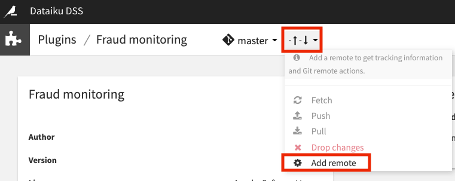
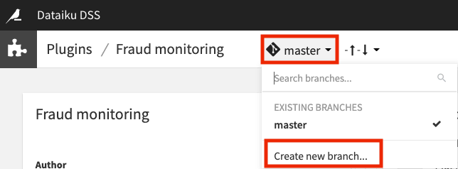
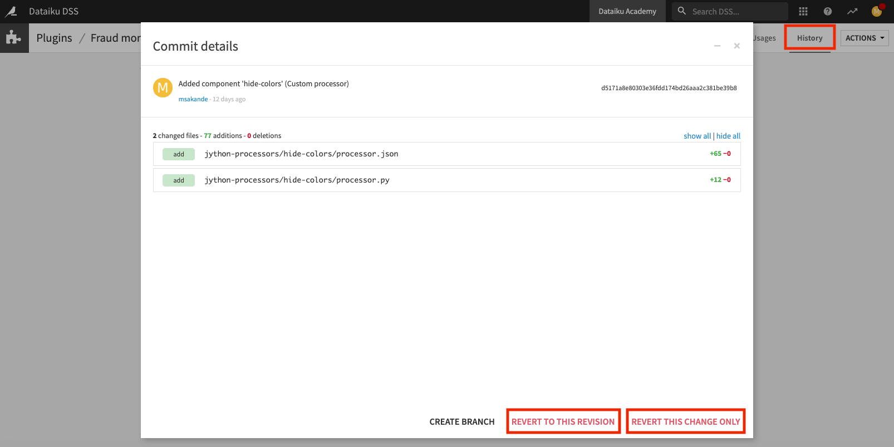
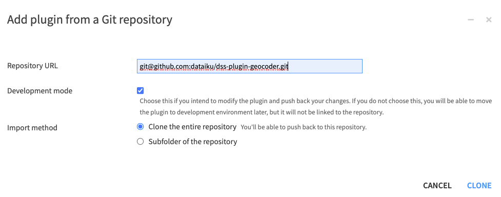

# Git integration for plugins

This tutorial explains Dataiku's Git integration for plugins.
We'll also see how to use Git repositories to share development plugins with others in the plugin development community.


## Git version control tasks available for plugins

Each plugin we create in the plugin editor is associated with a local Git repository,
and every change that we make in the plugin editor (e.g.,
saving a file or adding a new component) is automatically committed to the Git repository.

```{note}
   The Git integration for plugins is separate from the {doc}`Git integration for projects<refdoc:collaboration/version-control>`, and the {doc}`Git in project libraries<refdoc:collaboration/import-code-from-git>` should not be confused.
```

The Plugin-Git integration allows us to perform common version control tasks, such as:

- Pushing and pulling changes from a remote repository.
- Using branches.
- Viewing a plugin's history.
- Reverting changes, etc.


We'll explore some of these tasks.

### Connecting to a remote repository

Dataiku can connect to a remote repository securely by using SSH. 

```{note}
   Connecting Dataiku to a remote repository by SSH requires prior setup of SSH credentials. The {ref}`refdoc:ref-devguide-working-with-remotes` article provides in-depth guidance on how to set up this connection.
```

To share a development plugin via a remote repository,
we connect to the remote Git repository by adding its SSH URL to Dataiku through the “change tracking” indicator. 
Ideally, the remote repository should be empty, as using a separate repository for each plugin is good practice.

{.image-popup}

Once connected to the remote repository, we can push the plugin's code from the ``master`` branch of the local git repository.
In the remote repository, we'll see that the ``master`` branch has been successfully pushed.

### Working with branches

Back in Dataiku, we can also create a development branch of the local ``master`` branch for more development work on the plugin.

{.image-popup}

By navigating to the **History** tab, we can see the changes made on a branch and revert changes as needed.

{.image-popup}

Once we're satisfied with our changes, we can push any new updates back to the remote Git repository.

### Merging branches

Because the ability to merge branches is not directly available in Dataiku,
we'll have to go outside Dataiku (into a Git client such as GitHub) to merge
the changes on the development branch into the ``master`` branch.

Upon returning to Dataiku, we can switch to the local ``master`` branch
and pull in the changes from the remote ``master``
so that the merged changes are now available at the local ``master`` branch in Dataiku.

### Importing plugins from Git repositories

Furthermore, we can import plugins developed by others and stored in a remote Git repository
into Dataiku for our use or further development.

For example, we can fetch the Geocoder plugin directly from its remote Git repository and clone this remote repository for use on our Dataiku instance.

We can also select the option to clone in “development mode” to make changes to the plugin locally and
push our changes to the remote repository, provided that we have write privileges on the remote repository.

When working in development mode, we can also choose whether to clone the entire repository or
clone a subfolder if the repository contains multiple plugins.

{.image-popup}

## Wrapping up
   
Congratulations! You have completed this tutorial and handled the git integration for plugins. You can now go further by creating your first plugin components like {doc}`datasets </tutorials/plugins/datasets/generality/index>` or {doc}`recipes </tutorials/plugins/recipes/generality/index>`.
