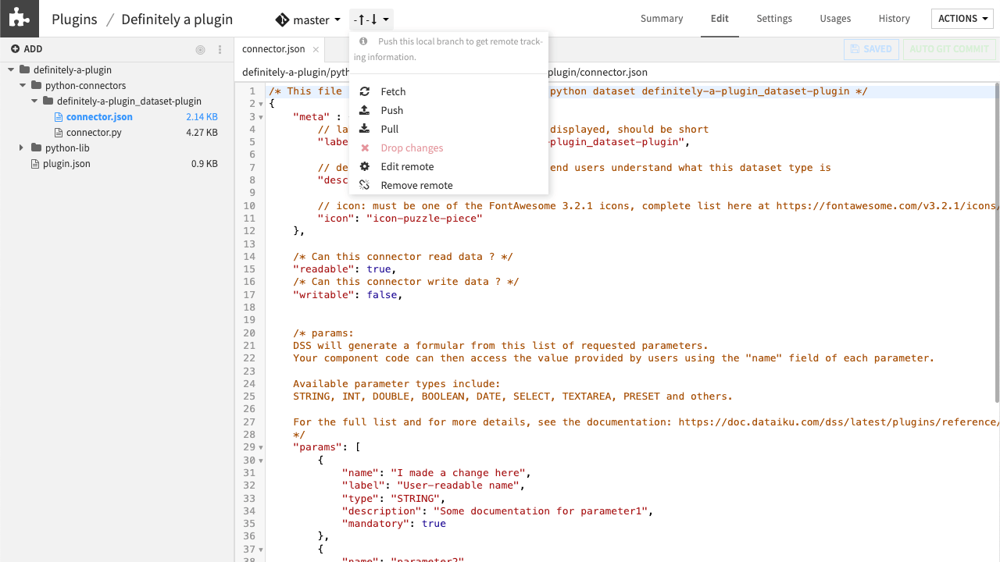

Plugin version management with Git
***********************************

After developing a Dataiku plugin on your instance, you can manage versions of the plugin on a remote Git repository (e.g., GitHub).  
This allows you to share the plugin across multiple Dataiku instances
and allow users on those other instances to contribute updates to the plugin.

In this tutorial, you will learn how to:

- Version your plugins with development branches.
- Track the history of development.
- Connect to a remote Git repository.

Prerequisites
=============

- Bases on Dataiku plugins.
- Familiarity with the basics of `Git <https://en.wikipedia.org/wiki/Git>`_
- Access to a remote Git repository where you can push changes. Ideally, it should be empty.
- Access to a Dataiku instance `set up to work with that remote Git repository <https://doc.dataiku.com/dss/latest/collaboration/git.html#working-with-remotes>`_.

Connect to a remote Git repository
===================================

Open any plugin you want to connect to a remote Git repository to share the development of this plugin with other coders.

1. Click on the change tracking indicator and select **Add a remote**.
2. Enter the URL of the remote and click **OK**.
3. If the ``master`` branch on the remote Git repo has any commits ahead of the local ``master`` branch, **Pull** those changes. This will be necessary if the repo you're connecting to is not empty.
4. From the change tracking indicator, select **Push**.

In your remote Git repo, you can see that the ``master`` branch has been successfully pushed.

.. note::

  We recommend using a separate repository for each plugin.

Git versioning
===============

Now, we'd like to work on changes to the plugin using a development branch so that others can continue using the original plugin.

1. From the branch indicator, click **Create new branch**.
2. Name the new branch ``release/1.0`` and click **Create**.
   
   .. image:: assets/plugin-branch.png
    :class: image-popup

   .. note::
    
      Just like in the usual git workflow, this creates a new development branch of the plugin from the ``master`` branch.

3. Click on the **History** tab to see your changes on this branch. If you switch to the ``master`` branch, you'll see that the history only includes the plugin's original development and none of the changes we've made to the branch.
   
   .. image:: assets/plugin-history.png
    :class: image-popup

4. Now you can switch back to the ``release/1.0`` branch and **Push** the changes.
   
   .. note:: 
      
      The ``release/1.0`` branch has been pushed to your remote Git repo. Merging the changes with the ``master`` branch is done outside of Dataiku.
   
5. To see the merges reflected in Dataiku, first **Fetch** the changes from the remote Git repo and then **Pull** the changes to your local Git.

Wrapping up
###########

You have completed this tutorial and connected your plugin to a remote repository.
You can now produce robust and efficient plugins like :doc:`recipes <./../../../plugins/recipes/generality/index>` or :doc:`macros <../../../plugins/macros/generality/index>` while collaborating through versioning.

