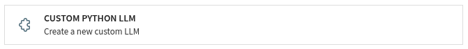
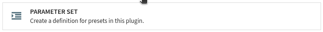
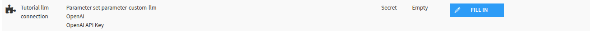
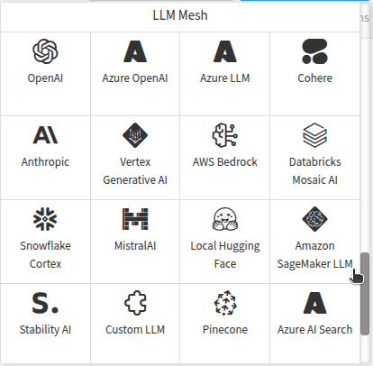
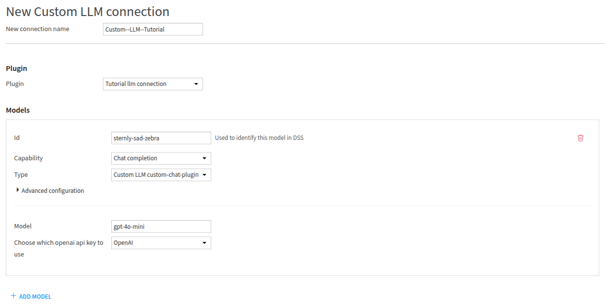

Creating a custom LLM Connection
********************************

.. meta::
    :desciption: This tutorial explains how to create a custom LLM connection in Dataiku,
                 including plugin setup and API key management.

This tutorial provides a step-by-step guide for creating a **custom LLM connection** in Dataiku.
It details the process of setting up a plugin, configuring a parameter set to handle API keys securely,
and coding the behavior of the LLM connection.
Finally, users learn how to enable and test the connection within the Dataiku environment to ensure proper functionality.

Prerequisites
=============

* Dataiku 14.1
* **Develop plugin** permission
* Python 3.9

Introduction
============

Sometimes, you must use a custom/self-hosted/pre-configured LLM for your project.
Dataiku offers many LLM connections, but some may want their personalized LLM Connection.
Some configurations can be done in the connection setting,
but if you need a specific configuration that is not present in Dataiku,
you must use the plugin's component: LLM Connection.
In this tutorial, you will learn how to create a new LLM Connection.
This connection will rely on the Python OpenAI SDK.
Attentive users may use this tutorial to set up any new connection without too much trouble by relying on an SDK.

To create an LLM Connection,
you must first create a plugin (or use an existing one).
Go to the main menu, click the **Plugins** menu, and select the **Write your own** from the **Add plugin** button.
Then choose a meaningful name, such as ``tutorial-llm-connection``.
Once the plugin is created, click the **Create a code environment** button and select Python as the default language.
If you need specific packages, you should add them in the ``requirements.txt`` file,
located in the ``code-env/python/spec`` of your plugin.

For this tutorial, you will need the ``openai`` package.
Add it to ``requirements.txt``, click the **Save all** button, return to the **Summary** tab,
select the container you want to use (or select **All containers**), and click the **Build new environment** button.

Click the **Create your first component** button, and choose the **Custom Python LLM** in the provided list,
as shown in :ref:`Fig. 1<tutorials/plugins/llm-connection/generality/new-custom-llm>`.
Then, complete the form by giving it a meaningful name, like ``custom-chat-plugin``,
and selecting the **Text completion** as a starter code.

.. _tutorials/plugins/llm-connection/generality/new-custom-llm:

    Figure 1 -- New LLM connection component.

Alternatively, you can select the **Edit** tab and, under the ``tutorial-llm-connection`` directory,
create a folder named ``python-llms``.
This directory is where you will find and create your custom LLM connection.
Under this directory, create a directory with a meaningful name (``custom-chat-plugin``, for this tutorial)
representing your LLM connection component.

Creating the Connection
=======================

A LLM connection is created by creating two files: ``llm.json`` and ``llm.py``.
The JSON file is the configuration file, and the Python file is where you will code the behavior of your LLM connection.

Configuring the LLM Connection
------------------------------

There is nothing specific to the LLM connection's configuration.
However, as using an LLM may require a personal API key, you might need to configure your plugin to ask for one.
You could ask the user for their API key when creating the connection,
but if you choose to do this, all users using the connection will also use the API key of the connection's creator.

Hopefully, Dataiku provides a mechanism to overcome this behavior: **Parameter set**.
We highly recommend using a parameter set when sharing confidential information such as API Key, SSH key, ...

Creating a Parameter set
^^^^^^^^^^^^^^^^^^^^^^^^

To create a **Parameter set**, select the **Summary** tab, click the **New component** button,
and choose the **Parameter set** from the provided list,
as shown in :ref:`Fig. 2<tutorials/plugins/llm-connection/generality/parameter-set-component>`.
Then, complete the form by giving it a meaningful name, like ``parameter-custom-llm``.
Select ``parameter-set.json`` in the ``parameter-sets/parameter-custom-llm`` folder.
:ref:`Code 1<tutorials/plugins/llm-connection/generality/parameter-set-configuration>` shows the configuration of the parameter set.

.. _tutorials/plugins/llm-connection/generality/parameter-set-component:

    
    Figure 2 -- New parameter set component.

.. literalinclude:: ./assets/parameter-set.json
    :caption: Code 1 --Parameter set -- configuration file
    :language: python
    :name: tutorials/plugins/llm-connection/generality/parameter-set-configuration

Once you have configured your parameter set, you will need to add a new preset.
Select the **Settings** tab, select the **Parameter set parameter-custom-llm** on the left panel,
and click the **Add preset** button.
Choose a name, ``OpenAI``, for example, and click the **Create** button.
You may want to fill out the form, but it is not mandatory.

As shown in :ref:`Fig. 3<tutorials/plugins/llm-connection/generality/credential-for-parameter-set>`,
the user can enter their API key in the "Credentials" tab of their "Profile & Settings" page.

.. _tutorials/plugins/llm-connection/generality/credential-for-parameter-set:

    Figure 3 -- Where to enter a credential for a parameter set.

Using the Parameter set
^^^^^^^^^^^^^^^^^^^^^^^

You can now use this parameter set in the LLM connection configuration file (``python-llms/custom-chat-plugin/llm.json``).
:ref:`Code 2<tutorials/plugins/llm-connection/generality/llm-configuration>` shows the configuration file's global shape.
The highlighted line shows how we connect the parameter set with the LLM connection.

.. literalinclude:: ./assets/llm.json
    :caption: Code 2 -- LLM connection -- configuration file
    :language: python
    :name: tutorials/plugins/llm-connection/generality/llm-configuration

Coding the custom LLM Connection
--------------------------------

Coding an LLM Connection follows the same principle as coding an agent.
If you need help on coding an agent, you will find some explanations
in the :ref:`Agent<ce/agents/creating-your-code-agent>` section in Concepts and examples,
or you can follow :doc:`this tutorial</tutorials/genai/agents-and-tools/code-agent/index>`.

To access the configuration entered by the user, you must define the ``set_config`` function,
as shown in :ref:`Code 3<tutorials/plugins/llm-connection/generality/llm-code>`.
The highlighted line shows how to retrieve a value from a parameter set. You first need to access the plugin's parameter (``api_key`` in our example), then retrieve the value from the parameter set (``param_set_api_key``).

.. literalinclude:: ./assets/llm.py
    :caption: Code 3 -- Custom LLM connection -- code
    :language: python
    :name: tutorials/plugins/llm-connection/generality/llm-code
    :emphasize-lines: 13

Enabling the custom LLM Connection
----------------------------------
The next step is to create a new Dataiku connection.
Go to the **Administration** panel, select the **Connections** tab, and click the **New connection** button.
In the LLM Mesh section, you will find **Custom LLM** connection; click on it to create a new connection.

.. _tutorials/plugins/llm-connection/generality/new-connection:

    
    Figure 4 -- Custom LLM connection in the connections menu.
    
Fill out the form by providing a valid connection name, selecting your plugin name,
clicking the **Add model** button, and filling out the form
as shown in :ref:`Fig. 5<tutorials/plugins/llm-connection/generality/new-connection-form>`.

.. _tutorials/plugins/llm-connection/generality/new-connection-form:

    Figure 5 -- New connection form.

Testing the connection
----------------------

You can use the connection now that it has been created (and made available for everyone,
except if you changed the security setting in the previous form).
You can use :ref:`Code 4<tutorials/plugins/llm-connection/generality/notebook-code>` to test if everything is OK.
The ``LLM_ID`` is built this way: ``custom:<connection-name>:<model_id>``.
If you need help retrieving a valid ``LLM_ID``, you can use :ref:`this code sample<ce/llm-mesh/get-llm-id>`.

.. code-block:: python
    :name: tutorials/plugins/llm-connection/generality/notebook-code
    :caption: Code 4 -- Testing the connection

    import dataiku

    LLM_ID = "" ## Fill with your LLM_ID

    client = dataiku.api_client()
    project = client.get_default_project()
    llm = project.get_llm(LLM_ID)
    completion = llm.new_completion()
    completion.with_message("How to code an agent in Dataiku?")
    resp = completion.execute()
    print(resp.text)

Wrapping up
===========

Congratulations on finishing the tutorial for creating a **custom LLM connection**.
You now know how to create, configure, and use a **custom LLM connection**.
Of course, your **LLM connection** can use a different provider; you just need to adapt the ``process`` function.
It is also possible to process asynchronously, with or without a stream.
You will find more information on this subject on this page: :ref:`ce/agents/creating-your-code-agent`.

Here is the complete code of the **custom LLM Connection** (and the **parameter set**):

.. dropdown:: llm.json

    .. literalinclude:: ./assets/llm.json
        :language: json

.. dropdown:: llm.py

    .. literalinclude:: ./assets/llm.py
        :language: python

.. dropdown:: parameter-set.json

    .. literalinclude:: ./assets/parameter-set.json
        :language: json

Reference documentation
=======================

Classes
-------
.. autosummary::
    dataikuapi.DSSClient

Functions
---------
.. autosummary::
  ~dataikuapi.DSSClient.get_default_project