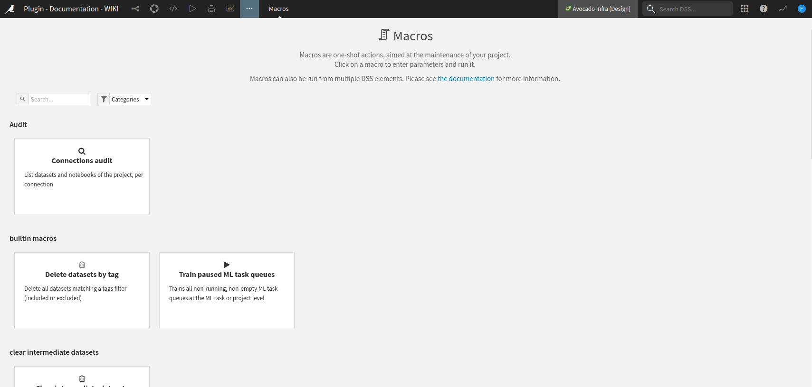
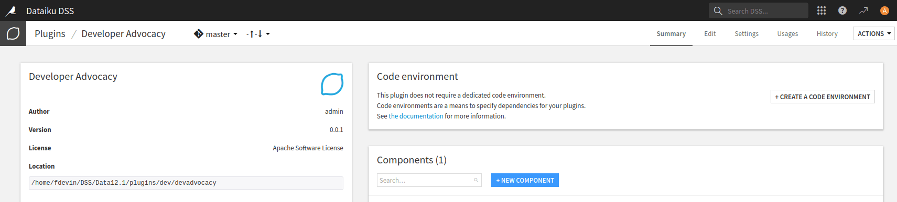
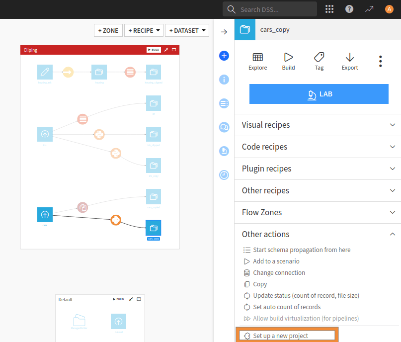

Creating a plugin Macro component
*********************************

Prerequisites
#############
* Dataiku >= 12.0
* Access to a dataiku instance with the "Develop plugins" permissions
* Access to an existing project with the following permissions:
    * "Read project content."
    * "Write project content."

Introduction
############

Macros in Dataiku can achieve many different roles, from automating tasks to extending the core product's capabilities.
Usually, macros are found in the **Macro** menu under the **More options menu**, as shown
in :ref:`Fig. 1<tutorial_plugin_macro_generality_new_macro>`.
If your macro has a specific ``macroRoles``, it can appear in other places depending on the role.
It's worth noting that a macro isn't restricted to a particular role and can have several roles if appropriate.

.. _tutorial_plugin_macro_generality_new_macro:

   Figure 1: Creation of a new macro.

A macro can be run in several contexts:

* Manually, by clicking on the macro's name in the project's macros screen
  (:ref:`Fig. 1<tutorial_plugin_macro_generality_new_macro>`).
* In a dashboard with pre-configured parameters for dashboard users.
* In a scenario.

You can find some examples :doc:`../index`.
To create a macro, go to the plugin editor,
click the **+ New component** button (:ref:`Fig. 2<tutorial_plugin_macro_generality_new_component>`),
and choose the macro component (:ref:`Fig. 3<tutorial_plugin_macro_generality_new_macro_component>`).

.. _tutorial_plugin_macro_generality_new_component:

   Figure 2: New component

.. _tutorial_plugin_macro_generality_new_macro_component:

.. figure:: ./assets/creating-a-new-macro.png
   :alt: Figure 3: New macro component
   :align: center
   :class: with-shadow image-popup

   Figure 3: New macro component

This will create a subfolder named ``python-runnables`` in your plugin directory.
Within this subfolder, a subfolder with the name of your macro will be created.
You will find two files in the subfolder: ``runnable.json`` and ``runnablie.py``.
The ``runnable.json`` file is used for configuring your macro, while the ``runnable_py`` file is used for processing.

Macro configuration
#####################

:ref:`Code 1<tutorial_plugin_macro_generality_generated_json>` shows the default configuration file generated by
Dataiku.
The file includes standard objects like ``"meta"``, ``"params"``, and ``"permissions"``,
which are expected for all components.
For more information about these generic objects, please refer to :doc:`refdoc:plugins/reference/macros`.

.. literalinclude:: ./assets/runnable-generated.json
   :caption: Code 1: Generated macro's configuration
   :language: json
   :name: tutorial_plugin_macro_generality_generated_json

The ``"macroRoles"`` object is where you can specify where you want your macro to appear in Dataiku.
For instance, if you opt for "DATASET," your macro will be visible when you choose a dataset from the flow,
as demonstrated in Fig. 4.
There are various roles available for macros, such as:

* DATASET, DATASETS, API_SERVICE, API_SERVICE_VERSION, BUNDLE, VISUAL_ANALYSIS, SAVED_MODEL, MANAGED_FOLDER: for a macro
  that runs on that particular object (usually as an input of the macro).
* PROJECT_MACROS: for a global macro that works on the project or Dataiku instance, depending on the processing.
* PROJECT_CREATOR: for defining a new type of project's creation, setting up specific permissions, a set of usable
  datasets, and a dedicated Code environment, etc.

.. _tutorial_plugin_macro_generality_UI_integration:

   Figure 4: UI integration for a ``"macroRoles": DATASET``

Finally, ``"resultType"`` is the return type of the macro. It can take one of those values:

* ``HTML``: produces an HTML (string) as a report (for example).
* ``FILE``: creates raw data (as a Python string) and will be stored in a temp file.
* ``FOLDER_FILE``: same as FILE, except it will be stored in a project folder.
* ``URL``: produces an URL.
* ``RESULT_TABLE``: produces a tabular result, adequately formatted for display.
* ``NONE``: the macro does not produce output.

We recommend that you use ``RESULT_TABLE`` rather than ``HTML`` if the output of your macro is a simple table,
as you won’t have to handle styling and formatting.

Associated to ``resultType``, ``resultLabel``,
``extension`` and ``mimeType`` are options to specify which output the macro will produce.

Macro execution
##################

:ref:`Code 2<tutorial_plugin_macro_generality_generated_python>`
shows the default generated code by Dataiku for the macro's execution, divided into three distinct parts.
These parts are designed to help you get started quickly and include:

* ``__init__``: This is an initialization function where you can parse the parameters entered by the user,
  read the plugin configuration, and do other tasks that are not directly linked to the processing.
  This function can help you set up the groundwork for your macro processing.
* ``get_progress_target``: If your macro produces some progress information,
  you should define the final state in this function. Usually, it returns a simple tuple,
  where the first parameter is the number of steps, and the second is a unit like SIZE, FILES, RECORDS, or NONE.
  Depending on your macro, you can use SIZE when uploading a file, FILES when reading different files,
  RECORDS when processing a list of records, and NONE if you want to return global progress.
  This function helps you track progress and keep your macro processing running smoothly.
* ``run``: This is where you will write the code for processing your macro.
  Depending on the macro's type, the processing could take various forms.

.. literalinclude:: ./assets/runnable-generated.py
   :caption: Code 2: Generated macro's processing
   :language: python
   :name: tutorial_plugin_macro_generality_generated_python

Simple example
##############

In this scenario you create a macro that copies a set of datasets, only SQL datasets, and upload datasets.
This macro needs to ask the user about the datasets they want to copy and which suffix to add to the copies.
The macro also needs to display the result of the copy. So you will choose a "RESULT_TABLE" as "resultType."
That leads to the configuration shown in :ref:`Code 3<tutorial_plugin_macro_generality_macro_configuration>`.

.. literalinclude:: ./assets/runnable.json
   :caption: Code 3: Macro's configuration
   :language: json
   :name: tutorial_plugin_macro_generality_macro_configuration

The process shown in :ref:`Code 4<tutorial_plugin_macro_generality_macro_processing>` is as follows:

* Get the required information from the user in the ``__init__`` function.
* Copy the datasets in the run function.

  The highlighted lines in the code indicate the lines responsible for generating the output report of the macro.

.. literalinclude:: ./assets/runnable.py
   :caption: Code 4: Macro's processing
   :language: python
   :name: tutorial_plugin_macro_generality_macro_processing
   :emphasize-lines: 33-35,40,61,64,66,68

Wrapping up
###########

Congratulations! You have completed this tutorial and built your first macro.
Understanding all these basic concepts will allow you to create more complex macros.

To go further, instead of copying datasets
you could extract some information (like associated tags) from those datasets and display them in a table or HTML.

Here is the complete version of the code presented in this tutorial:

.. dropdown:: runnable.json

    .. literalinclude:: ./assets/runnable.json
        :language: json

.. dropdown:: runnable.py

    .. literalinclude:: ./assets/runnable.py
        :language: python
