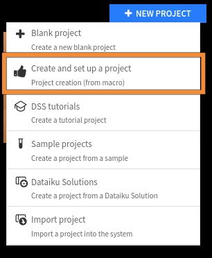

Writing a macro for project creation
************************************

Prerequisites
#############

* Dataiku >= 12.0
* Access to a dataiku instance with the "Develop plugins" permissions
* Access to an existing project with the following permissions:
    * "Read project content"
    * "Write project content"

.. note::
	We recommend reading :doc:`this tutorial<../generality/index>`. We will assume that you already have a plugin created.

Introduction
############

This tutorial will show you how to create a macro dedicated to project creation.

The purpose of this macro is to make the project creation process more efficient and streamlined.
Once created, the macro will be accessible under the **+New project** button on the Dataiku home page, as shown in
:ref:`Fig 1<tutorial_plugin_macro_project_creation_where_to_find_the_macro>`.
This tutorial will provide step-by-step instructions on completing this macro to save time
and effort when creating new projects.

.. _tutorial_plugin_macro_project_creation_where_to_find_the_macro:

    Figure 1: Project creation macro.

To create a project creation macro, go to the plugin editor, click the **+New component** button,
and choose the macro component.
This will create a subfolder named ``python-runnables`` in your plugin directory.
Within this subfolder, a subfolder with the name of your macro will be created.
You will find two files in this subfolder: ``runnable.json`` and ``runnable.py``.
The JSON file is a placeholder for your macro's configuration, including the parameters.
The Python file, on the other hand, defines how the macro is executed

To ensure a successful implementation, it's essential first to define the requirements of the macro.
In this case, the macro is designed to assist users in setting up a new project.
The macro will prompt the user to provide a name for their project and select a dedicated code environment and default cluster.
Additionally, users can apply tags to their projects and create a starter wiki to get their projects off the ground.

Macro configuration
#####################

Fill in the ``meta`` section as usual.
If you need help, you will find dedicated information in :doc:`this documentation<../generality/index>`.
For the ``macroRoles`` field, enter the ``PROJECT_CREATOR`` and ``JSON_OBJECT`` for the ``resultType`` field,
as shown in :ref:`Code 1<tutorial_plugin_macro_project_creation_macro_global_configuration>`.

.. important::

    If you want the user to be redirected to the newly created project, you must set the ``resultType`` to ``"JSON_OBJECT"``,
    in :ref:`Code 1<tutorial_plugin_macro_project_creation_macro_global_configuration>`
    and return the ``projectKey`` into a JSON object
    in the ``run`` function (:ref:`Code 3<tutorial_plugin_macro_project_creation_macro_runnable>`):
    
    .. code-block:: python

        return json.dumps({"projectKey": self.project_key})

.. literalinclude:: ./assets/runnable.json
    :caption: Code 1: Macro's global configuration
    :language: json
    :name: tutorial_plugin_macro_project_creation_macro_global_configuration
    :lines: 2-16

To create a macro, it is crucial to define its parameters carefully.
As this macro's scope has been restricted, the parameters required are straightforward and relatively easy to determine.

The first parameter is the project name (``project_name``),
which should be a concise but descriptive label for the project.
The second parameter is the code environment (``code_envs``),
which should be specified to ensure the project's compatibility with the project's coding standards and requirements.

The third parameter is the cluster name (``default_cluster``),
which should be defined based on the infrastructure used for the project.

The fourth parameter (``tags``) is a list of strings representing the tags for the project.
These tags help to categorize the project, making it easier to search for and identify relevant content.

Finally, the fifth parameter is the wiki content (``wiki_content``).
If the user wishes to add a wiki, this parameter is necessary.
Additionally, it is essential to include a parameter (``additional_wiki``)
that allows the user to indicate whether or not they want to create a wiki.

Defining all these parameters leads to the code shown in
:ref:`Code 2<tutorial_plugin_macro_project_creation_macro_parameter_configuration>`.

.. literalinclude:: ./assets/runnable.json
    :caption: Code 2: Macro's parameters configuration
    :language: json
    :name: tutorial_plugin_macro_project_creation_macro_parameter_configuration
    :lines: 16-

Macro execution
##################

For more information about the initial generated code, you can refer to :doc:`this documentation<../generality/index>`.

The :ref:`Code 3<tutorial_plugin_macro_project_creation_macro_runnable>` presents the whole code of the macro.
Comments help you to understand how it works.
The complete processing procedure is executed within the ``run`` function.
We have defined a helper function named ``create_checklist`` for generating a checklist item from a list of strings.
This function could/should be in a separate file (for example, in a library), but for presentation purposes,
it is included in the Python file.

As part of the processing:

- We first create a client for interacting with Dataiku and gather information about the connected user.

- Then, we generate a unique project key which is used to identify the project throughout the system.

- After that, we create the project and set the default code environment and cluster, essential components for any project.
  Additionally, we create a checklist for the project and add tags to it.

- Finally, if the user desires, we make a wiki for the project,
  which can be used to document the project's progress and guide team members.

If you want to impose a particular configuration,
you can add these steps to the procedure without requesting the user's input.

Wrapping up
###########

Congratulations! You have completed this tutorial and built your first macro for project creation.
Understanding all these basic concepts allows you to create more complex macros.

For example, you can import some datasets from the feature store,
define other settings for your newly created project, or set specific permission for users/groups.

Here is the complete version of the code presented in this tutorial:

.. dropdown:: runnable.json

    .. literalinclude:: ./assets/runnable.json
        :language: json

.. dropdown:: runnable.py
    :open:

    .. literalinclude:: ./assets/runnable.py
        :name: tutorial_plugin_macro_project_creation_macro_runnable
        :caption: Code 3: Macro's processing
        :language: python

