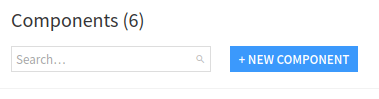
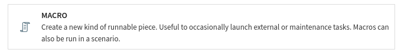
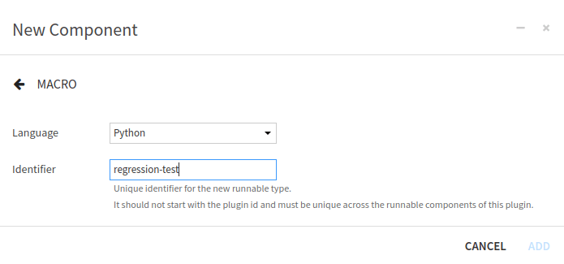
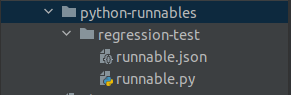
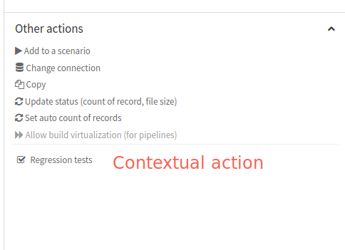
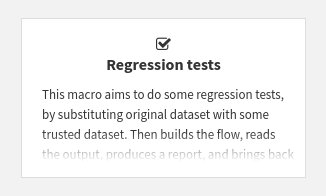
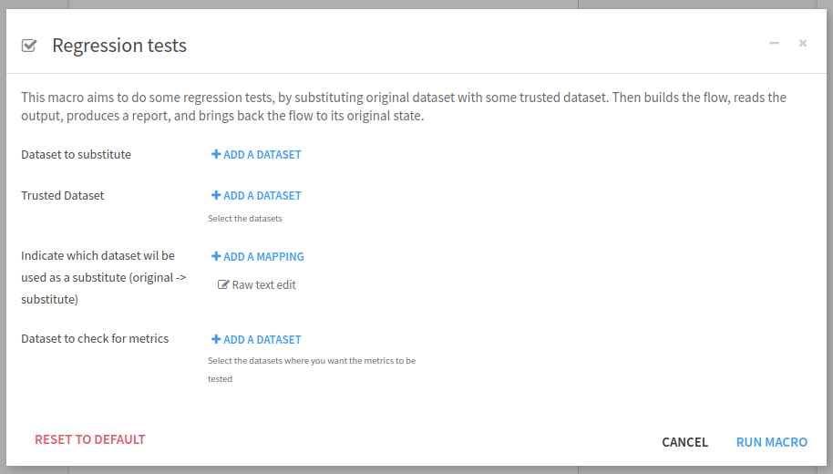

Writing a macro for managing regression tests
===================================================

.. _tutorial_plugin_macro_test_regression_macro:

Context
---------
When a project is modified, the changes may impact the final result. While some impacts are desired,
others may result in defects. In software development, testing aims to verify these modifications automatically.
There are many types of testing, but they can be classified into three categories: functional testing,
performance testing, and maintenance testing. Maintenance testing verifies that the changes introduced have
no impact on the rest of the project.

Software testing could be applied to a Dataiku Project. In this tutorial, the focus is on maintenance testing.
When a Project is modified, we want to ensure the final result does not change. This is called regression testing,
and you could apply it in various ways. Whenever a Flow change is made to a Project, there is a risk of defects.
In this case, we may want to test these changes.

We can test the Flow modifications, by replacing the input Datasets, with "well-known" Datasets, running the
Flow, verifying that the defined Metrics/Checks are still good, and reusing previously used Datasets.
This task is repetitive, could be very long and fastidious, and error-prone. In that case, a Macro (for more
information about Macros, see :doc:`refdoc:operations/macros`) could be written to automate this workflow
with the following steps:

- Replace the inputs of the Flow with "well-known Datasets" (aka trusted Datasets)
- Build the Flow
- Read the outputs and compares them with the trusted outputs, and issue a report with the results
- Restore the original inputs of the Flow

Writing a Macro will also provide a way to be automatically run when the Flow is modified, by using a scenario
(for more information, please see :doc:`refdoc:scenarios/index`). This tutorial is spread into four parts,
readers that know how a macro is created and configured can easily skip the first two parts:

- :ref:`tutorial_plugin_macro_macro_creation`: How to create a new Macro component.
- :ref:`tutorial_plugin_macro_macro_configuration`: How to configure the Macro component.
- :ref:`tutorial_plugin_macro_test_regression_macro_analysis`: Analysis of the context of the Macro to define the
  Macro parameters.
- :ref:`tutorial_plugin_macro_test_regression_macro_coding_the_macro`: How to code the Macro.

.. tip:: 
    Starting from version 13.3.0, Dataiku has a powerful native feature for non-regression testing.
    :ref:`The reference documentation<refdoc:flow-test-step>`
    and :doc:`the knowledge base<kb:automation/scenarios/tutorial-test-scenarios>`
    provide comprehensive information about this feature.

.. _tutorial_plugin_macro_macro_creation:

Macro creation
--------------

Creation by the user interface
^^^^^^^^^^^^^^^^^^^^^^^^^^^^^^^

We can create a Macro from the plugin component interface (for more information on
Plugin development, please see :doc:`refdoc:plugins/reference/index`) and choose "new component"
(:ref:`Fig. 1<tutorial_plugin_macro_new_component>`).

.. _tutorial_plugin_macro_new_component:

   Figure 1: New component.

and then choose Macro (:ref:`Fig. 2<tutorial_plugin_macro_new_macro_component>`)

.. _tutorial_plugin_macro_new_macro_component:

   Figure 2: Plugin -- New Macro component.

and fill the form to create a Macro, by choosing a name for the Macro (here ``regression-test``), as shown on
:ref:`Fig. 3<tutorial_plugin_macro_new_macro_form>`.

.. _tutorial_plugin_macro_new_macro_form:

   Figure 3: Plugin -- Form for new Macro component.

Creation by code
^^^^^^^^^^^^^^^^^
Alternatively, we can create a Macro component directly inside the Plugin code directory, by making the following
directory (:ref:`Fig. 4<tutorial_plugin_macro_directory>`). We can choose a different name for the directory
``regression-test``, but the other names can not be changed. So we have to keep ``python-runnables`` (the directory
where goes the Macros), and also have to keep ``runnable.json`` and ``runnable.py`` (to be able to run the Macro).
As explained in :doc:`refdoc:plugins/reference/macros`, this is because a macro is essentially a function wrapped
in a class.

.. _tutorial_plugin_macro_directory:

   Figure 4: Plugin -- Directory of a Macro component named ``regression-test``.

.. _tutorial_plugin_macro_macro_configuration:

Macro configuration
--------------------

Description
^^^^^^^^^^^

The configuration of the Macro is done in the ``runnable.json`` file. Each component plugin begins with a ``meta``
section that contains the name of the component (``label``), the description of the component (``description``) and
an icon to represent the component (``icon``). For this Macro, we could have written:

.. _tutorial_plugin_macro_code_macro_description:
.. code-block:: json
   :caption: Code 1: Macro description.

   "meta": {
       "label": "Regression tests",
       "description": "This macro aims to do some regression tests, by substituting original datasets with some trusted datasets. Then builds the flow, reads the output, produces a report, and brings back the flow to its original state.",
       "icon": "icon-check"
   },

This description is on the plugin page as shown in :ref:`Fig. 5<tutorial_plugin_macro_macro_description>`,
and :ref:`Fig. 7<tutorial_plugin_macro_submenu_macro>`.

.. _tutorial_plugin_macro_macro_description:

.. figure:: ../../assets/macro-description.png
   :alt: Figure 5: Macro description.
   :align: center

   Figure 5: Plugin -- Macro description.

Global Configuration
^^^^^^^^^^^^^^^^^^^^^
Then we will need to configure the Macro. Does this Macro run with UNIX user identity, or with the identity of the
final user (this is relevant if only UIF is enabled). Unless having a clear understanding of all UIF implications,
we should set it to ``true`` (``"impersonate": true``). We will also need to set the permission that a user needs to
see/run the Macro. Here, as we change the Flow, the user needs ``"WRITE_CONF"``. Then, we must specify what the Macro
returns among:

* ``NONE``: no result
* ``HTML``: a string that is an HTML (utf8 encoded)
* ``FOLDEF_FILE``: a (``folderId``, ``path``) pair to a file in a folder of this project (*json-encoded*)
* ``FILE``: raw data (as a python string) that will be stored in a temp file by Dataiku
* ``URL`` : an URL

We have chosen to return an HTML string. And finally, we should also define where this Macro will appear in the
Dataiku. We can target Dataiku objects (``DATASET``, ``DATASETS``, ``API_SERVICE``, ``API_SERVICE_VERSION``,
``BUNDLE``, ``VISUAL_ANALYSIS``, ``SAVED_MODEL``, ``MANAGED_FOLDER``) or the project itself. If we target Dataiku
objects, then the Macro can prefill some of its parameters, and will contextually appear in the
GUI when it is relevant, for example in the "Other actions" section in the right panel
(see :ref:`Fig. 6<tutorial_plugin_macro_contextual_action>`).

.. _tutorial_plugin_macro_contextual_action:

   Figure 6: Plugin -- Contextual action.

If we target the Project itself, the Macro will appear in the "Macros" submenu in the project settings,
as shown in :ref:`Fig. 7<tutorial_plugin_macro_submenu_macro>`. In both cases, we can see that the icon we
previously define (in the description section) is used.

.. _tutorial_plugin_macro_submenu_macro:

   Figure 7: Plugin -- Macro integration inside the Macros submenu.

This leads to the code shown in :ref:`Code 2<tutorial_plugin_macro_code_global_configuration>`.

.. code-block:: json
   :caption: Code 2: Global configuration of the Macro plugin.
   :name: tutorial_plugin_macro_code_global_configuration

   "impersonate": true,
   "permissions": ["WRITE_CONF"],
   "resultType": "HTML",
   "resultLabel": "Regression tests results",
   "macroRoles": [
       {
           "type": "DATASETS",
           "targetParamsKey": "original-dataset",
           "applicableToForeign": true
       },
       {
           "type": "PROJECT_MACROS"
       }
   ]

.. _tutorial_plugin_macro_test_regression_macro_analysis:

Analysis and inputs
-----------------------------

.. note::
   Several assumptions help simplify the code for the macro. For example, it doesn't use every input for the Project,
   only the specified Datasets. This tutorial provides a starting point that could be adapted to specific needs.

Input datasets
^^^^^^^^^^^^^^
While we can get all the inputs to a Flow, knowing which inputs we should replace with
which trusted outputs can be challenging. In addition, some of the input Datasets may not be relevant to change
because they do not impact the result or are not part of the Flow we want to test. So we need to ask the user which
input Datasets are concerned by this test.

"Well-known Datasets"
^^^^^^^^^^^^^^^^^^^^^
Since trusted Datasets are not part of the initial Flow we want to test, we need to know which Datasets are
"well-known". We also need to know which trusted Dataset will replace which input Dataset, as it may be difficult to
replace one Dataset with another one.

Metrics
^^^^^^^
The purpose of the macro is to ensure changes to the Flow do NOT impact outcomes by checking relevant Metrics of the
output Datasets against an expected result. We can assume that the relevant Metrics are those of the Datasets at the
end of the Flow. But other Datasets may also contain relevant Metrics. So we want the user to specify the Datasets that
contain the Metrics that this macro will observe.

.. _tutorial_plugin_macro_sum_up:

Summary
^^^^^^^
To summarize, this Macro requires as input:

- the Datasets to be substituted
- the trusted Datasets
- a mapping from input Datasets to trusted Datasets
- a list of Datasets that the macro will use for testing Checks and Metrics

Macro parameters definition
^^^^^^^^^^^^^^^^^^^^^^^^^^^^
In the previous section, we decided that to realize this Macro, we need 4 parameters (for more information about types
and usages of Macro parameter, see :doc:`refdoc:plugins/reference/params`) (Datasets to substitute, trusted datasets, a
mapping, Datasets that have the metrics to test). So we need to define these parameters in the ``runnable.json`` file
too (see :ref:`Code 3<tutorial_plugin_macro_code_parameter_definition>`). For each parameter, we have:

* ``name``: used when we want to access the value of this parameter when coding the plugin.
* ``label``: used when Dataiku displays the graphical user interface to enter the values for the parameter.
* ``type``: indicates which values are accepted for this parameter.
* ``mandatory``: indicates if the parameter needs to be entered or not.

We can also have some other optional fields. Here we have used ``description`` (to display inline help),
``canSelectForeign`` (to allow the foreign object to be entered). Using those parameters' definitions, Dataiku will
display the input screen as shown in :ref:`Fig. 8<tutorial_plugin_macro_visual_input_interface>`.

.. code-block:: json
   :name: tutorial_plugin_macro_code_parameter_definition
   :caption: Code 3: Plugin -- Parameters definition.

   "params": [
       {
         "name": "original-dataset",
         "label": "Dataset to substitute",
         "type": "DATASETS",
         "mandatory": true
       },
       {
         "name": "trusted-dataset",
         "label": "Trusted Dataset",
         "type": "DATASETS",
         "description": "Select the datasets",
         "mandatory": true,
         "canSelectForeign": true
       },
       {
         "name": "mapping",
         "label": "Indicate which dataset will be used as a substitute (original -> substitute)",
         "type": "MAP",
         "mandatory": true
       },
       {
         "name": "dataset-to-build",
         "label": "Dataset to check for metrics",
         "type": "DATASETS",
         "description": "Select the datasets where you want the metrics to be tested",
         "mandatory": true,
         "canSelectForeign": true
       }
   ],

.. _tutorial_plugin_macro_visual_input_interface:

   Figure 8: Plugin -- Visual parameters input interface.

:ref:`Code 4<tutorial_plugin_macro_code_configuration_file>` show the whole code for ``runnable.json``.

.. code-block:: json
   :caption: Code 4: Macro configuration file.
   :name: tutorial_plugin_macro_code_configuration_file

   {
       "meta": {
           "label": "Regression tests",
           "description": "This macro aims to do some regression tests, by substituting the original dataset with some trusted dataset. Then builds the flow, reads the output, produces a report, and brings back the flow to its original state.",
           "icon": "icon-check"
       },
       "params": [
           {
               "name": "original-dataset",
               "label": "Dataset to substitute",
               "type": "DATASETS",
               "mandatory": true
           },
           {
               "name": "trusted-dataset",
               "label": "Trusted Dataset",
               "type": "DATASETS",
               "description": "Select the datasets",
               "mandatory": true,
               "canSelectForeign": true
           },
           {
               "name": "mapping",
               "label": "Indicate which dataset will be used as a substitute (original -> substitute)",
               "type": "MAP",
               "mandatory": true
           },
           {
               "name": "dataset-to-build",
               "label": "Dataset to check for metrics",
               "type": "DATASETS",
               "description": "Select the datasets where you want the metrics to be tested",
               "mandatory": true,
               "canSelectForeign": true
           }
       ],
       "impersonate": true,
       "permissions": ["WRITE_CONF"],
       "resultType": "HTML",
       "resultLabel": "Regression tests results",
       "macroRoles": [
           {
               "type": "DATASETS",
               "targetParamsKey": "original-dataset",
               "applicableToForeign": true
           },
           {
               "type": "PROJECT_MACROS"
           }
       ]
   }

.. _tutorial_plugin_macro_test_regression_macro_coding_the_macro:

Coding the macro
----------------

Now we have entirely configured the Macro, we can code it. If we have created the Macro from the visual interface,
the ``runnable.py`` comes with the default skeleton just shown in
:ref:`Code 5<tutorial_plugin_macro_code_default_code_file>`. The ``__init__`` (line 7) function is the place
to retrieve the values of the parameters. The highlighted function, line 24 (``def run(self, progress_callback):``),
is where the processing starts.

.. code-block::
   :caption: Code 5: Macro default code file.
   :name: tutorial_plugin_macro_code_default_code_file
   :linenos:
   :emphasize-lines: 7,24

   # This file is the actual code for the Python runnable to-be-deleted
   from dataiku.runnables import Runnable

   class MyRunnable(Runnable):
       """The base interface for a Python runnable"""

       def __init__(self, project_key, config, plugin_config):
           """
           :param project_key: the project in which the runnable executes
           :param config: the dict of the configuration of the object
           :param plugin_config: contains the plugin settings
           """
           self.project_key = project_key
           self.config = config
           self.plugin_config = plugin_config

       def get_progress_target(self):
           """
           If the runnable will return some progress info, have this function return a tuple of
           (target, unit) where unit is one of: SIZE, FILES, RECORDS, NONE
           """
           return None

       def run(self, progress_callback):
           """
           Do stuff here. Can return a string or raise an exception.
           The progress_callback is a function expecting 1 value: current progress
           """
           raise Exception("unimplemented")

Initialization
^^^^^^^^^^^^^^
The initialization is straightforward. We just have to retrieve the parameters. For implementation purposes, that
will be discussed later. We also need to sort the Datasets where the Metrics are and build the inverted map from
tested Datasets to trusted Datasets.

.. code-block:: python
   :caption: Code 6: Initialization code of the Macro.
   :name: tutorial_plugin_macro_code_initialization_code
   :linenos:
   :emphasize-lines: 10-13

   def __init__(self, project_key, config, plugin_config):
       """
       :param project_key: the project in which the runnable executes
       :param config: the dict of the configuration of the object
       :param plugin_config: contains the plugin settings
       """
       self.project_key = project_key
       self.config = config
       self.plugin_config = plugin_config
       self.original_dataset = config.get("original-dataset", [])
       self.trusted_dataset = config.get("trusted-dataset", [])
       self.mapping = config.get("mapping", {})
       self.dataset_to_build = config.get("dataset-to-build", [])
       self.dataset_to_build.sort()
       self.inv_mapping = {v: k for k, v in self.mapping.items()}

The highlighted lines retrieve the values of the parameters filled in the window when running the macro. We have
3 lists of dataset name (``"original-dataset"``, ``"trusted-dataset"``, ``"dataset-to-build"``), and one dict
(``"mapping"``) for the mapping as explained in :ref:`this section<tutorial_plugin_macro_test_regression_macro_analysis>`.
The different names come from the ``runnable.json`` (``"name"`` field of each parameter).

The ``run`` function
^^^^^^^^^^^^^^^^^^^^^^

Before running the Dataset substitution, we need to check if all provided Datasets exist. So we define the function
:ref:`is_all_datasets_exist<tutorial_plugin_macro_code_datasets_exist>` for this purpose. We test all the provided
Datasets, as if one is missing, it may leave the project in an unstable state.

.. code-block:: python
   :name: tutorial_plugin_macro_code_datasets_exist
   :caption: Code 7: Test if all Datasets exist in the context of a project.

   def is_all_datasets_exist(project, datasets):
       """
       Test if all datasets exist
       :param project: current project
       :param datasets: list of dataset names
       :return: true if all datasets exist
       """
       exist = True
       for d in datasets:
           exist &= project.get_dataset(d).exists()
       return exist

   .../...

   client: Union[DSSClient, TicketProxyingDSSClient] = dataiku.api_client()
   project: DSSProject = client.get_project(self.project_key)
   # Checking if the all datasets are defined
   if not is_all_datasets_exist(project, self.original_dataset):
       raise Exception("All original datasets do not exist")
   if not is_all_datasets_exist(project, self.trusted_dataset):
       raise Exception("All trusted datasets do not exists")
   if not is_all_datasets_exist(project, self.dataset_to_build):
       raise Exception("Can not find all datasets for metric checks.")

We could also have checked if the mapping is correct, by looking if the keys are defined in the ``original-dataset``,
and if all values of the mapping are in the ``trusted_dataset``. This is left to the reader.
Once we are sure that we will have no trouble when running the Macro, we have to retrieve and store the existing
Metrics and Checks to be able to compare them with the trusted Dataset Metrics.

.. code-block:: python
   :name: tutorial_plugin_macro_code_get_the_metrics
   :caption: Code 8: Retrieve and store the existing Metrics.

   def is_used_metrics(metric):
       """
       Test if a metric is used
       :param metric: the metric to test
       :return: true if it is used
       """
       return metric['displayedAsMetric']

   def get_checks_used(settings):
       """
       Get the list of all used checks for a dataset
       :param settings: the settings of the dataset
       :return: the list of all checks used for this dataset
       """
       return list(map((lambda check: 'check:CHECK:'+check), settings['metricsChecks']['displayedState']['checks']))

   def extract_metrics_and_checks_used(dataset: DSSDataset) -> list:
       """
       Get all metrics and checks used for the dataset
       :param dataset: the dataset to extract information
       :return: a list containing all metrics and checks used for the dataset
       """
       last_metrics = dataset.get_last_metric_values().get_raw()
       return_list = list()
       id_metrics = list(map((lambda metric: metric['metric']['id']), filter(is_used_metrics, last_metrics['metrics'])))
       return_list.extend(id_metrics)
       id_checks = get_checks_used(dataset.get_settings().get_raw())
       return_list.extend(id_checks)
       return_list.sort()

       return return_list

   .../...
   # Previous metrics
   for d in self.dataset_to_build:
       dataset = project.get_dataset(d)
       last_metrics = dataset.get_last_metric_values()
       metrics_and_check_used = extract_metrics_and_checks_used(dataset)
       for metric in metrics_and_check_used:
           metric_value = last_metrics.get_metric_by_id(metric)
           if metric_value and metric_value['lastValues']:
               result[metric] = {
                   'initialValue': metric_value['lastValues'][0]['value']
               }

Then we replace the existing dataset with the trusted ones:

.. code-block:: python
   :name: tutorial_plugin_macro_code_replace_dataset
   :caption: Code 9: Replacing existing Datasets with trusted Datasets.

   flow: DSSProjectFlow = project.get_flow()
   for d in self.original_dataset:
       flow.replace_input_computable(d, self.mapping[d])

We build the Flow, and run Checks/Metrics:

.. code-block:: python
   :caption: Code 10: Running the flow to build the wanted Dataset.

   definition = {
       "type": "RECURSIVE_FORCED_BUILD",
       "outputs": [{
           "id": "%s" % output_name,
       } for output_name in self.dataset_to_build]
   }
   job = project.start_job(definition)
   state = ''
   while state != 'DONE' and state != 'FAILED' and state != 'ABORTED':
       time.sleep(1)
       state = job.get_status()['baseStatus']['state']

After this step, we have to retrieve the resulting Metrics and Checks using the same process as
:ref:`here<tutorial_plugin_macro_code_get_the_metrics>`, compare them and put back the Flow by doing the inverse
substitution that we have done :ref:`here<tutorial_plugin_macro_code_replace_dataset>`. Don't forget to compute
the Metrics, and run the Checks before retrieving them!

Conclusion
--------------------
What is left to the reader? As we choose to produce an HTML report, the reader should produce this report.
The reader can change the Macro result type, for this purpose this documentation
(:doc:`refdoc:plugins/reference/macros`) will be of interest.

In this tutorial, we learn to implement a regression test by using a Macro to test a Flow change. This kind of test
helps the data scientists to test their modifications before putting them into production. This Macro aims to change
datasets by trusted datasets, but you could also use it to test the impact of changing the connection type of Datasets.
Defining a Macro is an elegant solution for many repetitive tasks. Macros can be run as a step in a scenario,
leading to more automatization.
