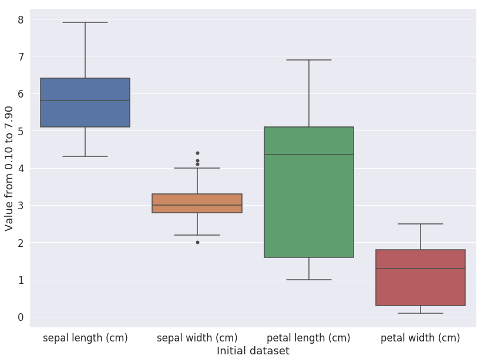
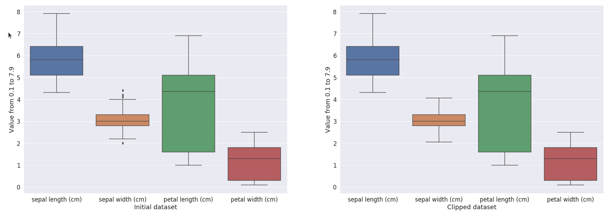
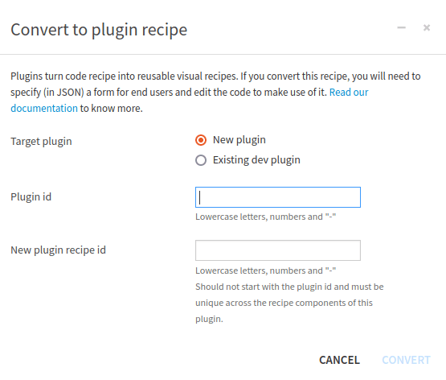
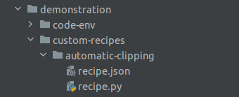
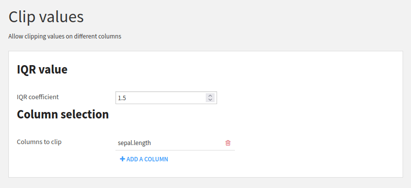
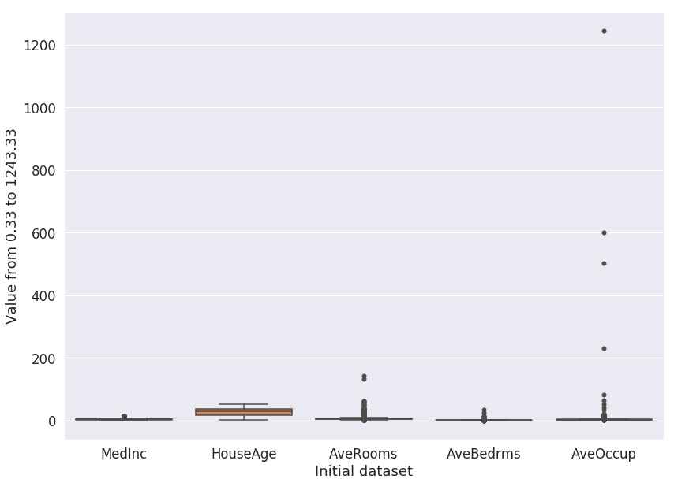
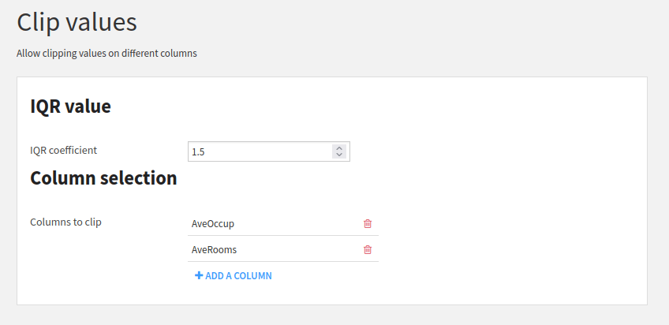
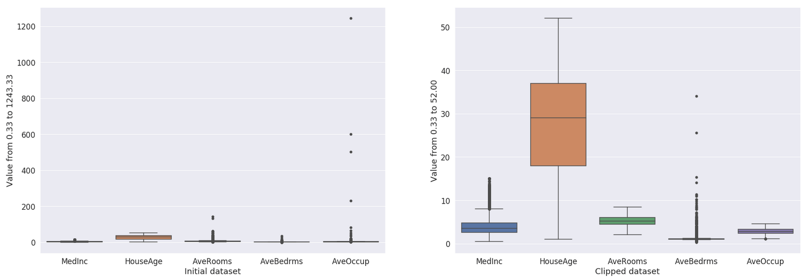

Writing a custom recipe to remove outliers from a dataset
**********************************************************************

Prerequisites
#############

* Dataiku >= 11.0
* "Develop plugins" permission
* A Python code environment with ``scikit-learn`` packages installed (see the
  :doc:`documentation<refdoc:code-envs/operations-python>` for more details) if you want to be able to load the
  dataset from the code.

This tutorial was written with Python 3.9 and with the package ``scikit-learn==1.2.2``.

Context
#######
A dataset can sometimes be polluted by  a fraction of irrelevant values called *outliers*. These outliers may wrongly 
skew the dataset's statistical distribution and lead to false interpretations, so they must be addressed. One
solution is to *clip* them by capping their value to the boundaries of a user-defined interval. For example, if an
interval of [0, 1] is defined, any value lower than 0 becomes 0, and any value greater than 1 becomes 1.  As there is no
visual recipe in Dataiku to do this processing, this tutorial aims at packaging the relevant code into a custom 
recipe plugin component to be made available to non-coder users of the instance.

The `iris dataset <https://scikit-learn.org/stable/auto_examples/datasets/plot_iris_dataset.html>`_
consists of 3 types of irises’ (Setosa, Versicolour, and Virginica) petal and sepal length,
stored in a 150x4 numpy.ndarray. A quick analysis of this dataset, with a boxplot, produces the plot shown in
:ref:`Fig. 1<tutorial_plugin_recipes_clipping_dataset_boxplot>`.

.. _tutorial_plugin_recipes_clipping_dataset_boxplot:

    Figure 1: Analysis of the iris dataset.

This plot shows that some values can be considered outliers for the “Sepal width” feature so we will clip them.
:ref:`Code 1<tutorial_plugin_recipes_clipping_dataset>` is an example of how we can clip values.

.. code-block:: python
    :name: tutorial_plugin_recipes_clipping_dataset
    :caption: Code 1: Clipping the Iris dataset

    import dataiku
    from dataiku import pandasutils as pdu
    import pandas as pd
    import warnings
    from sklearn import datasets
    warnings.filterwarnings("ignore")

    iris = datasets.load_iris()
    df = pd.DataFrame(data= np.c_[iris['data']],
                         columns= iris['feature_names'])

    # Column where to clip
    column_name = "sepal width (cm)"

    # Compute the quantile and IQR
    Q1 = df[column_name].quantile(0.25)
    Q3 = df[column_name].quantile(0.75)
    IQR = 1.5 * (Q3 - Q1)
    lower = Q1 - IQR
    upper = Q3 + IQR

    # Clip values
    df[column_name] = df[column_name].clip(lower=lower, upper=upper)

Running :ref:`Code 1<tutorial_plugin_recipes_clipping_dataset>` will produce a clipped dataset, as shown in
:ref:`Fig. 2<tutorial_plugin_recipes_recipes_clipping_dataset_result>`. In
:ref:`Code 1<tutorial_plugin_recipes_clipping_dataset>`, we used the interquartile range (IQR) method to measure
the dispersion of the data and use a coefficient to detect outliers. For example, applied to the iris dataset,
values greater than 4.05 have been replaced by 4.05, affecting three rows where values were 4.4, 4.1, and 4.2.
We also replace the value 2.0 with the value 2.05. Depending on the use case, we could clip or remove the outliers.

.. _tutorial_plugin_recipes_recipes_clipping_dataset_result:

    
    Figure 2: Visualization of the result of the clipping method.
    
Generalization
##############

:ref:`Code 1<tutorial_plugin_recipes_clipping_dataset>` clips values for the iris dataset. To distribute this code, let's transform it into a code recipe. The input is the Iris dataset, and the
output will be a dataset (named ``iris_clipped``). :ref:`Code 2<tutorial_plugin_recipes_clipping_dataset_code_recipe>`
shows the code recipe from this generalization.

.. code-block:: python
    :name: tutorial_plugin_recipes_clipping_dataset_code_recipe
    :caption: Code 2: Code recipe for clipping values

    # -*- coding: utf-8 -*-
    import dataiku
    from dataiku import pandasutils as pdu
    import pandas as pd
    import numpy as np

    def clip_value(dataset, column_name):
        """
        Clip values from a dataframe.

        :param dataset: dataframe to process
        :param columns_name: column where values are clipped

        :return: a "clipped" dataset.
        """
        Q1 = dataset[column_name].quantile(0.25)
        Q3 = dataset[column_name].quantile(0.75)
        IQR = 1.5 * (Q3 - Q1)
        lower = Q1 - IQR
        upper = Q3 + IQR
        dataset[column_name] = dataset[column_name].clip(lower=lower, upper=upper)
        return dataset

    # Read recipe inputs
    iris = dataiku.Dataset("iris")
    iris_df = iris.get_dataframe()
    column_name = "sepal.width"

    iris_clipped_df = clip_value(iris_df, column_name)

    # Write recipe outputs
    iris_clipped = dataiku.Dataset("iris_clipped")
    iris_clipped.write_with_schema(iris_clipped_df)

This code recipe is a way to distribute the code to other people or to apply it to another dataset. Still, the
code recipe only partially covers our needs: each time a user wants to leverage it, they have to manually adapt the code to their specific needs. It is not a complicated task, but not the best pattern in terms of usability. Instead, we will create a custom plugin recipe. 

Create a custom plugin recipe
#############################

A custom plugin recipe should be created using the "Convert to plugin" button in the action panel. To be
able to do that:

* Edit the **Code recipe**
* Click the **Actions** button
* Click the **Convert to plugin** button
* Select either **New plugin** or **Existing dev plugin**
* Choose the appropriate **Plugin id**
* Choose a correct id for the **New plugin recipe id**
* Click **Convert**

.. _tutorial_plugin_recipes_convert_a_code_recipe:

    Figure 3: Convert a code recipe to a plugin recipe

Once this is done, Dataiku generates the custom recipe files and opens the editor to allow to modify of the newly
created plugin recipe. :ref:`Fig. 4<tutorial_plugin_recipes_automatic_clipping>` shows a directory structure example of
a custom plugin recipe named ``automatic-clipping``. This plugin recipe is embedded into a plugin called
``demonstration``.

.. _tutorial_plugin_recipes_automatic_clipping:

    Figure 4: Directory structure of a plugin recipe

.. _tutorial_plugin_recipes_automatic_clipping_parameters_definition:

Recipe configuration
####################

Description and configuration
^^^^^^^^^^^^^^^^^^^^^^^^^^^^^

The recipe configuration is done in the ``recipe.json`` file, which describes the content in more detail in
:doc:`refdoc:plugins/reference/recipes`.

Analysis and inputs
###################

The structure of this recipe is simple: its input dataset contains the raw data, its output dataset is the result of the clipping operation.

This coefficient could be adjusted to better adapt the cleaning of the outliers. It should be a
parameter of our recipes.

Datasets rarely contain only numbers, and clipping will work only on numbers. So we need a way to select which columns
the clipping function will run. This could also be a parameter.

Recipe parameters definition
^^^^^^^^^^^^^^^^^^^^^^^^^^^^

The previous analysis leads to the parameter definition shown in
:ref:`Code 4<tutorial_plugin_recipes_parameter_definition>`.

.. code-block:: javascript
    :caption: Code 4: Parameter definitions
    :name: tutorial_plugin_recipes_parameter_definition

    "params": [
        {
            "type": "SEPARATOR",
            "description": "<h3>IQR value</h3>"
        },
        {
            "name": "IQR_coeff",
            "type": "DOUBLE",
            "defaultValue": 1.5,
            "label": "IQR coefficient",
            "mandatory": true
        },
        {
            "type": "SEPARATOR",
            "description": "<h3>Column selection</h3>"
        },
        {
            "name": "columns_to_clip",
            "label": "Columns to clip",
            "type": "COLUMNS",
            "columnRole": "dataset_name"
        }
    ],

This parameter definition will produce the user interface shown in :ref:`Fig. 5<tutorial_plugin_recipes_parameter>`.

.. _tutorial_plugin_recipes_parameter:

    
    Figure 5: User interface for the parameter entry

Input and output Datasets
^^^^^^^^^^^^^^^^^^^^^^^^^

Input and output Datasets are not handled by the parameter definition but by the ``inputRoles`` and ``outputRoles`` of
the recipe definition, as shown in :ref:`Code 5<tutorial_plugin_recipes_input_output_dataset>`.

.. code-block:: javascript
    :caption: Code 5: Input and output Datasets definition
    :name: tutorial_plugin_recipes_input_output_dataset

    "selectableFromDataset": "dataset_name",
    "inputRoles": [
        {
            "name": "dataset_name",
            "label": "Datasets to clip",
            "description": "Automatically remove outliers from a dataset, by clipping the values",
            "arity": "UNARY",
            "required": true,
            "acceptsDataset": true
        }
    ],
    "outputRoles": [
        {
            "name": "dataset_clipped",
            "label": "Clipped dataset",
            "description": "Result of the clipping",
            "arity": "UNARY",
            "required": true,
            "acceptsDataset": true
        }
    ],

The full ``recipe.json`` is shown in :ref:`Code 6<tutorial_plugin_recipes_recipe_json>`. When saving, Dataiku may warn
that the parameter ``null`` has no label. This is expected, as we do not define a name or a label for the
``SEPARATOR`` parameter type.

.. code-block:: javascript
    :caption: Code 6: ``recipe.json``
    :name: tutorial_plugin_recipes_recipe_json

    {
        "meta": {
            "label": "Clip values",
            "description": "Allow clipping values on different columns",
            "icon": "icon-align-justify",
            "iconColor": "orange"
        },
        "kind": "PYTHON",
        "inputRoles": [
            {
                "name": "dataset_name",
                "label": "Datasets to clip",
                "description": "Automatically remove outliers from a dataset, by clipping the values",
                "arity": "UNARY",
                "required": true,
                "acceptsDataset": true
            }
        ],
        "outputRoles": [
            {
                "name": "dataset_clipped",
                "label": "Clipped dataset",
                "description": "Result of the clipping",
                "arity": "UNARY",
                "required": true,
                "acceptsDataset": true
            }
        ],
        "params": [
            {
                "type": "SEPARATOR",
                "description": "<h3>IQR value</h3>"
            },
            {
                "name": "IQR_coeff",
                "type": "DOUBLE",
                "defaultValue": 1.5,
                "label": "IQR coefficient",
                "mandatory": true
            },
            {
                "type": "SEPARATOR",
                "description": "<h3>Column selection</h3>"
            },
            {
                "name": "columns_to_clip",
                "label": "Columns to clip",
                "type": "COLUMNS",
                "columnRole": "dataset_name"
            }
        ],
        "selectableFromDataset": "dataset_name",
        "resourceKeys": []
    }

Coding the Recipe
##################

Once the recipe is properly defined, we can now dive into the code. First, we should load the data provided by the user,
as shown in :ref:`Code 7<tutorial_plugin_recipes_load_data>`.

.. code-block:: python
    :caption: Code 7: Loading data from the UI
    :name: tutorial_plugin_recipes_load_data

    import dataiku
    from dataiku.customrecipe import *
    from dataiku import Dataset

    from pandas import DataFrame, Series

    def load_config():
        """
        Retrieve all parameters entered by the user

        :return: dataset input name,
                 dataset output name,
                 IQR coefficient,
                 columns to clip
        """
        # To retrieve the datasets of an input role named 'input_A' as an array of dataset names:
        input_name = dataiku.customrecipe.get_input_names_for_role('dataset_name')[0]

        # For output, the process is the same:
        output_name = dataiku.customrecipe.get_output_names_for_role('dataset_clipped')[0]

        # IQR value
        IQR_value = dataiku.customrecipe.get_recipe_config().get('IQR_coeff', 1.5)

        # columns_to_clip
        columns_to_clip = dataiku.customrecipe.get_recipe_config().get('columns_to_clip', [])

        return input_name, output_name, IQR_value, columns_to_clip

Then we need to do the clipping (:ref:`Code 9<tutorial_plugin_recipes_clipping>`) and finish by running the whole
process: loading, clipping, and saving (:ref:`Code 10<tutorial_plugin_recipes_save>`).

.. code-block:: python
    :caption: Code 9: Clip the selected columns
    :name: tutorial_plugin_recipes_clipping

    def clip_values(input_dataframe, columns_to_clip, IQR_value):
        """
        Clip values from a dataset.

        :param input_dataframe: dataframe to process
        :param columns_to_clip: column where values are clipped
        :param IQR_value: coefficient for clipping

        :return: a "clipped" dataset.
        """
        Q1 = input_dataframe[columns_to_clip].quantile(0.25)
        Q3 = input_dataframe[columns_to_clip].quantile(0.75)
        IQR = IQR_value * (Q3 - Q1)
        lower = Q1 - IQR
        upper = Q3 + IQR
        input_dataframe[columns_to_clip] = input_dataframe[columns_to_clip].clip(lower=lower, upper=upper, axis=1)
        return input_dataframe

.. code-block:: python
    :caption: Code 10: Save the result
    :name: tutorial_plugin_recipes_save

    def process():
        """
        Do the global processing.
        Load data, process them, clip dataset and save the dataset.
        """
        input_name, output_name, IQR_value, columns_to_clip = load_config()
        input_dataset = dataiku.Dataset(input_name)
        df = input_dataset.get_dataframe()
        clipped_dataset = clip_values(df, columns_to_clip, IQR_value)
        output = dataiku.Dataset(output_name)
        output.write_with_schema(clipped_dataset)

    if __name__ == "__main__":
        process()

By turning the code recipe into a custom recipe plugin, we now have a generic recipe that can be applied to any
dataset. For example, if we load the ``california_housing`` dataset from scikit learn
(``datasets.fetch_california_housing()``), drop the columns: ``Population``, ``Latitude``, and ``Longitude``, the
boxplot looks like :ref:`Fig. 6<tutorial_plugin_recipes_recipes_clipping_dataset_housing>`.

.. _tutorial_plugin_recipes_recipes_clipping_dataset_housing:

    Figure 6: Boxplot for the California housing dataset.

:ref:`Fig. 7<tutorial_plugin_recipes_recipes_clipping_dataset_housing_plugin>` shows the parameters used to clip
the dataset, clipping only ``AveOccup`` and ``AveRooms`` columns.

.. _tutorial_plugin_recipes_recipes_clipping_dataset_housing_plugin:

    Figure 7: Parameter for clipping the California housing dataset.

And the resulting dataset looks like in :ref:`Fig. 8<tutorial_plugin_recipes_recipes_clipping_dataset_housing_result>`.

.. _tutorial_plugin_recipes_recipes_clipping_dataset_housing_result:

    Figure 8: Result of the clipping.

Conclusion
##########

In this tutorial, we built a simple custom recipe plugin component that allows non-coder users to clip a dataset. 
Of course, the processing steps presented here are simple. Still, the true goal of this tutorial is to bootstrap
your work as a plugin developer to transform your code into an operational custom visual recipe.

From there, you can look into more elaborate aspects, like:

* making your code more robust with exception handling and logging
* adding more input parameters to make the outlier detection more flexible
* adding a parameter to allow clipping, removing, or keeping the outliers