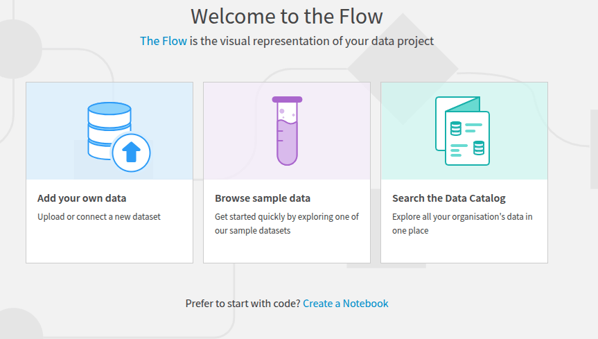
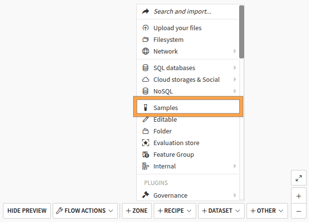
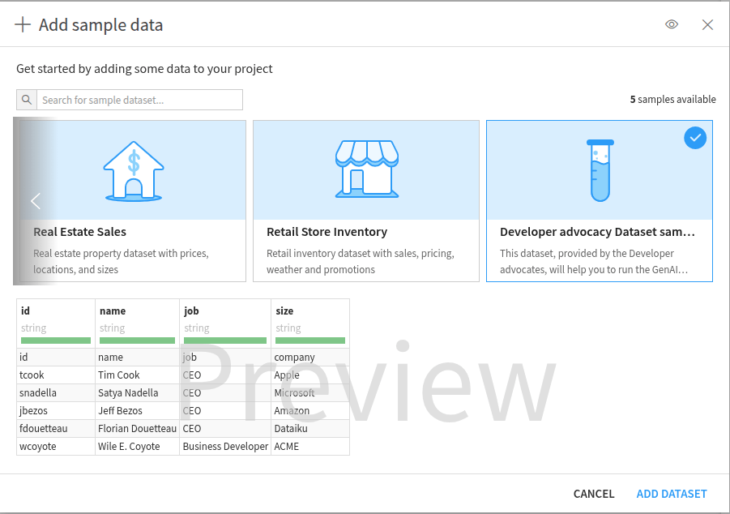
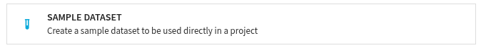
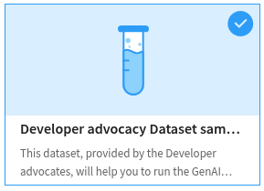
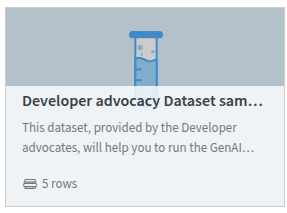
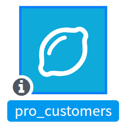

Creating a sample dataset
*************************

When starting a new project, users might have trouble finding or using datasets relevant to your company.
To overcome these difficulties, Dataiku introduced a new plugin component, Sample Dataset, in version 14.
This component allows you to provide datasets that can be used to start a project quickly.

Once a sample dataset has been created,
every user can find it easily either on an empty flow by clicking the "Browse sample data"
(:ref:`Fig. 1<tutorials-plugins-sample-dataset-browse-sample-dataset>`)
or in the flow view when clicking the **+Dataset** button and choosing the sample option in the flow
(:ref:`Fig. 2<tutorials-plugins-sample-dataset-add-dataset>`).

.. _tutorials-plugins-sample-dataset-browse-sample-dataset:

    Figure 1: Browse sample dataset.

.. _tutorials-plugins-sample-dataset-add-dataset:

    Figure 2: Add dataset samples.

Whatever your choice, you will end to a modal that let the user select a sample dataset
(:ref:`Fig. 3<tutorials-plugins-sample-dataset-select-sample>`).
If you need to provide your users with a new sample dataset,
you must develop a sample dataset component in an existing plugin (or a new one).

.. _tutorials-plugins-sample-dataset-select-sample:

    
    Figure 3: Browse provided sample dataset.
    

This tutorial highlights the different actions needed to develop this component.

Prerequisites
=============

You have followed the :doc:`/tutorials/plugins/creation-configuration/index` tutorial or already know how to develop a plugin.

* Dataiku >= 14.0
* "Develop plugins" permissions

Creating the plugin environment
===============================

To create a sample dataset, you must first create a plugin.
This documentation helps create and configure a plugin.
Once the plugin is created, click the **New component** button and choose the **Sample dataset** component
(:ref:`Fig. 4<tutorials-plugins-sample-dataset-new-sample-dataset-component>`).

.. _tutorials-plugins-sample-dataset-new-sample-dataset-component:

    
    Figure 4: New sample dataset component.
    

Fill in the form by providing a unique identifier, ``pro-customer``, for example, and click the **Add** button.
This will redirect you to the plugin development environment
within a folder containing the ``dataset.json`` (:ref:`Code 1<tutorials-plugins-sample-dataset-default-configuration-json>`) configuration file
and a folder (``data``) containing a ``sample.csv`` file.
The former file configures the sample dataset, and the latter is where you put the data that you want to share.

.. literalinclude:: ./assets/default-dataset.json
    :language: json
    :caption: Code 1: default configuration file -- ``dataset.json``
    :name: tutorials-plugins-sample-dataset-default-configuration-json

Configuring the sample dataset
==============================

To configure your sample dataset, modify the ``dataset.json`` file.
This file is divided into two sections:

* ``meta``: configuration of the object sample dataset
* ``columns``: description of the different columns in your sample

In the ``meta`` section,
you will find the usual fields (``label``, ``description``, ``icon``)
and three specific optional fields (``rowCount``, ``logo``, and ``displayOrderRank``).

``logo``, ``label``, and ``description`` are used to display information about your sample dataset when creating it,
as shown in :ref:`Fig. 5<tutorials-plugins-sample-dataset-sample-dataset-information>`.
If you want to provide a logo, you will need to create a ``resource`` folder at the root of your plugin, 
and upload your image to that folder.

.. _tutorials-plugins-sample-dataset-sample-dataset-information:

    
    Figure 5: Displaying information of your sample dataset.
    

If you have filled in the ``rowCount`` field,
it will also be used when the user glimpses the sample dataset
(:ref:`Fig. 6<tutorials-plugins-sample-dataset-sample-dataset-information-glimpse>`).

.. _tutorials-plugins-sample-dataset-sample-dataset-information-glimpse:

    
    Figure 6: Glimpsing a sample dataset.
    

The ``displayOrderRank`` determines which position your sample dataset will be presented to the user.

Finally, the ``icon`` value is used when the dataset is visible in the flow
(:ref:`Fig. 7<tutorials-plugins-sample-dataset-flow-view>`).
If you don't provide an icon, the plugin icon will be used.
The default plugin icon will be used if there is no plugin icon.

.. _tutorials-plugins-sample-dataset-flow-view:

    
    Figure 7: New sample dataset in the flow.
    

You will describe your data in the ``columns`` section, as stated in the default file.

Providing sample dataset data
=============================

In the ``data`` folder of your sample dataset component,
you can provide several CSV files, respecting the format you have described in the ``columns`` section.
Each file will be used to provide data to the user.
Dataiku will concatenate those files to build a unique dataset.
You should not give a header line in your CSV file as the data are already described.

Dataiku will use the unique identifier you provided while creating the sample dataset component.
For example, if you put the content shown in :ref:`Code 2<tutorials-plugins-sample-dataset-sample-data>` as ``sample.csv``,
you will end up with a dataset that could be used as a starting point for the different tutorials on Agent
(:doc:`/tutorials/genai/agents-and-tools/agent/index`, :doc:`/tutorials/genai/agents-and-tools/llm-agentic/index` ).

.. literalinclude:: ./assets/sample.csv
    :language: text
    :caption: Code 2: sample of data.
    :name: tutorials-plugins-sample-dataset-sample-data

Wrapping up
===========

Creating a sample dataset in Dataiku is an easy process that improves the user experience for new projects.
Following this tutorial's steps,
you will build a sample dataset component tailored to your organization's specific requirements.
This allows quick access to relevant data, empowering users with the necessary resources to begin their analyses.

Here is the complete code of this tutorial:

.. dropdown:: :download:`dataset.json<./assets/dataset.json>`
    :open:

    .. literalinclude:: ./assets/dataset.json
        :language: json

.. dropdown:: :download:`sample.csv<./assets/sample.csv>`
    :open:

    .. literalinclude:: ./assets/sample.csv
        :language: text