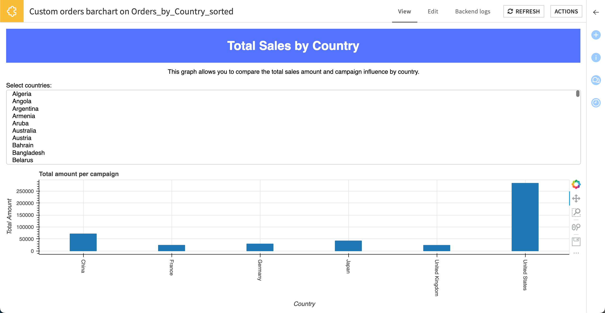

Turning an existing webapp into a webapp plugin component
*********************************************************

.. meta::
  :description: Learn how to create a custom webapp as a Dataiku plugin in this tutorial.

In this tutorial, we'll start from the webapp created in the :doc:`Bokeh webapp tutorial <../../../webapps/bokeh/basics/index>` to create a
webapp plugin. The aim is to have a ready-to-use bar chart webapp in an order context with a boolean validating or not the presence of the category.

Converting to a webapp plugin
=============================

1. Click the **Actions** button on your web app to open the right panel.
2. Click **Plugin** to convert it to a plugin webapp.
3. Choose either your existing dev plugin or create a new one as the target plugin.
4. Give the webapp an identifier like ``custom-orders-barchart``.
5. Click **Convert**.
6. Confirm the overwrite of existing sources, if necessary.

Editing the definitions in ``webapp.json``
------------------------------------------

First, let's examine the *webapp.json* file.  This file describes the parameters that the user must specify when using the plugin webapp.

Note that unlike the *recipe.json* file of a plugin recipe (see :doc:`that tutorial<../../../plugins/recipes/generality/index>`),
there are no ``input_roles`` or ``output_roles`` sections,
and we can focus on editing the ``"params"`` section, which comprises the **input** dataset,
the **category** column, the **boolean** column, and the **total amount of orders** column defined as follow: 

Thinking about the parameters to specify, there's:

- the input dataset
- the category column
- the boolean column
- the total amount of orders column

\... which can be specified in the JSON as follows.

.. sphinx could not lex literal_block json 

.. code-block::

    "params": [
        {
            "name": "input_dataset",
            "type": "DATASET",
            "label": "Dataset",
            "description": "The dataset used to populate the webapp",
            "mandatory": true,
            "canSelectForeign": true
        },
        {
            "name": "category",
            "type": "DATASET_COLUMN",
            "datasetParamName": "input_dataset",
            "label": "Category Column",
            "description": "",
            "mandatory": true
        },
        {
            "name": "boolean",
            "type": "DATASET_COLUMN",
            "datasetParamName": "input_dataset",
            "label": "Boolean Column",
            "description": "",
            "mandatory": true
        },
        {
            "name": "total_amount",
            "type": "DATASET_COLUMN",
            "datasetParamName": "input_dataset",
            "label": "Total Amount Column",
            "description": "",
            "mandatory": true
        }
    ],

After doing that, uncomment the roles section.

.. sphinx could not lex literal_block json 

.. code-block::

    "roles": [
        {"type": "DATASET", "targetParamsKey": "input_dataset"}
    ]

.. #plugin-configuration

Editing the code in ``backend.py``
----------------------------------

Now, let's edit *backend.py*.  The default contents include the code from your Python Bokeh webapp.
You can retrieve the parameter's value from the map of parameters previously defined
with the :meth:`get_webapp_config()` function, such as:

.. code-block:: python

  input_dataset = get_webapp_config()['input_dataset']
  category = get_webapp_config()['category']
  campaign = get_webapp_config()['boolean']
  total_amount = get_webapp_config()['total_amount']

Then, use them as variables inside your code if needed.

For example, in the application function code block:

.. code-block:: python

    def application():
    """
    Create the application.
    """
    
    # RETRIEVE VALUES
    input_dataset = get_webapp_config()['input_dataset']
    boolean = get_webapp_config()['boolean']
    
    # READ DATASET
    dataset = dataiku.Dataset(input_dataset)
    df = dataset.get_dataframe()
    # Only keep data where the campaign has been launched
    df = df[df[boolean]]

Once you have finished updating the code, don't forget to save your change. 

.. note::

    A webapp plugin allows you to use a single code for several use cases if the data is similar for each context.
    However, titles and other labels will remain hard-coded, which limits generalization to a more advanced and detailed webapp.

Provisioning the plugin with a code environment
-----------------------------------------------

You'll need to :doc:`configure <../../../plugins/creation-configuration/index>` your plugin
and specify the code environment with Bokeh directly in the plugin and not in the webapp. To do so:

1. Navigate to the **Summary** tab. 
2. Click **+ Create a new code environment** and choose **Python**.
3. Back in the **Edit** tab, select the **requirements.txt** file under **code-env > python > spec**
4. Enter ``bokeh``.
5. Click **Save All**
6. Navigate back to the **Summary** tab and click **Build New Environment**.

Using your custom webapp in a project
=====================================

Let's access the input Dataiku dataset as a pandas dataframe
and extract the relevant columns from the pandas dataframe to define the source data for the visualization.

.. note::

  After editing *webapp.json* for a plugin webapp, you must do the following:

  1. On the top right corner, click **Actions > Reload this plugin**.
  2. Reload the Dataiku page in your browser (``Ctrl+r``/ ``Cmd+r``).

  When modifying the *backend.py* file, you don't need to reload anything. Restart the webapp backend.

1. Go to the Flow and select a dataset, such as *Orders_by_Country_sorted*.
2. From the **Actions** sidebar, select your plugin webapp.
3. Give the new webapp a name (or accept the default) and click **Create**.
4. In the **Edit** tab, make the desired selections for displaying the webapp.
5. Click **Save and View Webapp**.

The webapp displays the selected settings and provides interactivity to change the plot title,
the time period to display, and the category of the categorical column.

To change the dataset and columns the webapp uses, go to the **Edit** tab, make the new selections, and click **View webapp**.

Wrapping Up
============

You have leveraged the power of a webapp into a reusable plugin for further use.
Here is the complete version of code used during this tutorial.

.. dropdown:: backend.py

    .. literalinclude:: ./assets/backend.py
        :language: python

.. dropdown:: webapp.json

    .. literalinclude:: ./assets/webapp.json
        :language: json