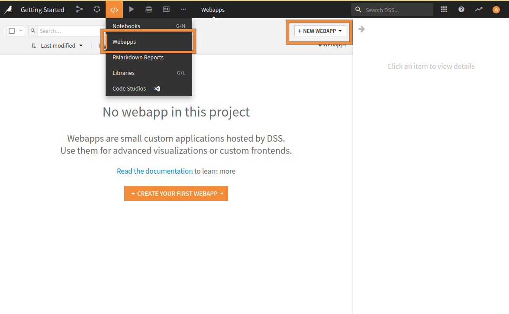
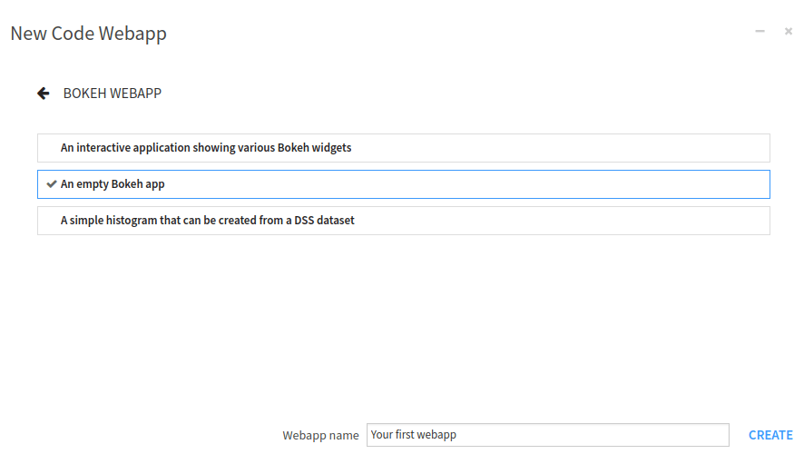
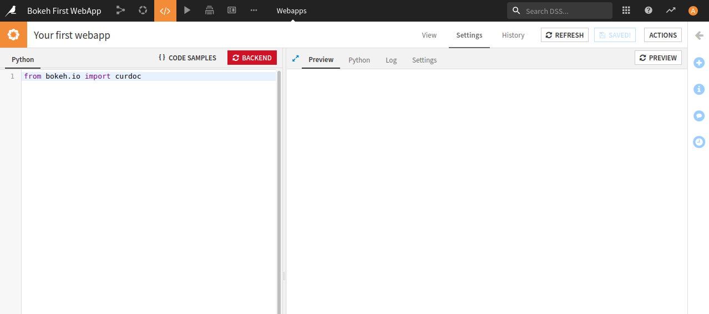
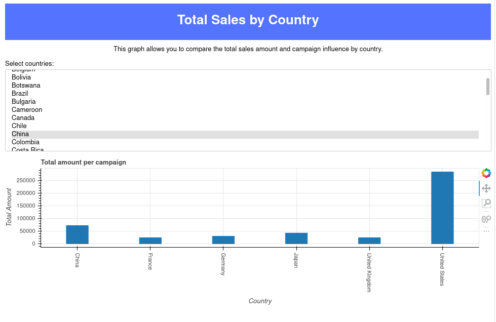

Bokeh: Your first webapp
************************
.. _Bokeh: https://bokeh.org/
.. _Academy: https://academy.dataiku.com/

Prerequisites
#############

* Dataiku >= 11.0 (You can also use Dataiku cloud)
* Some familiarity with python

Bokeh_ is a Python library for creating interactive visualizations for modern web browsers.
This tutorial will create a simple Bokeh webapp in Dataiku. We will use sample sales data from the fictional Haiku
T-shirt company, similar to the data used in the Basics tutorials. The webapp will display the total amount sold for
each selected country. Each time the user changes the input, the plot is updated.

.. note::

    We have tested this tutorial using a Python 3.9 code environment with ``bokeh==2.4.3``. Other Python
    versions may be compatible, Bokeh version before 2.4.0 may be incompatible. Check the webapp logs for potential
    incompatibilities.

Data preparation
################

Start by downloading the source data following
`this link <https://cdn.downloads.dataiku.com/public/website-additional-assets/data/Orders_by_Country_sorted.csv>`__
and make it available in your Dataiku project, for example, by uploading the *.csv* file. Name the resulting
Dataiku dataset ``Orders_by_Country_sorted``.

Creating the webapp
###################

First, you need to create a Bokeh webapp. You will use the empty Bokeh template and generate a Bokeh webapp named:
``Your first webapp``, as shown in :ref:`Fig. 1<bokeh_basics_create_webapp>` and
:ref:`2<bokeh_basics_create_webapp_step2>`.

.. _bokeh_basics_create_webapp:

    Fig. 1: Creation of a webapp.

.. _bokeh_basics_create_webapp_step2:

    Fig. 2: Naming the newly created webapp.

Once the webapp is created, you will land on an empty webapp. To be able to edit code, you have to select the
"Settings" tab. This window comprises two parts. Usually, the left part is where we enter the code, and the right part
is dedicated to the preview of the webapp, as shown in :ref:`Fig. 3<bokeh_basics_editor>`.

.. _bokeh_basics_editor:

    Fig. 3: Edition of the Bokeh webapp.

On the right side, there are four tabs, allowing you to switch to:

* Preview mode: default opened tab.
* Python editor: to have two different views of your code.
* Log: helpful in debugging when something goes wrong. If you do not see your logs, click on the "Refresh log"
  button to update the log window.
* Settings: to configure the webapp, like the code environment used for the webapp.

Sketching the webapp
####################

The webapp will consist of a title, a text (to explain the purpose of the webapp), a multi-select object (for selecting
the countries), and a plot. This tutorial will also focus on good practices, like
`single responsibility <https://en.wikipedia.org/wiki/Single-responsibility_principle>`__, forbidding
the usage of global variables, and so on.

Import package and set up the application
^^^^^^^^^^^^^^^^^^^^^^^^^^^^^^^^^^^^^^^^^
First, you will need some data, so you have to use the ``dataiku`` package. All along this tutorial, you will need some
other packages/components, and you will include them all at once. After importing the libraries, you will create a
function to render the application's title. You will also make a description of the application. And finally, you will
define a function for the application creation and call it to render the webapp, as shown in
:ref:`Code 1<bokeh_code_import>`. The emphasized line is the place to write code for reading data. You will do it just
after.

.. code-block:: python
    :name: bokeh_code_import
    :caption: Code 1: Import packages and create the first step for the application.
    :emphasize-lines: 38

    import dataiku
    from bokeh.io import curdoc
    from bokeh.models import Div, MultiSelect, ColumnDataSource, FactorRange
    from bokeh.plotting import figure
    from functools import partial
    from bokeh.layouts import layout

    def add_title():
        """
        Create the title for the application.
        :return: The title object.
        """
        title = Div(text="""<h1>Total Sales by Country</h1>""",
                    style={'backgroundColor': '#5473FF',
                           'color': '#FFFFFF',
                           'width': '98vw',
                           'margin': 'auto',
                           'textAlign': 'center'})
        return title

    def add_text():
        """
        Create a description of the application.
        :return: The text object.
        """
        text = Div(text="This graph allows you to compare the total sales amount and campaign influence by country.",
                   sizing_mode="stretch_width",
                   align="center")
        return text

    def application():
        """
        Create the application.
        """

        title = add_title()
        text = add_text()

        app = layout([title, text])
        curdoc().add_root(app)

    application()

Providing data
^^^^^^^^^^^^^^
To use the dataset, you must read ``Orders_by_Country_sorted`` with the ``dataiku`` package,
as shown in :ref:`Code 2<bokeh_code_read_data>`. Reading the dataset will slightly modify the function
``application()`` (:ref:`Code 2<bokeh_code_read_data>` replaces the emphasized line in
:ref:`Code 1<bokeh_code_import>`).

.. code-block:: python
    :name: bokeh_code_read_data
    :caption: Code 2: Reading the data.

    # READ DATASET
    dataset = dataiku.Dataset("Orders_by_Country_sorted")
    df = dataset.get_dataframe()
    # Only keep data where the campaign has been launched
    df = df[df['campaign']]

    source = ColumnDataSource(dict(x=[], y=[]))

Plotting the data
^^^^^^^^^^^^^^^^^
Once the data is read, you will create a Plot. You could plot the data directly, but you will face problems when you
want to update the plot (Bokeh won't let you quickly update it). So you will first create a plot with empty data, and
later on, you will update this plot with the selected country. :ref:`Code 3<bokeh_code_create_plot>` shows how to
create an empty plot, ready to be updated when needed. The highlighted lines show the tweaks you have to do to plot
data dynamically.

.. code-block:: python
    :name: bokeh_code_create_plot
    :caption: Code 3: Plot creation.
    :emphasize-lines: 12, 17

    def add_plot(df, source):
        """
        Create a plot for rendering the selection
        :param df: The dataframe to use.
        :param source: The columnSource to use.
        :return: The plot object.
        """
        plot = figure(plot_width=600, plot_height=300,
                      x_axis_label='Country',
                      y_axis_label='Total Amount',
                      title='Total amount per campaign',
                      x_range=FactorRange(factors=list(df.country)),
                      sizing_mode='stretch_width'
                      )
        plot.left[0].formatter.use_scientific = False
        plot.xaxis.major_label_orientation = "vertical"
        plot.vbar(source=source, x='x', top='y', bottom=0, width=0.3)

        return plot

Of course, you will have to modify your `application` function to reflect the changes, as shown in
:ref:`Code 4<bokeh_code_application_step_2>` (highlighted lines).

.. code-block:: python
    :name: bokeh_code_application_step_2
    :caption: Code 4: Application modification to integrate the plot.
    :emphasize-lines: 15, 17

    def application():
        """
        Create the application.
        """
        # READ DATASET
        dataset = dataiku.Dataset("Orders_by_Country_sorted")
        df = dataset.get_dataframe()
        # Only keep data where the campaign has been launched
        df = df[df['campaign']]

        source = ColumnDataSource(dict(x=[], y=[]))

        title = add_title()
        text = add_text()
        plot = add_plot(df, source)

        app = layout([title, text, plot])
        curdoc().add_root(app)

User selection and updating the plot
^^^^^^^^^^^^^^^^^^^^^^^^^^^^^^^^^^^^
In the same way, you have created the plot, and you will create a function for the multi-select object (
:ref:`Code 5<bokeh_code_create_select>`). The highlighted line allows Bokeh to run a function (``update_fig``) when the
user changes the object's value. Usually, the library imposes the prototype of this function. But as you need
some additional data to be passed to this function, you will use the ``partial`` function to provide other data to
the ``update_fig`` function. :ref:`Code 6<bokeh_code_update_fig>` shows the implementation of the function.

.. code-block:: python
    :name: bokeh_code_create_select
    :caption: Code 5: Multi-select object creation.
    :emphasize-lines: 15

    def add_select(df, source, plot):
        """
        Create a Multi-select for the country selection.
        :param df: The dataframe to use.
        :param source: The columnSource to use.
        :param plot: The plot to update.
        :return: The multi-select object.
        """
        select = MultiSelect(title="Select countries:",
                             options=[i for i in sorted(df.country.unique())],
                             value=['United States', 'China', 'Japan', 'Germany', 'France', 'United Kingdom'],
                             size=10,
                             sizing_mode='stretch_width'
                             )
        select.on_change("value", partial(update_fig, df=df, source=source, plot=plot))
        return select

.. code-block:: python
    :name: bokeh_code_update_fig
    :caption: Code 6: Callback function for updating the plot.

    def update_fig(_attr, _old, new, df, source, plot):
        """
        Callback for updating the plot with the new values.
        :param _attr: Unused: the attribute that is changed.
        :param _old: Unused: the old value.
        :param new: The new value.
        :param df: The dataframe to use.
        :param source: The columnSource to use.
        :param plot: The plot to update.
        """

        data = df[df['country'].isin(new)]
        source.data = dict(
            x=data.country,
            y=data.total_amount
        )
        plot.x_range.factors = list(source.data['x'])

And, of course, you will need to update the application to reflect these changes. As you plot an empty figure, you
should update it with some default values (provided in the multi-select object), so the highlighted lines in
:ref:`Code 7<bokeh_code_application_final>` show how to do this.

.. code-block:: python
    :name: bokeh_code_application_final
    :caption: Code 7: Final version of the application code.
    :emphasize-lines: 16-20

    def application():
        """
        Create the application.
        """
        # READ DATASET
        dataset = dataiku.Dataset("Orders_by_Country_sorted")
        df = dataset.get_dataframe()
        # Only keep data where the campaign has been launched
        df = df[df['campaign']]

        source = ColumnDataSource(dict(x=[], y=[]))

        title = add_title()
        text = add_text()
        plot = add_plot(df, source)
        select = add_select(df, source, plot)

        update_fig("", "", select.value, df, source, plot)

        app = layout([title, text, select, plot])
        curdoc().add_root(app)

Going further
#############

If everything goes well, you should go to a webapp that looks like :ref:`Fig. 4<bokeh_fig_final>`.

.. _bokeh_fig_final:

    Fig. 4: Final state of the webapp.

You learned how to read and use a dataset with Dataiku and Bokeh. You also know how to plot a histogram based on this
dataset. Using the same principles, you can draw another chart, explore other datasets, add interactivity, etc.

Here is the complete code of the web application:

.. dropdown:: :download:`app.py<./assets/bokeh.py>`
    :open:

    .. literalinclude:: ./assets/bokeh.py
        :language: python
